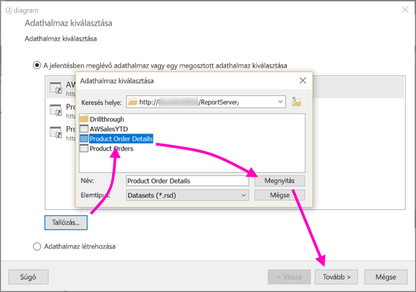
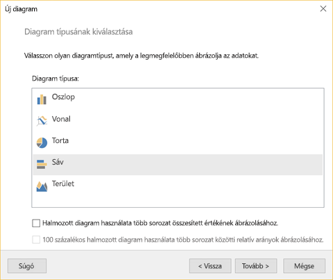
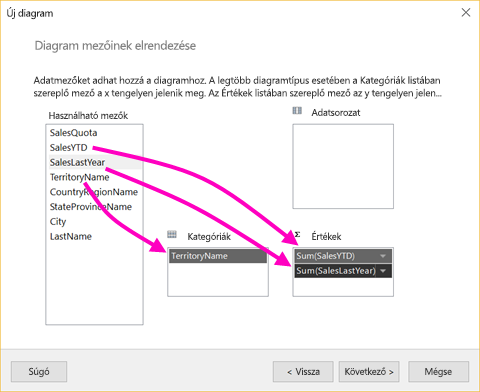
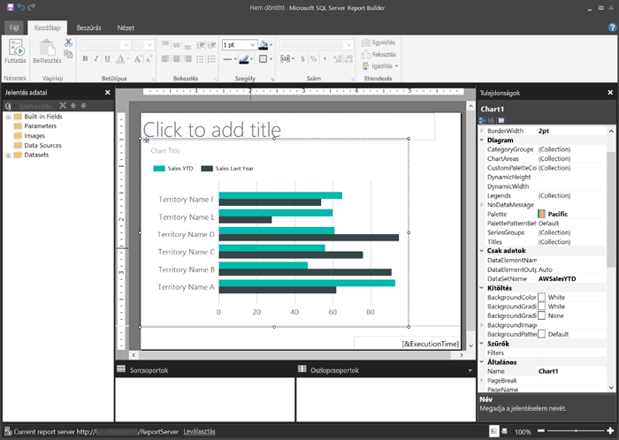
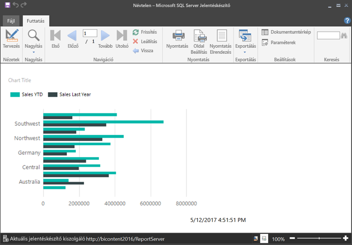
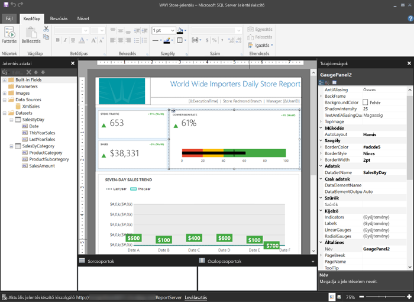

# Többoldalas jelentés létrehozása a Power BI jelentéskészítő kiszolgálóhoz
Mint ahogyan az elnevezés is sugallja, a többoldalas jelentések egyszerre több oldalon is átnyúlhatnak. Az elrendezésük rögzített formátumban történik, és precíz testreszabási lehetőségeket biztosítanak. A többoldalas jelentések .rdl-fájlok.

A többoldalas jelentéseket a Power BI jelentéskészítő kiszolgáló webportálján és az SQL Server Reporting Services (SSRS) webportálján tárolhatja és kezelheti. Létrehozhatja őket a Jelentéskészítőben vagy az SQL Server Data Tools (SSDT) eszközkészletben található Jelentéstervező használatával, majd közzéteheti őket az egyiknek a webportálján. Ekkor a jelentések megtekinthetővé válnak a cégen belüli olvasók számára egy böngészőben, vagy a Power BI mobilalkalmazás használatával a mobileszközeiken.

Ha már hozott létre többoldalas jelentéseket a Jelentéskészítőben vagy a Jelentéstervezőben, akkor készen áll arra, hogy a Power BI jelentéskészítő kiszolgálóra is létrehozzon ilyen jelentéseket. Ha még nem hozott létre ilyeneket, akkor néhány gyors lépésben felkészülhet rá.

## 1. lépés: Töltse le és indítsa el a Jelentéskészítőt
Lehet, hogy korábban már telepítette a Jelentéskészítőt, hogy jelentéseket hozzon létre egy SSRS-kiszolgálóra. Használhatja ugyanezt a verziójú Jelentéskészítőt arra is, hogy a Power BI jelentéskészítő kiszolgálóra hozzon létre jelentéseket. Ha még nem telepítette, akkor ezt egyszerűen megteheti.

1. A Power BI jelentéskészítő kiszolgáló webportálján válassza az **New** (Új) > **Paginated Report** (Többoldalas jelentés) lehetőséget.
   
    
   
    Ha a Jelentéskészítő nincs telepítve a számítógépén, akkor ez a lépés végigvezeti a telepítés folyamatán.
2. A telepítést követően megnyílik a Jelentéskészítő az **Új jelentés vagy adatkészlet** képernyőn.
   
    
3. Válassza ki a létrehozni kívánt jelentés típusának varázslóját:
   
   * Táblázat vagy mátrix
   * Diagram
   * Térkép
   * Üres
4. Kezdjük a Diagram varázslóval.
   
    A Diagram varázsló végigvezeti azokon a lépéseken, amelyekkel létrehozhat egy egyszerű diagramot egy jelentésben. Onnan már szinte korlátlan lehetőségei lesznek a jelentése testreszabására.

## 2. Lépés: Haladjon végig a Diagram varázsló lépésein
A Diagram varázsló végigvezeti azokon az alapvető lépéseken, amelyekkel létrehozhat egy vizualizációt egy jelentésben.

A többoldalas jelentések sokféle adatforráshoz kapcsolódhatnak, a Microsoft SQL Servertől és a Microsoft Azure SQL Database-től kezdve egészen az Oracle-ig, a Hyperionig és egyéb adatforrásokig. További információk a [többoldalas jelentéseket támogató adatforrásokról](connect-data-sources.md).

A Diagram varázsló első lépése az **Adatkészlet kiválasztása**, ahol létrehozhat egy adatkészletet, vagy kiválaszthat egy megosztott adatkészletet egy kiszolgálóról. Az *adatkészletek* egy külső adatforráson végzett lekérdezés jelentésadatait adják vissza.

1. Válassza a **Tallózás...** lehetőséget, válasszon ki egy megosztott adatkészletet egy kiszolgálón, majd válassza a **Megnyitás** > **Tovább** lehetőségeket.
   
    
   
     Új adatkészletet szeretne létrehozni? Tekintse meg a [Megosztott vagy beágyazott adatkészlet létrehozása](https://docs.microsoft.com/sql/reporting-services/report-data/create-a-shared-dataset-or-embedded-dataset-report-builder-and-ssrs) című cikket.
2. Válasszon egy diagramtípust, esetünkben a sávdiagramot.
   
    
3. A mezők elrendezéséhez húzza őket a **Kategóriák**, **Sorozatok** és **Értékek** területekre.
   
    
4. Válassza a **Tovább** > **Befejezés** lehetőséget.

## 3. lépés: Tervezze meg jelentését
Most már a Jelentéstervező nézetben van. Észreveheti, hogy az adatok csupán helyőrző adatok, nem az Ön saját adatai.

* Az saját adatainak megtekintéséhez válassza a **Futtatás** lehetőséget.
  
     
* A Jelentéstervező nézethez való visszatéréshez válassza a **Tervezés** lehetőséget.

Módosíthatja az imént létrehozott diagramot, megváltoztathatja az elrendezését, az értékeit, a jelmagyarázatát, vagyis szinte bármit.

Sok más típusú vizualizációt is felvehet, például mérőműszereket, táblázatokat, mátrixokat, térképeket stb. Felvehet fejléceket és lábléceket több oldalhoz is. Tekintse meg [A Jelentéskészítő oktatóanyagait](https://docs.microsoft.com/sql/reporting-services/report-builder-tutorials) és próbálja ki ezeket.

## 4. lépés: Mentse a jelentését a jelentéskészítő kiszolgálóra
Ha elkészült a jelentése, mentse a Power BI jelentéskészítő kiszolgálóra.

1. A **Fájl** menüben válassza a **Mentés másként** lehetőséget, majd mentse a jelentést a jelentéskészítő kiszolgálóra. 
2. Most már megtekintheti a jelentést a böngészőben.
   
    

## Következő lépések
Számos nagyszerű erőforrás nyújt segítséget, ha jelentést szeretne készíteni a Jelentéskészítőben vagy az SQL Server Data Tools eszközkészletben található Jelentéstervezőben. Érdemes a Jelentéskészítő oktatóanyagaival kezdeni.

* [A Jelentéskészítő oktatóanyagai](https://docs.microsoft.com/sql/reporting-services/report-builder-tutorials)
* [Mi a Power BI jelentéskészítő kiszolgáló?](get-started.md)  

További kérdései vannak? [Kérdezze meg a Power BI közösségét](https://community.powerbi.com/)

