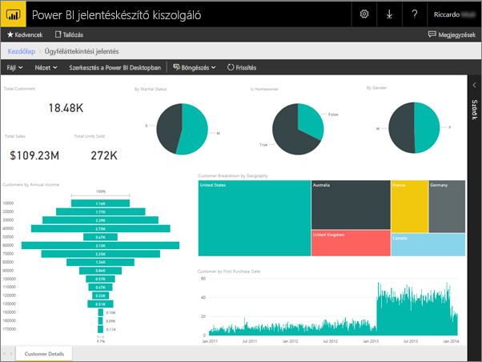
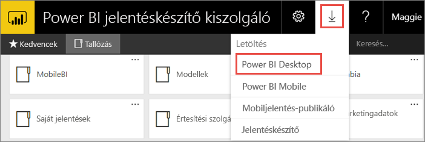
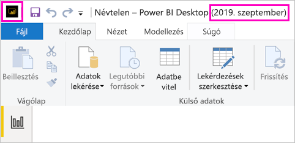
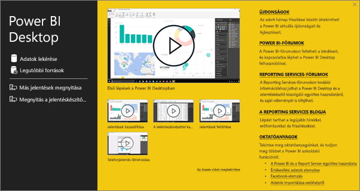
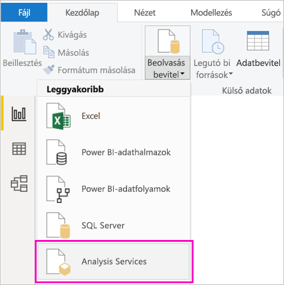
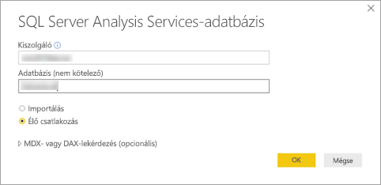
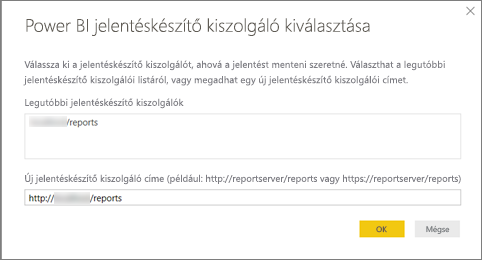
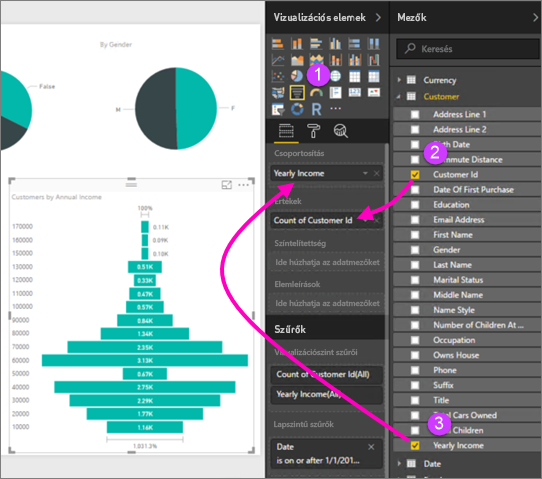
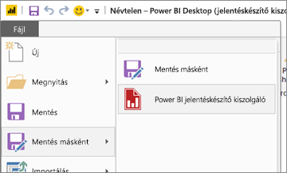

# Power BI-jelentés létrehozása a Power BI jelentéskészítő kiszolgálóhoz
A Power BI-jelentéseket helyszínen is tárolhatja és kezelheti a Power BI jelentéskészítő kiszolgáló webportálján, illetve tárolhatja őket a felhőbeli Power BI szolgáltatásban (https://powerbi.com) ). A jelentéseket a Power BI Desktopban hozhatja létre, majd közzéteheti a webportálon. Ekkor a jelentések megtekinthetővé válnak a cégen belüli olvasók számára egy böngésző vagy egy Power BI-mobilalkalmazás használatával.

Íme négy gyors lépés a kezdéshez.

## 1\. lépés: A Power BI jelentéskészítő kiszolgálóhoz optimalizált Power BI Desktop telepítése

Ha már létrehozott jelentéseket a Power BI Desktopban, akkor gyakorlatilag a Power BI jelentéskészítő kiszolgálóra is létrehozhat Power BI-jelentéseket. Javasoljuk, hogy a kiszolgáló és az alkalmazás folyamatos szinkronizálása érdekében telepítse a Power BI Desktop Power BI jelentéskészítő kiszolgálóra optimalizált verzióját. Ugyanazon a számítógépen a Power BI Desktop mindkét változata telepítve lehet.

1. A jelentéskészítő kiszolgáló webportálján kattintson a **Letöltés** nyíl > **Power BI Desktop** lehetőségre.

    

    Megnyithatja a [Power BI jelentéskészítő kiszolgáló](https://powerbi.microsoft.com/report-server/) kezdőlapját is, ahol kiválaszthatja a **Speciális letöltési beállítások** lehetőséget.

2. A letöltőközpontlapon kattintson a **Letöltés** gombra.

3. A számítógépétől függően válassza az alábbiak egyikét:

    - **PBIDesktopRS.msi** (32 bites verzió) vagy

    - **PBIDesktopRS_x64.msi** (64 bites verzió).

4. A telepítő letöltése után indítsa el a Power BI Desktop (2019. szeptember) telepítő varázslóját.

2. A telepítés végén kattintson a **Power BI Desktop azonnali indítása** lehetőségre.
   
    A folyamat automatikusan elindul, és máris hozzákezdhet. A címsorban látható **Power BI Desktop (2019. szeptember)** feliratból láthatja, hogy a megfelelő verziót töltötte le.

    

3. Ha még nem ismeri a Power BI Desktopot, érdemes megtekintenie az üdvözlőképernyőn látható videókat.
   
    

## 2\. lépés: Adatforrás kiválasztása
Számos adatforráshoz kapcsolódhat. További információkért lásd: [Kapcsolódás az adatforrásokhoz](connect-data-sources.md).

1. Az üdvözlőképernyőn kattintson az **Adatok beolvasása** elemre.
   
    Vagy a **Kezdőlap** lapon kattintson az **Adatok beolvasása** elemre.
2. Válassza ki az adatforrást – ebben a példában ez az**Analysis Services**.
   
    
3. Adja meg a **Kiszolgálót** és igény szerint az **Adatbázist**. Győződjön meg róla, hogy az **Élő csatlakozás** elem ki van jelölve > **OK**.
   
    
4. Válassza ki azt a jelentéskészítő kiszolgálót, amelyen menteni fogja jelentéseket.
   
    

## 3\. lépés: A jelentés megtervezése
Most jön a legérdekesebb rész: Az adatokat illusztráló vizualizációk létrehozása.

Például tölcsérdiagramot hozhat létre az éves jövedelem alapján csoportokba rendezett ügyfelekről.

1. A **Megjelenítések** ablaktáblán kattintson a **Tölcsérdiagram** lehetőségre.
2. Húzza a megszámlálandó mezőt az **Értékek** oszlopba. Ha nem numerikus mezőről van szó, a Power BI Desktop automatikusan hozzáteszi a *Count of* (Száma) kiegészítést.
3. A csoportosítandó mezőt húzza a **Csoport** oszlopba.

További információk a [Power BI-jelentés megtervezéséről](../desktop-report-view.md).

## 4\. lépés: Mentse a jelentést a jelentéskészítő kiszolgálón
A kész jelentést mentse a 2. lépésben kiválasztott Power BI jelentéskészítő kiszolgálón.

1. A **Fájl** menüben kattintson a**Mentés másként** > **Power BI jelentéskészítő kiszolgáló** elemre.
   
    
2. Most már megtekintheti a jelentést a webportálon.
   
    
    
> [!NOTE]
> Ha a későbbiekben módosítja a jelentést, az asztalon megjelenő jelentésadatok mindig a jelentés első létrehozásakor gyorsítótárazott adatok lesznek.  Ha a jelentés szerkesztésekor a legfrissebb adatokat szeretné megtekinteni, frissítenie kell az adatokat a Power BI Desktop alkalmazásban.

## Következő lépések
### Power BI Desktop
A Power BI Desktop számos nagyszerű erőforrással segíti a jelentéskészítést. Egy jó kiindulási pont ez a hivatkozás.

* [Első lépések a Power BI Desktopban](../desktop-getting-started.md)
* Interaktív tanulás: [Ismerkedés a Power BI Desktoppal](/learn/modules/get-data-power-bi/2-getting-started-power-bi-desktop)

### Power BI jelentéskészítő kiszolgáló
* [A Power BI jelentéskészítő kiszolgálóhoz optimalizált Power BI Desktop telepítése](install-powerbi-desktop.md)  
* [Mi a Power BI jelentéskészítő kiszolgáló?](get-started.md)  

További kérdései vannak? [Kérdezze meg a Power BI közösségét](https://community.powerbi.com/)
