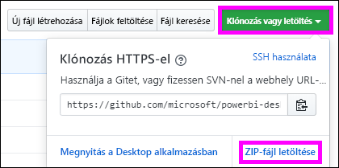

# <a name="embed-a-power-bi-report-server-report-using-an-iframe-in-sharepoint-server"></a>Power BI jelentéskészítő kiszolgálóval készült jelentés beágyazása iFrame-keretben a SharePoint Serverben

Ebből a cikkből elsajátíthatja egy Power BI jelentéskészítő kiszolgálóval készült jelentés iFrame használatával történő beágyazását egy SharePoint oldalba. Ha a SharePoint Online-nal dolgozik, akkor a Power BI jelentéskészítő kiszolgálónak nyilvánosan elérhetőnek kell lennie. A SharePoint Online-ban a Power BI szolgáltatással együttműködő Power BI jelentéskijelző nem működik együtt a Power BI jelentéskészítő kiszolgálóval.  


## <a name="prerequisites"></a>Előfeltételek
* Telepített és konfigurált [Power BI jelentéskészítő kiszolgáló](https://powerbi.microsoft.com/report-server/).
* Telepített [Power BI Desktop a Power BI jelentéskészítő kiszolgálóhoz optimalizálva](install-powerbi-desktop.md).
* Telepített és konfigurált [SharePoint](https://docs.microsoft.com/sharepoint/install/install)-környezet.
* Az Internet Explorer 11 csak akkor támogatott, ha a dokumentum IE11 (Edge) módra van beállítva, vagy a SharePoint Online használata esetén. A helyszíni SharePointtal és a SharePoint Online-nal más támogatott böngészők is használhatók.

## <a name="create-the-power-bi-report-url"></a>A Power BI-jelentés URL-címének létrehozása

1. Töltse le a mintát a GitHubról: [Blog Demo](https://github.com/Microsoft/powerbi-desktop-samples). Válassza a **Klónozás vagy letöltés**, majd a **ZIP letöltése** lehetőséget.

    

2. Tömörítse ki a fájlt, majd nyissa meg a minta .pbix-fájlt a Power BI jelentéskészítő kiszolgálóhoz optimalizált Power BI Desktopban.

    

3. Mentse a jelentést a **Power BI jelentéskészítő kiszolgálóra**. 

    

4. Tekintse meg a jelentést a Power BI jelentéskészítő kiszolgáló webportálján.

    

### <a name="capture-the-url-parameter"></a>Az URL-paraméter rögzítése

Ha már megvan az URL-cím, létrehozhat egy SharePoint-oldalon egy iFrame-et, amely megjeleníti a jelentést. Bármely Power BI jelentéskészítő kiszolgálóval készült jelentés URL-címéhez a következő lekérdezésisztring-paramétert kell hozzáfűznie a jelentés SharePoint iFrame-be való beágyazásához: `?rs:embed=true`.

   Például:
    ``` 
    https://myserver/reports/powerbi/Sales?rs:embed=true
    ```
## <a name="embed-the-report-in-a-sharepoint-iframe"></a>A jelentés beágyazása SharePoint iFrame-be

1. Nyissa meg a SharePoint **Webhely tartalma** oldalát.

    

2. Válassza ki az oldalt, amelyhez hozzá kívánja adni a jelentést.

    

3. Válassza a jobb felső sarokban lévő fogaskerék ikont, majd az **Oldal szerkesztése** lehetőséget.

    

4. Válassza a **Kijelző hozzáadása** lehetőséget.

5. A **Kategóriák** területen válassza a **Multimédia és tartalom** elemet. A **Kijelzők** területen válassza a **Tartalomszerkesztő**, majd a **Hozzáadás** lehetőséget.

    

6. Válassza az **Új tartalom hozzáadásához kattintson ide** elemet.

7. A felső menüben válassza a **Szöveg formázása**, majd a **Forrás szerkesztése** lehetőséget.

     

8. A **Forrás szerkesztése** ablakban illessze be az iFrame-kódot a **HTML forrás** mezőbe és válassza az **OK** lehetőséget.

    

     Például:
     ```html
     <iframe width="800" height="600" src="https://myserver/reports/powerbi/Sales?rs:embed=true" frameborder="0" allowFullScreen="true"></iframe>
     ```

9. A felső menüben válassza az **Oldal**, majd a **Szerkesztés befejezése** lehetőséget.

    

    A jelentés megjelenik az oldalon.

    

## <a name="next-steps"></a>Következő lépések

- [Power BI-jelentés létrehozása a Power BI jelentéskészítő kiszolgálóhoz](quickstart-create-powerbi-report.md).  
- [Többoldalas jelentés létrehozása a Power BI jelentéskészítő kiszolgálóhoz](quickstart-create-paginated-report.md).  

További kérdései vannak? [Kérdezze meg a Power BI közösségét](https://community.powerbi.com/). 
