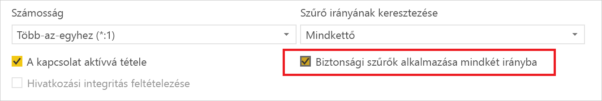
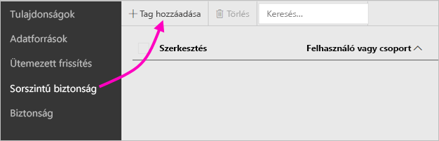
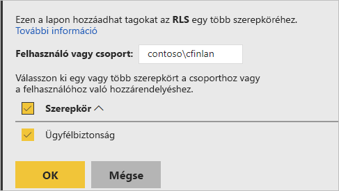
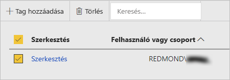

# Sorszintű biztonság (RLS) a Power BI jelentéskészítő kiszolgálóban

A Power BI jelentéskészítő kiszolgálóban a sorszintű biztonság (RLS) használatával korlátozható adott felhasználók adatokhoz való hozzáférése. A szűrők a sorok szintjén korlátozzák az adatok elérését, és szerepkörökön belül határozhat meg szűrőket.  Ha a Power BI jelentéskészítő kiszolgálóban az alapértelmezett engedélyeket használja, akkor bármely olyan felhasználó hozzárendelhet a szerepkörökhöz tagokat az adott jelentéshez, aki rendelkezik Közzétevői vagy Tartalomkezelői engedéllyel a Power BI-jelentéshez.    

RLS-t olyan jelentésekhez konfigurálhat, amelyeket a Power BI Desktop használatával importáltak a Power BI-ba. Olyan jelentésekhez is konfigurálható RLS, amelyek DirectQueryt használnak, amilyen például az SQL Server.  Vegye figyelembe, hogy az RLS nem érvényesül, ha a DirectQuery-kapcsolat integrált hitelesítést használ a jelentésolvasók számára. Az Analysis Services élő kapcsolataihoz a helyszíni modellen konfigurálhatja a sorszintű biztonságot. Az élő kapcsolatok adatkészleteinél nem fog megjelenni a biztonsági beállítás. 

[!INCLUDE [rls-desktop-define-roles](../includes/rls-desktop-define-roles.md)]

## Kétirányú keresztszűrés

A sorszintű biztonsági szűrés alapbeállítás szerint egyirányú szűrőket alkalmaz, függetlenül attól, hogy a kapcsolatok egy- vagy kétirányúra vannak-e beállítva. A kétirányú keresztszűrést manuálisan engedélyezheti a sorszintű biztonsághoz.

- Válassza ki a kapcsolatot, majd jelölje be a **Biztonsági szűrő alkalmazása mindkét irányban** jelölőnégyzetet. 

    

Ezt a négyzetet akkor jelölje be, ha [dinamikus sorszintű biztonságot](https://docs.microsoft.com/analysis-services/tutorial-tabular-1200/supplemental-lesson-implement-dynamic-security-by-using-row-filters) alkalmaz felhasználónév vagy bejelentkezési azonosító alapján. 

További információt a [Kétirányú keresztszűrés a DirectQuery használatával a Power BI Desktopban](../desktop-bidirectional-filtering.md) és [A táblázatos BI szemantikai modell biztonságossá tétele](https://download.microsoft.com/download/D/2/0/D20E1C5F-72EA-4505-9F26-FEF9550EFD44/Securing%20the%20Tabular%20BI%20Semantic%20Model.docx) című tanulmányban talál.

[!INCLUDE [rls-desktop-view-as-roles](../includes/rls-desktop-view-as-roles.md)]

## Tagok hozzáadása szerepkörökhöz 

Miután menti a jelentést a Power BI jelentéskészítő kiszolgálón, kezelheti a biztonságot, és tagokat adhat hozzá vagy távolíthat el a kiszolgálón. A sorszintű biztonsági lehetőség csak azoknál a felhasználóknál jelenik meg, akik Közzétevői vagy Tartalomkezelői engedélyekkel rendelkeznek a jelentéshez, egyéb esetekben ez a lehetőség szürkén jelenik meg.

 Ha a jelentés nem rendelkezik a szükséges szerepkörökkel, nyissa meg a jelentést a Power BI Desktopban, adjon hozzá szerepköröket vagy módosítsa azokat, majd ismét mentse azt a Power BI jelentéskészítő kiszolgálón. 

1. A Power BI Desktopban mentse a jelentést a Power BI jelentéskészítő kiszolgálóra. A Power BI Desktopnak azt a verzióját kell használnia, amely a Power BI jelentéskészítő kiszolgálóhoz van optimalizálva.
2. A Power BI jelentéskészítő kiszolgálóban válassza a jelentés melletti három pontot ( **...** ). 

3. Válassza a **Kezelés** > **Sorszintű biztonság** lehetőséget. 

     

    A **Sorszintű biztonság** oldalon adhat hozzá tagokat a Power BI Desktopban létrehozott szerepkörökhöz.

5. Tag hozzáadásához válassza a **Tag hozzáadása** lehetőséget.

1. A szövegmezőben adja meg a felhasználót vagy a csoportot a Felhasználónév formátumban (TARTOMÁNY\felhasználó), majd válassza ki azokat a szerepköröket, amelyeket hozzájuk szeretne adni. Csak cégen belüli tagot vehet fel.   

    

    Attól függően, hogy hogyan van konfigurálva az Active Directory, itt az egyszerű felhasználónév is megadható. Ebben az esetben a jelentéskészítő kiszolgáló a listában a megfelelő felhasználónevet jeleníti meg.

1. Az alkalmazáshoz kattintson az **OK** lehetőségre.   

8. Ha tagokat szeretne eltávolítani, jelölje be a név melletti jelölőnégyzetet, majd válassza a **Törlés** elemet.  Egyszerre több tag is törölhető. 

    

## username() és userprincipalname()

A username() és a usernameprincipal() DAX-függvény felhasználható az adatkészletben. Használható a Power BI Desktopban megadott kifejezésekben is. A modelleket közzétételük után a Power BI jelentéskészítő kiszolgáló használja.

A Power BI Desktopban a username() a felhasználót adja eredményül TARTOMÁNY\Felhasználó formátumban, a userprincipalname() pedig user@contoso.com formátumban.

A Power BI jelentéskészítő kiszolgálóban a username() és a userprincipalname() egyaránt a felhasználó egyszerű felhasználónevét adja vissza, amely egy e-mail-címhez hasonló.

Ha a Power BI jelentéskészítő kiszolgálóban egyéni hitelesítést használ, akkor azt a felhasználónév-formátumot adja vissza, amelyet Ön megadott a felhasználók számára.  

## Korlátozások 

Itt találja a sorszintű biztonság Power BI-modellekben érvényes aktuális korlátozásait. 

Azok a felhasználók, akik a username() DAX-függvényt használó jelentésekkel rendelkeznek, új viselkedést fognak tapasztalni, amelyben a függvény visszaadja az egyszerű felhasználónevet (UPN-t), KIVÉVE, ha a DirectQueryt integrált biztonsági megoldással használják.  Mivel ebben a helyzetben az RLS nem érvényesül, az itteni viselkedés változatlan marad.

Csak a Power BI Desktoppal létrehozott adathalmazokon határozhat meg RLS-t. Ha az Excellel létrehozott adatkészletekhez szeretné engedélyezni az RLS-t, először Power BI Desktop- (PBIX-) fájlokká kell konvertálnia a fájlokat. További információ az [Excel-fájlok konvertálásáról](../desktop-import-excel-workbooks.md).

Csak az Extract, a Transform, a Load (ETL) és a tárolt hitelesítő adatokat használó DirectQuery-kapcsolatok vannak támogatva. Az Analysis Servicesbe irányuló élő kapcsolatok és az integrált hitelesítést használó DirectQuery-kapcsolatok az alapul szolgáló adatforrásban vannak kezelve. 

Ha integrált biztonságot használ a DirectQueryben, a felhasználói az alábbiakat tapasztalhatják majd:
- Az RLS le van tiltva, és minden adat vissza lesz adva.
- A felhasználók nem tudják frissíteni a szerepkör-hozzárendeléseiket, és hibaüzenetet kapnak az RLS-kezelési oldalon.
- A DAX username függvényei esetén a felhasználóneveket továbbra is TARTOMÁNY\FELHASZNÁLÓ formátumban kapja. 

A jelentéskészítőknek nincs hozzáférésük a jelentésadatok megtekintéséhez a Power BI jelentéskészítő kiszolgálóban, amíg nem rendeltek magukhoz megfelelő szerepköröket a jelentés feltöltését követően. 

 

## Gyakori kérdések 

### Létrehozhatom ezeket a szerepköröket Analysis Services-adatforrásokhoz? 

Igen, ha az adatokat a Power BI Desktopba importálta. Ha élő kapcsolatot használ, nem konfigurálhatja az RLS-t a Power BI szolgáltatáson belül. Az RLS a helyszínen van meghatározva az Analysis Services-modellben. 

### RLS-sel korlátozhatom a felhasználóim számára elérhető oszlopok vagy mértékek körét? 

Nem. Ha egy felhasználó hozzáfér egy adott adatsorhoz, a sor összes adatoszlopát láthatja. 

### Lehetővé teszi az RLS, hogy elrejtsem a részletes adatokat, de hozzáférést nyújtsak a vizualizációkban összegzett adatokhoz? 

Nem. Egy-egy adatsort biztosíthat, de a felhasználók mindig látják a részleteket vagy az összegzett adatokat. 

### Hozzáadhatok új szerepköröket a Power BI Desktopban, ha már vannak meglévő szerepköreim és hozzárendelt tagok? 

Igen, ha már rendelkezik meglévő szerepkörökkel és hozzárendelt tagokkal a Power BI jelentéskészítő kiszolgálóban, további szerepköröket is létrehozhat, és a jelentést újra közzéteheti, és ez nem lesz hatással a jelenlegi hozzárendelésekre. 
 

## Következő lépések

[Mi a Power BI jelentéskészítő kiszolgáló?](get-started.md) 
[Rendszergazdai kézikönyv](admin-handbook-overview.md)  

További kérdései vannak? [Kérdezze meg a Power BI közösségét](https://community.powerbi.com/)
