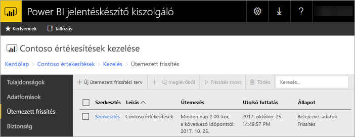

# A Power BI-jelentések ütemezett frissítése a Power BI jelentéskészítő kiszolgálón
A Power BI jelentések ütemezett frissítésének köszönhetően folyamatosan naprakészek maradnak a jelentések adatai.

Az ütemezett frissítés csak a beágyazott modellen alapuló Power BI-jelentések esetében érhető el. Ez más szóval azt jelenti, hogy a jelentés nem élő kapcsolatra vagy DirectQueryre épül, hanem importálva vannak a jelentésbe az adatok. Az adatok importálása azt eredményezi, hogy megszűnik a kapcsolatuk az eredeti adatforrással, ezért frissíteni kell őket ahhoz, hogy naprakészek maradjanak. Az adatok naprakészségének megőrzésére az ütemezett frissítés alkalmazható.

Az ütemezett frissítést a jelentések kezelési szakaszában lehet konfigurálni. Az ütemezett frissítés konfigurálásról [A Power BI jelentések ütemezett frissítésének konfigurálása](configure-scheduled-refresh.md) című cikk nyújt részletes tájékoztatást.

## A funkció működése
A Power BI-jelentések ütemezett frissítésében számos összetevő vesz részt.

* Az SQL Server Agent tölti be az ütemezett eseményeket generáló időzítő szerepét.
* Ütemezett feladatok jönnek létre a jelentéskészítő kiszolgáló adatbázisának esemény- és értesítésvárakozási sorában. Bővítő telepítés esetén a várakozási sort a környezet összes jelentéskészítő kiszolgálója közösen használja.
* Minden olyan jelentésfeldolgozás, amely ütemezett esemény hatására következik be, háttérfolyamatként megy végbe.
* Az adatmodellt egy Analysis Services-példányban tölti be a rendszer.
* Bizonyos adatforrások esetében a Power Query adategyesítési motor létesít kapcsolatot az adatforrásokkal, illetve alakítja át az adatokat. Más típusú adatforrásokkal közvetlenül a Power BI jelentéskészítő kiszolgáló adatmodelljeit szolgáltató Analysis Services-példány létesíthet kapcsolatot.
* Az új adatok az Analysis Services adatmodelljébe töltődnek be.
* Az Analysis Services feldolgozza az adatokat, és elvégzi a szükséges számításokat.

A Power BI jelentéskészítő kiszolgáló működtet egy eseményvárakozási sort az ütemezett műveletek tárolására. Rendszeres időközönként lekérdezi a várakozási sort, hogy nincsenek-e új események. Alapértelmezés szerint 10 másodpercenként vizsgálja meg a várakozási sort. Az időköz az RSReportServer.config fájl **PollingInterval**, **IsNotificationService** és **IsEventService** konfigurációs beállításával módosítható. Az **IsDataModelRefreshService** is használható annak beállítására, hogy egy jelentéskészítő kiszolgáló feldolgozza-e az ütemezett eseményeket.

### Analysis Services
A Power BI-jelentések megjelenítéséhez, illetve az ütemezett frissítés elvégzéshez be kell tölteni a Power BI-jelentés adatmodelljét az Analysis Servicesbe. A Power BI jelentéskészítő kiszolgálóval együtt fut az Analysis Services egy példánya.

## Szempontok és korlátozások
### Mikor nem lehet ütemezett frissítést használni?
Nem minden Power BI-jelentéshez lehet létrehozni ütemezett frissítési tervet. A következő lista tartalmazza azokat a Power BI-jelentéseket, amelyekhez nem lehet ütemezett frissítés tervet létrehozni.

* A jelentésnek van legalább egy élő kapcsolatot használó Analysis Services-adatforrása.
* A jelentésnek van legalább egy DirectQueryt használó adatforrása.
* A jelentésnek nincs adatforrása, például azért, mert az adatok megadása manuálisan, az *Adatbevitel* funkcióval történik, vagy egy jelentésnek csak statikus tartalma van (képek, szöveg stb.).

A fenti listán felül vannak olyan speciális helyzetek, amelyekben az *importált* adatforrások ellenére nem lehet frissítési terveket létrehozni.

* Ha az adatforrás *fájl* vagy *mappa* típusú, és az elérési útja helyi elérési út (például. C:\Users\Felhasználó\Dokumentumok), akkor nem lehet frissítési tervet létrehozni. Az elérési útnak olyan elérési útnak kell lennie, amelyhez úgy csatlakozhat a jelentéskészítő kiszolgáló, mint egy hálózati megosztáshoz. Ez lehet például *\\megosztás\Dokumentumok*.
* Ha egy adatforráshoz csak OAuth-hitelesítéssel lehet csatlakozni (például Facebook, Google Analytics, Salesforce stb.), akkor nem lehet gyorsítótár-frissítési tervet létrehozni. A jelentéskészítő kiszolgáló egyelőre nem támogatja az OAuth-hitelesítést semmilyen adatforrás esetében, akár többoldalas, akár mobil-, akár Power BI-jelentésekről van szó.

### Memóriakorlátozások
A jelentéskészítő kiszolgáló szokásos feladatai hasonlítanak a webalkalmazásokéihoz. Az importált adatokat tartalmazó vagy DirectQueryre épülő jelentések betöltéséhez, illetve az ütemezett frissítések végrehajtásához szükség van egy, a jelentéskészítő kiszolgáló mellett futó Analysis Services-példányra. Ez a vártnál nagyobb memóriaigényt támaszthat a kiszolgálóval szemben. Tehát ennek megfelelően kell megtervezni a kiszolgáló üzembe helyezését, vagyis ügyelni kell arra, hogy az Analysis Services is fogyaszthat memóriát a jelentéskészítő kiszolgáló mellett.

Az Analysis Services-példányok monitorozásáról az [Analysis Services-példány monitorozása](https://docs.microsoft.com/sql/analysis-services/instances/monitor-an-analysis-services-instance) című cikk nyújt tájékoztatást.

Az Analysis Servicesen belüli memóriabeállításokról a [Memóriatulajdonságok](https://docs.microsoft.com/sql/analysis-services/server-properties/memory-properties) című cikkben olvashat.

## Következő lépések
Egy Power BI-jelentés [ütemezett frissítésének](configure-scheduled-refresh.md) konfigurálása.

További kérdései vannak? [Kérdezze meg a Power BI közösségét](https://community.powerbi.com/)

