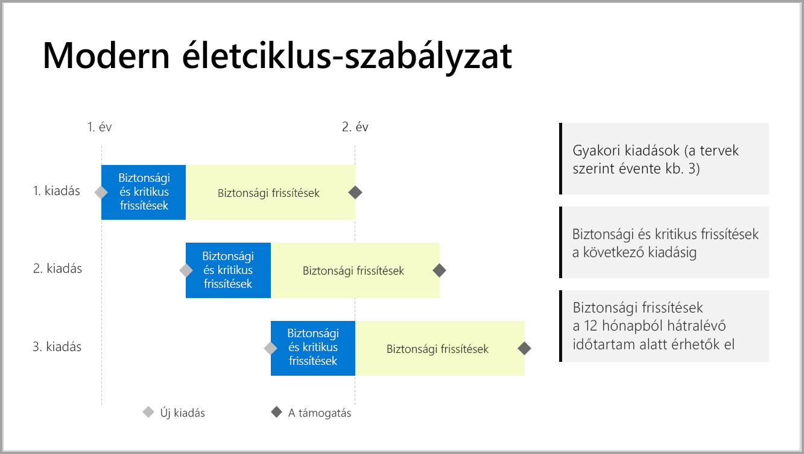

# A Power BI jelentéskészítő kiszolgáló támogatási ütemterve

A Power BI jelentéskészítő kiszolgáló évente néhány alkalommal jelenik meg. A biztonsági és kritikus frissítések addig érhetők el, amíg az új kiadás általánosan elérhető nem lesz. A következő kiadás megjelenése után az előző kiadás a 12 hónapos kiadási ciklusa hátralévő idejében továbbra is letölti a biztonsági frissítéseket.

Ezzel a támogatási házirenddel az újítások gyorsan eljutnak az ügyfelekhez, ugyanakkor az ügyfelek azokat rugalmasan, a saját tempójuknak megfelelően alkalmazhatják.

* Biztonsági és kritikus frissítések szolgáltatási fázisa – A legfrissebb Power BI jelentéskészítő kiszolgáló használata esetén a biztonsági és a kritikus frissítésekben Ön egyaránt részesül.
* Biztonsági frissítések (kizárólag) szolgáltatási fázisa – Egy új verzió megjelenését követően a korábbi verziók támogatása a 12 hónapos támogatási ciklus hátralévő idejére a biztonsági frissítésekre korlátozódik (lásd: 1-es ábra).

    

## Korábbi verziók

| **Verzió** | **Elérhetőség dátuma** | **Támogatás végének dátuma** |
| --- | --- | --- |
| 2017. június |2017. június 12. |Már nem támogatott |
| 2017. október |2017. október 31. | Már nem támogatott |
| 2018. március | 2018. március 19. | 2019. március 19. |
| 2018. augusztus | 2018. augusztus 15. | 2019. augusztus 15. |
| 2019. január | 2019. január 23. | 2020. január 23. |
| 2019. május | 2019. május 22. | 2020. május 22. |

A Power BI jelentéskészítő kiszolgáló, illetve a Power BI jelentéskészítő kiszolgálóra optimalizált Power BI Desktop letöltéséhez nyissa meg az [On-premises reporting with Power BI Report Server](https://powerbi.microsoft.com/report-server/) (Helyi jelentéskészítés Power BI jelentéskészítő kiszolgálóval) webhelyet.

## Következő lépések
[A Power BI jelentéskészítő kiszolgáló újdonságai](whats-new.md)  
[A Power BI Jelentéskészítő kiszolgáló bemutatása](get-started.md)
[Rendszergazdai áttekintés](admin-handbook-overview.md)  
[A Power BI jelentéskészítő kiszolgáló telepítése](install-report-server.md)  

További kérdései vannak? [Kérdezze meg a Power BI közösségét](https://community.powerbi.com/)