# Oktatóanyag: A Power BI jelentéskészítő kiszolgáló webportáljának áttekintése virtuális gépen
Ebben az oktatatóanyagban Azure-beli virtuális gépet hozhat létre az előre telepített Power BI jelentéskészítő kiszolgálóval, így kipróbálhatja a Power BI- és a többoldalas jelentésminták és főbb teljesítménymutatók megtekintését, szerkesztését és kezelését.

Az oktatóanyag során a következő feladatokat végezheti el:

> [!div class="checklist"]
> * Virtuális gép létrehozása és csatlakozás hozzá
> * A Power BI jelentéskészítő kiszolgáló webportáljának elindítása és áttekintése
> * Kedvenc elem címkézése
> * Power BI-jelentés megtekintése és szerkesztése
> * Többoldalas jelentés megtekintése, kezelése és szerkesztése
> * Excel-munkafüzet megtekintése az Excel Online-ban

Ehhez az oktatóanyaghoz Azure-előfizetés szükséges. Ha még nincs, kezdés előtt hozzon létre egy [ingyenes fiókot](https://azure.microsoft.com/free/?WT.mc_id=A261C142F).

## Virtuális gép létrehozása Power BI jelentéskészítő kiszolgálóhoz

Szerencsére a Power BI csapata létrehozott egy virtuális gépet, amelyre már telepítve van a Power BI jelentéskészítő kiszolgáló.

1. Az Azure Marketplace-en nyissa meg a [Power BI jelentéskészítő kiszolgáló](https://azuremarketplace.microsoft.com/marketplace/apps/reportingservices.technical-preview?tab=Overview) elemet.  

2. Válassza a **Letöltés most** lehetőséget.
3. A szolgáltató használati feltételeinek és adatvédelmi szabályzatának elfogadásához válassza a **Tovább** lehetőséget.

    

4. **1. lépés, Alapok** – a **Virtuális gép neve** mezőben adja meg a **reportservervm** értéket.

5. Hozzon létre egy felhasználónevet és jelszót.

6. Az **Erőforráscsoport** alatt tartsa meg az **Új létrehozása** beállítást, és adja meg hozzá a **reportserverresourcegroup** nevet.

    Ha többször elvégzi az oktatóanyagot, az első alkalom után új nevet kell adnia az erőforráscsoportnak. Egy előfizetésben nem használhatja kétszer ugyanazt az erőforráscsoport-nevet. 

7. Tartsa meg a többi alapbeállítást > **OK**.

    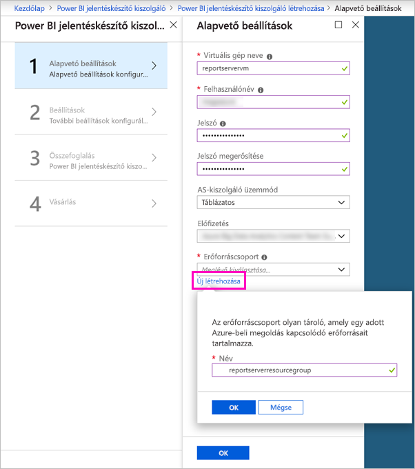

8. **2. lépés, Beállítások** – tartsa meg az alapértelmezett beállításokat > **OK**.

9. **3. lépés, Összegzés** > **OK**.

10. **4. lépés** – tekintse át a felhasználókra vonatkozó használati feltételeket és az adatvédelmi szabályzatot > **Létrehozás**.

    A **Power BI jelentéskészítő kiszolgáló üzembe helyezésének kérése** folyamat több percig is eltarthat.

## Virtuális gép csatlakoztatása

1. Az Azure bal oldali navigációs paneljén válassza a **Virtuális gépek** lehetőséget. 

2. A **Szűrés név szerint** mezőbe gépelje be a „report” szót. 

3. Jelölje ki a **REPORTSERVERVM** nevű virtuális gépet.

    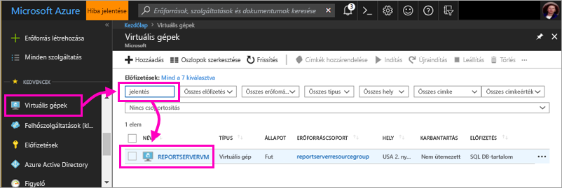

4. A REPORTSERVERVM virtuális gép ablakában válassza a **Csatlakozás** lehetőséget.

    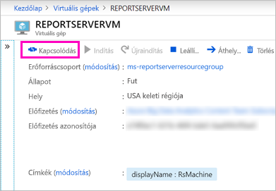

5. A Távoli asztali kapcsolat párbeszédablakban válassza a **Csatlakozás** lehetőséget.

6. Adja meg a virtuális géphez létrehozott felhasználónevet és jelszót > **OK**.

7. A következő párbeszédpanelen az áll, hogy a távoli számítógép nem azonosítható. Válassza az **Igen** lehetőséget.

   Máris megnyílik az új virtuális gép.

## A Power BI jelentéskészítő kiszolgáló a virtuális gépen

Amikor a virtuális gép megnyílik, a következő elemek láthatók az asztalán.

|Szám  |Az ikon szerepe  |
|---------|---------|
| | Elindítja az SQL Server Data Tools programot többoldalas (.RDL) jelentések létrehozásához |
| | Power BI-jelentésminták (.PBIX)  |
| | A Power BI jelentéskészítő kiszolgáló dokumentációjára mutató hivatkozás   |
| | Elindítja a Power BI jelentéskészítő kiszolgálóhoz optimalizált Power BI Desktopot (2018. március)  |
| | A Power BI jelentéskészítő kiszolgáló webportált nyitja meg a böngészőben   |

Kattintson duplán a **Jelentéskészítő kiszolgáló webportál** ikonra. A böngészőben megnyílik a http://localhost/reports/browse oldal. A webportálon több, típusonként csoportosított fájlt talál. 

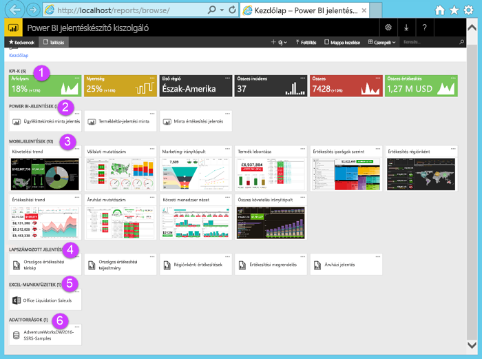

|Szám  |Az ikon szerepe  |
|---------|---------|
| | A webportálon létrehozott főbb teljesítménymutatók (KPI-k) |
| |  Power BI (.PBIX) jelentések  |
| | Az SQL Server Mobiljelentés-publikálóban létrehozott mobiljelentések  |
| |  A Jelentéskészítő vagy az SQL Server Data Tools használatával létrehozott többoldalas jelentések  |
| | Excel-munkafüzetek   | 
| | Adatforrások többoldalas jelentésekhez | 

## Kedvencek címkézése
A kívánt főbb teljesítménymutatókat és jelentéseket megjelölheti kedvencként. Mivel ezek a központi Kedvencek mappában kapnak helyet, könnyen megtalálhatók mind a webportálon, mind a Power BI-mobilalkalmazásokban. 

1. Válassza a három pont ikont (**…**) a **Haszonkulcs** KPI jobb felső sarkában, majd válassza a **Hozzáadás a Kedvencekhez** lehetőséget.
   
    
2. Ha a webportál menüszalagján a **Kedvencek** lehetőségre kattint, ez a csoport is megjelenik a webportál Kedvencek lapján.
   
    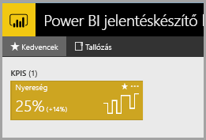

3. A **Böngésző** lehetőség választásával térjen vissza a webportálra.
   
## Elemek megtekintése listanézetben
A webportál alapértelmezés szerint Csempe nézetben látható.

Ön azonban Lista nézetre válthat, amelyben egyszerre több elemet is egyszerűen mozgathat vagy törölhet. 

1. Kattintson a **Csempék** > **Lista** elemre.
   
    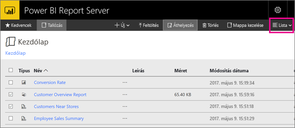

2. Térjen vissza a csempenézetre: válassza a **Lista** > **Csempék** elemet.

## Power BI-jelentések

A webportálon megtekintheti és kezelheti a Power BI-jelentéseket, és közvetlenül innen elindíthatja a Power BI Desktopot.

### Power BI-jelentések megtekintése

1. A webportálon a **Power BI-jelentések** alatt válassza a **Ügyféláttekintő jelentésmintát**. A jelentés megnyílik a böngészőben.

1. Jelölje ki az Egyesült Államokat a faszerkezetes térképen, és figyelje meg, hogyan emeli ki a többi vizualizáció ehhez kapcsolódó értékeit.

    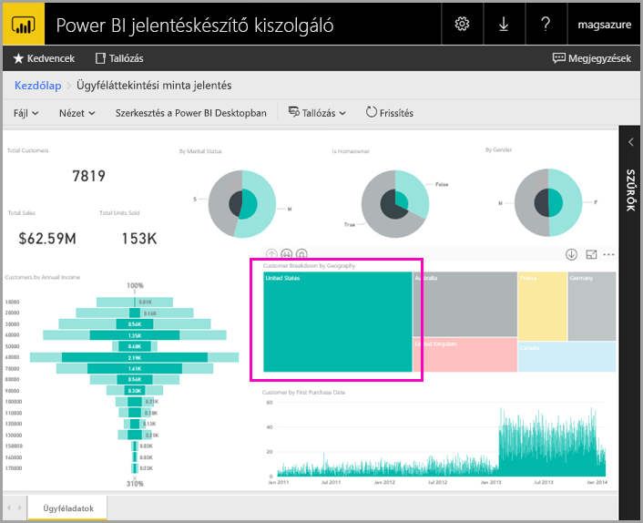

### Szerkesztés a Power BI Desktopban

1. Válassza a **Szerkesztés a Power BI Desktopban** lehetőséget.

1. Válassza az **Engedélyezés** lehetőséget, hogy ez a webhely megnyithasson egy programot az Ön számítógépén. 

     A jelentés megnyílik a Power BI Desktopban. Figyelje meg a felső sávban látható nevet: "Power BI Desktop (2018. március)". Ez a Power BI jelentéskészítő kiszolgálóhoz optimalizált verzió.

    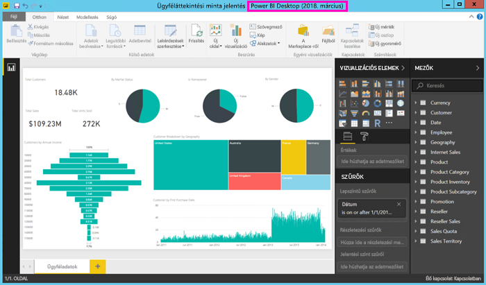

     A Power BI Desktop a virtuális gépen telepített verzióját használja. Jelentés feltöltéséhez nem léphet másik tartományba.

3. A Mezők panelen bontsa ki az Ügyfél táblát, és húzza át a Foglalkozás mezőt a jelentésszintű szűrők közé.

    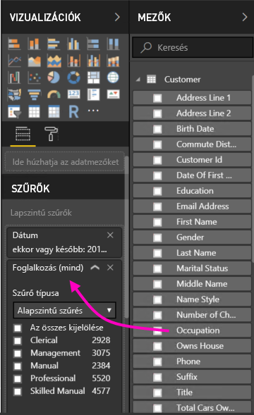

1. Mentse a jelentést.

1. Térjen vissza a jelentéshez a böngészőben, és használja a böngésző **Frissítés** ikonját.

    

8. Bontsa ki a jobb oldali **Szűrők** panelt, hogy megjelenjen a hozzáadott **Foglalkozás** mező. Válassza a **Hivatásos** elemet.

    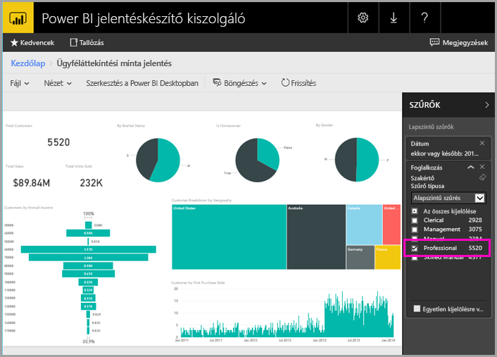

3. A **Böngésző** lehetőség választásával térjen vissza a webportálra.

## Többoldalas (.RDL) jelentések

A webportálon megtekintheti és kezelheti a többoldalas jelentéseket, és közvetlenül innen elindíthatja a Jelentéskészítőt.

### Lapszámozott jelentés kezelése

1. A webportálon a **Lapszámozott jelentések** alatt válassza az **Értékesítési rendelés** > **Kezelés** melletti három pont ikont (…).

1. Válassza a **Paraméterek** lehetőséget, és változtassa meg a **SalesOrderNumber** alapértelmezését az **SO50689** értékre  > **Alkalmaz**.

   

3. A **Böngésző** lehetőség választásával térjen vissza a webportálra.

### Többoldalas jelentés megtekintése

1. A webportálon válassza az **Értékesítési rendelés** lehetőséget.
 
3.  Az Ön által beállított **Rendelés** paraméternél az **SO50689**-nél nyílik meg. 

    

    Ez és a többi a paraméter itt az alapértelmezés megváltoztatása nélkül módosítható.

1. Válassza a **Rendelés** **SO48339** > **Jelentés megtekintése** lehetőséget.

4. Figyelje meg, hogy ez az összesen 2 oldal közül az első. A második oldalra a jobbra mutató nyíllal lapozhat át. A táblázat ezen az oldalon folytatódik.

    

5. A **Böngésző** lehetőség választásával térjen vissza a webportálra.

### Többoldalas jelentés szerkesztése

A többoldalas jelentések a Jelentéskészítőben szerkeszthetők, a Jelentéskészítő pedig leindítható közvetlenül a böngészőből.

1. A webportálon válassza az **Értékesítési rendelés** > **Szerkesztés a Jelentéskészítőben** melletti három pont ikont (…).

1. Válassza az **Engedélyezés** lehetőséget, hogy ez a webhely megnyithasson egy programot az Ön számítógépén.

1. Az Értékesítési rendelés jelentés Tervező nézetben nyílik meg a Jelentéskészítőben.

    

1. A jelentés előnézetéhez válassza a **Futtatás** lehetőséget.

    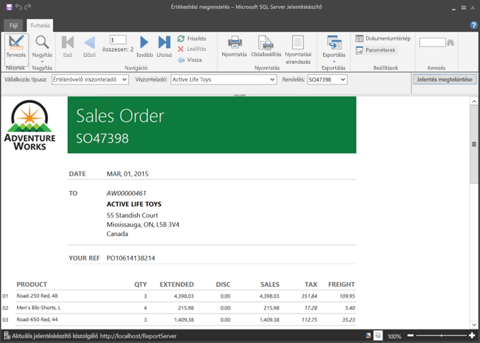

5. Zárja be a Jelentéskészítőt és térjen vissza a böngészőhöz.

## Excel-munkafüzetek megtekintése

A Power BI jelentéskészítő kiszolgálón az Excel Online-ban jeleníthet meg és kezelhet Excel-munkafüzeteket. 

1. Válassza az **Office Liquidation Sale.xlsx** Excel-munkafüzetet. Előfordulhat, hogy az a hitelesítő adatait kéri. Válassza a **Mégse** lehetőséget. 
    A fájl megnyílik a webportálon.
1. Válassza a szeletelő **Készülék** elemét.

    

1. A **Böngésző** lehetőség választásával térjen vissza a webportálra.

## Az erőforrások felszabadítása

Az oktatóanyag befejezése után törölje az erőforráscsoportot, a virtuális gépet és minden hozzájuk kapcsolódó erőforrást. 

- Ehhez jelölje ki a virtuális gép erőforráscsoportját, és válassza a **Törlés** lehetőséget.

## Következő lépések

Az oktatóanyag elvégzése során létrehozott egy virtuális gépet Power BI jelentéskészítő kiszolgálóval. Kipróbálhatta a webportál néhány funkcióját, valamint megnyitott egy Power BI-jelentést és egy többoldalas jelentést a megfelelő szerkesztőfelületen. Ezen a virtuális gépen SQL Server Analysis Services-adatforrások vannak telepítve, így ezekkel létrehozhat saját Power BI- és lapszámozott jelentéseket. 

A folytatásban még többet tudhat meg a Power BI jelentéskészítő kiszolgálóhoz készült jelentések létrehozásáról.

> [!div class="nextstepaction"]
> [Power BI-jelentés létrehozása a Power BI jelentéskészítő kiszolgálóhoz](./quickstart-create-powerbi-report.md)

