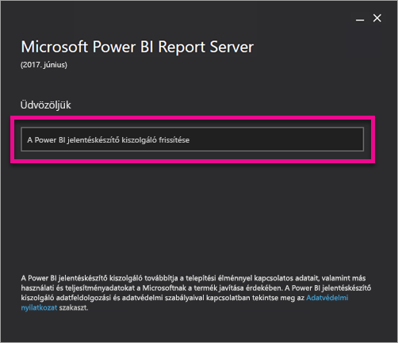
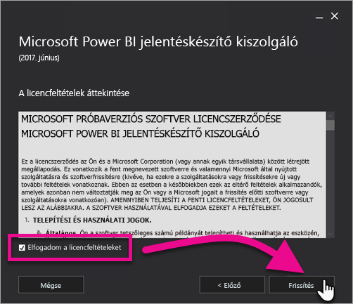
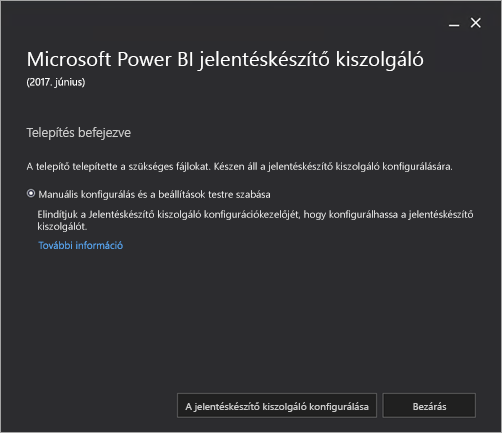

# A Power BI jelentéskészítő kiszolgáló frissítése

A Power BI jelentéskészítő kiszolgáló frissítésének ismertetése

 **Letöltés** 

A Power BI jelentéskészítő kiszolgáló, illetve a Power BI jelentéskészítő kiszolgálóra optimalizált Power BI Desktop letöltéséhez nyissa meg az [On-premises reporting with Power BI Report Server](https://powerbi.microsoft.com/report-server/) (Helyi jelentéskészítés Power BI jelentéskészítő kiszolgálóval) webhelyet.

## Előkészületek

Azt javasoljuk, hogy mielőtt frissít egy jelentéskészítő kiszolgálót, a következő lépésekkel készítsen róla biztonsági másolatot.

### A titkosítási kulcsok biztonsági másolatának elkészítése

Célszerű biztonsági másolatot készíteni a titkosítási kulcsokról, mielőtt első alkalommal konfigurálja egy jelentéskészítő kiszolgáló telepítését. Azt javasoljuk ezenkívül, hogy mindig készítsen biztonsági másolatot a kulcsokról, ha módosítja a szolgáltatásfiókok identitását, vagy átnevezi a számítógépet. Erről [A Reporting Services titkosítási kulcsainak biztonsági mentése és visszaállítása](https://docs.microsoft.com/sql/reporting-services/install-windows/ssrs-encryption-keys-back-up-and-restore-encryption-keys) című cikk tartalmaz további tájékoztatást.

### A jelentéskészítő kiszolgáló adatbázisainak biztonsági mentése

A jelentéskészítő kiszolgáló állapot nélküli kiszolgáló, ezért az alkalmazások minden adatát a **reportserver** és a **reportservertempdb** adatbázis tárolja (ezek egy SQL Server Database Engine-példányon futnak). A **reportserver** és a **reportservertempdb** adatbázis biztonsági másolatát az SQL Server-adatbázisok valamelyik támogatott biztonsági mentési módszerével készítheti el. Konkrétan a jelentéskészítő kiszolgálók adatbázisára vonatkozóan a következő ajánlások érvényesek:

* A **reportserver** adatbázis biztonsági mentését a teljes helyreállítási modellel készítse el.
* A **reportservertempdb** adatbázis biztonsági mentését az egyszerű helyreállítási modellel készítse el.
* A két adatbázist biztonsági mentését végezheti eltérő ütemezéssel. A **reportservertempdb** adatbázisról csak azért kell biztonsági másolatot készíteni, hogy hardverhiba esetén ne kelljen újra létrehozni. Hardverhiba esetén nem kell helyreállítani a **reportservertempdb** adatait, a táblaszerkezetére azonban szükség van. Ha elveszíti a **reportservertempdb** adatbázist, csakis a jelentéskészítő kiszolgáló adatbázisának ismételt létrehozásával nyerheti vissza. Ha újra létrehozza a **reportservertempdb** adatbázist, fontos, hogy a neve megegyezzen a jelentéskészítő kiszolgáló elsődleges adatbázisáéval.

Az SQL Server relációs adatbázisainak biztonsági mentéséről és helyreállításáról [Az SQL Server-adatbázisok biztonsági mentése és visszaállítása](https://docs.microsoft.com/sql/relational-databases/backup-restore/back-up-and-restore-of-sql-server-databases) című cikk nyújt tájékoztatást.

### A konfigurációs fájlok biztonsági mentése

A Power BI jelentéskészítő kiszolgáló konfigurációs fájlokban tárolja az alkalmazásbeállításokat. Azt javasoljuk, hogy készítsen biztonsági másolatot a fájlokról a kiszolgáló első konfigurálásakor, illetve azt követően, hogy egyéni bővítményeket telepít. A következő fájlokról kell biztonsági mentést készíteni:

* config.json
* RSHostingService.exe.config
* Rsreportserver.config
* Rssvrpolicy.config
* Reportingservicesservice.exe.config
* A jelentéskészítő kiszolgáló ASP.NET-alkalmazásainak web.config fájlja
* Az ASP.NET machine.config fájlja

## A jelentéskészítő kiszolgáló frissítése

A Power BI jelentéskészítő kiszolgáló frissítése nagyon egyszerű. Alig néhány lépés szükséges a fájlok telepítéséhez.

1. Keresse meg a PowerBIReportServer.exe fájlt, és indítsa el a telepítőt.

2. Válassza az **Upgrade Power BI Report Server** (Power BI jelentéskészítő kiszolgáló frissítése) lehetőséget.

    

3. Olvassa el a licencfeltételeket, majd válassza az **Upgrade** (Frissítés) elemet.

    

4. A sikeres frissítés után a **Configure Report Server** (Jelentéskészítő kiszolgáló konfigurálása) gombbal elindíthatja a Reporting Services konfigurációkezelőt, vagy kiléphet a telepítőből a **Close** (Bezárás) gombra kattintva.

    

## A Power BI Desktop frissítése

A jelentéskészítő kiszolgáló frissítése után gondoskodnia kell róla, hogy minden olyan felhasználó, aki Power BI-jelentéseket készít, frissítsen a Power BI Desktopnak arra a verziójára, amely a kiszolgálón futó Power BI jelentéskészítő kiszolgálóra van optimalizálva.

## Következő lépések

* [Rendszergazdai áttekintés](admin-handbook-overview.md)  
* [A Power BI jelentéskészítő kiszolgálóhoz optimalizált Power BI Desktop telepítése](install-powerbi-desktop.md)  
* [A Reporting Services telepítésének ellenőrzése](https://docs.microsoft.com/sql/reporting-services/install-windows/verify-a-reporting-services-installation)  
* [A jelentéskészítő kiszolgáló szolgáltatásfiókjának konfigurálása](https://docs.microsoft.com/sql/reporting-services/install-windows/configure-the-report-server-service-account-ssrs-configuration-manager)  
* [A jelentéskészítő kiszolgáló URL-címeinek konfigurálása](https://docs.microsoft.com/sql/reporting-services/install-windows/configure-report-server-urls-ssrs-configuration-manager)  
* [A jelentéskészítő kiszolgáló adatbázis-kapcsolatának konfigurálása](https://docs.microsoft.com/sql/reporting-services/install-windows/configure-a-report-server-database-connection-ssrs-configuration-manager)  
* [Jelentéskészítő kiszolgáló inicializálása](https://docs.microsoft.com/sql/reporting-services/install-windows/ssrs-encryption-keys-initialize-a-report-server)  
* [SSL-kapcsolatok konfigurálása a jelentéskészítő kiszolgálón](https://docs.microsoft.com/sql/reporting-services/security/configure-ssl-connections-on-a-native-mode-report-server)  
* [Windows-szolgáltatásfiókok és -engedélyek konfigurálása](https://docs.microsoft.com/sql/database-engine/configure-windows/configure-windows-service-accounts-and-permissions)  
* [A Power BI jelentéskészítő kiszolgáló böngészőtámogatása](browser-support.md)

További kérdései vannak? [Kérdezze meg a Power BI közösségét](https://community.powerbi.com/)