# Ügyfél-jövedelmezőségi minta a Power BI-hoz: Bemutató megtekintése

Az Ügyfél-jövedelmezőségi minta nevű tartalomcsomag egy marketinganyagokat készítő céghez tartozó irányítópultot, jelentést és adatkészletet tartalmaz. Az irányítópult létrehozásával a pénzügyi vezető figyelni tudja az 5 üzleti egység kezelőjéhez (vezetőjéhez), a termékekhez, az ügyfelekhez és a bruttó árréshez tartozó fontosabb metrikákat. Egyetlen pillantással láthatja, hogy mely tényezők vannak hatással a jövedelmezőségre.

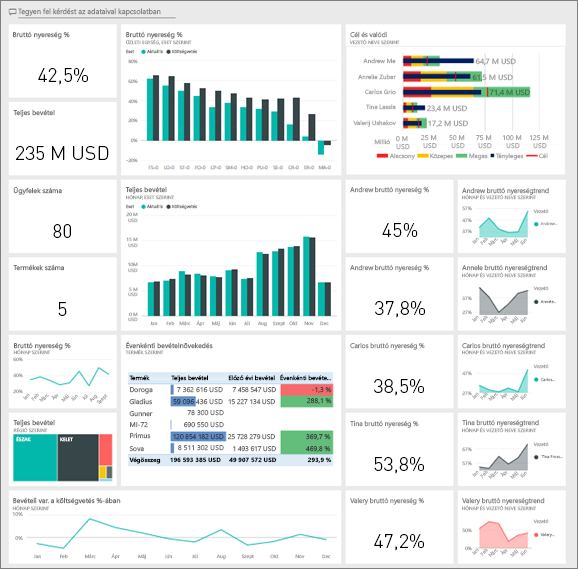

Ez a minta abba a sorozatba tartozik, amely a Power BI üzleti jellegű adatokkal, jelentésekkel, és irányítópultokkal történő használatát mutatja be. Az [obviEnce](http://www.obvience.com/) által lett létrehozva valós adatokkal, melyeket anonimizáltunk. Az adatok többféle formátumban: tartalomcsomagként, .pbix kiterjesztésű Power BI Desktop-fájlként és Excel-munkafüzetként is elérhetők. [Power BI-minták](sample-datasets.md) megtekintése. 

Ez az oktatóanyag a Power BI szolgáltatásban mutatja be az Ügyfél-jövedelmezőségi minta tartalomcsomagot. Mivel azonban a jelentéssel való munka hasonló a Power BI Desktopban és a szolgáltatásban, a bemutatót akkor is követni tudja, ha a .pbix-mintafájlt a Power BI Desktopban használja. 

A minták Power BI Desktopban való vizsgálatához nincs szükség Power BI-licencre. Ha nem rendelkezik Power BI Pro-licenccel, a mintát a Saját munkaterületre mentheti a Power BI szolgáltatásban. 

## A minta beszerzése

Használat előtt a mintát [tartalomcsomagként](#get-the-content-pack-for-this-sample), [.pbix-fájlként](#get-the-pbix-file-for-this-sample) vagy [Excel-munkafüzetként](#get-the-excel-workbook-for-this-sample) le kell töltenie.

### Tartalomcsomag letöltése ehhez a mintához

1. Nyissa meg a Power BI szolgáltatást (app.powerbi.com), jelentkezzen be, majd nyissa meg azt a munkaterületet, ahol a mintát szeretné menteni.

   Ha nem rendelkezik Power BI Pro-licenccel, a mintát a Saját munkaterületre mentheti.

2. A bal alsó sarokban válassza az **Adatok lekérése** lehetőséget.

   
3. Ekkor megjelenik az **Adatok lekérése** lap. Itt válassza a **Minták** lehetőséget.

4. Válassza ki az **Ügyfél-jövedelmezőségi mintát**, majd válassza a **Kapcsolódás** lehetőséget.  

    
5. A Power BI importálja a tartalomcsomagot, és egy új irányítópultot, jelentést és adatkészletet ad hozzá az aktuális munkaterülethez.

    

### .pbix-fájl letöltése ehhez a mintához

Az Ügyfél-jövedelmezőségi mintát a Power BI Desktoppal való használatra tervezett [.pbix-fájlként](https://download.microsoft.com/download/6/A/9/6A93FD6E-CBA5-40BD-B42E-4DCAE8CDD059/Customer%20Profitability%20Sample%20PBIX.pbix) is letöltheti.

### Excel-munkafüzet letöltése ehhez a mintához

Ha a minta adatforrását is szeretné megtekinteni, használja az [Excel-munkafüzetként](https://go.microsoft.com/fwlink/?LinkId=529781) letölthető változatát. A munkafüzet megtekinthető és módosítható Power View-lapokat tartalmaz. A nyers adatok megtekintéséhez engedélyezze az Adatok Elemzése bővítményeket, majd válassza a **Power Pivot > Kezelés** lehetőséget. A Power View és a Power Pivot bővítmények engedélyezéséről az [Excel-minták megtekintése magában az Excelben](sample-datasets.md#optional-take-a-look-at-the-excel-samples-from-inside-excel-itself) című cikkben olvashat részletesen.

## Mi olvasható le az irányítópultról?

Azon a munkaterületen, ahol a mintát mentette, keresse meg az Ügyfél-jövedelmezőségi irányítópultot, és válassza ki:

### Vállalati szintű irányítópult-csempék
1. Nyisson meg az irányítópultot a Power BI szolgáltatásban. Ezek az irányítópult-csempék magas szintű, fontos vállalati metrikák megtekintését teszik lehetővé a pénzügyi vezetőnek. Amint észrevesz valami érdekeset, a vezető az adott csempére kattintva le tud hatolni a mélyebb adatszintekre.

2. Tekintse át a csempéket az irányítópult bal oldalán.

    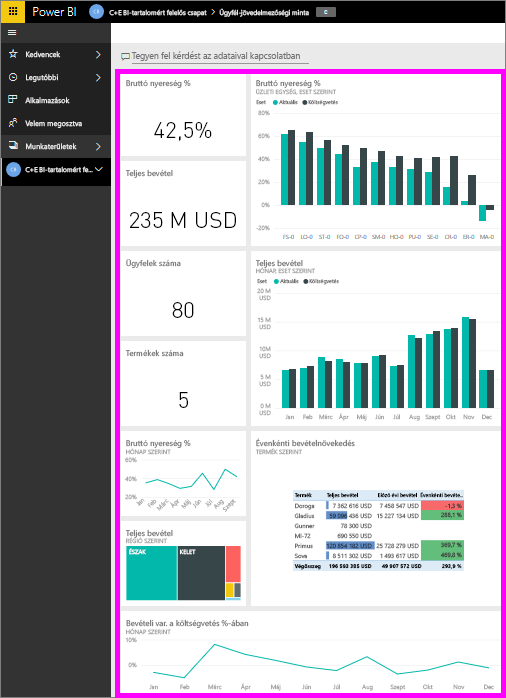

   Figyelje meg a következő részleteket:
   - A cég bruttó árrése 42,5%.
   - 80 ügyfele van.
   - 5 különböző terméket értékesít.
   - A legalacsonyabb százalékos, költségvetéshez viszonyított bevételvariancia februárban volt, míg a legmagasabb azt követően márciusban.
   - A bevétel nagy része a keleti és az északi régióból származik. A bruttó árrés soha nem haladta meg a költségvetést, bár az ER-0 és az MA-0 további vizsgálatot igényel.
   - Az évhez tartozó teljes bevétel megközelíti a költségvetést.

### Vezetőre vonatkozó irányítópult-csempék
Az irányítópult jobb oldalán található csempék a csapat mutatószámait tartalmazzák. A pénzügyi vezetőnek követnie kell a régiós vezetők teljesítményét, és ezek a csempék teszik lehetővé számára a profit magas szintű áttekintését – a százalékos bruttó árrés használatával. Ha a százalékos bruttó árrés trendje váratlan értékeket mutat bármely vezetőhöz kapcsolódóan, a pénzügyi vezető alaposabb vizsgálatot végezhet.

Az vezetőre vonatkozó irányítópult-csempék elemzésével a következő megfigyeléseket tehetjük:

- Carlos kivételével minden vezető meghaladta az értékesítési célkitűzést. Ezzel együtt azonban Carlos tényleges értékesítési adatai a legmagasabbak.
- Annelie százalékos bruttó árrése a legalacsonyabb, de folyamatos növekedés tapasztalható március óta.
- Valery százalékos bruttó árrése azonban jelentősen csökken.
- Andrew pedig ingadozó értékeket produkált az évben.

## Az irányítópult alapjául szolgáló adatok megismerése
Ezen az irányítópulton szerepelnek olyan csempék, amelyek jelentésre vagy Excel-munkafüzetre mutatnak.

### Az Excel Online adatforrás megnyitása
Az irányítópulton szereplő **Target vs Actual** és **Year Over Year Revenue Growth** nevű csempék Excel-munkafüzetből lettek az irányítópultra rögzítve. Ha bármely csempét kiválasztja, a Power BI megnyitja az adatforrást, ami esetünkben az Excel Online.

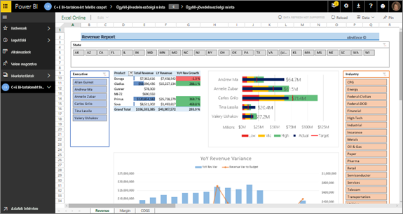

1. Válassza ki az Excelből rögzített csempék valamelyikét. Ekkor megnyílik az Excel Online a Power BI szolgáltatásban.
2. Figyelje meg, hogy a munkafüzetnek három lapon vannak adatai. Nyissa meg a **Bevétel** elemet.
3. Vizsgáljuk meg, miért nem sikerült Carlosnak elérnie a célkitűzést:  

    a. Az **Executive** (Vezetők) csúszka használatával válassza ki a **Carlos Grilo** tételt.   

    b. Az első kimutatásból megtudhatjuk, hogy Carlos elsődleges termékére, a Primusra vonatkozóan a bevétel 152%-kal csökkent a tavalyi évhez képest. Az **Éves bevételváltozást** megjelenítő diagram azt mutatja, hogy Carlos eredménye a legtöbb hónapban a költségvetés alatti.  

    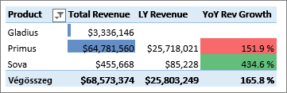

    

4. Folytassa az ismerkedést. Ha talál valami érdekeset, a jobb felső sarokban található **Rögzítés**  elemet választva [rögzítheti is egy irányítópultra](service-dashboard-pin-tile-from-excel.md).

5. A böngésző vissza gombját használva térhet vissza az irányítópulthoz.

### Az alapul szolgáló Power BI-jelentés megnyitása
Az Ügyfél-jövedelmezőségi minta irányítópultján található csempék közül sok az alapul szolgáló Ügyfél-jövedelmezőségi minta jelentésből lett rögzítve az irányítópulton.

1. A jelentés Olvasó nézetben való megnyitásához válassza ki a csempék egyikét.

   Ha a csempe a Q&A használatával lett létrehozva, akkor a kiválasztásával megnyílik a Q&A ablak. Válassza ki **Kilépés a Q&A-ből** lehetőséget, térjen vissza az irányítópultra, és próbálkozzon egy másik csempével.

2. A jelentés három oldalból áll. A jelentés alján látható fülek mindegyike külön-külön oldalt jelöl.

    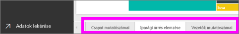

    * A **Csapat mutatószámai** az 5 vezető teljesítményére és üzleti mutatóira fókuszál.
    * Az **Iparági árrés elemzése** lehetőséget biztosít a jövedelmezőség elemzésére az egész iparág jelenlegi teljesítményéhez viszonyítva.
    * Az **Executive Scorecard** (Vezetők mutatószámai) az egyes vezetők nézeteit jeleníti meg egyéni oldalméret-formátumban.

### Csapat mutatószámai lap

Nézzük meg két csapattag teljesítményét részletesen, és lássuk, mely adatokba kaphatunk betekintést: 

1. A bal oldali **Vezetők** szeletelőben Andrew nevének kiválasztásával szűrheti a jelentésoldalt, így csak Andrew adatai jelennek meg:

   * A KPI gyors áttekintéséhez nézze meg Andrew **Bevételi állapot (Év)** mutatóját; ez zöld, ami azt jelenti, hogy jó a teljesítménye.
   * A **Százalékos, költségvetéshez viszonyított bevételvariancia hónap és vezető szerint** diagram azt mutatja, hogy a februári csökkenést leszámítva Andrew jól teljesít. Andrew legdominánsabb területe a keleti régió, amely 49 ügyfelet és a hét termékből ötöt foglal magában. Andrew százalékos bruttó árrése nem a legmagasabb, de nem is a legkisebb.
   * Az **Éves bevétel és a költségvetéshez viszonyított bevételvariancia hónap szerint** diagram állandó, egyenletes profiteloszlást mutat. Ha azonban szűrést végez a **Középső** négyzetet kiválasztva a régiótérképen, akkor látható, hogy Andrewnak csak márciusban és csak Indianában van bevétele. Vajon szándékos ez a trend, vagy alaposabb vizsgálatot igényel?

2. Most térjünk át Valeryre. A **Vezetők** szeletelőben Valery nevének kiválasztásával szűrheti a jelentésoldalt, így csak Valery adatai jelennek meg. 

   

   * Vegye észre, hogy a **Teljes éves bevétel állapota** nevű KPI piros színű. Ez az elem mindenképpen további vizsgálatot igényel.
   * Valery bevételvarianciája is aggasztó képet fest – Valery nem teljesíti a bevételi árrés követelményeit.
   * Valery csak 9 ügyféllel rendelkezik, mindössze 2 terméket kezel, és szinte kizárólag északi régióban foglalkozik ügyfelekkel. Ez a specializáció magyarázhatja a metrikákban tapasztalható túlzott ingadozást.
   * Az **Észak** négyszög kiválasztásával a fatérképen látható, hogy Valery bruttó árrése az északi régióban összhangban van az általános árrésre vonatkozó teljesítménnyel.
   * A többi **Bevétel régiónként** négyszöget kiválasztva érdekes jelenséget láthatunk: a százalékos bruttó árrés értéke 23% és 79% között mozog. Valery bevételi mutatói az északi régiót kivéve minden régióban rendkívül szezonálisak.

3. A feltárás folytatásával kideríthető, hogy Valery régiója miért is nem teljesít jól. Nézze meg a régiókat, a többi üzleti egységet, valamint a jelentés következő lapját: **Iparági árrés elemzése**.

### Iparági árrés elemzése
Ez a jelentéslap az adatok egy másik szeletét mutatja meg. A teljes iparág bruttó árrését vizsgálja szegmens szerinti bontásban. A pénzügyi vezető ezt a lapot használva hasonlíthatja össze a cég és az üzleti egységek metrikáit az iparági metrikákkal, és mindez segít megmagyarázni a különböző trendeket és a jövedelmezőséget. Talán furcsa, hogy a csapat-specifikus **Bruttó árrés hónap és vezető szerint** területi diagram szerepel ezen a lapon. Viszont lehetővé teszi a lap szűrését az üzleti egységek vezetői szerint.  

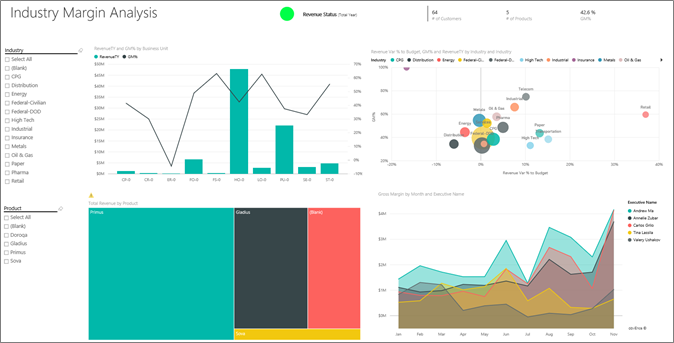

1. Hogyan változik a jövedelmezőség az iparágban? Hogyan oszlanak meg a termékek és az ügyfelek iparági bontásban? Ezeknek a kérdéseknek a megválaszolásához válasszon ki egy vagy több iparágat a bal felső sarokban (a fogyasztási cikkek iparágától kezdje). A szűrő törléséhez használja a radír ikont.

2. A **Százalékos, költségvetéshez viszonyított bevételvariancia, Bruttó árrés % és Éves bevétel iparág szerint** buborékdiagramon a pénzügyi vezető a legnagyobb buborékokat keresi, mert azok jelentik a bevételre a legnagyobb hatást. Ha a területi diagramon a vezetők nevét sorra kijelölve szűri a lapot, egyszerűen tekintheti meg az egyes vezetők teljesítményét iparági szegmens szerint.

3. Amikor kijelöl egy vezetőt a diagramon, figyelje meg a következő részleteket:
   * Andrew teljesítménye több különböző iparági szegmensben érzékelhető a jelentősen eltérő százalékos bruttó árrésnek (elsősorban a pozitív oldalon) és a százalékos varianciának köszönhetően.
   * Annelie diagramja hasonló, azzal a különbséggel, hogy ő csak pár iparági szegmensre koncentrál (a szövetségi szegmensre és a Gladius nevű termékre fókuszálva).
   * Carlos egyértelműen a szolgáltatási szegmensre koncentrál, és szép profitot termel. Carlos nagy mértékben növelte a százalékos varianciát is a high-tech szektorban, és egy új szegmensben (ipar) rendkívül jó teljesítményt ért el a költségvetéshez viszonyítva.
   * Tina több szegmensre koncentrál, és ő rendelkezik a legmagasabb százalékos bruttó árréssel, de a buborékok jellemzően kis mérete azt mutatja, hogy a cég profitjára gyakorolt hatása minimális.
   * Valery, aki csak egy termékért felel, mindössze 5 iparági szegmensre koncentrál. Valery iparági befolyása szezonális, de mivel mindig nagy méretű buborékokat hoz létre, jelentős hatást gyakorol a cég profitjára. Magyarázható az iparági szegmensekkel a csökkenő teljesítményét?

### Vezetők mutatószámai
Ez az oldal egyéni oldalméret-formátummal rendelkezik.

## Részletes adatfeltárás Q&A-kérdések feltevésével
Az elemzéshez hasznos lenne megállapítani, hogy mely iparág termeli a legtöbb bevételt Valerynek. Használjuk a Q&A-t.

1. Válassza a **Jelentés szerkesztése** elemet a jelentés Szerkesztési nézetben való megnyitásához. A szerkesztési nézet csak a jelentés tulajdonosa számára érhető el. Ezt a nézetet néha *létrehozói* nézetnek is hívjuk. Ha azonban a jelentés csak meg van osztva Önnel, akkor nem nyithatja meg Szerkesztési nézetben.

2.  A Q&A kérdésmező megnyitásához az irányítópult felső részén válassza a **Kérdés feltevése** lehetőséget.

    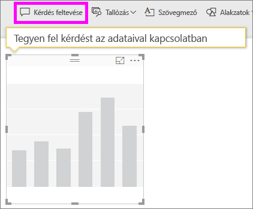

3. A kérdésmezőbe írja be a következőt: *Valery teljes bevétele iparág szerint*. Figyelje meg, ahogy a vizualizáció frissül, miközben beírja a kérdést.

    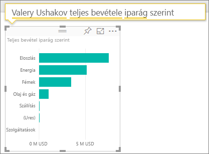

   Ahogy látható, a forgalmazás képviseli Valery legnagyobb bevételi területét.

### Részletes feltárás szűrők hozzáadásával
Vessen egy pillantást a Forgalmazás iparágra.  

1. Nyissa meg az **Iparági árrés elemzése** jelentésoldalt.
2. Anélkül, hogy bármilyen vizualizációt kijelölne a jelentéslapon, bontsa ki a jobb oldalon lévő Szűrő ablaktáblát (ha az még nincs kibontva). A **Szűrők** ablaktáblán csak **Lapszintű szűrők** láthatók.  

   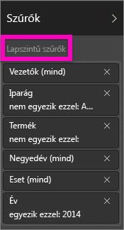
3. Keresse meg az **Iparág** szűrőt, és a nyíl kiválasztásával bontsa ki a listát. Adjon hozzá egy lapszűrőt a Forgalmazás iparághoz. Először törölje az összes kijelölést **Az összes kijelölése** jelölőnégyzet bejelölésének törlésével. Most jelölje ki egyedül a **Forgalmazás** elemet.  

   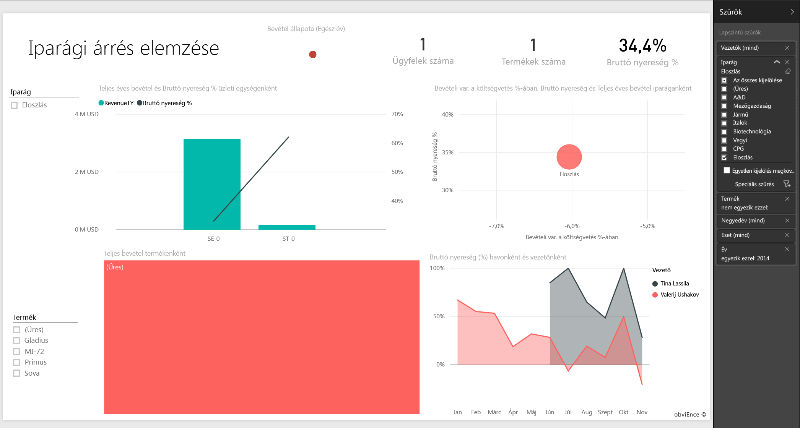
4. A **Bruttó árrés hónap és vezető szerint** területdiagramon az látható, hogy csak Valery és Tina rendelkezik ügyféllel ebben az iparágban, és csak Valery foglalkozott ezzel az iparággal júniustól novemberig.   
5. Válassza ki **Tina** és  **Valery** nevét a **Bruttó árrés hónap és vezető szerint** területdiagram jelmagyarázatában. Figyelje meg, hogy Tina teljesítménye a **Teljes bevétel termék szerint** diagram adatai alapján kicsi Valery teljesítményéhez képest.
6. A tényleges bevétel megtekintéséhez az irányítópulton jelölje ki a Q&A mezőt, és írja be a következőt: *teljes forgalmi bevétel környezet és vezető szerint*.  

     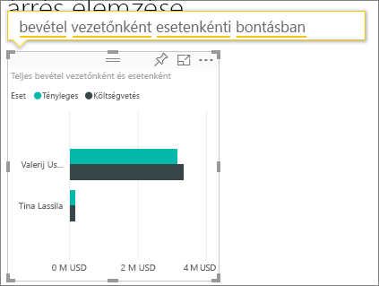

    Hasonlóan lehet megvizsgálni más iparágakat, és akár az ügyfelek vizualizációhoz való hozzáadásával is feltárhatók a Valery teljesítménye mögötti okok.

## További lépések: Csatlakozás az adatokhoz
Ezzel a környezettel biztonságosan kísérletezhet, mert dönthet úgy, hogy nem menti a módosításokat. De ha mégis mentené őket, bármikor lekérheti a minta egy új másolatát az **Adatok lekérése** lehetőség választásával.

Reméljük, hogy ez a bemutató segített megérteni a mintaadatok Power BI irányítópultok, Q&A és jelentések segítségével történő elemzését. Most Önön a sor – kapcsolódjon a saját adataihoz. A Power BI használatával számos különböző adatforráshoz kapcsolódhat. További információ: [Első lépések a Power BI szolgáltatásban](service-get-started.md).

