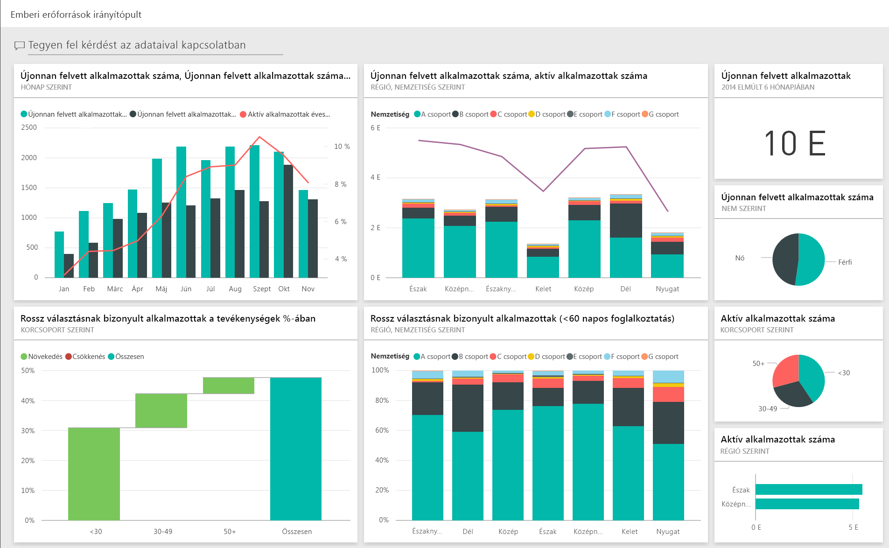
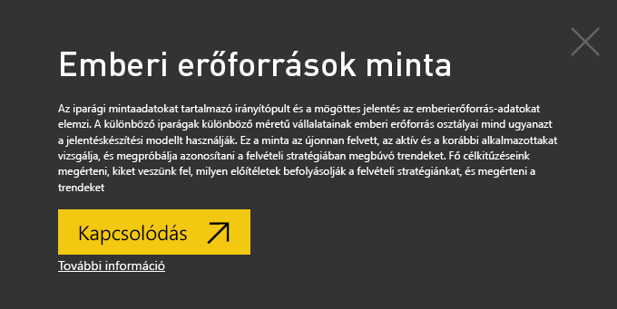
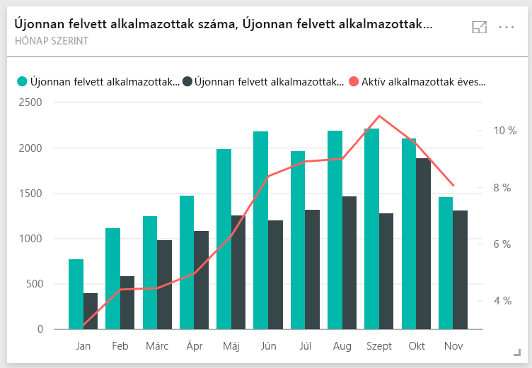
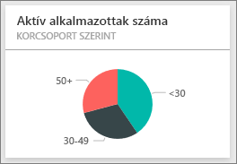
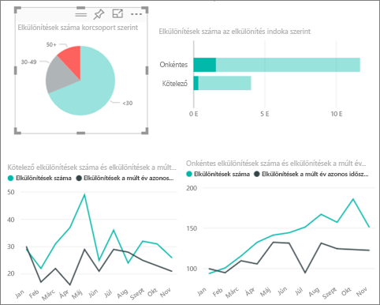
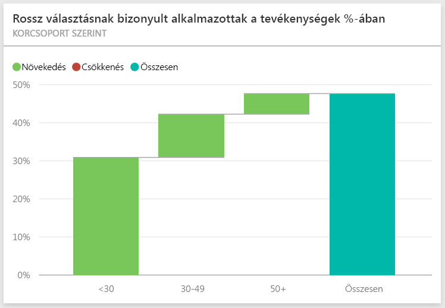
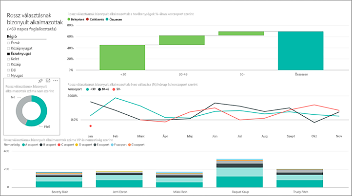
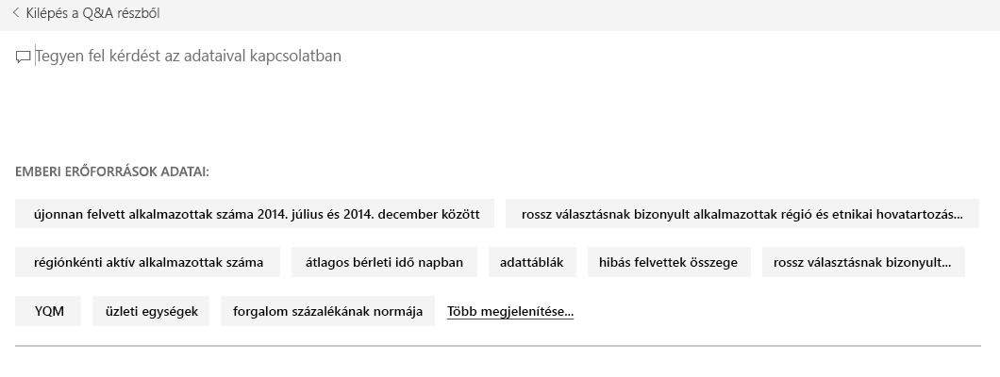
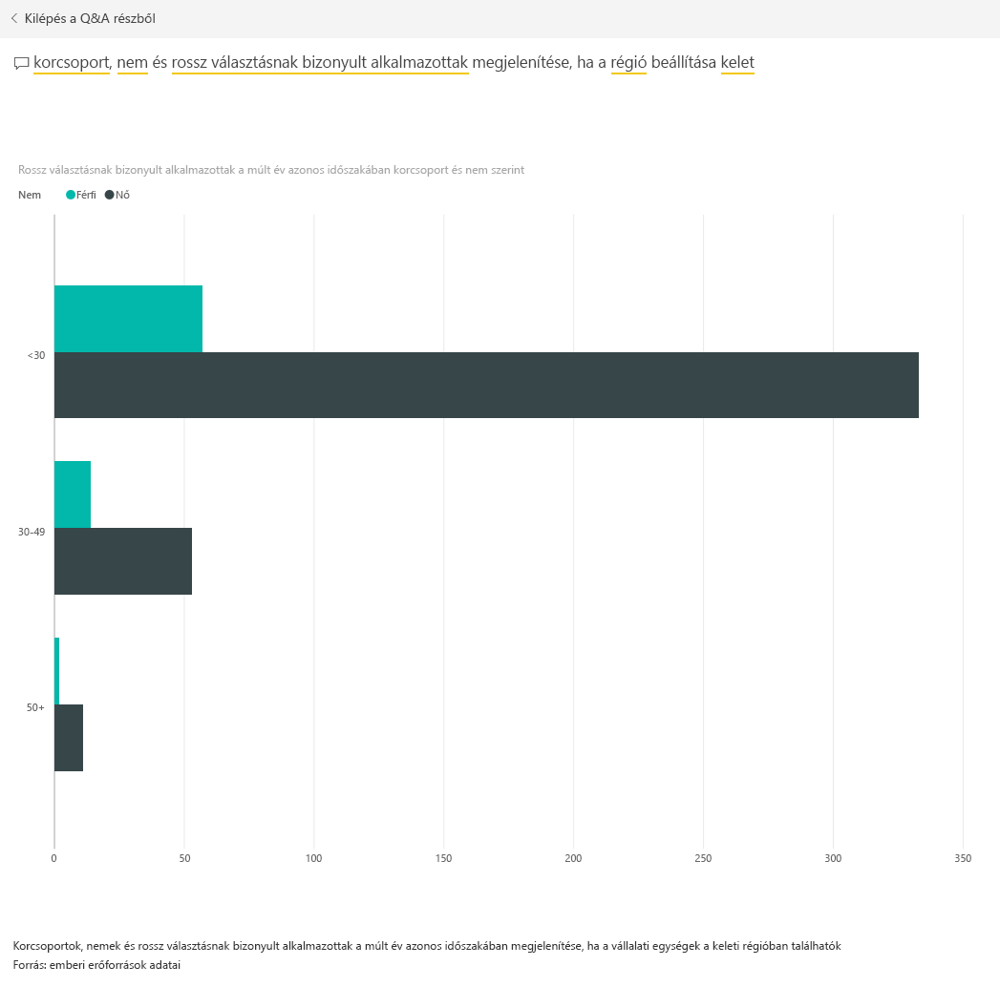

# Emberi erőforrások minta a Power BI-hoz: Bemutató megtekintése

Az Emberi erőforrások minta tartalomcsomag egy irányítópultot, egy jelentést és egy emberi erőforrás részleg számára készült adathalmazt tartalmaz. Ebben a mintában a különböző iparágak különböző méretű vállalatainak emberi erőforrás osztályai mind ugyanazt a jelentéskészítési modellt használják. A minta vizsgálja az újonnan felvett és aktív alkalmazottakat, valamint azokat, akik már nem dolgoznak a vállalatnál. A célja trendek kimutatása a munkaerő-toborzási stratégiában. A fő célkitűzésünk, hogy megismerjük:

* Kiket veszünk fel
* Milyen előítéletek befolyásolják a felvételi stratégiánkat
* Milyen trendeket mutatnak a távozások

Ez a minta abba a sorozatba tartozik, amely a Power BI üzleti jellegű adatokkal, jelentésekkel, és irányítópultokkal történő használatát mutatja be. Az [obviEnce](http://www.obvience.com/) által lett létrehozva valós adatokkal, melyeket anonimizáltunk. Az adatok többféle formátumban: tartalomcsomagként, .pbix kiterjesztésű Power BI Desktop-fájlként és Excel-munkafüzetként is elérhetők. [Power BI-minták](sample-datasets.md) megtekintése. 

Ez az oktatóanyag a Power BI szolgáltatásban mutatja be az Emberi erőforrás minta tartalomcsomagot. Mivel azonban a jelentéssel való munka hasonló a Power BI Desktopban és a szolgáltatásban, a bemutatót akkor is követni tudja, ha a .pbix-mintafájlt a Power BI Desktopban használja. 

A minták Power BI Desktopban való vizsgálatához nincs szükség Power BI-licencre. Ha nem rendelkezik Power BI Pro-licenccel, a mintát a Saját munkaterületre mentheti a Power BI szolgáltatásban. 

## A minta beszerzése

Használat előtt a mintát [tartalomcsomagként](#get-the-content-pack-for-this-sample), [.pbix-fájlként](#get-the-pbix-file-for-this-sample) vagy [Excel-munkafüzetként](#get-the-excel-workbook-for-this-sample) le kell töltenie.

### Tartalomcsomag letöltése ehhez a mintához

1. Nyissa meg a Power BI szolgáltatást (app.powerbi.com), jelentkezzen be, majd nyissa meg azt a munkaterületet, ahol a mintát szeretné menteni.

   Ha nem rendelkezik Power BI Pro-licenccel, a mintát a Saját munkaterületre mentheti.

2. A bal alsó sarokban válassza az **Adatok lekérése** lehetőséget.
   
   
3. Ekkor megjelenik az **Adatok lekérése** lap. Itt válassza a **Minták** lehetőséget.
   
4. Válassza ki az **Emberi erőforrások mintát**, majd válassza a **Kapcsolódás** lehetőséget.  
   
   

5. A Power BI importálja a tartalomcsomagot, és egy új irányítópultot, jelentést és adatkészletet ad hozzá az aktuális munkaterülethez.
   
   
  
### .pbix-fájl letöltése ehhez a mintához

Az Emberi erőforrások mintát a Power BI Desktoppal való használatra tervezett [.pbix-fájlként](https://download.microsoft.com/download/6/9/5/69503155-05A5-483E-829A-F7B5F3DD5D27/Human%20Resources%20Sample%20PBIX.pbix) is letöltheti.

### Excel-munkafüzet letöltése ehhez a mintához

Ha a minta adatforrását is szeretné megtekinteni, használja az [Excel-munkafüzetként](https://go.microsoft.com/fwlink/?LinkId=529780) letölthető változatát. A munkafüzet megtekinthető és módosítható Power View-lapokat tartalmaz. A nyers adatok megtekintéséhez engedélyezze az Adatok Elemzése bővítményeket, majd válassza a **Power Pivot > Kezelés** lehetőséget. A Power View és a Power Pivot bővítmények engedélyezéséről az [Excel-minták vizsgálata az Excelben](sample-datasets.md#explore-excel-samples-inside-excel) című cikkben olvashat részletesen.

## Újonnan felvett alkalmazottak
Elsőként vizsgáljuk meg az újonnan felvett alkalmazottakat.

1. A munkaterületén válassza az **Irányítópultok** lapot, és nyissa meg az **Emberi erőforrások minta** irányítópultot.
2. Az irányítópulton válassza a **New Hire Count, New Hires Same Period Last Year, Actives YoY % Change By Month** (Újonnan felvett alkalmazottak száma, Újonnan felvett alkalmazottak száma a tavalyi év megegyező időszakában, Aktív alkalmazottak éves változása %-ban, hónapok szerint) csempét.  

     

   Ekkor megnyílik a „Human Resources Sample” jelentés **New Hires** (Újonnan felvett alkalmazottak) nevű oldala.  

   

3. Figyelje meg a következő érdekes elemeket:

    * A **New Hire Count, New Hires SPLY és Actives YoY % Change, kategória: Month** (Újonnan felvett alkalmazottak száma, Újonnan felvett alkalmazottak a tavalyi év megegyező időszakában és Aktív alkalmazottak éves változása %-ban, hónapok szerint) kombinált diagram szerint az idei év minden hónapjában több alkalmazottat vettünk fel, mint a tavalyi év adott hónapjaiban. Ez a különbség bizonyos hónapokban jelentős mértékű.
    * A **New Hire Count és Active Employee Count, kategória: Region és Ethnicity** (Újonnan felvett alkalmazottak száma és Aktív alkalmazottak száma régiók és nemzetiségek szerint) kombinált diagramon az látható, hogy az **East** (Keleti) régióban kevesebb embert veszünk fel.
    * A **New Hires YoY Var, kategória Age Group** (Újonnan felvett alkalmazottak éves változása korcsoportok szerint) vízesésdiagramon látható, hogy többnyire fiatalabb embereket veszünk fel. Ez a trend valószínűleg annak tudható be, hogy a munkák többnyire részmunkaidős jellegűek.
    * A **New Hire Count, kategória: Gender** (Újonnan felvett alkalmazottak száma nemek szerint) tortadiagramon nagyjából kiegyenlített arányt láthatunk.

    Talál más meglátásokat? Például egy olyan régiót, amelyben a nemek aránya nem ennyire kiegyenlített. 

4. Válasszon ki különböző korcsoportokat és neveket, hogy feltárhassa a korok, nemek, régiók és nemzetiségek közötti kapcsolatokat.

5. Az irányítópultra való visszatéréshez válassza az **Emberi erőforrások minta** lehetőséget a felső navigációs panelen.

   

## Jelenleg aktív és korábbi alkalmazottak összehasonlítása
Vizsgáljuk meg a vállalat jelenlegi és korábbi alkalmazottainak adatait.

1. Az irányítópulton válassza az **Active Employee Count by Age Group** (Aktív alkalmazottak száma korcsoport szerint) csempét.

   

   Ekkor megnyílik a „Human Resources Sample” jelentés **Active Employees vs. Separations** (Aktív alkalmazottak vs. távozások) nevű oldala.  

   

 2. Figyelje meg a következő érdekes elemeket:

    * A két bal oldali kombinált diagramon látható az aktív alkalmazottak és a távozó alkalmazottak számának éves változása. Az idei évben a gyors felvételeknek köszönhetően több aktív alkalmazottunk van, de a távozások száma is nagyobb, mint a tavalyi évben.
    * Augusztusban volt a legmagasabb a távozások száma. Válasszon ki különböző korcsoportokat, nemeket vagy régiókat, és nézze meg, talál-e kiugró adatokat.
    * Ha megnézzük a tortadiagramot, láthatjuk, hogy az aktív alkalmazottak között egyenletes a nemek és a korcsoportok eloszlása. Válasszon ki különböző korcsoportokat, hogy megnézhesse a nemek közti különbségeket életkorok szerint. Minden korcsoport esetén egyenlő a nemek aránya?

## A távozások okai
Nézzük meg a jelentést Szerkesztő nézetben. Módosíthatja a tortadiagramot, hogy az aktív alkalmazottak adai helyett a távozások adatait mutassa.

1. Válassza a bal felső sarokban a **Jelentés szerkesztése** lehetőséget.

2. Válassza ki az **Active Employee Count, kategória: Age Group** tortadiagramot.

3. A **Mezők** ablaktáblán válassza az **Employees** (Alkalmazottak) lehetőséget az **Employees** tábla kibontásához. Szüntesse meg az **Active Employee Count** (Aktív alkalmazottak száma) kijelölését, hogy eltávolítsa ezt a mezőt a diagramból.

4. Jelölje ki az **Employees** (Alkalmazottak) táblán a **Separation Count** (Távozások száma) mezőt, hogy hozzáadja az **Értékek** gyűjtőhöz a **Mezők** területen.

5. A jelentésvásznon válassza ki a **Voluntary** (Felmondás) sávot a **Separation Count by Separation Reason** (távozások száma távozási okok szerint) sávdiagramon. 

   Ez sáv kiemeli a többi vizualizáción azokat az alkalmazottakat, akik saját maguk mondtak fel.

6. Jelölje ki a **Separation Count by Age Group** (Távozások száma korcsoportok szerint) tortadiagram 50+ jelzésű szeletét.

7. Figyelje meg a jobb alsó sarokban található vonaldiagramot. Ez a diagram úgy van szűrve, hogy csak a felmondásokat mutassa.  

   

   Figyelje meg az 50 feletti korcsoportban mutatkozó trendet. Az év utolsó szakaszában az 50 évnél idősebbek közül többen mondtak fel. Ezt a trendet érdemes lesz alaposabban is megvizsgálni több adat alapján.

8. Követheti ugyanezeket a lépések az **Active Employee Count, kategória: Gender** (Aktív alkalmazottak száma nemek szerint) tortadiagram esetén is, ha az aktív alkalmazottakat a távozásokra cseréli. Nézze meg a felmondások adatait nemek szerint, hogy talál-e bennük valamilyen elemzést.

9. Az irányítópultra való visszatéréshez válassza az **Emberi erőforrások minta** lehetőséget a felső navigációs panelen. Ha szeretné, mentheti a jelentésen végrehajtott módosításokat.

## Rossz választásnak bizonyult alkalmazottak
Az utolsó terület a rossz választásnak bizonyult alkalmazottakat vizsgálja. Azok az alkalmazottak bizonyultak rossz választásnak, akik 60 napnál kevesebbet töltöttek a vállalatnál. Gyors ütemben veszünk fel alkalmazottakat, de vajon a megfelelő jelölteket választjuk?

1. Válassza a **Bad Hires as % of Actives by Age Group** (Rossz választásnak bizonyult alkalmazottak %-a az Aktívakhoz képest, korcsoportok szerint) irányítópult-csempét. A jelentés a harmadik **Bad hires** (Rossz választások) lappal nyílik meg.

     
2. A bal oldalon található **Region** (Régió) szeletelőn jelölje ki a **Northwest** (Északnyugat) értéket, és jelölje ki a **Bad Hire Count by Gender** (Rossz választásnak bizonyult alkalmazottak nemek szerint) fánkdiagramon a **Male** (Férfi) szeletet. Nézze meg a **Bad Hires** (Rossz választások) oldal többi vizualizációját. Figyelje meg, hogy több a rossz választás a férfiak között, mint a nők között, és sok rossz választás van az A csoportban.

     

3. Ha megfigyeli a **Bad Hire Count by Gender** (Rossz választások nemek szerint) fánkdiagramot, és különböző régiókat jelöl ki a **Régió** szeletelőben, észreveheti, hogy egyedül a Keleti régióban hoztak több rossz döntést nőkről mint férfiakról.  

4. Az irányítópultra való visszatéréshez válassza ki az irányítópult nevét a felső navigációs panelen.

## Kérdés feltétele az irányítópult Q&A-mezőjében
Az irányítópult [Q&A-kérdésmezőjében](power-bi-tutorial-q-and-a.md) természetes nyelven tehet fel az adatokkal kapcsolatos kérdést. A Q&A felismeri a beírt szavakat, és kitalálja, hogy az adatkészletben hol találja meg a választ.

1. Jelölje ki a Q&A kérdésmezőt. Megfigyelheti, hogy még mielőtt gépelni kezdene, a Q&A javaslatok megjelenítésével segít a kérdés megfogalmazásában.

   

2. Választhat egyet ezek közül, vagy írja be a *show age group, gender and bad hires SPLY where region is east* (mutassa a korcsoportot, a nemeket, és a rossz választásnak bizonyult alkalmazottakat a tavalyi év azonos időszakában, a keleti régióban) kérdést.  

   

   Észrevehető, hogy a legtöbb rossz választásnak bizonyult női alkalmazott 30 évnél fiatalabb.

## További lépések: Csatlakozás az adatokhoz
Ezzel a környezettel biztonságosan kísérletezhet, mert dönthet úgy, hogy nem menti a módosításokat. De ha mégis mentené őket, bármikor lekérheti a minta egy új másolatát az **Adatok lekérése** lehetőség választásával.

Reméljük, hogy ez a bemutató segített megérteni a mintaadatok Power BI irányítópultok, Q&A és jelentések segítségével történő elemzését. Most Önön a sor – kapcsolódjon a saját adataihoz. A Power BI használatával számos különböző adatforráshoz kapcsolódhat. További információ: [Első lépések a Power BI szolgáltatásban](service-get-started.md).
