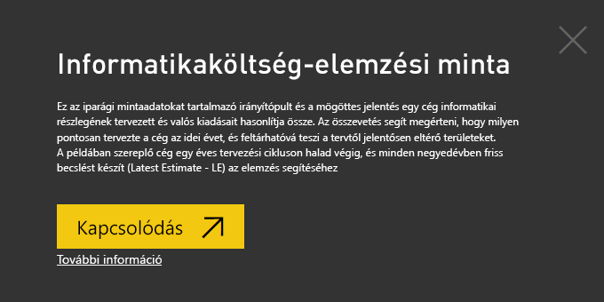
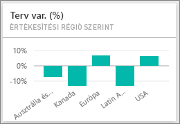
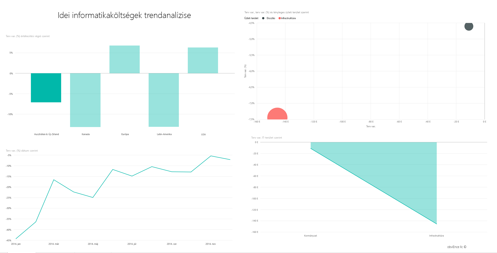
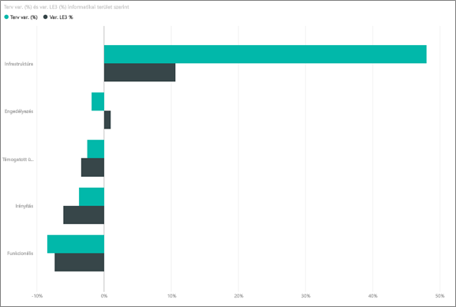
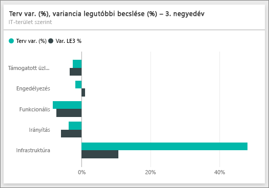
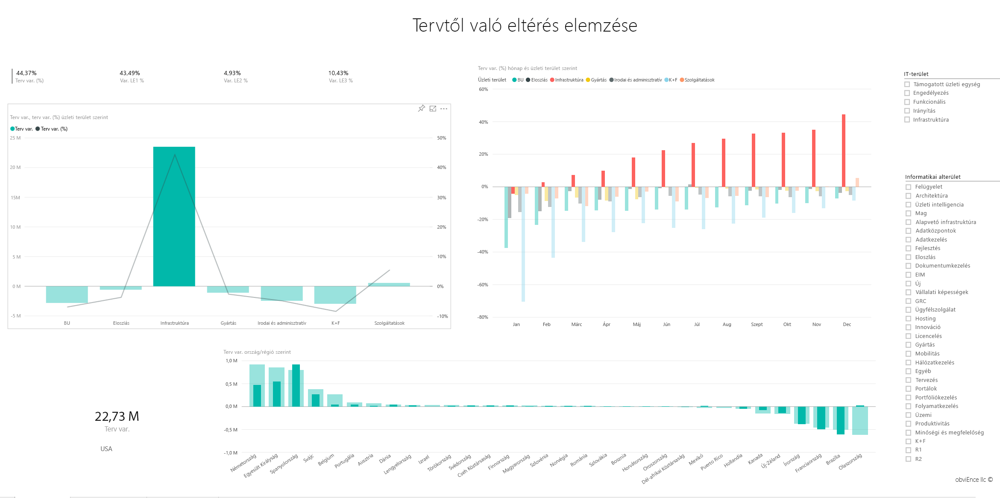

# Informatikai kiadások elemzése minta a Power BI-hoz: bemutató

Az Informatikaköltség-elemzési minta tartalomcsomag egy irányítópultot, jelentést és adathalmazt tartalmaz, és egy informatikai osztály költségeinek terv- és tényadatait elemzi. Az összevetés segít megérteni, hogy milyen pontosan tervezte a cég az idei évet, és feltárhatóvá teszi a tervtől jelentősen eltérő területeket. A példában szereplő cég egy éves tervezési cikluson halad végig, és minden negyedévben friss becslést készít (Latest Estimate - LE) a pénzügyi év informatikai költségeiben bekövetkezett változások elemzéséhez.

Ez a minta abba a sorozatba tartozik, amely a Power BI üzleti jellegű adatokkal, jelentésekkel, és irányítópultokkal történő használatát mutatja be. Az [obviEnce](http://www.obvience.com/) által lett létrehozva valós adatokkal, melyeket anonimizáltunk. Az adatok többféle formátumban: tartalomcsomagként, .pbix kiterjesztésű Power BI Desktop-fájlként és Excel-munkafüzetként is elérhetők. [Power BI-minták](sample-datasets.md) megtekintése. 

Ebben az oktatóanyagban a Power BI szolgáltatásban vizsgáljuk meg az Informatikaköltség-elemzési minta tartalomcsomagot. Mivel azonban a jelentéssel való munka hasonló a Power BI Desktopban és a szolgáltatásban, a bemutatót akkor is követni tudja, ha a .pbix-mintafájlt a Power BI Desktopban használja. 

A minták Power BI Desktopban való vizsgálatához nincs szükség Power BI-licencre. Ha nem rendelkezik Power BI Pro-licenccel, a mintát a Saját munkaterületre mentheti a Power BI szolgáltatásban. 

## A minta beszerzése

 Használat előtt a mintát [tartalomcsomagként](#get-the-content-pack-for-this-sample), [.pbix-fájlként](#get-the-pbix-file-for-this-sample) vagy [Excel-munkafüzetként](#get-the-excel-workbook-for-this-sample) le kell töltenie.

### Tartalomcsomag letöltése ehhez a mintához

1. Nyissa meg a Power BI szolgáltatást (app.powerbi.com), jelentkezzen be, majd nyissa meg azt a munkaterületet, ahol a mintát szeretné menteni.

   Ha nem rendelkezik Power BI Pro-licenccel, a mintát a Saját munkaterületre mentheti.

2. A bal alsó sarokban válassza az **Adatok lekérése** lehetőséget.
   
   
3. Ekkor megjelenik az **Adatok lekérése** lap. Itt válassza a **Minták** lehetőséget.
   
4. Válassza az **Informatikaköltség-elemzési mintát**, majd a **Csatlakozás** lehetőséget.  
  
   
   
5. A Power BI importálja a tartalomcsomagot, és egy új irányítópultot, jelentést és adatkészletet ad hozzá az aktuális munkaterülethez.
   
   
  
### .pbix-fájl letöltése ehhez a mintához

Az Informatikaköltség-elemzési mintát a Power BI Desktoppal való használatra tervezett [.pbix-fájlként](https://download.microsoft.com/download/E/9/8/E98CEB6D-CEBB-41CF-BA2B-1A1D61B27D87/IT%20Spend%20Analysis%20Sample%20PBIX.pbix) is letöltheti.

### Excel-munkafüzet letöltése ehhez a mintához

Ha a minta adatforrását is szeretné megtekinteni, használja az [Excel-munkafüzetként](https://go.microsoft.com/fwlink/?LinkId=529783) letölthető változatát. A munkafüzet megtekinthető és módosítható Power View-lapokat tartalmaz. A nyers adatok megtekintéséhez engedélyezze az Adatok Elemzése bővítményeket, majd válassza a **Power Pivot > Kezelés** lehetőséget. A Power View és a Power Pivot bővítmények engedélyezéséről az [Excel-minták vizsgálata az Excelben](sample-datasets.md#explore-excel-samples-inside-excel) című cikkben olvashat részletesen.

## Az Informatikaköltség-elemzés minta irányítópultja
Az irányítópulton bal oldalán látható két számcsempe, a **Var Plan %** (Tervtől való százalékos eltérés) és a **Variance Latest Estimate % Quarter 3** (A 3. negyedévi friss becsléstől való százalékos eltérés) bemutatja a cég általános teljesítményét a tervhez és a friss negyedévi becsléshez képest (LE3 = 3. negyedévi friss becslés). A tervtől való átlagos eltérés körülbelül 6 %. Tárja fel az eltérés okát – mikor, hol, és mely kategóriában jelentkezik?

## Idei informatikaköltségek trendanalízise oldal
Amikor a **Var Plan % by Sales Region** (Tervtől való százalékos eltérés értékesítési régiók szerint) csempét választja, az megjeleníti az Informatikaköltség-elemzés mintajelentés **Idei informatikaköltségek trendanalízise** oldalát. Egy pillantással felmérheti, hogy az Egyesült Államok és Európa területén pozitív, Kanadában, Latin-Amerikában és Ausztráliában negatív az eltérés. Míg az Egyesült Államok területén körülbelül +6 % az eltérés a legfrissebb becsléshez képest, Ausztráliában ez az érték körülbelül -7 %.

Ha azonban csupán ezt az egy diagramot vizsgálja, téves következtetésre juthat. A nagyobb összefüggések megértéséhez meg kell vizsgálnia a dollárban kifejezett tényleges összegeket is.

1. A **Tervtől való százalékos eltérés régiók szerint** diagramon jelölje ki **Ausztráliát és Új-Zélandot**, és tekintse meg a **Tervtől való eltérés informatikai terület szerint** diagramot.

   
2. Most válassza ki az **USA** elemet. Megfigyelheti, hogy Ausztrália és Új-Zéland egészen kis hányadát teszi ki a teljes költségnek az Egyesült Államokhoz viszonyítva.

    Most vizsgálja meg, hogy az USA területén belül melyik kategória okozza az eltérést.

## Kérdések az adatokról
1. A felső navigációs panelen, az **Informatikaköltség-elemzés minta** lehetőségre kattintva visszatérhet a minta irányítópultjához.
2. Válassza a **Tegyen fel kérdést az adataival kapcsolatban** lehetőséget.
3. A bal oldali **Az első lépésekkel kapcsolatos kérdések** listában válassza a **what is the plan by IT area** (mi az informatikai terület szerinti terv) lehetőséget.

   

4. Törölje a Q&A-mezőből az előző bevitelt, és írja be a *show IT areas, var plan % and var le3 % bar chart* (mutasd az informatikai területek, a tervtől való százalékos eltérés és a 3. negyedévi friss becsléstől való százalékos eltérés sávdiagramját).

   

   Az első informatikai területen, amely az **Infrastruktúra**, igen jelentős a százalékos különbség az eredeti tervhez és a legfrissebb becsléshez képest mért eltérés között.

## Idei költségelemek szerinti ráfordítás oldal

1. Térjen vissza az irányítópulthoz, és nézze meg **Tervtől való százalékos eltérés és a 3. negyedévi friss becsléstől való százalékos eltérés** irányítópult-csempét.

   

   Megfigyelheti, hogy az Infrastruktúra kiemelkedően nagy pozitív eltérést mutat a tervhez képest.

1. A csempe kiválasztásával megnyithatja a jelentést, és megtekintheti az **Idei költségek költségelemenként** oldalt.
2. Jelölje ki az **Infrastruktúra** sávra a jobb alsó **Var Plan % and Var LE3 % by IT Area** (tervtől való százalékos eltérés, és a LE3 értéktől való százalékos eltérés informatikai területek szerint) diagramon, és figyelje meg a bal alsó **Var Plan % by Sales Region** (tervtől való százalékos eltérés értékesítési régiók szerint) diagramot.

    
3. A **Költségelem-csoport** szeletelőben szereplő neveket egymás után kiválasztva megtalálhatja a legnagyobb eltérést mutató költségelemet.
4. A legnagyobb eltérést mutató részterület megtalálásához az **Egyéb** elem kijelölése mellett jelölje ki az **Informatikai terület** szeletelő **Infrastruktúra** elemét, majd egyenként jelölje ki az **Informatikai részterület** szeletelő elemeit.  

   Figyelje meg a **Hálózat** elemnél mutatkozó nagy eltérést. A jelek szerint a vállalat úgy döntött, hogy telefonos szolgáltatásokat ad alkalmazottainak juttatásként, bár ezt nem tervezték előre.

## Tervtől való eltérés elemzése oldal

1. Válassza a **Tervtől való eltérés elemzése** lapfület az oldal alján.

2. Ha a bal oldali **Var Plan, and Var Plan % by Business Area** (Tervtől való eltérés és Tervtől való százalékos eltérés üzleti területek szerint) diagramon kijelöli az **Infrastruktúra** oszlopot, az oldal többi részén kiemelheti az infrastruktúra üzleti terület értékeit.

    

   A **Tervtől való százalékos eltérés hónap és üzleti terület szerint** diagramon megfigyelheti, hogy az infrastruktúra üzleti terület februárban kezdett pozitív eltérést mutatni. Azt is megfigyelheti, hogy ennek az üzleti területnek a tervtől való eltérése országonként változik, összevetve az összes üzleti területre vonatkozó értékkel. 

3. A jobb oldali **Informatikai terület** és **Informatikai részterület** szeletelők használatával szűrheti az oldal többi részén látható értékeket, és ismerkedhet az adatokkal. 

## A jelentés szerkesztése
Válassza a **Jelentés szerkesztése** elemet a bal felső sarokban, és nyissa meg a Szerkesztési nézetet:

* Áttekintheti a lapok felépítését – a mezőket az egyes diagramokban és a szűrőket az oldalakon.
* Lapokat és diagramokat vehet fel ugyanazon adatok alapján.
* Módosíthatja az egyes diagramok vizualizációjának típusát.
* Az érdekesnek ítélt diagramokat rögzítheti az irányítópulton.

## Következő lépések: Kapcsolódás a saját adatokhoz
Ezzel a környezettel biztonságosan kísérletezhet, mert dönthet úgy, hogy nem menti a módosításokat. De ha mégis mentené őket, bármikor lekérheti a minta egy új másolatát az **Adatok lekérése** lehetőség választásával.

Reméljük, hogy ez a bemutató segített megérteni a mintaadatok Power BI irányítópultok, Q&A és jelentések segítségével történő elemzését. Most Önön a sor – kapcsolódjon a saját adataihoz. A Power BI használatával számos különböző adatforráshoz kapcsolódhat. További információ: [Első lépések a Power BI szolgáltatásban](service-get-started.md).
