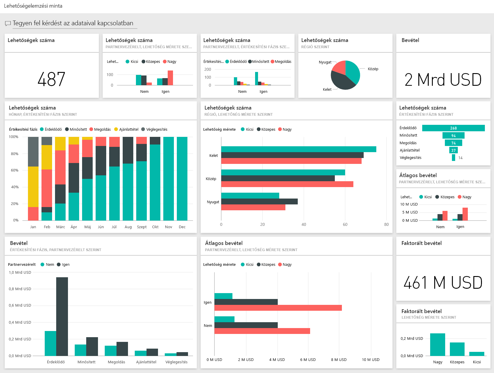
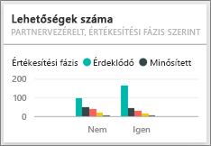
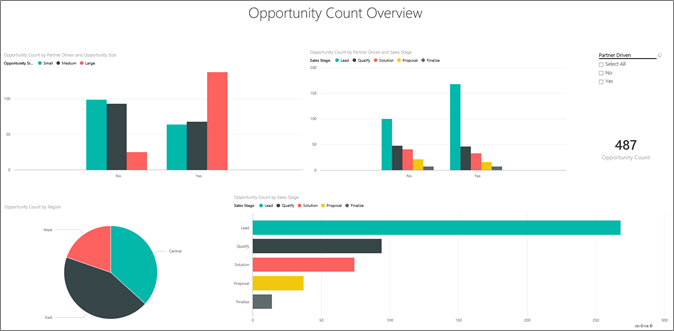
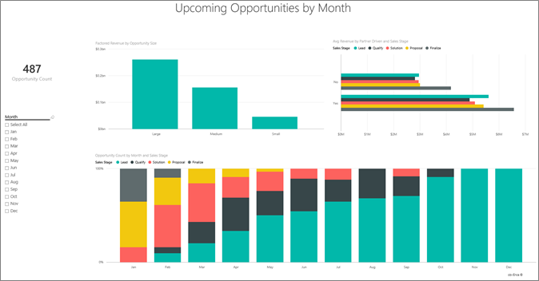

# Lehetőségelemzési minta a Power BI-hoz: Bemutató megtekintése

A Lehetőségelemzési minta tartalomcsomag egy két értékesítési csatornával: *közvetlen* és *partnercsatornával* rendelkező szoftvervállalathoz tartozó irányítópultot, jelentést és adathalmazt tartalmaz. Ezt az irányítópultot az értékesítési vezető hozta létre, hogy követni lehessen vele az üzleti lehetőségeket és a bevételeket a régiók, az ügylet mérete és a csatorna szerinti eloszlásban.

A minta két bevételi mértékre támaszkodik:

* Bevétel: A várható bevétel értékesítői becslése.
* Faktorált bevétel: Bevétel X valószínűségi % képlettel számított érték, amelyről elfogadott, hogy pontosabb előrejelzést ad a ténylegesen várható értékesítési bevételről. A valószínűséget az határozza meg, hogy az ügylet melyik *Értékesítési szakasznál* tart:
  * Érdeklődés: 10%  
  * Minősítés: 20%  
  * Megoldás: 40%  
  * Ajánlattétel: 60%  
  * Véglegesítés: 80%

Ez a minta abba a sorozatba tartozik, amely a Power BI üzleti jellegű adatokkal, jelentésekkel, és irányítópultokkal történő használatát mutatja be. Az [obviEnce](http://www.obvience.com/)-től származó valós adatokkal lett létrehozva, melyeket anonimizáltunk. Az adatok többféle formátumban: tartalomcsomagként, .pbix kiterjesztésű Power BI Desktop-fájlként és Excel-munkafüzetként is elérhetők. [Power BI-minták](sample-datasets.md) megtekintése. 

Ebben az oktatóanyagban a Power BI szolgáltatásban vizsgáljuk meg a Lehetőségelemzési minta tartalomcsomagot. Mivel azonban a jelentéssel való munka hasonló a Power BI Desktopban és a szolgáltatásban, a bemutatót akkor is követni tudja, ha a .pbix-mintafájlt a Power BI Desktopban használja. 

A minták Power BI Desktopban való vizsgálatához nincs szükség Power BI-licencre. Ha nem rendelkezik Power BI Pro-licenccel, a mintát a Saját munkaterületre mentheti a Power BI szolgáltatásban. 

## A minta beszerzése

Használat előtt a mintát [tartalomcsomagként](#get-the-content-pack-for-this-sample), [.pbix-fájlként](#get-the-pbix-file-for-this-sample) vagy [Excel-munkafüzetként](#get-the-excel-workbook-for-this-sample) le kell töltenie.

### Tartalomcsomag letöltése ehhez a mintához

1. Nyissa meg a Power BI szolgáltatást (app.powerbi.com), jelentkezzen be, majd nyissa meg azt a munkaterületet, ahol a mintát szeretné menteni. 

    Ha nem rendelkezik Power BI Pro-licenccel, a mintát a Saját munkaterületre mentheti.

2. A bal alsó sarokban válassza az **Adatok lekérése** lehetőséget.

    
3. Ekkor megjelenik az **Adatok lekérése** lap. Itt válassza a **Minták** lehetőséget.

4. Válassza a **Lehetőségelemzési minta** elemet, majd a **Kapcsolódás** lehetőséget.  

   
5. A Power BI importálja a tartalomcsomagot, és egy új irányítópultot, jelentést és adathalmazt ad hozzá az aktuális munkaterülethez.

   

### .pbix-fájl letöltése ehhez a mintához

Az Lehetőségelemzési mintát a Power BI Desktoppal való használatra tervezett [.pbix-fájlként](http://download.microsoft.com/download/9/1/5/915ABCFA-7125-4D85-A7BD-05645BD95BD8/Opportunity%20Analysis%20Sample%20PBIX.pbix) is letöltheti.

### Excel-munkafüzet letöltése ehhez a mintához

Ha a minta adatforrását is szeretné megtekinteni, használja az [Excel-munkafüzetként](http://go.microsoft.com/fwlink/?LinkId=529782) letölthető változatát. A munkafüzet megtekinthető és módosítható Power View-lapokat tartalmaz. A nyers adatok megtekintéséhez engedélyezze az Adatok Elemzése bővítményeket, majd válassza a **Power Pivot > Kezelés** lehetőséget. A Power View és a Power Pivot bővítmények engedélyezéséről az [Excel-minták megtekintése magában az Excelben](sample-datasets.md#optional-take-a-look-at-the-excel-samples-from-inside-excel-itself) című cikkben olvashat részletesen.

## Mi olvasható le az irányítópultról?
Az irányítópultot az értékesítési vezető azért hozta létre, hogy nyomon követhesse a számára legfontosabb mutatókat. Amint észrevesz valami érdekeset, a vezető az adott csempére kattintva megtekintheti az adatokat:

- A vállalati bevétel 2 milliárd dollár, a faktorált bevétel pedig 461 millió dollár.
- Az üzleti lehetőségek száma és a bevétel a jól ismert tölcsér mintát követi, vagyis az összesített értékek értékesítési szakaszonként csökkenő tendenciát mutatnak.
- A legtöbb üzleti lehetőség a keleti (East) régióban van.
- A nagyobb üzleti lehetőségek több bevételt generálnak, mint a közepes, vagy a kis lehetőségek.
- A nagy partnerekkel kötött üzletek több bevételt hoznak: átlagosan 8 millió dollárt a közvetlen értékesítésekből származó 6 millióval szemben.

Ahhoz, hogy az üzlet létrejöjjön, ugyanannyi energiát kell fektetni a nagynak, a közepesnek és a kicsinek minősülő lehetőségekbe is, ezért érdemes elemezni és többet kideríteni a nagy lehetőségekkel kapcsolatos adatokból.

1. A munkaterületen, amelyre a mintát mentette, nyissa meg az **Irányítópultok** lapot, majd keresse meg és jelölje ki a **Lehetőségelemzési minta** irányítópultot.

2. Válassza a **Partnerek hatáskörébe tartozó lehetőségek száma értékesítési fázis szerint** csempét a Lehetőségelemzési mintajelentés elő oldalának megnyitásához. 

    

## A jelentés oldalainak feltárása

A jelentés bármelyik oldalát megtekintheti az alsó oldalfülek kiválasztásával.

### Lehetőségek száma – áttekintő oldal

Figyelje meg a következő részleteket:
* A lehetőségek száma szempontjából a keleti régió vezet.  
* A **Lehetőségek száma régiónként** tortadiagramon az egyes régiók kijelölésével régiónként szűrheti az oldalt. Megfigyelheti, hogy a partnerek mindegyik régióban jelentősen több nagy lehetőségekkel rendelkeznek.   
* Az **Partnerek hatáskörébe tartozó lehetőségek száma és a lehetőségek mérete** oszlop azt mutatja, hogy a legtöbb nagy lehetőség partnerek hatáskörébe tartozik, ugyanakkor a közepes és kis lehetőségek többsége a közvetlen vállalati értékesítéshez tartozik.
* A **Lehetőségek száma értékesítési fázis szerint** sávdiagramon az egyes **Értékesítési fázisokat** egyenként kijelölve láthatja a régiónkénti darabszámok eltérését. Megfigyelheti, hogy bár a lehetőségek száma a Keleti régióban a legmagasabb, a Megoldás, Ajánlattétel és Véglegesítés fázisban mindhárom régió hasonló számokkal rendelkezik. Ez az eredmény azt jelenti, hogy a Középső és a Nyugati régióban az ügyletek nagyobb hányadát sikerül végigvinni.

### Bevételelemzés oldal
Ez az oldal hasonló nézőpontot kínál az adatokhoz, de a lehetőségek száma helyett a bevételt jeleníti meg.  

Figyelje meg a következő részleteket:
* A Keleti régió nem csak a lehetőségek száma, de bevétel tekintetében is vezet.  
* Ha a **Bevétel értékesítési fázis és partneri hatókör szerint** diagramot a **Partneri hatókör** beállítás **Igen** értékét választva szűri, akkor 1,5 milliárd dolláros bevételt és 294 millió dolláros faktorált bevételt fog látni. Hasonlítsa össze ezeket az összegeket a nem partneri hatókörbe tartozó 644 milliós, illetve 166 milliós bevétellel. 
* A nagy ügyfelekhez kapcsolódó, partnerek hatókörébe tartozó üzleti lehetőségek átlagosan 8 milliós bevétele nagyobb, mint a közvetlen vállalati értékesítéshez tartozó nagy üzletek 6 milliós bevételénél.  
* A partnerek hatókörébe tartozó üzletek között a nagy lehetőségekhez tartozó átlagos bevétel majdnem kétszerese a közepes lehetőségekhez tartozó átlagos bevételnek.  
* A partnerek hatókörébe tartozó és közvetlen céges értékesítéshez tartozó kis és közepes üzleti lehetőségek átlagos bevétele nagyságrendileg hasonló.   

Mindezekből tisztán látszik, hogy a partnerek eredményesebbek az ügyfelek felé történő értékesítés terén, mint a közvetlen vállalati értékesítők. Valószínűleg érdemes lenne több ügyletet lecsatornázni a partnerekhez.

### Lehetőségek számra régió és fázis szerint
A jelentésnek ez az oldala az előző oldaléhoz hasonló adatokat vizsgál, de régiónként és fázisonként lebontva. 

Figyelje meg a következő részleteket:
* Ha a **Lehetőségek szám régió** szerint tortadiagramon a **Kelet** kijelölésével erre a régióra szűr, látni fogja, hogy ebben a régióban a lehetőségek közel egyenlően oszlanak meg a partneri hatókörbe tartozó és közvetlen értékesítés között.
* A legtöbb nagy lehetőség a központi régióhoz tartozik, a legtöbb kis lehetőség a keleti régióhoz, a közepes lehetőségek száma pedig a nyugati régióban a legnagyobb.

### Jövőbeli lehetőségek hónap szerint oldal
Ezen az oldalon hasonló tényezőket vizsgálunk, de most a dátum és az idő szempontjából. 
 

A pénzügyi vezető ezt az oldalt használja a munkaterhelés időbeli elosztásához. Ha megvizsgálja az értékesítési szakaszonként és havonta várható bevétel lehetőségeket, ennek megfelelően tud előre tervezni.

Figyelje meg a következő részleteket:
* A Véglegesítés értékesítési szinthez tartozó átlagos bevétel a legmagasabb. Ezeknek az ügyleteknek a lezárása élvezi a legmagasabb prioritást.
* Ha hónap szerint szűr (egy hónap kijelölésével a **Hónap** szeletelőben), látni fogja, hogy januárban nagy arányban várhatók Véglegesítés értékesítési fázisba kerülő üzleti lehetőségek, 75 millió dollárnyi faktorált bevétellel. Februárban ugyanakkor többnyire közepes méretű ügyletek lépnek majd a Megoldás és az Ajánlattétel értékesítési fázisba.
* A faktorált bevétellel kapcsolatos számok az értékesítési szakasztól, a lehetőségek számától és az ügylet méretétől függően váltakoznak. Ha szeretne további összefüggéseket felfedezni, vegyen fel további szűrőket ezekhez a tényezőkhöz a jobboldali **Szűrők** panel használatával.

## Következő lépések: Csatlakozás az adatokhoz
Ezzel a környezettel biztonságosan kísérletezhet, mert dönthet úgy, hogy nem menti a módosításokat. De ha mégis mentené őket, bármikor lekérheti a minta egy új másolatát az **Adatok lekérése** lehetőség választásával.

Reméljük, hogy ez a bemutató segített megérteni a mintaadatok Power BI irányítópultok, Q&A és jelentések segítségével történő elemzését. Most Önön a sor – kapcsolódjon a saját adataihoz. A Power BI használatával számos különböző adatforráshoz kapcsolódhat. További információ: [Első lépések a Power BI szolgáltatásban](service-get-started.md).

