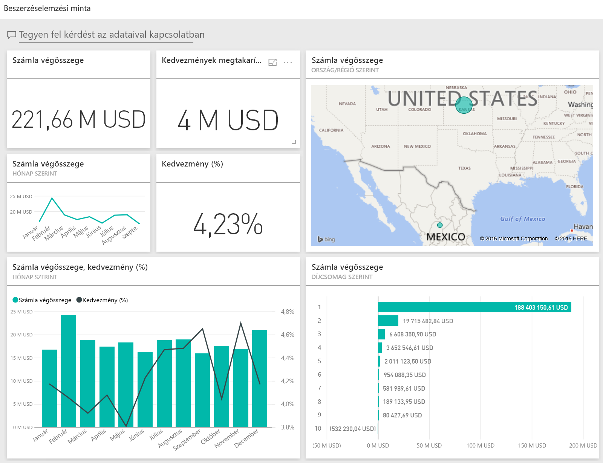
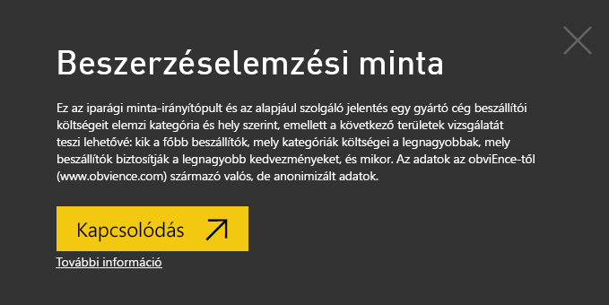
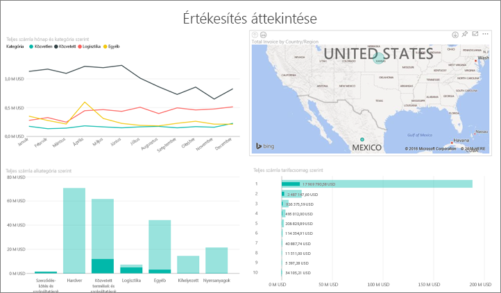
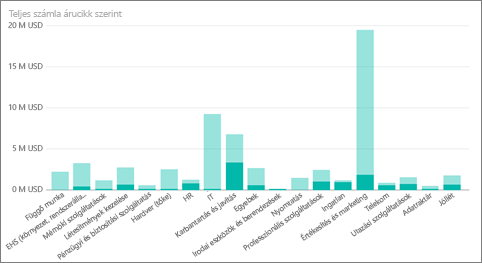
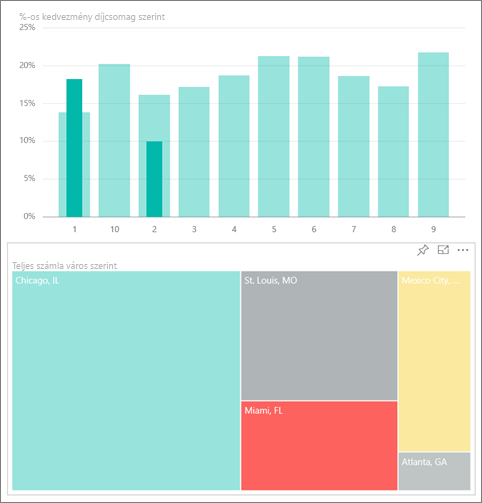
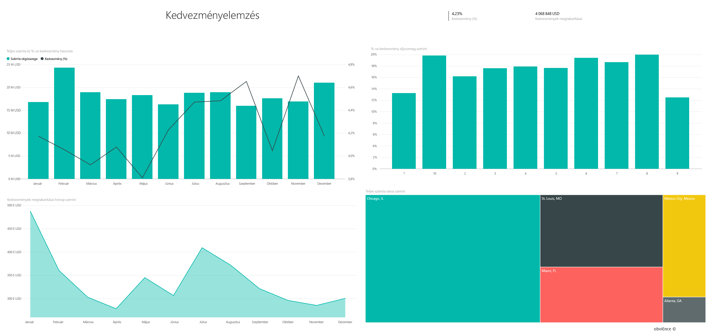
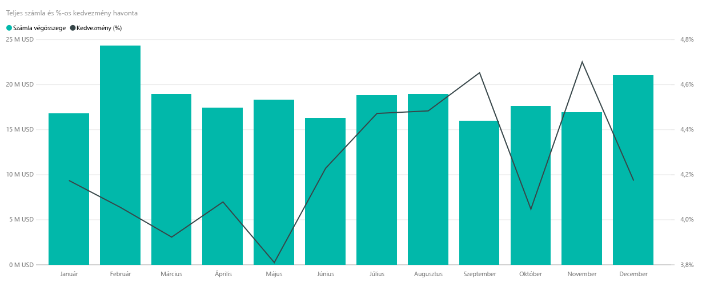
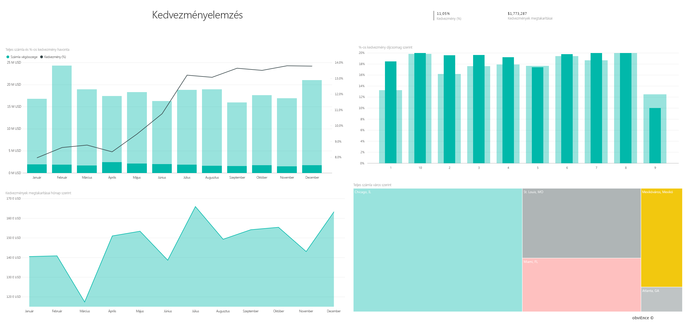

# Beszerzéselemzési minta a Power BI-hoz: bemutató

A Beszerzéselemzési minta tartalomcsomag egy irányítópultot, jelentést és adathalmazt tartalmaz, amely egy gyártó cég beszállítói költségeit elemzi kategória és hely szerint. A mintában az alábbi területek ismerhetők meg:

* Kik a fő beszállítók?
* Mely kategóriák költségei a legmagasabbak?
* Mely beszállítók biztosítják a legnagyobb kedvezményeket, és mikor?

Ez a minta abba a sorozatba tartozik, amely a Power BI üzleti jellegű adatokkal, jelentésekkel, és irányítópultokkal történő használatát mutatja be. Az [obviEnce](http://www.obvience.com/) által lett létrehozva valós adatokkal, melyeket anonimizáltunk. Az adatok többféle formátumban: tartalomcsomagként, .pbix kiterjesztésű Power BI Desktop-fájlként és Excel-munkafüzetként is elérhetők. [Power BI-minták](sample-datasets.md) megtekintése. 

Ebben az oktatóanyagban a Power BI szolgáltatásban vizsgáljuk meg a Beszerzéselemzési minta tartalomcsomagot. Mivel azonban a jelentéssel való munka hasonló a Power BI Desktopban és a szolgáltatásban, a bemutatót akkor is követni tudja, ha a .pbix-mintafájlt a Power BI Desktopban használja. 

A minták Power BI Desktopban való vizsgálatához nincs szükség Power BI-licencre. Ha nem rendelkezik Power BI Pro-licenccel, a mintát a Saját munkaterületre mentheti a Power BI szolgáltatásban. 

## A minta beszerzése

Használat előtt a mintát [tartalomcsomagként](#get-the-content-pack-for-this-sample), [.pbix-fájlként](#get-the-pbix-file-for-this-sample) vagy [Excel-munkafüzetként](#get-the-excel-workbook-for-this-sample) le kell töltenie.

### Tartalomcsomag letöltése ehhez a mintához

1. Nyissa meg a Power BI szolgáltatást (app.powerbi.com), jelentkezzen be, majd nyissa meg azt a munkaterületet, ahol a mintát szeretné menteni. 

    Ha nem rendelkezik Power BI Pro-licenccel, a mintát a Saját munkaterületre mentheti.

2. A bal alsó sarokban válassza az **Adatok lekérése** lehetőséget.

    
3. Ekkor megjelenik az **Adatok lekérése** lap. Itt válassza a **Minták** lehetőséget.

4. Válassza a **Beszerzéselemzési minta** elemet, majd a **Kapcsolódás** lehetőséget.  
  
   
   
5. A Power BI importálja a tartalomcsomagot, és egy új irányítópultot, jelentést és adatkészletet ad hozzá az aktuális munkaterülethez.
   
   
  
### .pbix-fájl letöltése ehhez a mintához

A Beszerzéselemzési mintát a Power BI Desktoppal való használatra tervezett [.pbix-fájlként](https://download.microsoft.com/download/D/5/3/D5390069-F723-413B-8D27-5888500516EB/Procurement%20Analysis%20Sample%20PBIX.pbix) is letöltheti. 

### Excel-munkafüzet letöltése ehhez a mintához

Ha a minta adatforrását is szeretné megtekinteni, használja az [Excel-munkafüzetként](https://go.microsoft.com/fwlink/?LinkId=529784) letölthető változatát. A munkafüzet megtekinthető és módosítható Power View-lapokat tartalmaz. A nyers adatok megtekintéséhez engedélyezze az Adatok Elemzése bővítményeket, majd válassza a **Power Pivot > Kezelés** lehetőséget. A Power View és a Power Pivot bővítmények engedélyezéséről az [Excel-minták vizsgálata az Excelben](sample-datasets.md#explore-excel-samples-inside-excel) című cikkben olvashat részletesen.

## Költési trendek
Először nézzük meg a költési trendeket kategória és hely szerint.  

1. A munkaterületen, amelyre a mintát mentette, nyissa meg az **Irányítópultok** lapot, majd keresse meg és jelölje ki a **Beszerzéselemzési minta** irányítópultot. 
2. Válassza a **Számlák összege ország/régió szerint** irányítópult-csempét, amely a **Beszerzéselemzési minta** jelentés **Költségek áttekintése** oldalát nyitja meg.

    

Figyelje meg a következő részleteket:

* A **Teljes számla hónap és kategória szerint** nevű vonaldiagramon a **Közvetlen** kategória viszonylag következetes kiadásokat mutat, a **Logisztika** kategória csúcsértéke decemberben van, míg az **Egyéb** nevű kategóriáé februárban.
* A **Számlák összege ország/régió szerint** nevű térképen a kiadások többsége az Egyesült Államokban mutatkozik.
* A **Számlák összege alkategória szerint** nevű oszlopdiagramon a **Hardver**, valamint a **Közvetett termékek és szolgáltatások** képviselik a legnagyobb kiadási kategóriát.
* A **Számlák összege szint szerint** nevű sávdiagramon az ügyfelek többsége 1. szintű (első 10-be tartozó) beszállítónak minősül. Ezáltal jobban kezelhetők a beszállítói kapcsolatok.

## Mexikói költések
Nézzük meg a mexikói költési területeket.

1. A **Számlák összege ország/régió szerint** térképen válassza a **Mexikó** buborékot. Látható, hogy a **Számlák összege alkategória szerint** nevű oszlopdiagramon a legtöbb kiadást a **Közvetett termékek és szolgáltatások** alkategória képviseli.

   
2. Részletezheti a **Közvetett termékek és szolgáltatások** nevű oszlopot:

   * A **Számlák összege alkategória szerint** diagramon válassza a részletezés nyilat  a diagram jobb felső sarkában.
   * Válassza ki a **Közvetett termékek és szolgáltatások** nevű oszlopot.

      Látható, hogy a költség kiugróan az **Értékesítés és marketing** alkategóriában a legmagasabb.
   * Válassza ki újra **Mexikót** a térképen.

      Mexikóban a legnagyobb kiadás a **Karbantartás és javítás** alkategóriában jelentkezik.

      
3. Válassza ki a felfelé mutató nyilat a diagram bal felső sarkában a felhatoláshoz.
4. Válassza újra a részletező nyilat újra a részletezés kikapcsolásához.  
5. A felső navigációs panelen a **Beszerzéselemzési minta** lehetőségre kattintva visszatérhet az irányítópulthoz.

## Különböző városok értékelése
A kiemelések használatával értékelheti a különböző városokat.

1. Válassza a **Számlák összege, százalékos kedvezmény hónap szerint** irányítópult-csempét, amely a **Beszerzéselemzési minta** jelentés **Kedvezmények elemzése** oldalát nyitja meg.
2. A **Számlák összege város szerint** fatérképen jelölje ki egymás után a városokat, hogy összehasonlíthassa azokat. Megfigyelheti, hogy a Miamihoz tartozó szinte összes számla 1. szintű beszállítóktól származik.

   

## Beszállítói kedvezmények
Most tekintsük át a beszállítóktól származó kedvezményeket, valamint azokat az időszakokat, amikor a legtöbb kedvezményt kapjuk:
* Havonta változnak a kedvezmények, vagy ugyanazok maradnak?
* Egyes városok több kedvezményt kapnak-e más városokhoz képest?

### Kedvezmény havonta
A **Számlák összege és százalékos kedvezmény hónap szerint** nevű kombinált diagramon látható, hogy február a leginkább, és szeptember a legkevésbé forgalmas hónap. 

Figyelje meg a százalékos kedvezményt ezekben a hónapokban: a forgalom növekedésekor a kedvezmény csökken, alacsony forgalom idején a kedvezmény emelkedik. Minél nagyobb szükségünk volna a kedvezményre, annál kedvezőtlenebb ajánlatot kapunk.

### Kedvezmény városonként
Egy másik feltárható terület a városonként kapott kedvezmény. Válassza ki egyenként a városokat a fatérképen, és láthatja, hogyan változik a többi diagram:

* St. Louis-ban februárban kiugróan magas csúcsértéket ért el a teljes számlaérték, áprilisban viszont a legalacsonyabb szintre esett vissza a kedvezményekkel elérhető megtakarítás.
* A kedvezmény mértéke Mexikóvárosban a legmagasabb (11,05%), Atlantában pedig a legalacsonyabb (0,08%).

### A jelentés szerkesztése
Válassza ki a **Jelentés szerkesztése** elemet a bal felső sarokban, és nyissa meg a szerkesztési nézetet:

* Áttekintheti a lapok felépítését.
* Lapokat és diagramokat vehet fel ugyanazon adatok alapján.
* Módosíthatja a diagram vizualizációtípusát, például fatérképről gyűrűdiagramra.
* Rögzítheti a diagramokat az irányítópulton.

## Következő lépések: Kapcsolódás a saját adatokhoz
Ezzel a környezettel biztonságosan kísérletezhet, mert dönthet úgy, hogy nem menti a módosításokat. De ha mégis mentené őket, bármikor lekérheti a minta egy új másolatát az **Adatok lekérése** lehetőség választásával.

Reméljük, hogy ez a bemutató segített megérteni a mintaadatok Power BI irányítópultok, Q&A és jelentések segítségével történő elemzését. Most Önön a sor – kapcsolódjon a saját adataihoz. A Power BI használatával számos különböző adatforráshoz kapcsolódhat. További információ: [Első lépések a Power BI szolgáltatásban](service-get-started.md).

