# Kiskereskedelmi elemzési minta – Power BI: Bemutató megtekintése

A Kiskereskedelmi elemzési minta tartalomcsomag egy irányítópultot, jelentést és adathalmazt tartalmaz, és több üzletben és körzetben értékesített árucikkekre vonatkozó kiskereskedelmi adatokat elemez. A mérőszámok a folyó év teljesítményét vetik össze a tavalyival a következő területeken: értékesítés, egységek, bruttó nyereség, eltérés, valamint új üzletek elemzett adatai. 

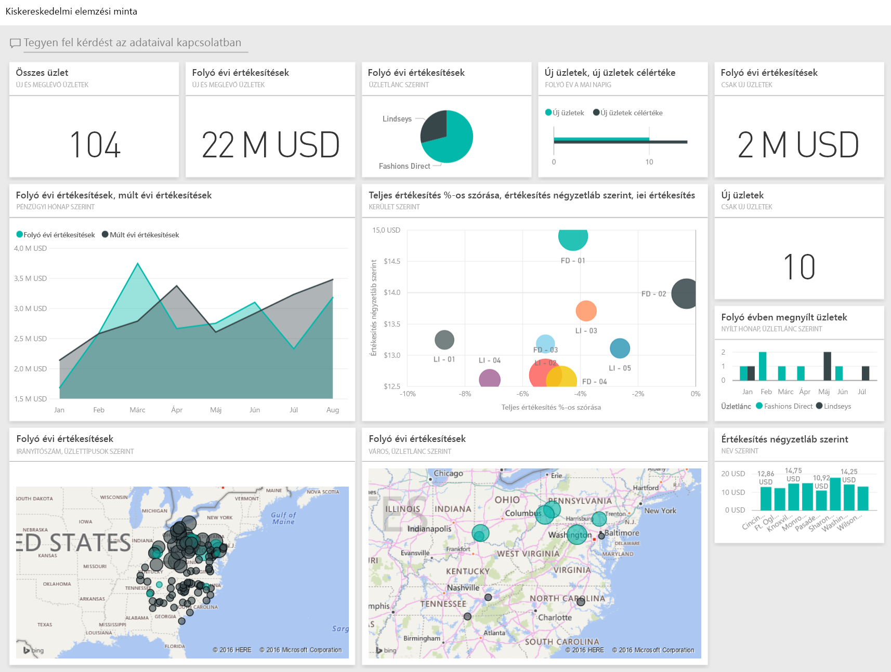

Ez a minta abba a sorozatba tartozik, amely a Power BI üzleti jellegű adatokkal, jelentésekkel, és irányítópultokkal történő használatát mutatja be. Az [obviEnce](http://www.obvience.com/) által lett létrehozva valós adatokkal, melyeket anonimizáltunk. Az adatok többféle formátumban: tartalomcsomagként, .pbix kiterjesztésű Power BI Desktop-fájlként és Excel-munkafüzetként is elérhetők. [Power BI-minták](sample-datasets.md) megtekintése. 

Ebben az oktatóanyagban a Power BI szolgáltatásban vizsgáljuk meg a Kiskereskedelmi elemzési minta tartalomcsomagot. Mivel azonban a jelentéssel való munka hasonló a Power BI Desktopban és a szolgáltatásban, a bemutatót akkor is követni tudja, ha a .pbix-mintafájlt a Power BI Desktopban használja. 

A minták Power BI Desktopban való vizsgálatához nincs szükség Power BI-licencre. Ha nem rendelkezik Power BI Pro-licenccel, a mintát a Saját munkaterületre mentheti a Power BI szolgáltatásban. 

## A minta beszerzése

 Használat előtt a mintát [tartalomcsomagként](#get-the-content-pack-for-this-sample), [.pbix-fájlként](#get-the-pbix-file-for-this-sample) vagy [Excel-munkafüzetként](#get-the-excel-workbook-for-this-sample) le kell töltenie.

### Tartalomcsomag letöltése ehhez a mintához

1. Nyissa meg a Power BI szolgáltatást (app.powerbi.com), jelentkezzen be, majd nyissa meg azt a munkaterületet, ahol a mintát szeretné menteni. 

    Ha nem rendelkezik Power BI Pro-licenccel, a mintát a Saját munkaterületre mentheti.

2. A bal alsó sarokban válassza az **Adatok lekérése** lehetőséget.

    
3. Ekkor megjelenik az **Adatok lekérése** lap. Itt válassza a **Minták** lehetőséget.
   
4. Válassza a **Kiskereskedelmi elemzési minta** elemet, majd a **Kapcsolódás** lehetőséget.  
  
   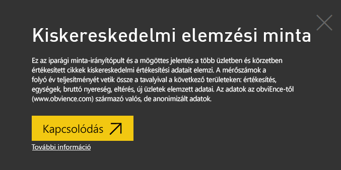
   
5. A Power BI importálja a tartalomcsomagot, és egy új irányítópultot, jelentést és adatkészletet ad hozzá az aktuális munkaterülethez.
   
   
  
### .pbix-fájl letöltése ehhez a mintához

Az Kiskereskedelmi elemzési mintát a Power BI Desktoppal való használatra tervezett [.pbix-fájlként](https://download.microsoft.com/download/9/6/D/96DDC2FF-2568-491D-AAFA-AFDD6F763AE3/Retail%20Analysis%20Sample%20PBIX.pbix) is letöltheti. 

### Excel-munkafüzet letöltése ehhez a mintához

Ha a minta adatforrását is szeretné megtekinteni, használja az [Excel-munkafüzetként](https://go.microsoft.com/fwlink/?LinkId=529778) letölthető változatát. A munkafüzet megtekinthető és módosítható Power View-lapokat tartalmaz. A nyers adatok megtekintéséhez engedélyezze az Adatok Elemzése bővítményeket, majd válassza a **Power Pivot > Kezelés** lehetőséget. A Power View és a Power Pivot bővítmények engedélyezéséről az [Excel-minták megtekintése magában az Excelben](sample-datasets.md#optional-take-a-look-at-the-excel-samples-from-inside-excel-itself) című cikkben olvashat részletesen.

## Az irányítópult elindítása és a jelentés megnyitása

1. A munkaterületen, amelyre a mintát mentette, nyissa meg az **Irányítópultok** lapot, majd keresse meg és jelölje ki a **Kiskereskedelmi elemzési minta** irányítópultot. 
2. Az irányítópulton válassza az **Összes értékesítés – Új és meglévő üzletek** csempét, amely megnyitja a Kiskereskedelmi elemzési mintajelentés **Üzleti értékesítések áttekintése** oldalát. 

   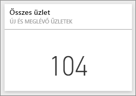  

   Ezen a jelentésoldalon összesen 104 üzlet látható, amelyek közül 10 új. Két üzletlánc működik, a Fashions Direct és a Lindseys. A Fashions Direct üzletek átlagosan nagyobbak.
3. A **Folyó évi értékesítések üzletlánconként** tortadiagramon jelölje ki a **Fashions Direct** láncot.

   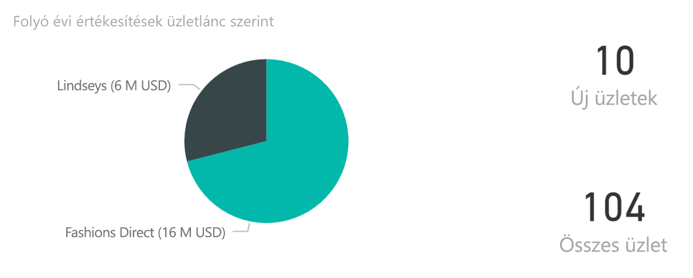  

   Figyelje meg az eredményt a **Teljes értékesítés százalékos eltérése** buborékdiagramon:

   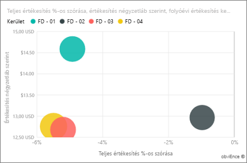  

   Az **FD-01** körzetben a legmagasabb az átlagos **négyzetlábankénti értékesítés**, az FD-02 körzetben pedig a legalacsonyabb a **Teljes értékesítés eltérése** a tavalyi évhez viszonyítva. Összességében az FD-03 és az FD-04 teljesít a leggyengébben.
4. Kattintson az egyes buborékokra vagy diagramokra annak megtekintéséhez, hogy ennek hatására milyen keresztkijelölések jönnek létre.
5. Az irányítópultra a felső navigációs panel **Kiskereskedelmi elemzési minta** elemének kiválasztásával térhet vissza.

   
6. Az irányítópulton válassza a **Folyó évi értékesítések – Új és meglévő üzletek** csempét. Ezzel egyenértékű művelet a *Folyó évi értékesítések* szöveg begépelése a Q&A kérdésmezőjébe.

   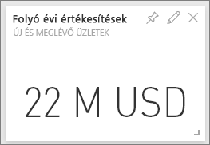

   Megjelennek a Q&A-eredmények:

   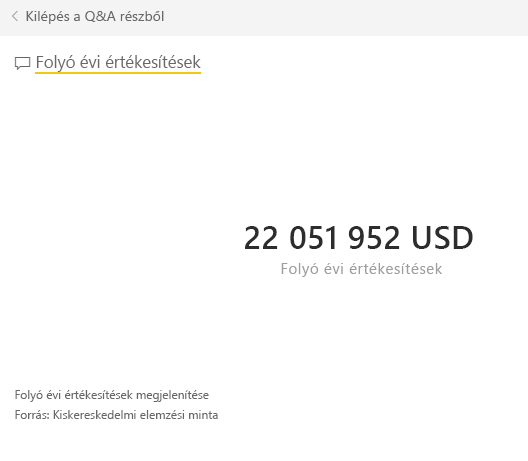

## A Power BI Q&A funkcióban létrehozott csempe áttekintése
Tárja fel a részleteket.

1. Módosítsa a kérdést a következőre: _folyó évi értékesítések **körzet szerint**_ . Tekintse meg az eredményt: A Q&A a választ automatikusan egy sávdiagramba helyezi, és további kifejezéseket javasol:

   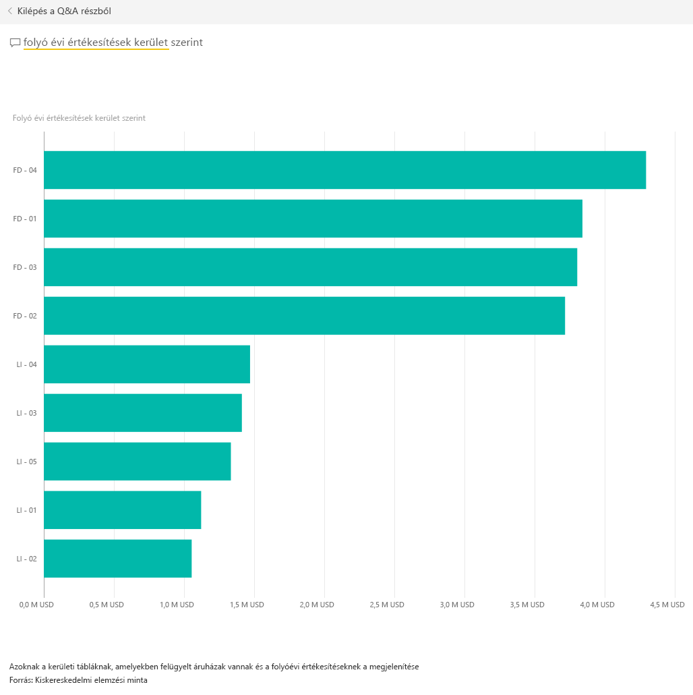
2. Most módosítsa a kérdést a következőre: _folyó évi értékesítések **irányítószám és üzletlánc szerint**_ .

   Figyelje meg, hogy a Power BI hogyan válaszol a megfelelő diagramokkal az éppen beírt kérdésre.
3. Kísérletezzen többféle kérdéssel, és tekintse meg a válaszul kapott eredményeket.
4. Amikor elkészült, térjen vissza az irányítópulthoz.

## Mélyebb adatelemzés
Most tárjon fel egy részletesebb szintet, ahol megvizsgálhatja az egyes körzetek teljesítményét.

1. Az irányítópulton válassza a **Folyó évi értékesítések, tavalyi értékesítések** csempét, amely a jelentés **Kerületi havi értékesítés** oldalát nyitja meg.

   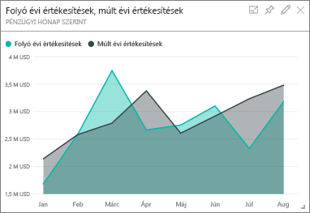

   A **Teljes értékesítés százalékos eltérése pénzügyi hónap szerint** diagramon a tavalyi évhez viszonyítva sokféle eltérést figyelhet meg. Január, április és július különösen rossz hónap volt.

   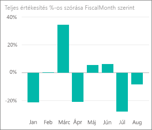

   Próbálja meg szűkítéssel kideríteni a probléma okát.
2. A Buborékdiagramon jelölje ki a **020-Férfiak** buborékot.

   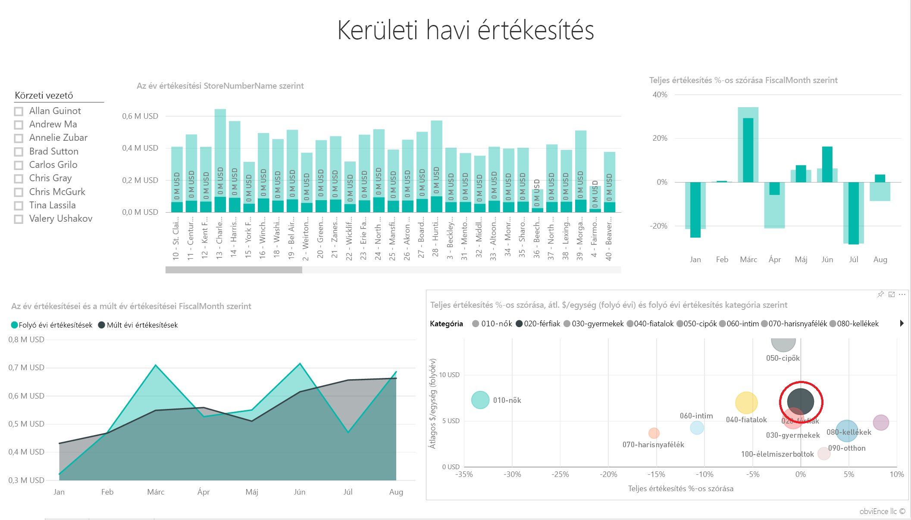  

   Figyelje meg, hogy bár a Férfiak kategóriát áprilisban nem érintette olyan rosszul a változás, mint a vállalkozás egészét, a január és a július itt is problémás hónap volt.
1. Jelölje ki a **010-Nők** buborékot.

   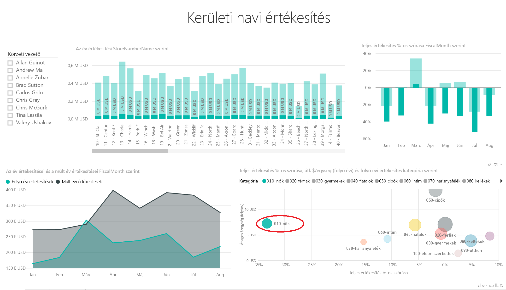

   Figyelje meg, hogy a Nők kategória minden hónapban sokkal rosszabbul teljesített, mint a vállalkozás egésze, és szinte minden hónapban sokkal rosszabbul teljesített a tavalyinál.
1. Kattintson ismét a buborékra a szűrő törléséhez.

## A szeletelő kipróbálása
Tekintse meg az egyes körzetek eredményeit.

1. Jelölje ki **Allan Guinot** nevét a bal felső **Körzeti vezető** szeletelőn.

   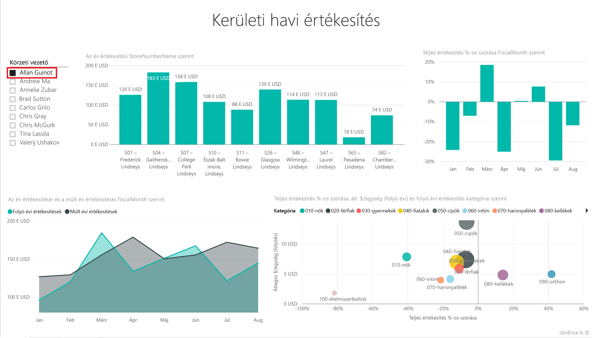

   Figyelje meg, hogy Allan körzete márciusban és júniusban is jobban teljesített, mint tavaly.
2. Míg **Allan Guinot** ki van jelölve, válassza a **Nők-10** buborékot a buborékdiagramon.

   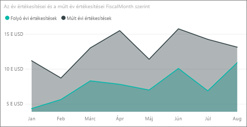

   Megfigyelheti, hogy a Nők-10 kategóriában Allan körzete nem érte el az előző évi teljesítményt.
3. Vizsgálja meg a többi körzeti vezetőt és a kategóriákat – Milyen egyéb következtetések vonhatók le?
4. Amikor elkészült, térjen vissza az irányítópulthoz.

## Amit az adatok az értékesítések idei növekedéséről elárulnak
Végezetül mérjük fel növekedést az idén nyílt új üzletek vizsgálatával.

1. Válassza a **Folyó évben nyílt üzletek a nyitás hónapja és üzletlánc szerint** csempét, amely a jelentés **Új üzletek elemzése** oldalát nyitja meg.

   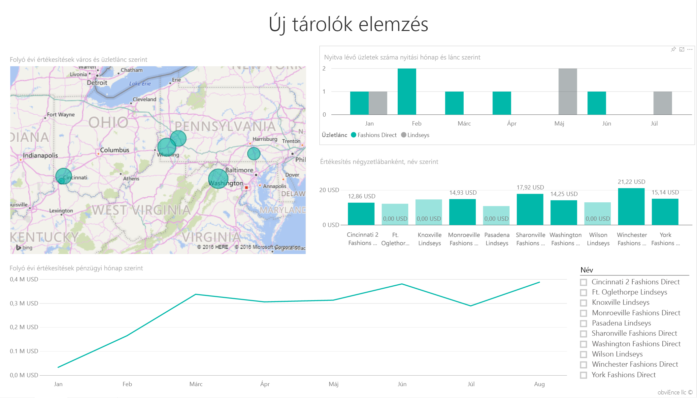

   A csempe világosan mutatja, hogy idén több Fashions Direct üzlet nyílt, mint Lindseys.
2. Vizsgálja meg az **Négyzetlábankénti értékesítés üzletnév szerint** diagramot:

   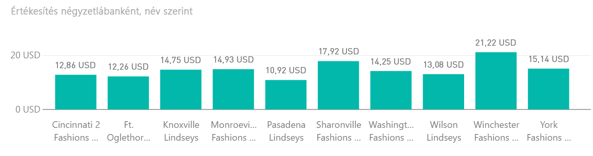

    Figyelje meg az egy négyzetlábra jutó értékesítés eltérését az új üzleteknél.
3. Válassza a jobb felső **Folyó évben nyílt üzletek a nyitás hónapja és üzletlánc szerint** diagram jelmagyarázatának **Fashions Direct** elemét. Figyelje meg, hogy a legjobban teljesítő üzlet (a Winchester Fashions Direct) 21,22 dolláros eredménye még ugyanazon a láncon belül is jelentősen meghaladja a leggyengébb üzlet (Cincinnati 2 Fashions Direct) 12,86 dolláros eredményét.

   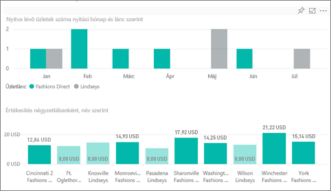
4. Válassza a **Név** szeletelőben a **Winchester Fashions Direct** elemet, és vizsgálja meg a vonaldiagramot. Az első értékesítési eredményeket februárban jelentették.
5. Jelölje ki a szeletelőben a **Cincinnati 2 Fashions Direct** elemet, és a vonaldiagramon figyelje meg, hogy az üzlet júniusban nyílt meg, és valószínűleg ez a legrosszabbul teljesítő üzlet.
6. A diagramokon lévő egyéb sávok, vonalak és buborékok kijelölésével további összefüggéseket fedezhet fel.

## Következő lépések: Csatlakozás az adatokhoz
Ezzel a környezettel biztonságosan kísérletezhet, mert dönthet úgy, hogy nem menti a módosításokat. De ha mégis mentené őket, bármikor lekérheti a minta egy új másolatát az **Adatok lekérése** lehetőség választásával.

Reméljük, hogy ez a bemutató segített megérteni a mintaadatok Power BI irányítópultok, Q&A és jelentések segítségével történő elemzését. Most Önön a sor – kapcsolódjon a saját adataihoz. A Power BI használatával számos különböző adatforráshoz kapcsolódhat. További információ: [Első lépések a Power BI szolgáltatásban](service-get-started.md).
