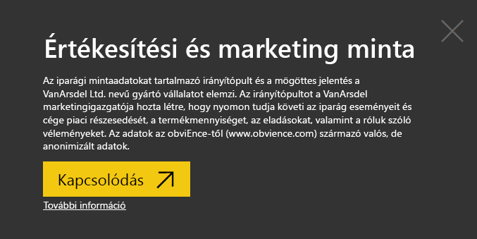
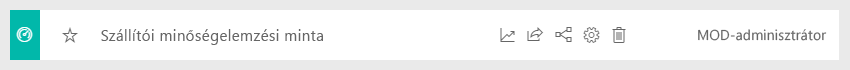
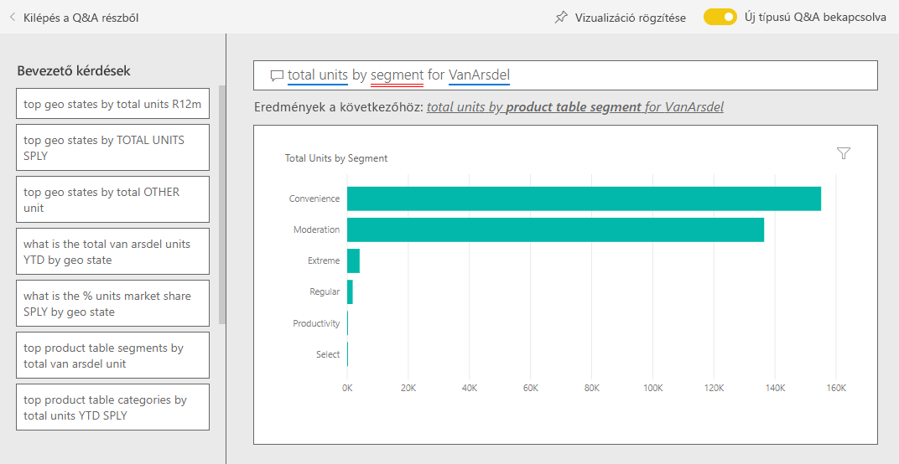
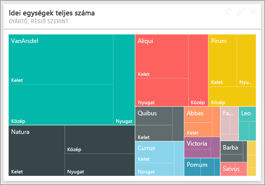
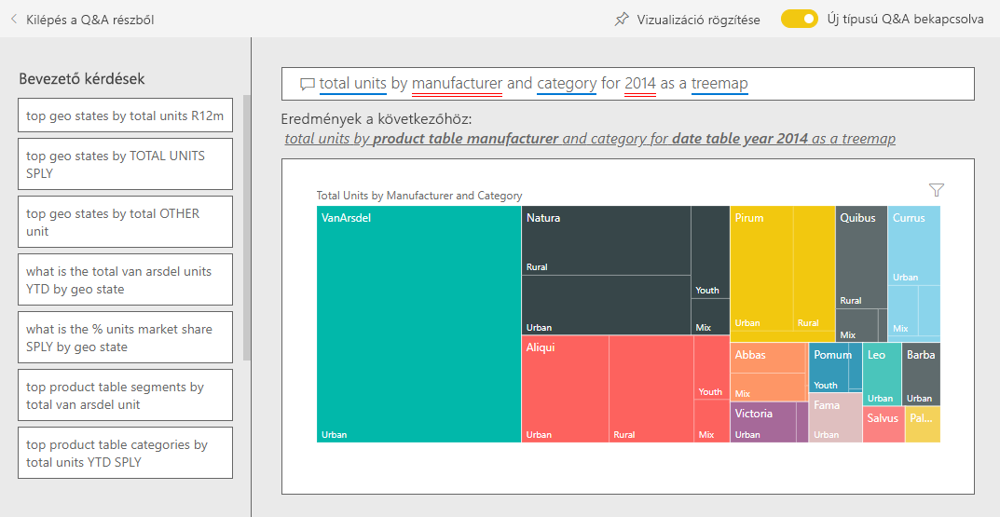
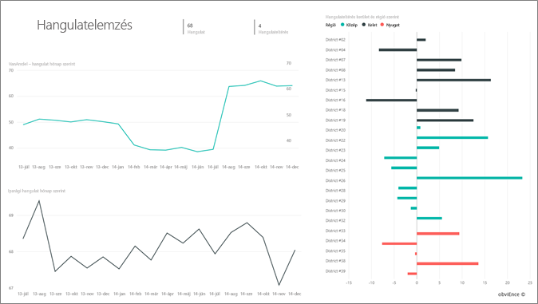
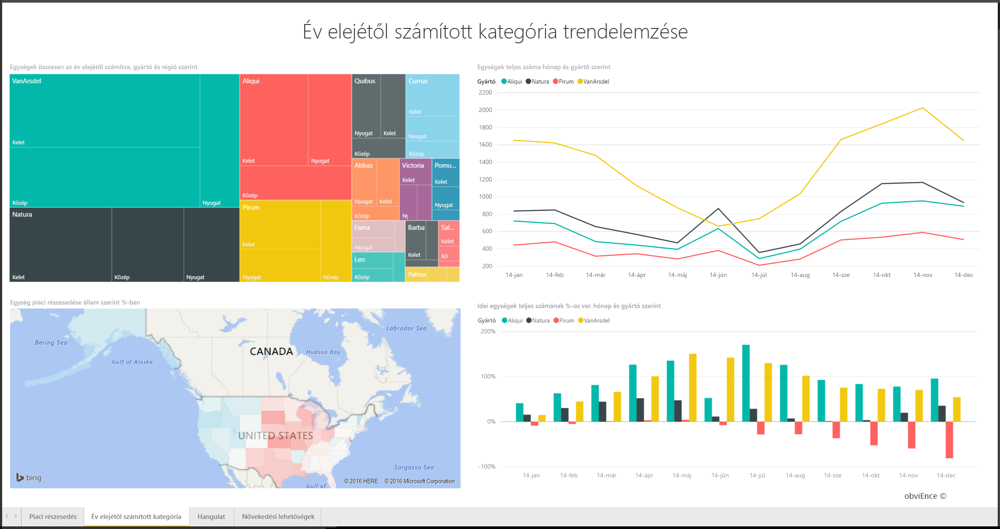
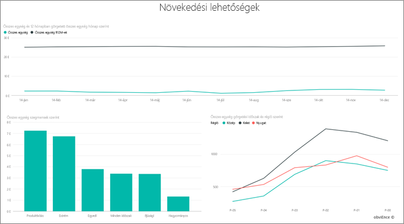

# Értékesítési és marketing minta a Power BI-hoz: Bemutató megtekintése

Az Értékesítési és marketing minta egy VanArsdel Ltd nevű kitalált gyártó céghez tartozó irányítópultot és jelentést tartalmaz. Az irányítópultot a VanArsdel marketingigazgatója hozta létre, hogy nyomon tudja követi az iparág eseményeit és cége piaci részesedését, a termékmennyiséget, az eladásokat, valamint a róluk szóló véleményeket.

A VanArsdel számos versenytárssal rendelkezik, de piacvezető az iparágában. A marketingigazgató növelni szeretné a piaci részesedést, és fel szeretné deríteni a növekedési lehetőségeket. Valamilyen okból azonban a VanArsdel piaci részesedése csökkenni kezdett, júniusban jelentős mértékű zuhanással.

Ez a minta abba a sorozatba tartozik, amely a Power BI üzleti jellegű adatokkal, jelentésekkel, és irányítópultokkal történő használatát mutatja be. Az [obviEnce](http://www.obvience.com/) által lett létrehozva valós adatokkal, melyeket anonimizáltunk. Az adatok többféle formátumban: tartalomcsomagként, .pbix kiterjesztésű Power BI Desktop-fájlként és Excel-munkafüzetként is elérhetők. [Power BI-minták](sample-datasets.md) megtekintése. 

Ebben az oktatóanyagban a Power BI szolgáltatásban vizsgáljuk meg az Értékesítési és marketing minta tartalomcsomagot. Mivel azonban a jelentéssel való munka hasonló a Power BI Desktopban és a szolgáltatásban, a bemutatót akkor is követni tudja, ha a .pbix-mintafájlt a Power BI Desktopban használja. 

A minták Power BI Desktopban való vizsgálatához nincs szükség Power BI-licencre. Ha nem rendelkezik Power BI Pro-licenccel, a mintát a Saját munkaterületre mentheti a Power BI szolgáltatásban. 

## A minta beszerzése

Használat előtt a mintát [tartalomcsomagként](#get-the-content-pack-for-this-sample), [.pbix-fájlként](#get-the-pbix-file-for-this-sample) vagy [Excel-munkafüzetként](#get-the-excel-workbook-for-this-sample) le kell töltenie.

### Tartalomcsomag letöltése ehhez a mintához

1. Nyissa meg a Power BI szolgáltatást (app.powerbi.com), jelentkezzen be, majd nyissa meg azt a munkaterületet, ahol a mintát szeretné menteni.

   Ha nem rendelkezik Power BI Pro-licenccel, a mintát a Saját munkaterületre mentheti.

2. A bal alsó sarokban válassza az **Adatok lekérése** lehetőséget.
   
   
3. Ekkor megjelenik az **Adatok lekérése** lap. Itt válassza a **Minták** lehetőséget.
   
4. Válassza ki az **Értékesítési és marketing mintát**, majd válassza a **Kapcsolódás** lehetőséget.   
  
   
   
5. A Power BI importálja a tartalomcsomagot, és egy új irányítópultot, jelentést és adatkészletet ad hozzá az aktuális munkaterülethez.
   
   
  
### .pbix-fájl letöltése ehhez a mintához

A mintát [.pbix-fájlként](http://download.microsoft.com/download/9/7/6/9767913A-29DB-40CF-8944-9AC2BC940C53/Sales%20and%20Marketing%20Sample%20PBIX.pbix) is letöltheti, amelyet a Power BI Desktoppal való használatra terveztek.

### Excel-munkafüzet letöltése ehhez a mintához

Ha a minta adatforrását is szeretné megtekinteni, használja az [Excel-munkafüzetként](http://go.microsoft.com/fwlink/?LinkId=529785) letölthető változatát. A munkafüzet megtekinthető és módosítható Power View-lapokat tartalmaz. A nyers adatok megtekintéséhez engedélyezze az Adatok Elemzése bővítményeket, majd válassza a **Power Pivot > Kezelés** lehetőséget. A Power View és a Power Pivot bővítmények engedélyezéséről az [Excel-minták megtekintése magában az Excelben](sample-datasets.md#optional-take-a-look-at-the-excel-samples-from-inside-excel-itself) című cikkben olvashat részletesen.

## Mi olvasható le az irányítópultról?
Kezdjük a bemutatót az irányítópulton, és tekintsük meg a csempéket, melyek rögzítése mellett döntött a marketingigazgató. A piaci részesedéssel, az eladásokkal és a cégről szóló véleményekkel kapcsolatos információk jelennek meg. Az adatok régió, időpont és versenytársak szerinti bontásban tekinthetők meg.

* A bal oldali oszlopban látható csempéken az elmúlt évi iparági értékesítési mennyiség (50 000), a piaci részesedés (32,86 %), az értékesítési mennyiség (16 000), a véleménypontszám (68) a vélemények közötti eltérés (4) és az összes eladott egység mennyisége (1 millió) jelenik meg.
* A felső vonaldiagramon ( **% Units Market Share – % egység piaci részesedés és % Units Market Share Rolling 12 Months – % egység görgetett piaci részesedés az elmúlt 12 hónapban**) a piaci részesedés ingadozása jelenik meg az idő függvényében. Itt láthatja a júniusi visszaesést. A 12 hónapos gördülő (R12M) részesedés, amely egy ideig növekedett, kezd stagnálni.
* A legnagyobb versenytárs az Aliqui, ami egyértelműen látszik a középső oszlopdiagram csempéjén (**Total Units YTD Variance %** Idei egységek teljes százalékos szórása).
* Üzleti tevékenységünk legnagyobb része a keleti és a középső régióban zajlik.
* Az alsó vonaldiagramon (**Total Units for 2014** – 2014. évi összes egység) az látható, hogy a júniusi visszaesés nem szezonális – egy versenytársnál sem jelentkezik ugyanez a tendencia.
* A **Total Units Overall** (Egységek összesítése) és a **Total Units YTD** (Idei egységek teljes száma) csempén az eladott egységek száma látható szegmens, illetve régió/gyártó szerint. Az iparág legnagyobb piaci szegmensei a **Termelékenység** és a **Kényelem**.

## A Q&A használata a részletesebb adatok feltárásához

A Q&A segítségével további részleteket fedezhet fel az adatokról.

### Mely szegmensek meghatározók az értékesítésünk szempontjából? Megfelelnek az iparági trendeknek?
1. Válassza a **Total Units Overall by Segment** (Egységek összesítése szegmens szerint) csempét, amely megnyitja a Q&A-t és feltölti a *total units by segment* (Összes egység szegmensek szerint) ekérdezéssel.
2. Írja be a *for VanArsdel* (a VanArsdel esetében) kifejezést a meglévő lekérdezés végére. A Q&A értelmezi a kérdést, és megjeleníti a frissített diagramot, amely megadja a választ. Figyelje meg, hogy a termék mennyisége többnyire a **Kényelem** és a **Moderálás** szegmensből származik.

   
3. A **Moderálás** és a **Kényelem** kategóriában magas a részesedésünk; ezekben a szegmensekben vagyunk versenyképesek.
4. A felső navigációs sávon az **Értékesítési és marketing minta** lehetőségre kattintva térjen vissza az irányítópultokhoz.

### Milyen az összes egység piaci részesedése kategória (és régió) szerint?
1. Figyelje meg a **Total Units YTD by Manufacturer, Region** (Egységek összesen az év elejétől számítva, gyártó és régió szerint) csempét. Milyen az összes egység piaci részesedése kategória szerint?

   
2. Az irányítópult tetején található kérdésmezőbe írja be a *total units by manufacturer and category for 2014 as a treemap* (összes egység gyártó és kategória szerint 2014-ben, fatérkép diagramként) kérdést. Figyelje meg, ahogy a vizualizáció frissül, miközben beírja a kérdést.

   
3. Az eredmények összehasonlításához rögzítse a diagramot az irányítópulton. Érdekes tényt figyelhet meg: 2014-ben a VanArsdel csak az **Urban** (Városi) kategóriába tartozó termékeket értékesített.
4. Térjen vissza az irányítópultra.

## Értékesítési és marketing minta jelentés

Az irányítópultokon a jelentések is hozzáférhetők. Ha egy csempe egy mögöttes jelentés alapján készült, a csempét kiválasztva megnyílik az adott jelentés.

Ezen az irányítópulton a **% Units Market Share vs. % Units Market Share Rolling 12 Months** (% egység piaci részesedés és % egység görgetett piaci részesedés) diagram **% Units Market Share R12M** ( % egység piaci részesedés (R12M)) sorában az látható, hogy a piaci részesedés már nem növekszik az idő múlásával. Sőt egy kicsit még csökken is. És vajon miért zuhan jelentősen a piaci részesedés júniusban? 

Az Értékesítési és marketing minta négy oldallal rendelkezik.
 
### VanArsdel – piaci részesedés oldal
A jelentés 1. oldala a VanArsdel piaci részesedésére összpontosít.

1. Az irányítópulton válassza ki a **% Units Market Share vs. % Units Market Share Rolling 12 Months** diagramot az Értékesítési és marketing minta **VanArsdel – Market Share** (VanArsdel – piaci részesedés) nevű oldalának megnyitásához.

   

2. Tekintse meg a jelentés alján található **Total Units by Month and isVanArsdel** („Összes egység hónap és aszerint, hogy a VanArsdelé-e”) oszlopdiagramot. A fekete oszlop jelöli a VanArsdelt (a mi termékeinket), a zöld pedig a versenytársainkat. A 2014. júniusában a VanArsdel által tapasztalt visszaesés a versenytársaknál nem jelentkezett.

3. A jobb oldalon található **Total Category Volume by Segment** (Kategóriák összesített mennyisége szegmens szerint) sávdiagram a VanArsdel 2 legjobb szegmensére van szűrve. Tekintse meg, hogyan készült a szűrő:  

   a. Válassza ki a **Total Category Volume by Segment** diagramot.

   b. Bontsa ki a **Szűrők** panelt a jobb oldalon.  

   c. Figyelje meg, hogy a **Vizualizációszint szűrői** szakaszban a **Szegmens** úgy van szűrve, hogy csak a **Kényelem** és a **Moderálás** kategóriát tartalmazza.  

   d. Módosítsa a szűrőt úgy, hogy a **Szegmens** lehetőséget választva kibontja a szakaszt, majd a **Termelékenység** lehetőséget választva ezt a szegmenst is hozzáadja.  

4. A **Total Units by Month and isVanArsdel** („Összes egység hónap és aszerint, hogy a VanArsdelé-e”) diagramon válassza a jelmagyarázatban szereplő **Igen** lehetőséget az oldal a VanArsdel szerinti keresztszűréséhez. A **Total Category Volume by Segment** diagramon megfigyelheti, hogy a **Termelékenység** szegmensben nem vagyunk versenyképesek.

5. Válassza ismét a jelmagyarázat **Igen** lehetőségét a szűrő eltávolításához.

6. Tekintse meg a **% Units Market Share and % Units Market Share R12M by Month** vonaldiagramot. Ezen a havi piaci részesedés, illetve a 12 hónapos gördülő piaci részesedés látható. A gördülő havi adatok segítik a havi ingadozások simítását, és szemléltetik a hosszú távú trendeket. A **Total Category Volume by Segment** sávdiagramon a **Kényelem** és a **Moderálás** szegmenst kiválasztva megtekintheti, hogy mekkora az piaci részesedés ingadozása az egyes szegmensekben. A **Moderálás** szegmensben jóval nagyobb a piaci részesedés ingadozása.

Még mindig nem tudjuk, hogy miért zuhant a piaci részesedés júniusban. Ezután ellenőrizze a jelentés **Hangulatelemzés** oldalát.

### A Hangulatelemzés oldal
A jelentés 3. oldala a fogyasztói hangulatra koncentrál.

Tweetek, a Facebook, blogok és cikkek járulnak hozzá a fogyasztói véleményekhez, melyek két vonaldiagramon jelennek meg az oldal bal oldalán. A bal felső **VanArsdel – hangulat hónap szerint** diagramon az látható, hogy a termékeinkkel kapcsolatos vélemények többnyire semlegesek voltak egészen februárig. Ezután viszont jelentős romlás indult meg februárban, mely júniusban érte el a mélypontját. Mi történt, ami kiválthatta a vélemények ezen romlását? 

Külső forrásokat is ellenőriznünk kell. Februárban több cikkben és blogbejegyzésben is a legrosszabbként értékelték az iparágban a VanArsdel ügyfélszolgálatát. Ez a rossz sajtóvisszhang közvetlen összefüggésben volt az ügyfelek véleményével és az eladásokkal. A VanArsdel keményen dolgozott az ügyfélszolgálata javításán, amire az ügyfelek és az iparágban is felfigyeltek. Júliustól növekedésnek indultak a pozitív vélemények, majd elértek egy minden eddiginél jobb, 60 feletti értéket. A céggel kapcsolatos vélemények ezen javulását láthatóan tükrözi az 1. és a 2. oldalon látható **Total Units by Month** (Összes egység havonta) diagram is. Talán ez részben megmagyarázza a piaci részesedés júniusi visszaeséseit?

Érdemes lehet megvizsgálni a hangulateltérést is. Mely körzetekben a legnagyobb a vélemények közötti eltérés, hogyan használhatja ezt ki a vezetőség, és hogyan tárhatók fel módszerek ennek más körzetekbe való átültetésére.

### Év elejétől számított kategória trendelemzése oldal
A jelentés második oldala az év elejétől számított kategória trendjére koncentrál.

Figyelje meg a következő részleteket:
* A VanArsdel a legnagyobb cég a kategóriában, a legnagyobb versenytársaink pedig a Natura, az Aliqui és a Pirium. Szemmel tartjuk őket.
* Az Aliqui növekszik, de hozzánk képest továbbra is kicsi a termékmennyiségük.
* A fatérképen a VanArsdel zöld színnel van jelölve. A keleti régióban az ügyfelek a versenytársainkat részesítik előnyben, a középső régióban azonban megfelelően teljesítünk. Keleten a legalacsonyabb a részesedésünk.
* A földrajzi elhelyezkedés kihat az eladott egységek számára. A legtöbb gyártó számára a keleti a meghatározó régió, a VanArsdel pedig a középső régióban is erős jelenléttel rendelkezik.
* A jobb alsó **Total Units YTD Var % by Month and Manufacturer** (Összes egység százalékos változása az év elejétől számítva, hónap és gyártó szerint) diagramon pozitív eltérés látható, ami jó jel. Jobban teljesítünk, mint tavaly, viszont ez így van egy versenytárs, az Aliqui esetében is.

### Növekedési lehetőségek oldal
A jelentés 4. oldala a versenyző termékek elemzésére összpontosít.

Figyelje meg a következő részleteket:
* A bal alsó **Total Units by Segment** diagramon a VanArsdel két legerősebb szegmensének kivételével minden más kategóriaszegmens megjelenik. Az egyes szegmensek kiválasztásával azonosíthatja a VanArsdel lehetséges bővítési területeit. 
* Az **Extrém** és a **Termelékenység** szegmens gyorsabban növekszik, mint a többi. Azonban ezekben nincsenek versenytársaink. Ha be szeretnénk lépni ezekre a területekre, az adatok alapján meghatározhatjuk, hogy melyik régióban melyik szegmens népszerű. Tovább vizsgálhatunk például olyan kérdéseket, hogy melyik régió növekszik gyorsabban, és hogy ki lenne a legnagyobb versenytársunk ebben a szegmensben.
* Emlékszik még a piaci részesedés júniusi visszaesésére? A június jelentős hónap a **Termelékenység** szegmensben – egy olyan szegmensben, melyben jelenleg egyáltalán nem vagyunk versenyképesek. Ez segíthet magyarázni a piaci részesedésünk júniusi visszaesését.

A vizualizációk a VanArsdel, szegmens, hónap és régió szerinti szűrésével felderíthetjük a VanArsdel növekedési lehetőségeit.

## Következő lépések: Csatlakozás az adatokhoz
Ezzel a környezettel biztonságosan kísérletezhet, mert dönthet úgy, hogy nem menti a módosításokat. De ha mégis mentené őket, bármikor lekérheti a minta egy új másolatát az **Adatok lekérése** lehetőség választásával.

Reméljük, hogy ez a bemutató segített megérteni, hogy miképpen elemezheti az emberi erőforrások adatait a Power BI irányítópultok, a Q&A és a jelentések használatával. Most Önön a sor – kapcsolódjon a saját adataihoz. A Power BI használatával számos különböző adatforráshoz kapcsolódhat. További információ: [Első lépések a Power BI szolgáltatásban](service-get-started.md).
