# Szállítói minőségelemzési minta a Power BI-hoz: Bemutató megtekintése

Ez az iparági minta-irányítópult és az alapjául szolgáló jelentés az ellátási láncok egyik tipikus problémájára, a szállítók minőségelemzésére helyezi a hangsúlyt. Az elemzésben két fő mérőszám játszik szerepet: a hibák összesített száma és a hibák által okozott összesített állásidő. 

A mintának két fő célkitűzése van:

* Feltárni, hogy a minőséget tekintve kik a legjobb és legrosszabb szállítók.
* Azonosítani, hogy mely üzemek végzik jobban a hibák feltárását és elutasítását, hogy minimalizálják az állásidőt.

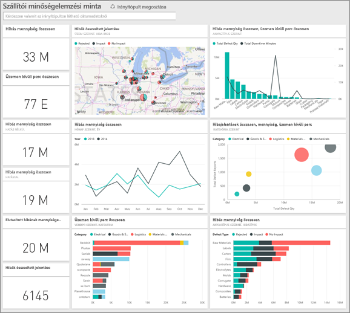

Ez a minta abba a sorozatba tartozik, amely a Power BI üzleti jellegű adatokkal, jelentésekkel, és irányítópultokkal történő használatát mutatja be. Az [obviEnce](http://www.obvience.com/) által lett létrehozva valós adatokkal, melyeket anonimizáltunk. Az adatok többféle formátumban: tartalomcsomagként, .pbix kiterjesztésű Power BI Desktop-fájlként és Excel-munkafüzetként is elérhetők. [Power BI-minták](sample-datasets.md) megtekintése. 

Ebben az oktatóanyagban a Power BI szolgáltatásban vizsgáljuk meg a Szállítói minőségelemzési minta tartalomcsomagot. Mivel azonban a jelentéssel való munka hasonló a Power BI Desktopban és a szolgáltatásban, a bemutatót akkor is követni tudja, ha a .pbix-mintafájlt a Power BI Desktopban használja. 

A minták Power BI Desktopban való vizsgálatához nincs szükség Power BI-licencre. Ha nem rendelkezik Power BI Pro-licenccel, a mintát a Saját munkaterületre mentheti a Power BI szolgáltatásban. 

## A minta beszerzése

Használat előtt a mintát [tartalomcsomagként](#get-the-content-pack-for-this-sample), [.pbix-fájlként](#get-the-pbix-file-for-this-sample) vagy [Excel-munkafüzetként](#get-the-excel-workbook-for-this-sample) le kell töltenie.

### Tartalomcsomag letöltése ehhez a mintához

1. Nyissa meg a Power BI szolgáltatást (app.powerbi.com), jelentkezzen be, majd nyissa meg azt a munkaterületet, ahol a mintát szeretné menteni.

   Ha nem rendelkezik Power BI Pro-licenccel, a mintát a Saját munkaterületre mentheti.

2. A bal alsó sarokban válassza az **Adatok lekérése** lehetőséget.
   
   
3. Ekkor megjelenik az **Adatok lekérése** lap. Itt válassza a **Minták** lehetőséget.
   
4. Válassza a **Szállítói minőségelemzési mintát**, majd a **Kapcsolódás** lehetőséget.  
   
   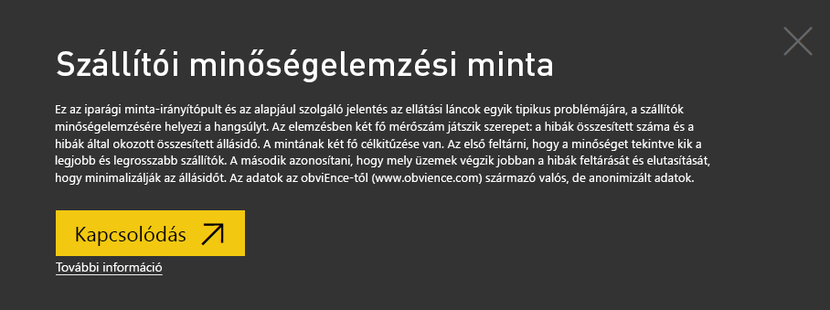

5. A Power BI importálja a tartalomcsomagot, és egy új irányítópultot, jelentést és adatkészletet ad hozzá az aktuális munkaterülethez.
   
   
  
### .pbix-fájl letöltése ehhez a mintához

A Szállítói minőségelemzési mintát a Power BI Desktoppal való használatra tervezett [.pbix-fájlként](https://download.microsoft.com/download/8/C/6/8C661638-C102-4C04-992E-9EA56A5D319B/Supplier-Quality-Analysis-Sample-PBIX.pbix) is letöltheti.

### Excel-munkafüzet letöltése ehhez a mintához

Ha a minta adatforrását is szeretné megtekinteni, használja az [Excel-munkafüzetként](https://go.microsoft.com/fwlink/?LinkId=529779) letölthető változatát. A munkafüzet megtekinthető és módosítható Power View-lapokat tartalmaz. A nyers adatok megtekintéséhez engedélyezze az Adatok Elemzése bővítményeket, majd válassza a **Power Pivot > Kezelés** lehetőséget. A Power View és a Power Pivot bővítmények engedélyezéséről az [Excel-minták vizsgálata az Excelben](sample-datasets.md#explore-excel-samples-inside-excel) című cikkben olvashat részletesen.

## Hibás anyagok által okozott állásidő
Nézzük meg a hibás anyagok által okozott állásidők elemzését, és hogy mely gyártók voltak a felelősek.  

1. Az irányítópulton válassza a **Total Defect Quantity** (Hibák összesített száma) vagy a **Total Downtime Minutes** (Állásidő összesített percei) csempét.

   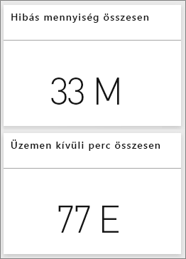  

   Ekkor megnyílik a Szállítói minőségelemzési minta jelentés **Downtime Analysis** (Állásidő elemzése) nevű oldala.

   Itt 33 millió hibás darabot láthatunk, ami összesen 77 000 percnyi állásidőt eredményez. Bár egyes anyagok között kevesebb a hibás darab, azonban ezek is okozhatnak késéseket, ami állásidőt eredményezhet. Vizsgáljuk meg ezeket az anyagokat a jelentés oldalon.  
2. Ha megnézzük, a **Defects and Downtime (min) by Material Type** (Hibák és állásidő (percben) anyagtípusok szerint) kombinált diagram **Total Downtime Minutes** (Állásidő összesített percei) sorát, akkor láthatjuk, hogy a hullámosított anyagok okozzák a leghosszabb állásidőket.  
3. Válassza ki a **Corrugate** (Hullámosított) oszlopot, hogy megnézhesse, mely üzemekre gyakorolja a legnagyobb negatív hatást, és hogy melyik gyártó a felelős.  

     
4. A **Downtime (min) by Plant** (Állásidő (percben) üzemek szerint) térképen válasszon ki önálló üzemeket, hogy megnézhesse, melyik gyártó vagy anyag felelős az adott üzem állásidejéért.

### Melyek a legrosszabb szállítók?
 Szeretnénk megtalálni a nyolc legrosszabb szállítót és meghatározni, hogy az állásidő hány százalékáért felelősek. Ezt úgy tehetjük meg, ha a **Downtime (min) by Vendor** (Állásidő (percben) gyártónként) területdiagramot egy fatérképre módosítjuk.  

1. A jelentés **Downtime Analysis** (Állásidő elemzése) nevű oldalán válassza a **Jelentés szerkesztése** lehetőséget a bal felső sarokban.  
2. Válassza ki a **Downtime (min) by Vendor** (Állásidő (percben) gyártónként) területdiagramot, majd a **Vizualizációk** ablaktáblán válassza a **Fatérkép** lehetőséget.  

   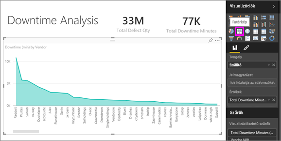  

    A fatérkép a **Vendor** (Gyártó) mezőt automatikusan a **Csoport** gyűjtőbe helyezi.  

    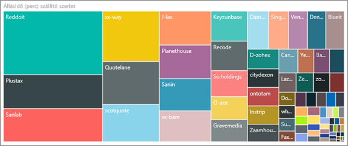  

   Ebben a fatérképben a nyolc legrosszabb gyártót a bal oldalon található nyolc blokk mutatja. Azt is láthatjuk, hogy ők felelősek az összes állásidő körülbelül 50%-áért.  
3. Az irányítópultra való visszatéréshez válassza a **Szállítói minőségelemzési minta** lehetőséget a felső navigációs panelen.

### Üzemek összehasonlítása
Most pedig nézzük meg, hogy mely üzemek találják meg és utasítják el hatékonyabban a hibás anyagokat, csökkentve ezzel az állásidőt.  

1. Az irányítópulton válassza a **Total Defect Reports by Plant, Defect Type** (Hibák összesített jelentése üzemek és hibatípusok szerint) térképcsempét.      

   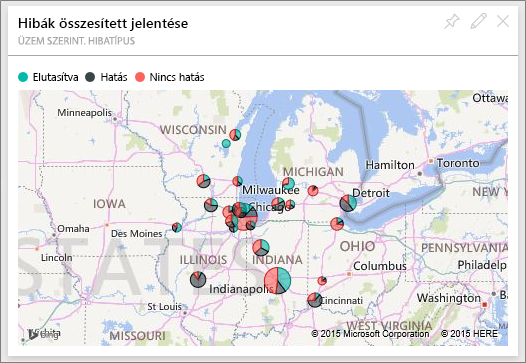  

   Ekkor megnyílik a jelentés **Supplier Quality Analysis** (Szállítói minőségelemzés) nevű oldala.  

2. A **Total Defect Reports by Plant, Defect Type** (Hibák összesített jelentése üzemek és hibatípusok szerint) jelmagyarázatában válassza ki a **Hatás** kört.  

    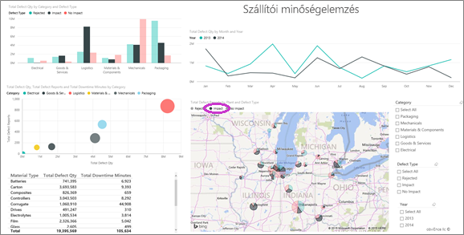  

    A buborékdiagramon megfigyelheti, hogy a legtöbb problémát okozó kategória a **Logisztika**. A hibák teljes mennyiségét, a hibajelentéseket és az állásidők perceit tekintve is ez a legnagyobb kategória. Vizsgáljuk meg alaposabban ezt a kategóriát.  
3. Válassza ki a **Logisztika** buborékját a buborékdiagramban, majd figyelje meg a Illinois állambeli Sprigfieldben és Naperville-ben található üzemeket. Naperville láthatóan jobban kezeli a hibás anyagokat, ugyanis sokszor elutasítja azokat, amelyek így csak kevésszer vannak rá negatív hatással, míg Springfield esetén nagyobb számú negatív hatást figyelhetünk meg.  

   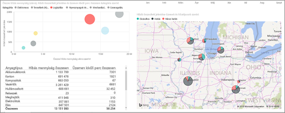  
4. Az irányítópultra való visszatéréshez válassza a **Szállítói minőségelemzési minta** lehetőséget a felső navigációs panelen.

## Melyik anyagot kezelik a legjobban?
Azokat az anyagokat kezelik a legjobban, amelyek a legkevesebb állásidőt okozzák, vagy amelyeknél a hibás anyagok – mennyiségüktől függetlenül – nincsenek negatív hatással.

1. Az irányítópulton nézze meg a **Total Defect Quantity by Material Type, Defect Type** (Hibák összesített száma anyagtípus és hibatípusok szerint) csempét.

   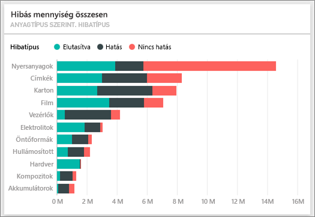

   Látható, hogy bár a **Raw Materials** (Nyersanyagok) esetében nagyon magas a hibák összes száma, azonban ezek többsége el lett utasítva vagy nem gyakorolt negatív hatást.

   Ellenőrizzük, hogy ez az anyagtípus a nagy mennyiségű hibás anyag ellenére nem okoz sok állásidőt.

2. Az irányítópulton nézze meg a **Total Defect Qty, Total Downtime Minutes by Material Type** (Hibák összesített száma, Állásidő összesített percei anyagtípusok szerint) csempét.

   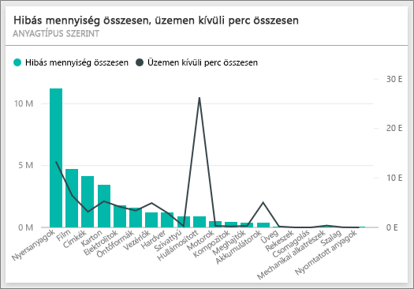

   A nyersanyagokat láthatóan jól kezelik: több közöttük a hibás, de kevesebb percnyi összes állásidőt okoznak.

### Hibák és állásidő összehasonlítása évek szerint
1. Válassza ki a **Total Defect Reports by Plant, Defect Type** (Hibák összesített jelentése üzemek és hibatípusok szerint) térképcsempét, hogy megnyissa a jelentés első, **Supplier Quality Analysis** (Szállítói minőségelemzés) nevű oldalát.
2. A **Total Defect Qty by Month and Year** (Hibás mennyiség összesen hónap és év szerint) diagramon láthatja, hogy a hibák száma magasabb 2014-ben, mint 2013-ban.  

    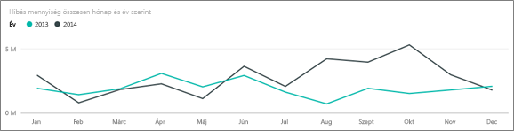  
3. Vajon a hibák megnövekedett száma több állásidőt is maga után von? Hogy ezt megtudjuk, feltehetünk egy kérdést a Q&A mezőben.  
4. Az irányítópultra való visszatéréshez válassza a **Szállítói minőségelemzési minta** lehetőséget a felső navigációs panelen.  
5. Mivel már tudjuk, hogy a nyersanyagok esetén a legmagasabb a hibák száma, írja be a kérdés mezőbe a *show material types, year and total defect qty* (mutassa az anyagtípusokat, az évet és a hibák összesített számát) kérdést.  

    Sokkal több hibás nyersanyag volt 2014-ben, mint 2013-ban.  

    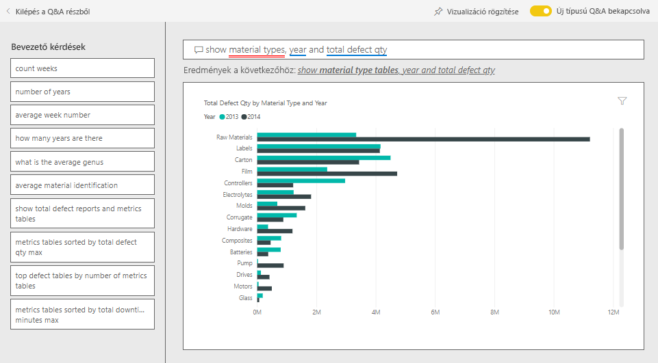  
6. Változtassa meg a kérdést a _show material types, year and total **downtime minutes**_ (mutassa az anyagtípusokat, az évet és az állásidő összesített perceit) kérdésre.  

   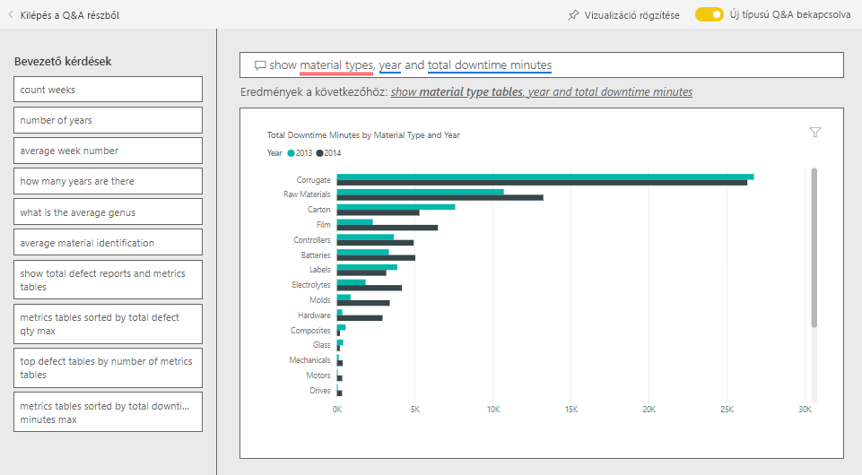

   Megfigyelheti, hogy a nyersanyagok által okozott állásidők nagyjából megegyeztek 2013-ban és 2014-ben, dacára annak, hogy 2014-ben sokkal több nyersanyag volt hibás. Úgy tűnik, hogy 2014-ben a hibás nyersanyagok megnövekedett száma nem vonta maga után a hibás nyersanyagok által okozott állásidő növekedését ebben az évben.

### Hibák és állásidő összehasonlítása hónapról hónapra
Nézzünk meg egy másik, szintén a hibák összesített számához kapcsolódó irányítópult-csempét.  

1. A bal felső sarokban válassza a **Kilépés a Q&A részből** lehetőséget az irányítópulthoz való visszatéréshez.  

    Tekintse meg alaposabban a **Total Defect Quantity by Month, Year** (Hibák összesített száma hónapok és évek szerint) csempét. Láthatja, hogy 2014 első felében hasonló mennyiségű hibás anyag volt, mint 2013-ban, azonban 2014 második felében a hibás anyagok száma jelentősen megnőtt.  

    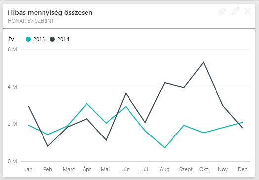  

    Nézzük meg, hogy ez maga után vont-e egy azonos mértékű növekedést az állásidő perceiben.  
2. Írja be a keresőmezőbe a *total downtime minutes by month and year as a line chart* (állásidő összesített percei, hónapok és évek szerint, vonaldiagramként) kérdést.  

   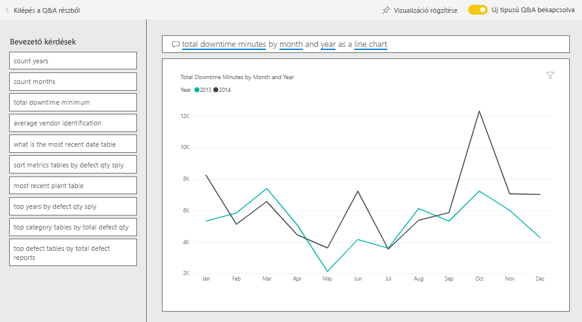

   Az állásidő perceinek júniusi és októberi ugrásszerű növekedésén kívül a hibák száma nem eredményezett jelentős növekedést az állásidőben. Ez azt mutatja, hogy jól kezeljük a hibás anyagokat.  
3. A diagram irányítópultra való kitűzéséhez válassza a gombostű ikont  a kérdésmező fölött.  
4. A kiugró hónapok vizsgálatához tegyen fel különböző kérdéseket, például a *total downtime minutes in October by plant*(állásidő összesített percei októberben üzemek szerint) kérdést, hogy megnézze az októberi állásidő perceit anyagtípusok szerint, az üzemek helyszíne szerint, kategória szerint stb. 
5. A bal felső sarokban válassza a **Kilépés a Q&A részből** lehetőséget az irányítópulthoz való visszatéréshez.

## További lépések: Csatlakozás az adatokhoz
Ezzel a környezettel biztonságosan kísérletezhet, mert dönthet úgy, hogy nem menti a módosításokat. De ha mégis mentené őket, bármikor lekérheti a minta egy új másolatát az **Adatok lekérése** lehetőség választásával.

Reméljük, hogy ez a bemutató segített megérteni a mintaadatok Power BI irányítópultok, Q&A és jelentések segítségével történő elemzését. Most Önön a sor – kapcsolódjon a saját adataihoz. A Power BI használatával számos különböző adatforráshoz kapcsolódhat. További információ: [Első lépések a Power BI szolgáltatásban](service-get-started.md).
