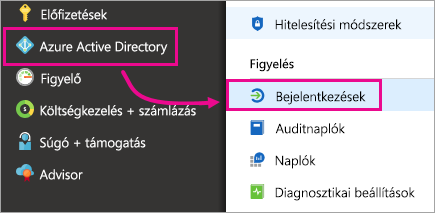
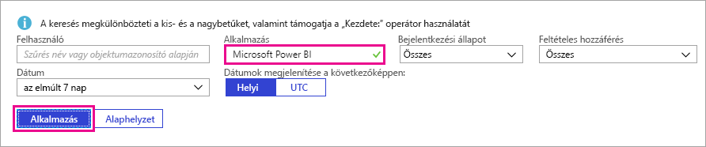

# Bejelentkezett Power BI-felhasználók keresése

Ha Ön Bérlői rendszergazda, és szeretné megtekinteni a Power bi-ba, használati bejelentkezett felhasználók listáját a [Azure Active Directory hozzáférési és használati jelentések](/azure/active-directory/reports-monitoring/concept-sign-ins) számára.

<iframe width="640" height="360" src="https://www.youtube.com/embed/1AVgh9w9VM8?showinfo=0" frameborder="0" allowfullscreen></iframe>

> [!NOTE]
> A **bejelentkezések** a jelentésben a hasznos adatok, de azt nem azonosítja a minden felhasználó rendelkezik licenccel. A licencek megtekintésére a Microsoft 365 Felügyeleti központját használhatja.

## Követelmények

A saját bejelentkezéseit bármely felhasználó (nem rendszergazda is) megtekintheti, de az összes felhasználóra vonatkozó jelentés megtekintése csak a következő feltételekkel lehetséges.

* A bérlőnek rendelkeznie kell egy hozzá társított Azure Active Directory Premium-licencet.

* A következő szerepkörök egyikével kell rendelkeznie: Globális rendszergazda, biztonsági rendszergazda, biztonsági olvasó.

## Bejelentkezések megtekintése az Azure-portállal

A bejelentkezési tevékenység megtekintéséhez kövesse az alábbi lépéseket.

1. Az **Azure Portalon** válassza az **Azure Active Directory** lehetőséget.

1. A **Figyelés** területen kattintson a **Bejelentkezések** elemre.
   
    

1. Szűrjön a kívánt alkalmazásra a **Microsoft Power BI** vagy a **Power BI Gateway** lehetőség választásával, majd kattintson az **Alkalmaz** elemre.

    **A Microsoft Power BI** bejelentkezési tevékenységeket, hogy a szolgáltatáshoz kapcsolódó, mivel a **Power BI Gateway** szűrőket a bejelentkezési tevékenységre jellemző a helyszíni adatátjáró.
   
    

## Az adatok exportálása

Is [bejelentkezési jelentés letöltése](/azure/active-directory/reports-monitoring/quickstart-download-sign-in-report) két formátumok egyikével: CSV-fájl, vagy egy JSON-fájlt.

Felső részén a **bejelentkezések** jelentésben válassza **letöltése** , majd válassza ki az alábbi lehetőségek közül:

* **Fürt megosztott kötetei szolgáltatás** töltheti le a szűrt adatokat egy CSV-fájlban.

* **JSON** a szűrt adatokat egy JSON-fájl letöltéséhez.

## Adatmegőrzés

A bejelentkezéshez kapcsolódó adatok legfeljebb 30 napig érhetők el. További információ: [Azure Active Directory-jelentések adatmegőrzési szabályzatában](/azure/active-directory/reports-monitoring/reference-reports-data-retention).

## Következő lépések

[Naplózás használata a cégnél](service-admin-auditing.md)

További kérdései vannak? [Kérdezze meg a Power BI közösségét](https://community.powerbi.com/)