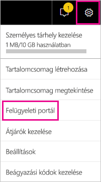
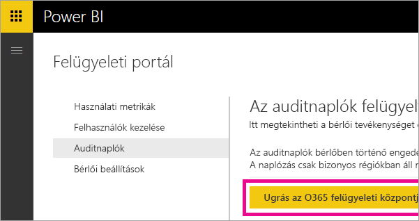
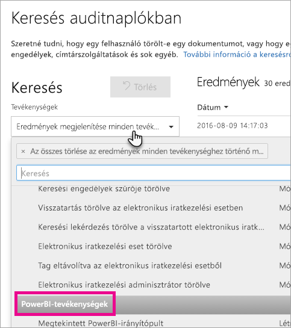
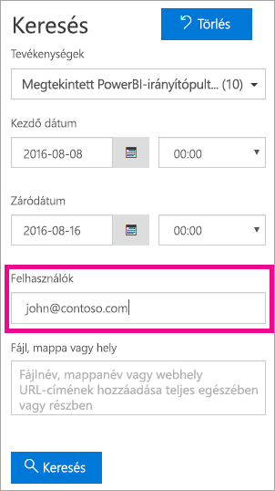
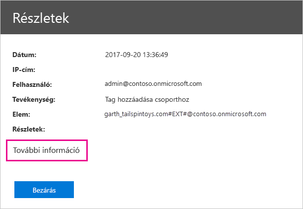
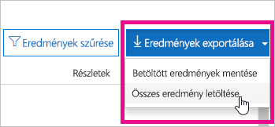

# <a name="use-auditing-within-your-organization"></a>Naplózás használata a cégnél

Ha tisztában van azzal, hogy a Power BI-bérlőn ki, milyen műveletet és mely elemeken végez el, sokat segíthet a munkahelyének a követelményeknek (például a jogszabályi követelményeknek és a rekordkezelésnek) való megfelelésben. A Power BI naplózási funkcióját a felhasználók által végzett műveletek, például a „Jelentés megtekintése” vagy az „Irányítópult megtekintése” naplózására használhatja. Nem használhatja a naplózást engedélyek naplózására.

A naplózással kapcsolatos munkát az Office 365 Biztonsági és megfelelőségi központjában, vagy a PowerShell használatával végezheti el. A naplózás az Exchange Online funkcióin alapul, amelynek automatikusan megtörténik a kiépítése a Power BI támogatásához.

A naplózási adatokat dátumtartomány, felhasználó, irányítópult, jelentés, adathalmaz és tevékenységtípus szerint szűrheti. A tevékenységeket le is töltheti egy CSV-fájlban (vesszővel tagolt szövegfájl), és offline elemezheti.

## <a name="requirements"></a>Követelmények

Az auditnaplók eléréséhez az alábbi követelményeknek kell megfelelnie:

* Az auditnapló eléréséhez globális rendszergazdának kell lennie, vagy az auditnaplók vagy auditnaplók (csak megtekintés) szerepkör tagjának kell lennie az Exchange Online-ban. Alapértelmezés szerint ezek a szerepkörök hozzá vannak rendelve a megfelelőség kezelése és a szervezet kezelése szerepkörcsoporthoz az Exchange felügyeleti központjának **Engedélyek** oldalán.

    Ha nem rendszergazdai fiókoknak hozzáférést szeretne adni az auditnaplóhoz, akkor fel kell vennie a felhasználót ezeknek a szerepkörcsoportoknak az egyikébe. Másik lehetőségként létrehozhat egy egyéni szerepkörcsoportot az Exchange felügyeleti központjában, hozzárendelheti az auditnaplók vagy auditnaplók (csak megtekintés) szerepkört ehhez a csoporthoz, majd felveheti a nem rendszergazdai fiókot az új szerepkörcsoportba. További információ: [Szerepkörcsoportok kezelése az Exchange Online-ban](/Exchange/permissions-exo/role-groups).

    Ha a Microsoft 365 Felügyeleti központjából nem éri el az Exchange felügyeleti központját, lépjen a https://outlook.office365.com/ecp weblapra, és jelentkezzen be a hitelesítő adataival.

* Ha rendelkezik hozzáféréssel az auditnaplóhoz, de nem globális rendszergazda vagy a Power BI szolgáltatás rendszergazdája, nem fér hozzá a Power BI felügyeleti portáljához. Ebben az esetben az [Office 365 Biztonsági és megfelelőségi központra](https://sip.protection.office.com/#/unifiedauditlog) mutató közvetlen hivatkozást kell használnia.

## <a name="access-your-audit-logs"></a>Az auditnaplók elérése

Naplókhoz csak akkor fér hozzá, ha a naplózás engedélyezve van a Power BI-ban. További információt a felügyeleti portál dokumentációjának [Auditnaplók](service-admin-portal.md#audit-logs) című szakaszában talál. Akár 48 órás késés is lehet a naplózás engedélyezése és a naplózási adatok megtekinthetővé válása között. Ha nem látja azonnal adatokat, ellenőrizze később az auditnaplókat. Hasonló késés lehet az auditnaplók megtekintési engedélyének megkapása és a naplók elérésének lehetővé válása között.

A Power BI auditnaplói közvetlenül az [Office 365 Biztonsági és megfelelőségi központon](https://sip.protection.office.com/#/unifiedauditlog) keresztül érhetők el. A Power BI felügyeleti portálon is talál egy oda mutató hivatkozást:

1. A Power BI-ban válassza jobb felső sarokban található **fogaskerékikont**, majd a **Felügyeleti portál** lehetőséget.

   

1. Válassza a **Naplók** lehetőséget.

1. Válassza az **Ugrás az O365 felügyeleti központjára** lehetőséget.

   

## <a name="search-only-power-bi-activities"></a>Keresés csak Power BI-tevékenységek között

A keresési eredményeket az alábbi lépésekkel korlátozhatja kizárólag Power BI-tevékenységekre. A tevékenységek listáját a cikk későbbi, [A Power BI által naplózott tevékenységek listája](#activities-audited-by-power-bi) című szakaszában találja meg.

1. A **Naplókeresés** lapon válassza a **Keresés** lehetőség alatti **Tevékenységek** elem legördülő menüjét.

2. Válassza a **Power BI-tevékenységek** lehetőséget.

   

3. A mező bezárásához kattintson bárhová a mezőn kívül.

A keresések csak Power BI-tevékenységeket adnak vissza.

## <a name="search-the-audit-logs-by-date"></a>Naplók keresése dátum szerint

A naplók között kereshet dátumtartomány szerint a **Kezdő dátum** és a **Záró dátum** mezőkkel. Az alapértelmezett kijelölés az elmúlt 7 nap. A dátum és az idő az Egyezményes világidő (UTC) formátumában jelenik meg. A megadható maximális dátumtartomány 90 nap. 

Ha a kijelölt dátumtartomány nagyobb 90 napnál, hibaüzenet jelenik meg. Ha a maximális értéket (90 napot) adta meg, **kezdődátumnak** a jelenlegi időt írja be. Ellenkező esetben hibaüzenet jelenik meg, mely szerint a kezdő dátum korábban van a záró dátumnál. Ha az elmúlt 90 napban kapcsolta be a naplózást, a dátumtartomány nem kezdődhet a naplózás bekapcsolásának napja előtt.


## <a name="search-the-audit-logs-by-users"></a>Naplók keresése felhasználók szerint

A naplóbejegyzések között kereshet adott felhasználók által elvégzett tevékenységeket. Írjon be egy vagy több felhasználónevet a **Felhasználók** mezőbe. A felhasználónév olyan, mint egy e-mail-cím. Ez az a fiók, amellyel a felhasználók bejelentkeznek a Power BI-ba. Ha a szervezet minden felhasználójáról (és szolgáltatásfiókjáról) szeretne eredményt kapni, hagyja üresen a mezőt.



## <a name="view-search-results"></a>Keresési eredmények megtekintése

A **Keresés** kiválasztása után betöltődnek a keresési eredmények. Néhány pillanat múlva megjelennek az **Eredmények** területen. A keresés végén a kijelzőn megjelenik az eredmények száma. Az **Auditnaplók keresése** legfeljebb 1000 eseményt jelenít meg. Ha 1000-nél több esemény felel meg a keresési feltételeknek, az alkalmazás az 1000 legutóbbi eseményt jeleníti meg.

### <a name="view-the-main-results"></a>A fő találatok megtekintése

Az **Eredmények** terület az alábbi adatokat tartalmazza a keresés által visszaadott egyes eseményekről. Kattintson az **Eredmények** terület egyik oszlopfejlécére az eredmények rendezéséhez.

| **Oszlop** | **Definíció** |
| --- | --- |
| Dátum |Az esemény dátuma és időpontja (UTC formátumban). |
| IP-cím |A naplózott tevékenységhez használt eszköz IP-címe. Az alkalmazás IPv4 vagy IPv6 formátumban jeleníti meg az IP-címet. |
| Felhasználó |Az eseményt előidéző műveletet végrehajtó felhasználó (vagy szolgáltatásfiók). |
| Tevékenység |A felhasználó által végrehajtott tevékenység. Ez az érték megfelel a **Tevékenységek** legördülő menüben kiválasztott tevékenységeknek. Az Exchange felügyeleti naplójának eseményei esetén ez az érték egy Exchange-parancsmag. |
| Item |A megfelelő tevékenység következtében létrehozott vagy módosított objektum. Ez lehet például a megtekintett vagy módosított fájl, vagy a módosított felhasználói fiók. Nem minden tevékenységhez jelenik meg érték ebben az oszlopban. |
| Részlet |A tevékenységek további részletei. Itt sem minden tevékenységhez tartozik érték. |

### <a name="view-the-details-for-an-event"></a>Az esemény részleteinek megtekintése

Ha további részletekre kíváncsi egy eseménnyel kapcsolatban, válassza az esemény rekordját a keresési eredmények listájában. Ekkor megjelenik a **Részletek** oldal, rajta az eseményrekord részletes tulajdonságaival. A **Részletek** oldalon attól függően jelennek meg tulajdonságok, hogy melyik Office 365-szolgáltatásban történik az esemény.

Ezeknek a részleteknek a megjelenítéséhez válassza a **További információ** lehetőséget. Minden Power BI-bejegyzés RecordType tulajdonságának értéke 20. Más tulajdonságokkal kapcsolatban a [Tulajdonságok részletei az auditnaplóban](/office365/securitycompliance/detailed-properties-in-the-office-365-audit-log/) című szakasz tartalmaz további információkat.

   

## <a name="export-search-results"></a>Keresési eredmények exportálása

A Power BI-naplót a következő lépésekkel exportálhatja CSV-fájlba.

1. Válassza az **Eredmények exportálása** lehetőséget.

1. Válassza a **Betöltött eredmények mentése** vagy **Az összes eredmény letöltése** lehetőséget.

    

## <a name="use-powershell-to-search-audit-logs"></a>Keresés auditnaplókban a PowerShell használatával

A naplókhoz a bejelentkezésétől függően PowerShell-lel is hozzáférhet. Az alábbi példa azt mutatja be, hogyan csatlakozhat az Exchange Online PowerShellhez, majd használhatja a [Search-UnifiedAuditLog](/powershell/module/exchange/policy-and-compliance-audit/search-unifiedauditlog?view=exchange-ps/) parancsot a Power BI auditnapló-bejegyzéseinek lekérésére. A szkript futtatásához egy rendszergazdának kell megadnia a megfelelő engedélyeket, amint az a [Követelmények](#requirements) szakaszban szerepel.

```powershell
Set-ExecutionPolicy RemoteSigned

$UserCredential = Get-Credential

$Session = New-PSSession -ConfigurationName Microsoft.Exchange -ConnectionUri https://outlook.office365.com/powershell-liveid/ -Credential $UserCredential -Authentication Basic -AllowRedirection

Import-PSSession $Session
Search-UnifiedAuditLog -StartDate 9/11/2018 -EndDate 9/15/2018 -RecordType PowerBI -ResultSize 1000 | Format-Table | More
```

## <a name="use-powershell-to-export-audit-logs"></a>Auditnaplók exportálása a PowerShell használatával

Az auditnapló-keresési eredményeket a PowerShell használatával is exportálhatja. Az alábbi példa a [Search-UnifiedAuditLog](/powershell/module/exchange/policy-and-compliance-audit/search-unifiedauditlog?view=exchange-ps/) parancsból végzett küldést és az eredménynek az [Export-Csv](/powershell/module/microsoft.powershell.utility/export-csv) parancsmag használatával végzett exportálását mutatja be. A szkript futtatásához egy rendszergazdának kell megadnia a megfelelő engedélyeket, amint az a [Követelmények](#requirements) szakaszban szerepel.

```powershell
$UserCredential = Get-Credential

$Session = New-PSSession -ConfigurationName Microsoft.Exchange -ConnectionUri https://outlook.office365.com/powershell-liveid/ -Credential $UserCredential -Authentication Basic -AllowRedirection

Import-PSSession $Session
Search-UnifiedAuditLog -StartDate 9/11/2019 -EndDate 9/15/2019 -RecordType PowerBI -ResultSize 5000 |
Export-Csv -Path "c:\temp\PowerBIAuditLog.csv" -NoTypeInformation

Remove-PSSession $Session
```

További információ az Exchange Online-hoz való csatlakozásról: [Csatlakozás az Exchange Online-hoz a PowerShell-lel](/powershell/exchange/exchange-online/connect-to-exchange-online-powershell/connect-to-exchange-online-powershell/). Egy másik példát a PowerShell auditnaplókkal való használatára a [Power BI Pro-licencek hozzárendelése a Power BI naplóival és a PowerShell-lel](https://powerbi.microsoft.com/blog/using-power-bi-audit-log-and-powershell-to-assign-power-bi-pro-licenses/) című cikkben talál.

## <a name="activities-audited-by-power-bi"></a>A Power BI által naplózott tevékenységek

A Power BI az alábbi tevékenységeket naplózza:

| Felhasználóbarát név                                     | Művelet neve                              | Megjegyzések                                  |
|---------------------------------------------------|---------------------------------------------|------------------------------------------|
| Adatforrás hozzáadása Power BI-átjáróhoz             | AddDatasourceToGateway (Adatforrás hozzáadása átjáróhoz)                      |                                          |
| Power BI-mappahozzáférés hozzáadása                      | AddFolderAccess                             | Jelenleg nem használt                       |
| Power BI-csoporttagok hozzáadása                      | AddGroupMembers (Csoporttagok hozzáadása)                             |                                          |
| Egy rendszergazda adatfolyam-tárfiókot csatolt egy bérlőhöz | AdminAttachedDataflowStorageAccountToTenant | Jelenleg nem használt                       |
| Power BI-adatkészlet elemezve                         | AnalyzedByExternalApplication (Külső alkalmazásban elemezve)               |                                          |
| Power BI-jelentés elemzése                          | AnalyzeInExcel (Elemzés az Excelben)                              |                                          |
| Adatfolyam-tárfiók csatolva                 | AttachedDataflowStorageAccount (Adatfolyam-tárfiók csatolva)              |                                          |
| Power BI-adatkészlet kötése egy átjáróhoz                | BindToGateway (Kötés átjáróhoz)                               |                                          |
| Adatfolyam-frissítés megszakítva                        | CancelDataflowRefresh (Adatfolyam-frissítés megszakítva)                       |                                          |
| Kapacitásállapot módosítása                            | ChangeCapacityState (Kapacitásállapot módosítása)                         |                                          |
| Kapacitás felhasználó-hozzárendelésének módosítása                  | UpdateCapacityUsersAssignment (Felhasználói hozzárendelések a kapacitásban)               |                                          |
| Power BI-adathalmaz-kapcsolatok módosítása              | SetAllConnections (Az összes kapcsolat beállítása)                           |                                          |
| Power BI-átjáró rendszergazdái módosítva                   | ChangeGatewayAdministrators (Átjáró-rendszergazdák módosítása)                 |                                          |
| A Power BI-átjáró adatforrásának felhasználói módosultak        | ChangeGatewayDatasourceUsers (Átjáróadatforrás-felhasználók módosítása)                |                                          |
| Vállalati Power BI-tartalomcsomag létrehozása      | CreateOrgApp (Szervezeti alkalmazás létrehozása)                                |                                          |
| Power BI-alkalmazás létrehozása                              | CreateApp (Alkalmazás létrehozása)                                   |                                          |
| Power BI-irányítópult létrehozása                        | CreateDashboard (Irányítópult létrehozása)                             |                                          |
| Power BI-adatfolyam létrehozása                         | CreateDataflow (Adatfolyam létrehozása)                              |                                          |
| Power BI-adathalmaz létrehozása                          | CreateDataset (Adatkészlet létrehozása)                               |                                          |
| Power BI e-mail-feliratkozás létrehozása               | CreateEmailSubscription (E-mail-feliratkozás létrehozása)                     |                                          |
| Power BI-mappa létrehozása                           | CreateFolder (Mappa létrehozása)                                |                                          |
| Power BI-átjáró létrehozva                          | CreateGateway (Átjáró létrehozása)                               |                                          |
| Power BI-csoport létrehozása                            | CreateGroup (Csoport létrehozása)                                 |                                          |
| Power BI-jelentés létrehozása                           | CreateReport (Jelentés létrehozása)                                |                                          |
| Adatfolyam migrálása külső tárfiókba     | DataflowMigratedToExternalStorageAccount    | Jelenleg nem használt                       |
| Adatfolyam-engedélyek hozzáadása                        | DataflowPermissionsAdded                    | Jelenleg nem használt                       |
| Adatfolyam-engedélyek eltávolítása                      | DataflowPermissionsRemoved                  | Jelenleg nem használt                       |
| Vállalati Power BI-tartalomcsomag törlése      | DeleteOrgApp (Szervezeti alkalmazás törlése)                                |                                          |
| Power BI-megjegyzés törlése                          | DeleteComment (Megjegyzés törlése)                               |                                          |
| Power BI-irányítópult törlése                        | DeleteDashboard (Irányítópult törlése)                             | Jelenleg nem használt                       |
| Power BI-adatfolyam törlése                         | DeleteDataflow (Adatfolyam törlése)                              | Jelenleg nem használt                       |
| Power BI-adathalmaz törlése                          | DeleteDataset (Adatkészlet törlése)                               |                                          |
| Power BI e-mail-feliratkozás törlése               | DeleteEmailSubscription (E-mail-feliratkozás törlése)                     |                                          |
| Power BI-mappa törlése                           | DeleteFolder (Mappa törlése)                                |                                          |
| Power BI-mappahozzáférés törlése                    | DeleteFolderAccess                          | Jelenleg nem használt                       |
| Power BI-átjáró törölve                          | DeleteGateway (Átjáró törlése)                               |                                          |
| Power BI-csoport törlése                            | DeleteGroup (Csoport törlése)                                 |                                          |
| Power BI-jelentés törlése                           | DeleteReport (Jelentés törlése)                                |                                          |
| Power BI-adathalmaz adatforrásainak felderítése          | GetDatasources (Adatforrások beszerzése)                              |                                          |
| Letöltött Power BI-jelentés                        | DownloadReport (Jelentés letöltése)                              |                                          |
| Adatfolyam tulajdonságai szerkesztve                        | EditDataflowProperties (Adatfolyam tulajdonságainak szerkesztése)                      |                                          |
| Power BI tanúsítási engedélyek szerkesztése          | EditCertificationPermission                 | Jelenleg nem használt                       |
| Power BI-irányítópult szerkesztése                         | EditDashboard (Irányítópult szerkesztése)                               | Jelenleg nem használt                       |
| Power BI-adathalmaz szerkesztése                           | EditDataset (Adatkészlet szerkesztése)                                 |                                          |
| Power BI-adathalmaz tulajdonságainak szerkesztése                | EditDatasetProperties                       | Jelenleg nem használt                       |
| Power BI-jelentés szerkesztése                            | EditReport (Jelentése szerkesztése)                                  |                                          |
| Power BI-adatfolyam exportálása                        | ExportDataflow (Adatfolyam exportálása)                              |                                          |
| Power BI-jelentés vizualizációs adatainak exportálása              | ExportReport (Jelentés exportálása)                                |                                          |
| Power BI-csempeadatok exportálása                       | ExportTile (Csempe exportálása)                                  |                                          |
| Adatfolyam-engedélyek sikertelen hozzáadása                | FailedToAddDataflowPermissions              | Jelenleg nem használt                       |
| Adatfolyam-engedélyek sikertelen eltávolítása             | FailedToRemoveDataflowPermissions           | Jelenleg nem használt                       |
| Power BI-adatfolyam SAS-jogkivonatának generálása             | GenerateDataflowSasToken (Adatfolyam-SAS-token generálása)                    |                                          |
| Beágyazott Power BI-token generálása                    | GenerateEmbedToken (Beágyazott token generálása)                          |                                          |
| Fájl importálása a Power BI-ba                         | Importálás                                      |                                          |
| Power BI-alkalmazás telepítése                            | InstallApp (Alkalmazás telepítése)                                  |                                          |
| Munkaterület kapacitásba migrálása                  | MigrateWorkspaceIntoCapacity (Munkaterület migrálása kapacitásba)                |                                          |
| Power BI-megjegyzés közzététele                           | PostComment (Megjegyzés közzététele)                                 |                                          |
| Power BI-irányítópult nyomtatása                        | PrintDashboard (Irányítópult nyomtatása)                              |                                          |
| Power BI-jelentésoldal nyomtatása                      | PrintReport (Jelentés nyomtatása)                                 |                                          |
| Power BI-jelentés webes közzététele                  | PublishToWebReport (Jelentés közzététele a weben)                          |                                          |
| Power BI-adatfolyam titkos kódjának fogadása a Key Vaultból  | ReceiveDataflowSecretFromKeyVault           |                                          |
| Adatforrás törölve a Power BI-átjáróból         | RemoveDatasourceFromGateway (Adatforrás eltávolítása átjáróból)                 |                                          |
| Power BI-csoporttagok eltávolítása                    | DeleteGroupMembers (Csoporttagok törlése)                          |                                          |
| Munkaterület eltávolítása kapacitásból                 | RemoveWorkspacesFromCapacity (Munkaterületek eltávolítása kapacitásból)                |                                          |
| Power BI-irányítópult átnevezése                        | RenameDashboard (Irányítópult átnevezése)                             |                                          |
| Power BI-adatfolyam frissítésének kérése               | RequestDataflowRefresh                      | Jelenleg nem használt                       |
| Power BI-adathalmaz frissítésének kérése                | RefreshDataset (Adatkészlet frissítése)                              |                                          |
| Power BI-munkaterületek fogadása                     | GetWorkspaces                               |                                          |
| Munkaterület adatfolyam-tárolási helyének beállítása     | SetDataflowStorageLocationForWorkspace (Munkaterület adatfolyam-tárolási helyének beállítása)      |                                          |
| Power BI-adatfolyam ütemezett frissítésének beállítása        | SetScheduledRefreshOnDataflow (Adatfolyam ütemezett frissítésének beállítása)               |                                          |
| Power BI-adathalmaz ütemezett frissítésének beállítása         | SetScheduledRefresh (Ütemezett frissítés beállítása)                         |                                          |
| Power BI-irányítópult megosztása                         | ShareDashboard (Irányítópult megosztása)                              |                                          |
| Power BI-jelentés megosztása                            | ShareReport (Jelentés megosztása)                                 |                                          |
| Megkezdett Power BI-próbaidőszak (kiterjesztett)                   | OptInForExtendedProTrial                    | Jelenleg nem használt                       |
| Power BI-próbaidőszak megkezdése                            | OptInForProTrial (Regisztráció a Pro csomag próbaverziójára)                            |                                          |
| Power BI-adatforrás átvétele                   | TakeOverDatasource (Adatforrás átvétele)                          |                                          |
| Power BI-adathalmaz átvétele                        | TakeOverDataset (Adatkészlet átvétele)                             |                                          |
| Power BI-adatfolyam átvéve                     | TookOverDataflow (Adatfolyam átvéve)                             |                                          |
| Közzé nem tett Power BI-alkalmazás                          | UnpublishApp (Alkalmazás közzétételének visszavonása)                                |                                          |
| Kapacitásforrás szabályozási beállításainak frissítése      | UpdateCapacityResourceGovernanceSettings (Kapacitásforrás szabályozási beállításai)    | Jelenleg nem a Microsoft 365 Felügyeleti központjában van |
| Kapacitás-rendszergazda frissítése                            | UpdateCapacityAdmins (Kapacitás-rendszergazdák frissítése)                        |                                          |
| Kapacitás megjelenített nevének frissítése                     | UpdateCapacityDisplayName (Kapacitás megjelenített neve)                   |                                          |
| Adatfolyamtár-hozzárendelési engedélyek frissítve   | UpdatedDataflowStorageAssignmentPermissions (Adatfolyamtár-hozzárendelési engedélyek frissítve) |                                          |
| Vállalati Power BI-beállítások frissítése          | UpdatedAdminFeatureSwitch (Frissített rendszergazdai funkciókapcsoló)                   |                                          |
| Power BI-alkalmazás frissítése                              | UpdateApp (Alkalmazás frissítése)                                   |                                          |
| Power BI-adatfolyam frissítése                         | UpdateDataflow (Adatfolyam frissítése)                              |                                          |
| Power BI-adathalmaz adatforrásainak frissítése             | UpdateDatasources (Adatforrások frissítése)                           |                                          |
| Power BI-adathalmaz paramétereinek frissítése               | UpdateDatasetParameters (Adatkészlet-paraméterek frissítése)                     |                                          |
| Power BI e-mail-feliratkozás frissítése               | UpdateEmailSubscription (E-mail-feliratkozás frissítése)                     |                                          |
| Power BI-mappa frissítése                           | UpdateFolder (Mappa frissítése)                                |                                          |
| Power BI-mappahozzáférés frissítése                    | UpdateFolderAccess (Mappahozzáférés frissítése)                          |                                          |
| Power BI-átjáró adatforráshoz tartozó hitelesítő adatainak frissítése  | UpdateDatasourceCredentials (Adatforrás hitelesítő adatainak frissítése)                 |                                          |
| Power BI-irányítópult megtekintése                         | ViewDashboard (Irányítópult megtekintése)                               |                                          |
| Power BI-adatfolyam megtekintése                          | ViewDataflow (Adatfolyam megtekintése)                                |                                          |
| Power BI-jelentés megtekintése                            | ViewReport (Jelentés megtekintése)                                  |                                          |
| Power BI-csempe megtekintése                              | ViewTile (Csempe megtekintése)                                    |                                          |
| Power BI-használati metrikák megtekintése                     | ViewUsageMetrics (Használati metrikák megtekintése)                            |                                          |
|                                                   |                                             |                                          |

## <a name="next-steps"></a>Következő lépések

[Mit jelent a Power BI-felügyelet?](service-admin-administering-power-bi-in-your-organization.md)  

[Power BI Felügyeleti portál](service-admin-portal.md)  

További kérdései vannak? [Kérdezze meg a Power BI közösségét](https://community.powerbi.com/)
