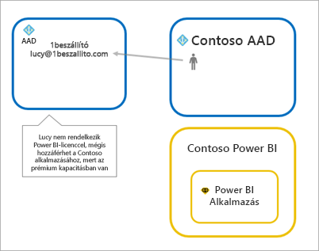
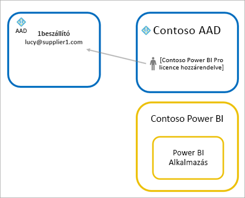
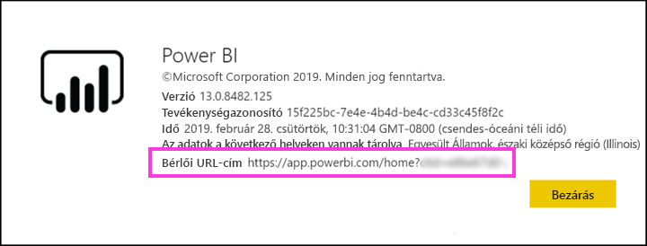

# Power BI tartalmak terjesztése Azure AD B2B külső vendégfelhasználóknak

A Power BI integrálható az Azure Active Directory vállalatközi felhasználásra szánt verziójával (Azure AD B2B), ami lehetővé teszi, hogy a Power BI-tartalmakat a szervezeten kívüli vendégfelhasználókkal is biztonságosan meg tudja osztani, úgy, hogy közben teljes mértékben szabályozza a belső adatok felhasználását.  

Emellett engedélyezheti külső vendégfelhasználóknak, hogy szerkesszék és kezeljék a szervezeti tartalmakat.

## Hozzáférés engedélyezése

Vendégfelhasználók meghívása előtt mindenképpen engedélyezze a [Tartalom megosztása külső felhasználókkal](service-admin-portal.md#export-and-sharing-settings) funkciót a Power BI felügyeleti portálján.

Használhatja az [Annak engedélyezése, hogy külső vendégfelhasználók is szerkeszthessék és kezelhessék a szervezeti tartalmakat](service-admin-portal.md#allow-external-guest-users-to-edit-and-manage-content-in-the-organization) funkciót is. Ezzel kijelölheti azokat a vendégfelhasználókat, akik megtekinthetnek és létrehozhatnak tartalmat a munkaterületeken, beleértve a vállalati Power BI tallózását.

## Kit lehet meghívni?

Bármilyen e-mail-címet, akár olyan személyes fiókot használó vendégfelhasználókat is meghívhat, mint a gmail.com, az outlook.com és a hotmail.com. Az Azure AD B2B szóhasználatával ezek a *közösségi identitások*.

## Vendégfelhasználók meghívása

A vendégfelhasználóknak csak az első alkalommal van szükségük meghívóra, amikor meghívják őket a vállalathoz. Kétféleképpen hívhat meg felhasználót: tervezett meghívással vagy alkalmi meghívással.

### Tervezett meghívások

Abban az esetben válassza a tervezett meghívási módot, ha már tudja, mely felhasználókat szeretné meghívni. Meghívót az Azure Portal vagy a PowerShell használatával küldhet. A meghíváshoz bérlői rendszergazdának kell lennie.

Meghívó az Azure Portalon való küldéséhez kövesse az alábbi lépéseket.

1. Az [Azure Portalon](https://portal.azure.com) válassza az **Azure Active Directory** lehetőséget.

1. A **Kezelés** szakaszban válassza a **Felhasználók** > **Minden felhasználó** > **Új vendégfelhasználó** elemet.

    

1. Adja meg az **e-mail-címet** és egy **személyes üzenetet**.

    

1. Kattintson a **Meghívás** lehetőségre.

Ha egynél több vendéget szeretne meghívni, használja a PowerShellt. Ha további információra van szüksége, tekintse át az [Azure AD B2B együttműködési kódmintát és PowerShell-példákat](/azure/active-directory/b2b/code-samples/) tartalmazó cikket.

A vendégfelhasználónak az e-mailben kapott meghívóban rá kell majd kattintania az **Első lépések** (Get Started) lehetőségre. A rendszer ezután hozzá fogja adni a vendégfelhasználót a bérlőhöz.

### Alkalmi meghívás

Külső felhasználó meghívásához bármikor hozzáadhatja őt az irányítópultjához vagy jelentéséhez a megosztási felületen, illetve az alkalmazásához a hozzáférési lapon. Az alábbi példán látható, hogy mi a teendő, amikor külső felhasználót hív meg egy alkalmazás használatára.

A vendégfelhasználó e-mailt fog kapni, amely tudatja, hogy Ön megosztotta vele az alkalmazást.

A vendégfelhasználónak a céges e-mail-címével kell bejelentkeznie. Bejelentkezés után a rendszer kérni fogja a meghívó elfogadását. Bejelentkezés után az alkalmazás megnyílik a vendégfelhasználó számára. Ahhoz, hogy később visszaléphessen az alkalmazásba, könyvjelzőzheti a hivatkozást vagy elmentheti az e-mailt.

## Licencelés

A vendégfelhasználónak megfelelő licenccel kell rendelkeznie ahhoz, hogy megtekinthesse a megosztott tartalmat. Három módon biztosítható, hogy a felhasználó megfelelő licenccel rendelkezzen: a Power BI Premium használata, egy Power BI Pro-licenc hozzárendelése a felhasználóhoz, vagy a vendég saját Power BI Pro- licencének használata.

Az [Annak engedélyezése, hogy külső vendégfelhasználók is szerkeszthessék és kezelhessék a szervezeti tartalmakat](service-admin-portal.md#allow-external-guest-users-to-edit-and-manage-content-in-the-organization) funkció használatakor a munkaterületekhez tartalmat adó vagy másokkal tartalmat megosztó vendégfelhasználóknak Power BI Pro-licencre van szüksége.

### Prémium szintű Power BI használata

Ha az alkalmazás munkaterületét [Power BI Premium-kapacitáshoz](service-premium-what-is.md) rendeli, a vendégfelhasználó Power BI Pro-licenc nélkül is használhatja az alkalmazást. A Power BI Premium az alkalmazások tekintetében további előnyöket, például gyakoribb frissítéseket, dedikált kapacitást és nagy modellméretet biztosít.

### Power BI Pro-licenc hozzárendelése a vendégfelhasználóhoz

Ha a vendégfelhasználóhoz Power BI Pro-licencet rendel a bérlőben, a vendégfelhasználó meg tudja tekinteni a bérlőben lévő tartalmat.

### A vendégfelhasználók hozzák saját Power BI Pro-licencüket

A vendégfelhasználó saját bérlőjén már rendelkezik Power BI Pro-licenccel.

## Tartalom szerkesztésére és kezelésére jogosult vendégfelhasználók 

Az [Annak engedélyezése, hogy külső vendégfelhasználók is szerkeszthessék és kezelhessék a szervezeti tartalmakat](service-admin-portal.md#allow-external-guest-users-to-edit-and-manage-content-in-the-organization) funkció használatakor a megadott vendégfelhasználók hozzáférést kapnak a vállalati Power BI-hoz. Bármilyen tartalmat megtekinthetnek, amelyre jogosultak. Hozzáférhetnek a kezdőlaphoz, böngészhetnek a munkaterületek között, alkalmazásokat telepíthetnek, megtekinthetik azok helyét a hozzáférési listán, és tartalmakkal bővíthetik a munkaterületeket. Létrehozhatnak olyan munkaterületeket, illetve ezek rendszergazdái lehetnek, amelyek az új munkaterületi felületet alkalmazzák. Bizonyos korlátozások érvényesek. Ezeket a Szempontok és korlátozások szakasz sorolja fel.
 
Ha elő szeretné segíteni ezen felhasználók könnyebb bejelentkezését a Power BI szolgáltatásba, ossza meg velük a bérlői URL-címet. A bérlői URL-cím megkereséséhez kövesse az alábbi lépéseket.

1. A Power BI szolgáltatásban a felső menüből válassza ki a Súgó ( **?** ), majd **A Power BI bemutatása** lehetőséget.

2. A **Bérlői URL-cím** melletti értékre van szüksége. Ez az érték a bérlői URL-cím, amelyet megoszthat a vendégfelhasználókkal.

    

## Megfontolandó szempontok és korlátozások

* A vendégeknek a külső Azure AD B2B alapértelmezés szerint csak olvasási jogosultságot ad a tartalomhoz. A külső Azure AD B2B-vendégek megtekinthetnek alkalmazásokat, irányítópultokat, jelentéseket, illetve adatokat exportálhatnak, és irányítópultokhoz és jelentésekhez kapcsolódó e-mail-értesítéseket hozhatnak létre. Nem férhetnek hozzá azonban munkaterületekhez, és nem tehetik közzé saját tartalmaikat. Ezek a korlátozások azonban nem vonatkoznak azokra a vendégfelhasználókra, akik az [Annak engedélyezése, hogy külső vendégfelhasználók is szerkeszthessék és kezelhessék a szervezeti tartalmakat](service-admin-portal.md#allow-external-guest-users-to-edit-and-manage-content-in-the-organization) funkcióval kaptak hozzáférést.

* Az [Annak engedélyezése, hogy külső vendégfelhasználók is szerkeszthessék és kezelhessék a szervezeti tartalmakat](service-admin-portal.md#allow-external-guest-users-to-edit-and-manage-content-in-the-organization) funkcióval engedélyezett vendégfelhasználók számára egyes elemek nem elérhetők. Jelentések frissítéséhez vagy közzétételéhez nekik a Power BI szolgáltatás webes felületét kell használniuk, így a Power BI Desktop-fájlok feltöltéséhez az Adatok lekérése lehetőséget.  Az alábbi használati módok nem támogatottak:
    * Közvetlen közzététel a Power BI Desktopból a Power BI szolgáltatásba
    * A vendégfelhasználók nem csatlakozhatnak a Power BI szolgáltatás szolgáltatói adathalmazaihoz a Power BI Desktoppal
    * Office 365-csoportokhoz kötött klasszikus munkaterületek:
        * A vendégfelhasználók nem hozhatnak létre ilyen munkaterületeket, és nem lehetnek ezek rendszergazdái
        * A vendégfelhasználók lehetnek tagok
    * Alkalmi meghívók küldése munkaterület-hozzáférési listák esetén nem támogatott
    * Az Excelhez készült Power BI Publisher vendégfelhasználók esetén nem támogatott
    * A vendégfelhasználók nem telepíthetik a Power BI Gateway szolgáltatást, és nem csatlakoztathatják az Ön vállalatához
    * A vendégfelhasználók nem telepíthetnek alkalmazásokat, és nem tehetnek közzé tartalmakat a teljes vállalat számára
    * A vendégfelhasználók nem használhatnak, hozhatnak létre, frissíthetnek vagy telepíthetnek vállalati tartalomcsomagokat
    * A vendégfelhasználók nem használhatják az Elemzés az Excelben funkciót
    * A vendégfelhasználók nem szerepelhetnek @mentioned minőségben a megjegyzésekben
    * A vendégfelhasználók nem használhatnak feliratkozásokat
    * Azon vendégfelhasználóknak, akik ezt a funkciót veszik igénybe, munkahelyi vagy iskolai fiókkal kell rendelkezniük. A személyes fiókkal rendelkező vendégfelhasználók további bejelentkezési korlátozásokat tapasztalhatnak.

* Ez a funkció a Power BI SharePoint Online-jelentés kijelzőjéhez jelenleg nem érhető el.

* Egyes Active Directory-beállítások, az egész vállalaton belül korlátozhatják a külső vendégfelhasználók jogosultságait. Ezek a Power BI-környezetre is vonatkoznak. Ezeket a beállításokat a következő dokumentáció ismerteti:
    * [Külső együttműködési beállítások kezelése](/azure/active-directory/b2b/delegate-invitations#configure-b2b-external-collaboration-settings)
    * [Adott szervezetek B2B-felhasználók felé irányuló meghívásainak engedélyezése vagy letiltása](https://docs.microsoft.com/azure/active-directory/b2b/allow-deny-list)  

## Következő lépések

Ha részletesebb információkra van szüksége például a sorszintű adatvédelem működésével kapcsolatban, olvassa el ezt a tanulmányt: [Power BI-tartalmak terjesztése Azure AD B2B külső vendégfelhasználóinak](https://aka.ms/powerbi-b2b-whitepaper).

Az Azure AD B2B szolgáltatással kapcsolatos további információt a [Mi az Azure AD B2B-csoportmunka?](/azure/active-directory/active-directory-b2b-what-is-azure-ad-b2b/) című cikkben találhat.
