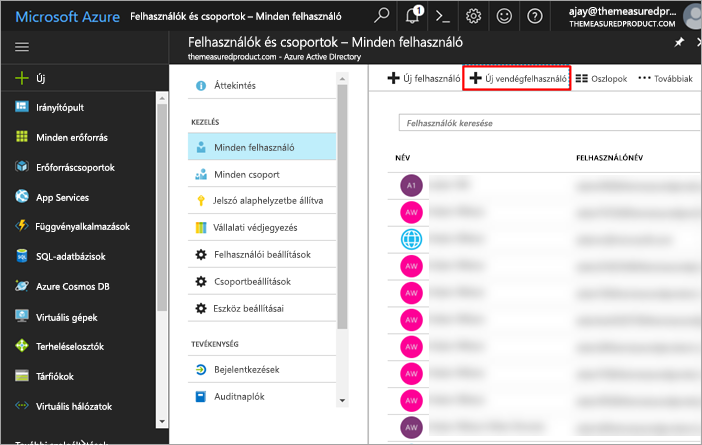
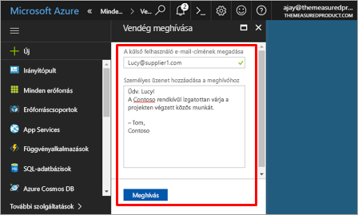
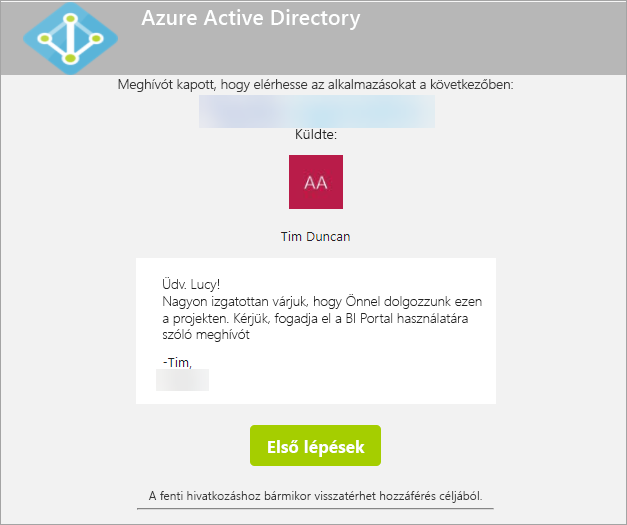
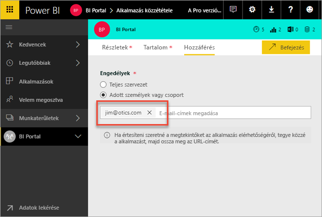
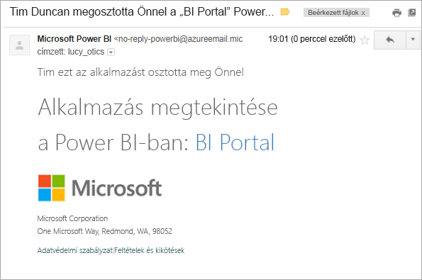
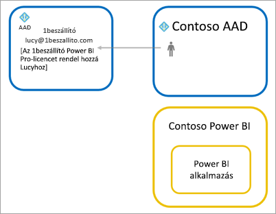

# Power BI tartalmak terjesztése Azure AD B2B külső vendégfelhasználóknak

A Power BI integrálható az Azure Active Directory vállalatközi felhasználásra szánt verziójával (Azure AD B2B), ami lehetővé teszi, hogy a Power BI-tartalmakat a szervezeten kívüli vendégfelhasználókkal is biztonságosan meg tudja osztani, úgy, hogy közben teljes mértékben szabályozza a belső adatok felhasználását.

## Hozzáférés engedélyezése

Vendégfelhasználók meghívása előtt győződjön meg arról, hogy engedélyezve van az [exportálási és megosztási beállítások](service-admin-portal.md#export-and-sharing-settings) funkciója a Power BI felügyeleti portálján.

## Kit lehet meghívni?

Bármilyen e-mail-címet, akár olyan személyes fiókot használó vendégfelhasználókat is meghívhat, mint a gmail.com, az outlook.com és a hotmail.com. Az Azure AD B2B szolgáltatásban ezek az úgynevezett *közösségi identitások*.

## Vendégfelhasználók meghívása

Meghívóra csak akkor van szükség, amikor először hív meg egy külső vendégfelhasználót a szervezetbe. Kétféleképpen hívhat meg felhasználót: tervezett meghívással vagy alkalmi meghívással.

### Tervezett meghívások

Abban az esetben válassza a tervezett meghívási módot, ha már tudja, mely felhasználókat szeretné meghívni. Meghívót az Azure Portal vagy a PowerShell használatával küldhet. A meghíváshoz bérlői rendszergazdának kell lennie.

Meghívó az Azure Portalon való küldéséhez kövesse az alábbi lépéseket.

1. Az [Azure Portalon](https://portal.azure.com) válassza az **Azure Active Directory** lehetőséget.

1. A **Kezelés** szakaszban válassza a **Felhasználók** > **Minden felhasználó** > **Új vendégfelhasználó** elemet.

    

1. Adja meg az **e-mail-címet** és egy **személyes üzenetet**.

    

1. Kattintson a **Meghívás** lehetőségre.

Ha egynél több vendéget szeretne meghívni, használja a PowerShellt. Ha további információra van szüksége, tekintse át az [Azure AD B2B együttműködési kódmintát és PowerShell-példákat](/azure/active-directory/b2b/code-samples/) tartalmazó cikket.

A vendégfelhasználónak az e-mailben kapott meghívóban rá kell majd kattintania az **Első lépések** (Get Started) lehetőségre. A rendszer ezután hozzá fogja adni a vendégfelhasználót a bérlőhöz.

### Ad-hoc meghívások

A meghívás végrehajtásához bármikor hozzáadhatja a külső felhasználót az irányítópultjához vagy jelentéséhez a megosztási felületen, illetve az alkalmazásához a hozzáférési lapon. Az alábbi példán látható, hogy mi a teendő, amikor külső felhasználót hív meg egy alkalmazás használatára.

A vendégfelhasználó fog kapni egy e-mailt, amely tájékoztatja arról, hogy megosztották vele az alkalmazást.

A vendégfelhasználónak a céges e-mail-címével kell bejelentkeznie. Bejelentkezés után a rendszer kérni fogja a meghívó elfogadását. Bejelentkezés után a vendégfelhasználót a rendszer átirányítja az alkalmazás tartalmához. Ahhoz, hogy később visszaléphessen az alkalmazásba, könyvjelzőzheti a hivatkozást vagy elmentheti az e-mailt.

## Licencelés

A vendégfelhasználónak megfelelő licenccel kell rendelkeznie ahhoz, hogy megtekinthesse a megosztott alkalmazást. Ennek három módja van: a Power BI Premium használata, egy Power BI Pro-licenc hozzárendelése a felhasználóhoz, vagy a vendég saját Power BI Pro- licencének használata.

### Prémium szintű Power BI használata

Ha az alkalmazás munkaterületét [Power BI Premium-kapacitáshoz](service-premium.md) rendeli, a vendégfelhasználó Power BI Pro-licenc nélkül is használhatja az alkalmazást. A Power BI Premium az alkalmazások tekintetében további előnyöket, például gyakoribb frissítéseket, dedikált kapacitást és nagy modellméretet biztosít.

### Power BI Pro-licenc hozzárendelése a vendégfelhasználóhoz

Ha a vendégfelhasználóhoz Power BI Pro-licencet rendel a bérlőben, a vendégfelhasználó meg tudja tekinteni a bérlőben lévő tartalmat.

### A vendégfelhasználók hozzák saját Power BI Pro-licencüket

A vendégfelhasználó saját bérlőjén már rendelkezik Power BI Pro-licenccel.

## Megfontolandó szempontok és korlátozások

* A külső B2B-vendégeknek csak olvasási jogosultságuk van a tartalomhoz. A külső B2B-vendégek megtekinthetnek alkalmazásokat, irányítópultokat, jelentéseket, illetve adatokat exportálhatnak, és irányítópultokhoz és jelentésekhez kapcsolódó e-mail-értesítéseket hozhatnak létre. Nem férhetnek hozzá azonban munkaterületekhez, és nem tehetik közzé saját tartalmaikat.

* Ez a funkció jelenleg nem érhető el Power BI-mobilalkalmazásokban. Az Azure AD B2B-vel megosztott Power BI-tartalmakat a mobileszközén böngészőben tekintheti meg.

* Ez a funkció a Power BI SharePoint Online-jelentés kijelzőjéhez jelenleg nem érhető el.

## Következő lépések

Többek közt a sorszintű biztonság működésével kapcsolatos további információért tekintse meg a következő tanulmányt: [Power BI-tartalom terjesztése vendégfelhasználóknak az Azure AD B2B használatával](https://aka.ms/powerbi-b2b-whitepaper).

Az Azure AD B2B szolgáltatással kapcsolatos további információt a [Mi az Azure AD B2B-csoportmunka?](/azure/active-directory/active-directory-b2b-what-is-azure-ad-b2b/) című cikkben találhat.
