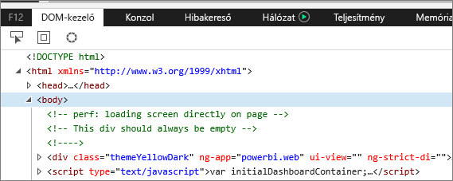
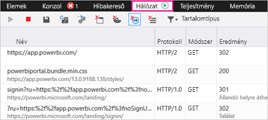
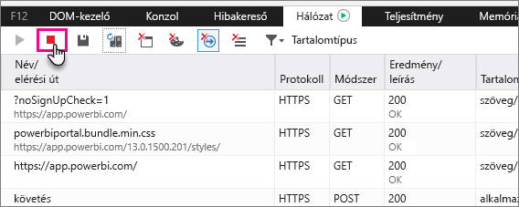
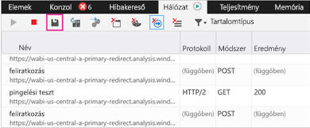

# A Power bi további diagnosztikai adatok rögzítése

Ez a cikk útmutatást manuálisan további diagnosztikai adatok gyűjtését a Power BI webes ügyféllel.

1. Keresse meg a [Power bi-ban](https://app.powerbi.com) a Microsoft Edge vagy az Internet Explorerben.

1. Nyomja meg **F12** , nyissa meg a Microsoft Edge fejlesztői eszközeit.

   

1. Válassza a **Hálózat** lapot. Itt látható az eddig rögzített forgalom.

   

    A következőket teheti:

    * Keresse meg az időtartamon belül, és bármely olyan probléma reprodukálásához.

    * Elrejtése és megjelenítése a fejlesztői eszközök ablaka a munkamenet során bármikor F12 billentyű lenyomásával.

1. Profilkészítés a munkamenet leállításához is kijelölheti a piros négyzetet a **hálózati** lapján a fejlesztői eszközök terület.

   

1. A lemez ikonra exportálhatja az adatokat egy HTTP-archívum (HAR) fájlba.

   

1. Adjon nevet a HAR-fájlnak és mentse.

    A HAR-fájl a böngészőablakot, és többek között a Power BI közötti hálózati kérelmekről minden információt tartalmaz:

    * A tevékenység azonosítók az egyes kérések.

    * Az egyes kérések pontos időbélyegét.

    * Hiba információt küld vissza az ügyfélnek.

    Tartalmazza a képernyőn megjelenő vizualizációk feltöltéséhez használt adatokat is.

1. A HAR-fájlt átadhatja vizsgálatra a támogatási szolgálatnak.

További kérdései vannak? [Kérdezze meg a Power BI közösségét](http://community.powerbi.com/)
