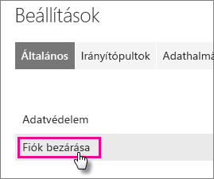
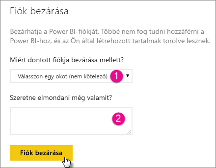
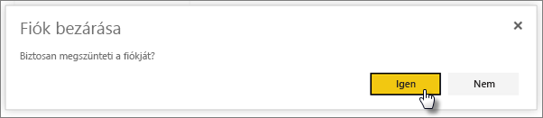
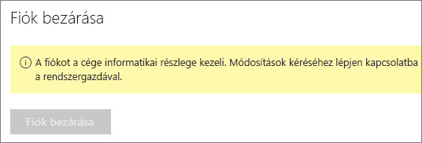

# A Power BI-fiók megszüntetése

Ha nem kívánja tovább használni a Power BI-t, bezárhatja Power BI-fiókját.  A fiók megszüntetése után nem tud többet bejelentkezni a Power BI-ba. A Power BI-ba feltöltött és ott létrehozott felhasználói adatok a Power BI szolgáltatási feltételei adatmegőrzési szabályzatának megfelelően törlésre kerülnek.

## Egyéni Power BI-felhasználók

Ha egyénileg regisztrált a Power BI-ba, a **Beállítások** képernyőn zárhatja be fiókját.

1. A Power BI-ban válassza a jobb felső sarokban lévő fogaskerék ikont, majd a **Beállítások** lehetőséget.

    

1. Az **Általános** lapon válassza a **Fiók bezárása** elemet.

    

1. Válassza ki a fiók bezárásának okát (1). Tetszés szerint további információkat is megadhat (2). Ezután kattintson a **Fiók megszüntetése** elemre.

    

1. Erősítse meg, hogy meg kívánja szüntetni a fiókját.

    

    Ekkor megjelenik a fiók bezárását igazoló képernyő. Ha szükséges, fiókját innen nyithatja újra.

    

## Felügyelt bérlői felhasználók

Ha a szervezeten keresztül regisztrált a Power BI-ba, lépjen kapcsolatba a bérlői rendszergazdával. Kérje a licenc fiókjához való hozzárendelésének törlését.

További kérdései vannak? [Kérdezze meg a Power BI közösségét](http://community.powerbi.com/)