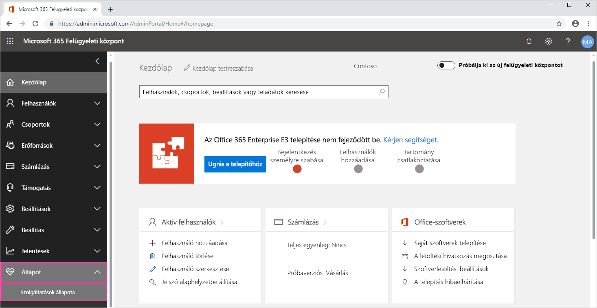
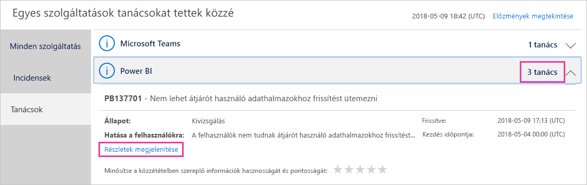
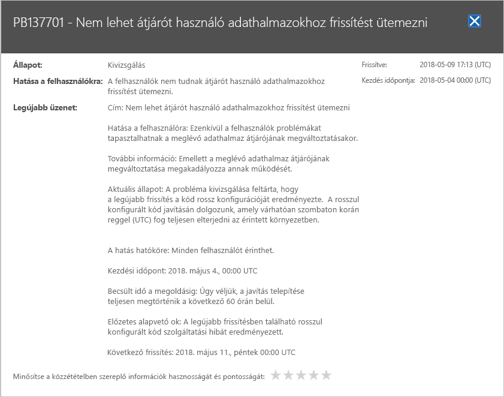

# A Power BI szolgáltatás állapotának követése az Office 365-ben

A Microsoft 365 Felügyeleti központ fontos eszközöket biztosít Power BI-rendszergazdáknak. Az eszközök a szolgáltatás állapotával kapcsolatos aktuális és korábbi információkat nyújtanak. A szolgáltatás állapotával kapcsolatos adatok eléréséhez a következő szerepkörök egyikével kell rendelkeznie:

* Power BI-szolgáltatásadminisztrátor

* Office 365 globális rendszergazda

További információk a szerepkörökről: [A Power BI-jal kapcsolatos rendszergazdai szerepkörök](service-admin-administering-power-bi-in-your-organization.md#administrator-roles-related-to-power-bi).

1. Jelentkezzen be a [Microsoft 365 Felügyeleti központba](https://portal.office.com/adminportal).

1. Válassza a navigációs panelen az **Összes megjelenítése** > **Állapot** > **Szolgáltatás állapota** lehetőséget. Megjelenik a Szolgáltatásállapot lap:

    

1. Az **Összes szolgáltatás** listában válassza a **Tanácsok** vagy az **Incidensek** elemet, és tekintse át az eredményeket. Az alábbi képernyőképen három aktív tanácsadás közül láthatja az egyiket.

    

1. További információkért kattintson a **Részletek megjelenítése** elemre az adott témánál. Az alábbi képernyőképen további részletek láthatók, köztük a legutóbbi állapotfrissítések.

    

    Több információ megtekintéséhez görgessen lejjebb, majd ha elkészült, zárja be az ablaktáblát.

1. Az összes szolgáltatás előzményadatait megnézheti, ha a **Szolgáltatásállapot** jobb felső sarkán az **Előzmények megtekintése** elemre kattint. Válassza **Az elmúlt 7 nap** vagy **Az elmúlt 30 nap** lehetőséget. 

1. A szolgáltatás jelenlegi állapotához a **Jelenlegi állapot megtekintése** elemre kattintva térhet vissza.