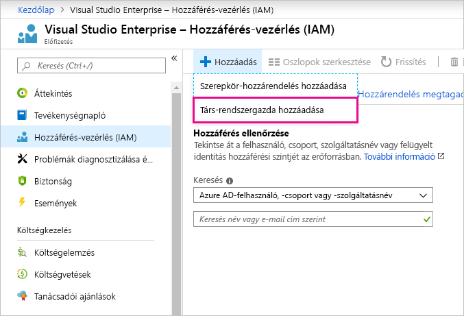

# Ugyanazon bejelentkezési fiók használata a Power BI-hoz és az Azure-hoz

Ha Ön a Power BI és az Azure felhasználója, ugyanazokat a bejelentkezési adatokat használhatja mindkét szolgáltatásban, így nem kell kétszer megadnia a jelszót.

A Power BI a munkahelyi vagy iskolai e-mail-címéhez társított felhasználói fiókjával lépteti be Önt.  Az Azure egy Microsoft-fiókkal vagy egy munkahelyi fiókkal lépteti be Önt.

Ha ugyanazokat a bejelentkezési adatokat szeretné használni az Azure-ban és a Power BI-ban, ügyeljen arra, hogy a munkahelyi fiókjával jelentkezzen be az Azure-ba.

**Mi történik, ha már be vagyok bejelentkezve az Azure-ban egy Microsoft-fiókkal?**

A munkahelyi fiókját társ-rendszergazdaként veheti fel az Azure-ban az alábbi lépések végrehajtásával:

1. Jelentkezzen be az [Azure Portalra](http://portal.azure.com/). Ha Ön több Azure-címtár felhasználója, az **Előfizetések** elemet választva szűrhet, hogy csak a szerkeszteni kívánt címtárat és előfizetéseket lássa.

1. A navigációs panelen válassza a **Hozzáférés-vezérlés (IAM)** lehetőséget, majd a **Hozzáadás** \> **Társ-rendszergazda hozzáadása** menüpontot.

    

1. Adja meg a munkahelyi fiókjához társított e-mail-címet, majd válassza a **Hozzáadás** lehetőséget.

1. Amikor legközelebb bejelentkezik az Azure Portalon, használja a munkahelyi e-mail-címét.

További kérdései vannak? [Kérdezze meg a Power BI közösségét](http://community.powerbi.com/)
