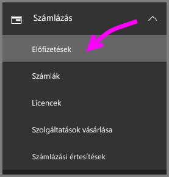
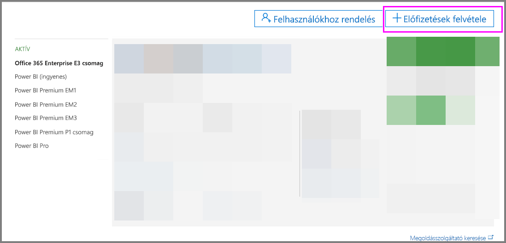
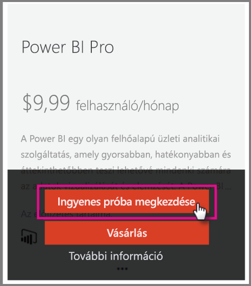
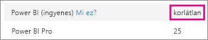
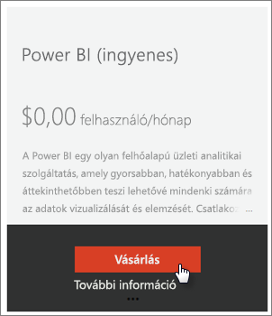
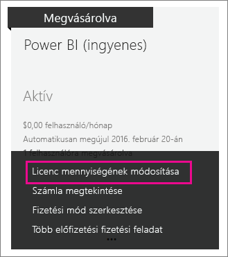
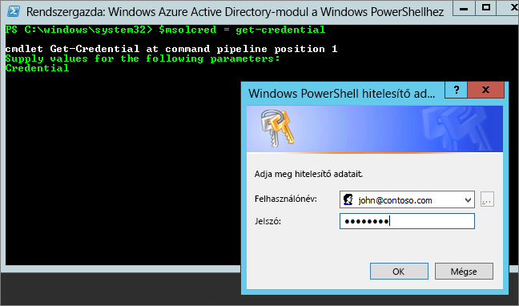

# <a name="power-bi-licensing-in-your-organization"></a>Szervezeti Power BI-licencelés

A Power BI szolgáltatásban a felhasználók számára elérhető képességeket két licenctípus határozza meg:

* **Felhasználónkénti** - *ingyenes és Power BI Pro-licencek*. Az ingyenes licenccel csak a Power BI egyes funkciói érhetők el. A Pro licenc a Power BI minden tartalmához és funkciójához hozzáférést biztosít, lehetővé teszi a tartalmak megosztását, és más Pro-felhasználókkal folytatott együttműködésre is lehetőség van. Csak a Pro szintű felhasználók tehetnek közzé és használhatnak tartalmat alkalmazás-munkaterületeken, oszthatnak meg irányítópultokat, és iratkozhatnak fel irányítópultokra és jelentésekre. További információkért lásd a [Power BI-szolgáltatások licenctípus szerinti funkcióinak](service-features-license-type.md) ismertetését.

* **Kapacitásalapú** - *Power BI Premium-licencek*. A Premium szint fenntartott kapacitást biztosít, amellyel konzisztensebb teljesítmény érhető el, és amely nagyobb adatméreteket támogat a Power BI-ban. Egyéni felhasználók esetén a Premium lehetővé teszi, hogy a Pro-felhasználók széles körben megoszthassák a tartalmakat anélkül, hogy a tartalmak címzettjei Pro licencekkel rendelkeznének. További információ: [A Power BI Premium bemutatása](service-premium.md).

A cikk a felhasználónkénti licencekre összpontosít a rendszergazda szemszögéből.

## <a name="manage-power-bi-pro-licenses"></a>Power BI Pro-licencek kezelése

Rendszergazdaként vásárolhat és kioszthat Power BI Pro-licenceket, és regisztrálhatja is a cégét a Power BI Pro próbaverziójára. A Power BI Pro próbaverziójára egyéni felhasználók is regisztrálhatnak.

### <a name="purchasing-power-bi-pro"></a>A Power BI Pro megvásárlása

A Power BI Pro-licenceket a Microsoft Office 365-ön keresztül vagy egy hivatalos Microsoft-partnertől vásárolhatja meg. A licenceket a megvásárlásuk után ki kell osztania az egyes felhasználóknak. További információkért lásd [a Power BI Pro-licencek vásárlását és kiosztását ismertető](service-admin-purchasing-power-bi-pro.md) témakört.

### <a name="power-bi-pro-trial-for-individuals"></a>A Power BI Pro próbaverziója egyéni felhasználóknak

A cégben dolgozó egyéni felhasználók regisztrálhatnak a Power BI Pro próbaverziójára. További információkért lásd: [Egyéni Power BI-regisztráció](service-self-service-signup-for-power-bi.md).

Az Office 365 felügyeleti portálján a szolgáltatáson belüli ingyenes Power BI Pro próbaverziót használó felhasználók nem a Power BI Pro próbaverziós felhasználóiként, hanem ingyenes Power BI-felhasználókként jelennek meg, a Power BI tárhelykezelési lapján azonban a Power BI Pro próbaverziós felhasználóiként vannak feltüntetve.

### <a name="power-bi-pro-trial-for-organizations"></a>A Power BI Pro próbaverziója cégeknek

Ha anélkül szeretné beszerezni és üzembe helyezni a Power BI próbaverziós licenceit több, a cégnél dolgozó felhasználó számára, hogy külön-külön el kellene fogadniuk a próbaverzió feltételeit, regisztrálhatja a céget a Power BI Pro próbaverziójára.

Mielőtt regisztrálna, vegye figyelembe a következőket:

* A regisztrációhoz [**globális rendszergazdai** vagy **számlázási rendszergazdai**](https://support.office.com/article/about-office-365-admin-roles-da585eea-f576-4f55-a1e0-87090b6aaa9d?ui=en-US&rs=en-US&ad=US) szerepkörrel kell rendelkeznie az Office 365-ben.

* A céges próbaverziók száma bérlőnként csak egy lehet. Ez azt jelenti, hogy ha valaki már alkalmazta a Power BI Pro próbaverzióját a bérlőn, Ön nem teheti meg ugyanezt. Ha segítségre van szüksége ezzel kapcsolatban, forduljon az [Office 365 számlázási támogatási csapatához](https://support.office.microsoft.com/en-us/article/contact-support-for-business-products-admin-help-32a17ca7-6fa0-4870-8a8d-e25ba4ccfd4b?CorrelationId=552bbf37-214f-4202-80cb-b94240dcd671&ui=en-US&rs=en-US&ad=US).

1. Keresse fel az [Office 365 Felügyeleti központot](https://portal.office.com/adminportal/home#/homepage).

1. A bal oldali navigációs ablaktáblán kattintson a **Számlázás**, majd az **Előfizetések** lehetőségre.

   

1. A jobb oldalon válassza az **Előfizetések felvétele** lehetőséget.

   

1. Az **Egyéb csomagok** területen mutasson a Power BI Pro melletti három pontra (**. . .**), majd válassza az **Ingyenes próba megkezdése** lehetőséget.

    

1. A rendelés visszaigazolási képernyőjén válassza a **Kipróbálom most** lehetőséget.

1. A rendelés nyugtázásánál válassza a **Folytatás** lehetőséget.

Most [kioszthatja a licenceket az Office 365-ben](https://support.office.com/article/assign-licenses-to-users-in-office-365-for-business-997596b5-4173-4627-b915-36abac6786dc).

## <a name="manage-power-bi-free-licenses"></a>Ingyenes Power BI-licencek kezelése

A céghez tartozó felhasználók két különböző módon szerezhetnek be ingyenes Power BI-licenceket. Egyénileg regisztrálhatnak a Power BI-ban, vagy Ön rendelhet hozzájuk Power BI-licencet az Office 365 Felügyeleti portálon.

Az egyéni regisztráció engedélyezése megkönnyíti a céges rendszergazda dolgát, mert lehetőséget ad a Power BI iránt érdeklődő felhasználóknak, hogy ők maguk regisztráljanak díjmentesen.

Az egyéni regisztráció letiltása azonban nagyobb kontrollt biztosít, és megfelelő választás lehet, ha naplóznia kell a szolgáltatás használatát.

### <a name="power-bi-free-for-individuals"></a>Ingyenes Power BI egyéni felhasználóknak

Alapértelmezés szerint a cégben dolgozó egyéni felhasználók regisztrálhatnak a Power BI ingyenes licenceire. További információkért lásd: [Egyéni Power BI-regisztráció](service-self-service-signup-for-power-bi.md).

Az egyéni regisztráció blokkolásával kapcsolatban lásd alább a cikk [Egyéni felhasználók általi Azure Active Directory-regisztráció engedélyezése és letiltása](service-admin-licensing-organization.md#enable-or-disable-individual-user-sign-up-in-azure-active-directory) szakaszát.

### <a name="requesting-and-assigning-free-licenses"></a>Ingyenes licencek igénylése és kiosztása

Ha a licencigénylés és -kiosztás folyamatát központilag szeretné felügyelni, előbb bizonyosodjon meg róla, hogy már rendelkezik a korlátlan (ingyenes) Power BI-licenckészlettel.

Ez a licenckészlet azt követően válik elérhetővé, hogy valaki egyéni felhasználóként már regisztrált a Power BI használatára. A regisztrálás során a rendszer hozzárendeli a licenckészletet a céghez, és a regisztráló felhasználónak kioszt egy licencet.

1. Az Office 365 felügyeleti központjában, a **Számlázás** > **Licencek** felületen keresse a **korlátlan** lehetőséget.

    

1. Ha a készlet elérhető, [kioszthatja a licenceket az Office 365-ben](https://support.office.com/article/assign-licenses-to-users-in-office-365-for-business-997596b5-4173-4627-b915-36abac6786dc). Ha a készlet nem érhető el, két lehetősége van:

    * Kérje meg a cég egy tagját az egyéni regisztrációra, ami kiváltja a korlátlan készlet létrehozását.

    * Továbblép a következő eljárásra, amellyel rögzített számú licencre regisztrálhat.

Ha a korlátlan (ingyenes) Power BI-licenckészlet nem érhető el, és nem szeretne egyéni regisztrációhoz folyamodni, eszerint kell eljárnia.

1. Keresse fel az [Office 365 Felügyeleti központot](https://portal.office.com/admin/default.aspx).

1. A bal oldali navigációs ablaktáblán kattintson a **Számlázás** > **Előfizetések** lehetőségre.

1. A jobb oldalon válassza az **Előfizetések felvétele +** lehetőséget.

1. Az **Egyéb csomagok** területen mutasson a Power BI (ingyenes) lehetőség melletti három pontra (**. . .**), majd válassza a **Vásárlás** lehetőséget.

    

1. Adja meg a hozzáadni kívánt licencek számát, és válassza a **Fizetés most** vagy a **Bevásárlókocsiba** lehetőséget.

1. A fizetési folyamat lépéseinél adja meg a szükséges adatokat.

    Ennél az ajánlatnál nincs vásárlás annak ellenére, hogy meg kell adnia a hitelkártyája adatait a számlázáshoz, vagy a számla kiküldését kell választania.

1. Most már [kioszthatja a licenceket az Office 365-ben](https://support.office.com/article/assign-licenses-to-users-in-office-365-for-business-997596b5-4173-4627-b915-36abac6786dc).

1. Ha később úgy dönt, hogy további licenceket kíván hozzáadni, visszatérhet az **Előfizetések hozzáadása** lapra, és választhatja a **Licencmennyiség módosítása** a Power BI (ingyenes) termékhez lehetőséget.

    

### <a name="enable-or-disable-individual-user-sign-up-in-azure-active-directory"></a>Egyéni felhasználók általi Azure Active Directory-regisztráció engedélyezése és letiltása

Rendszergazdaként engedélyezheti vagy letilthatja az egyéni felhasználók általi regisztrációt az Azure Active Directoryban (AAD). Ez a szakasz azt mutatja be, hogyan felügyelheti a regisztrációkat PowerShell-parancsokkal. Az Azure PowerShellről [az Azure PowerShell áttekintésében](/powershell/azure/overview) talál további információt.

A regisztrációkat az AAD **AllowAdHocSubscriptions** beállítása szabályozza. A legtöbb bérlő esetén ez a beállítás *true* (igaz) értékre van állítva, vagyis engedélyezett. Ha a Power BI-t egy partneren keresztül szerezte be, elképzelhető, hogy *false* (hamis) érték van megadva, amely letiltja a regisztrációt. Ha a beállítást *true* értékről *false* értékre módosítja, a cég új felhasználói nem fognak tudni egyénileg regisztrálni. Azoknak a felhasználóknak a Power BI-licence, akik a beállítás módosítása előtt regisztráltak, továbbra is megmarad.

1. Jelentkezzen be az Azure Active Directoryba az Office 365 hitelesítő adataival. Az alábbi PowerShell-szkript első sora bekéri a hitelesítő adatokat. A második sor csatlakozik az Azure Active Directoryhoz.

    ```powershell
     $msolcred = get-credential
     connect-msolservice -credential $msolcred
    ```

   

1. Miután bejelentkezett, a következő parancs futtatásával ellenőrizheti a bérlő aktuális konfigurációját.

    ```powershell
     Get-MsolCompanyInformation | fl AllowAdHocSubscriptions
    ```
1. A következő parancs futtatásával engedélyezheti ($true) vagy tilthatja le ($false) az **AllowAdHocSubscriptions** beállítást.

    ```powershell
     Set-MsolCompanySettings -AllowAdHocSubscriptions $true
    ```

> [!NOTE]
> Az AllowAdHocSubscriptions jelzővel irányítható a vállalat számos felhasználói képessége, beleértve a felhasználók azon képességét, hogy regisztráljanak az Azure Rights Management szolgáltatásra. A jelölő módosítása az összes képességre hatással van.

## <a name="next-steps"></a>Következő lépések

[Önkiszolgáló regisztráció a Power BI-ra](service-self-service-signup-for-power-bi.md)  

[Power BI Pro-licencek vásárlása és kiosztása](service-admin-purchasing-power-bi-pro.md)

További kérdései vannak? [Kérdezze meg a Power BI közösségét](http://community.powerbi.com/)