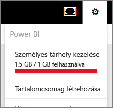

# Adattárolás felügyelete Power BI-munkaterületeken

Útmutató az adattárolás felügyeletéhez egyéni munkaterületen a jelentések és adathalmazok folyamatos közzététele érdekében.

## Kapacitási korlátok

A munkaterület tárolási korlátai a Saját munkaterületen és az alkalmazás-munkaterületen is attól függnek, hogy a munkaterület [megosztott vagy prémium szintű kapacitásban](service-basic-concepts.md#capacities) van.

### Megoszt kapacitás korlátai
Megosztott kapacitásban lévő munkaterület esetén: 

- Munkaterületenként 100 GB a tárterületkorlát.
- Alkalmazás-munkaterületek esetén a teljes felhasznált tárterület nem lépheti túl a bérlő 10 GB tárterületkorlátjának és a bérlőn üzemelő Pro-licencek számának szorzatát.

### Prémium szintű kapacitás korlátai
Prémium szintű kapacitásban lévő munkaterület esetén:
- A korlát prémium szintű kapacitásonként 100 TB.
- Felhasználónkénti tárolási korlát nincs.

További információkért tekintse meg [a Power BI díjszabási modelljét](https://powerbi.microsoft.com/pricing).

## A tárhely tartalma

A tárhely magában foglalja a saját adathalmazokat és Excel-jelentéseket, valamint a mások által Önnel megosztott elemeket. Adathalmaz minden olyan adatforrás, amelyet feltöltött, vagy amelyhez csatlakozott. Ezek közé az adatforrások közé tartoznak az Ön által használt Power BI Desktop-fájlok és Excel-munkafüzetek is. A következők szintén beletartoznak az adatkapacitásba.

* Irányítópultra rögzített Excel-tartományok.
* Power BI-irányítópultra rögzített helyszíni Reporting Services-vizualizációk.
* Feltöltött képek.

Az Ön által megosztott irányítópult mérete attól függ, hogy mi van rögzítve rajta. Ha például két különböző adathalmazhoz tartozó jelentésből származó elemeket rögzít, a méretbe mindkét adathalmaz beletartozik.

<a name="manage"/>

## Saját tulajdonban lévő elemek kezelése

Megtekintheti a Power BI-fiókban aktuálisan felhasznált tárhely méretét, és kezelheti a fiókot.

1. A saját tárhely kezeléséhez nyissa meg a **Saját munkaterületet** a navigációs ablaktáblán.
   
    

2. Kattintson a fogaskerék ikonra  a jobb felső sarokban \> **Személyes tárhely kezelése**.
   
    A felső sávon látható, hogy mennyit használt fel a rendelkezésre álló tárhelyből.
   
    
   
    Az adatkészletek és a jelentések két külön lapon találhatók az alábbiak szerint:
   
    **Saját tulajdon:** Ezeket a jelentéseket és adathalmazokat, köztük az olyan szolgáltatások adathalmazait, mint a Salesforce és a Dynamics CRM, Ön töltötte fel a saját Power BI-fiókjába.  

    **Mások tulajdona:** Ezeket a jelentéseket és adatkészleteket mások osztották meg Önnel.
1. Adatkészlet vagy jelentés törléséhez kattintson a Kuka ikonra .

Vegye figyelembe, hogy az adatkészleteken saját vagy megosztott jelentések és irányítópultok alapulhatnak. Ha törli az adatkészletet, ezek a jelentések és irányítópultok nem fognak működni.

## Saját munkaterület kezelése
1. Kattintson a **Munkaterületek** elem melletti nyílra, majd \> válassza ki a munkaterület nevét.
   
    
2. Kattintson a fogaskerék ikonra  a jobb felső sarokban \> **Csoporttárhely kezelése**.
   
    A felső sávon látható, hogy mennyit használtak fel a csoport rendelkezésére álló tárhelyből.
   
    
   
    Az adatkészletek és a jelentések két külön lapon találhatók az alábbiak szerint:
   
    **Közös tulajdon:** Ezeket a jelentéseket és adathalmazokat, köztük az olyan szolgáltatások adathalmazait, mint a Salesforce és a Dynamics CRM, Ön vagy valaki más töltötte fel a csoport Power BI-fiókjába.

    **Mások tulajdona:** Ezeket a jelentéseket és adatkészleteket mások osztották meg az Ön csoportjával.

3. Adatkészlet vagy jelentés törléséhez kattintson a Kuka ikonra .
   
   > [!NOTE]
   > Vegye figyelembe, hogy az adatkészleteken saját vagy a csoport más tagja által birtokolt jelentések és irányítópultok alapulhatnak. Ha törli az adatkészletet, ezek a jelentések és irányítópultok nem fognak működni.
   
   Egy munkaterület bármely rendszergazda, tag vagy közreműködő szerepkörrel rendelkező tagja jogosult adathalmazokat és jelentéseket törölni a munkaterületről.

## Adatkészletkorlátok
A Power BI-ba importálható egyes adathalmazok korlátja 1 GB. Ha adatimportálás helyett az Excel további használata mellett döntött, az adathalmaz korlátja 250 MB.

## Mi történik, ha eléri a korlátot
Ha eléri a munkája során felhasználható adatkapacitás korlátját, a szolgáltatás figyelmeztető üzeneteket küld. 

A fogaskerék ikon kiválasztásakor , piros csík jelzi az adatkapacitás korlátjának túllépését.

Ez a korlát megjelenik a **Személyes tárhely kezelése** területen is.

 

 Ha a korlátok bármelyikét elérő tevékenységet kísérel meg, üzenetet kap a korlát túllépéséről. Előfordulhat, hogy a tárhely [kezelésével](#manage) csökkenti a tárhely méretét, és így lépi át a korlátot.

 

 ## Következő lépések

 További kérdései vannak? [Kérdezze meg a Power BI közösségét](https://community.powerbi.com/)

