# Mobilalkalmazások konfigurálása a Microsoft Intune-nal

A Microsoft Intune lehetővé teszi a cégek számára az eszközök és alkalmazások kezelését. Az IOS és Android rendszerhez készült Power BI mobilalkalmazás integrálódik az Intune-nal. Ez az integráció lehetővé teszi az alkalmazás felügyeletét az eszközökön és a biztonság szabályozását. A konfigurációs szabályzatok révén a cégek sok mindent szabályozhatnak, például a hozzáférési kód megkövetelését, az alkalmazás adatkezelését, és akár az alkalmazásadatok titkosítását is, ha az alkalmazás nincs használatban.

## Általános mobileszköz-kezelési konfiguráció

A jelen cikk feltételezi, hogy az Intune megfelelően van konfigurálva, és az Intune-ban regisztrált eszközökkel rendelkezik. A cikk nem tekintendő teljes konfigurációs útmutatónak a Microsoft Intune-hoz. További információkért az Intune-nal kapcsolatban lásd: [Mi az Intune?](/intune/introduction-intune/).

A Microsoft Intune létezhet egyidejűleg az Office 365 mobileszköz-kezelési (MDM) összetevőjével. MDM használata esetén az eszköz regisztráltként jelenik meg az MDM-en belül, de elérhető az Intune-on belüli felügyelethez.

> [!NOTE]
> Az Intune konfigurálása után a háttéradatok frissítése ki lesz kapcsolva a Power BI mobilalkalmazásban az iOS vagy Android rendszerű eszközön. A Power BI a weben futó Power BI szolgáltatásból frissíti az adatokat, amikor belép az alkalmazásba.

## 1. lépés: Az URL-cím lekérése az alkalmazáshoz

Az alkalmazás Intune-beli létrehozása előtt le kell kérni az alkalmazások URL-címét. iOS rendszer esetén ezt az iTunes-ból, Android rendszernél a Power BI Mobile oldaláról szerezheti be.

Mentse az URL-címet, mert szüksége lesz rá az alkalmazás létrehozásakor.

### URL-cím lekérése iOS rendszer esetén

iOS rendszer esetén az alkalmazás URL-címét az iTunes-ból kell beszerezni.

1. Nyissa meg az iTunes-t.

1. Keressen a *Power BI* szövegre.

1. Ekkor meg kell jelennie a **Microsoft Power BI** elemnek az **iPhone-alkalmazások** és az **iPad-alkalmazások** listában. Bármelyiket használhatja, mivel azonos URL-címet kap.

1. Válassza a **Letöltés** legördülő listát, és válassza a **Hivatkozás másolása** lehetőséget.

    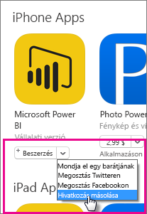

Az alábbihoz hasonlóan kell kinéznie: *https://itunes.apple.com/us/app/microsoft-power-bi/id929738808?mt=8*.

### URL-cím lekérése Android rendszer esetén

A Google Play Áruház URL-címét a [Power BI Mobile oldaláról](https://powerbi.microsoft.com/mobile/) szerezheti be. A **Download from Google Play** (Letöltés a Google Play Áruházból) ikonra kattintva léphet az alkalmazás lapjára. A böngésző címsorából másolhatja az URL-címet. Az alábbihoz hasonlóan kell kinéznie: *https://play.google.com/store/apps/details?id=com.microsoft.powerbim*.

## 2. lépés: Mobilalkalmazás-felügyeleti szabályzat létrehozása

A mobilalkalmazás-felügyeleti szabályzattal kényszerítheti például a hozzáférési kód megadását. Az Intune-portálon hozhat létre egyet.

Az alkalmazás vagy a szabályzat létrehozásával egyaránt kezdheti. A hozzáadásuk sorrendjének nincs jelentősége. Elég, hogy egyaránt jelen legyenek az üzembe helyezési lépéshez.

1. Az Intune portálon válassza a **Szabályzat** > **Konfigurációs szabályzatok** lehetőséget.

    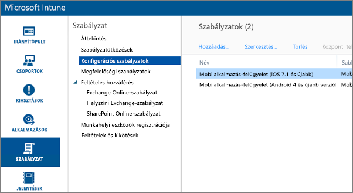

1. Kattintson a **Hozzáadás...** gombra.

1. A **Szoftver** szakaszban választhat az Android vagy az iOS rendszerbeli mobilalkalmazás-kezelés közül. Gyorsan és egyszerűen kiválaszthatja a **Szabályzat létrehozása az ajánlott beállításokkal** lehetőséget, vagy választhatja az egyéni szabályzat létrehozását.

1. A szabályzat szerkesztésével a konfigurálhatja az alkalmazásra vonatkozó kívánt korlátozásokat.

## 3. lépés: Az alkalmazás létrehozása

Az alkalmazás egy, az Intune-ban üzembe helyezés céljából mentett hivatkozás vagy csomag. Létre kell hoznia egy alkalmazást és egy hivatkozást az alkalmazás URL-címére, amelyet az iTunes vagy Google Play Áruházból szerzett be.

Az alkalmazás vagy a szabályzat létrehozásával egyaránt kezdheti. A hozzáadásuk sorrendjének nincs jelentősége. Elég, hogy egyaránt jelen legyenek az üzembe helyezési lépéshez.

1. Nyissa meg az Intune-portált és kattintson a bal oldali menüben az Intune **Alkalmazások** elemére.

1. Válassza az **Alkalmazás felvétele** lehetőséget. Ekkor elindul a **Szoftver hozzáadása** alkalmazás.

### Létrehozás iOS rendszerben

1. Válassza a **Felügyelt iOS-alkalmazás az App Store-ból** elemet a legördülő listából.

1. Adja meg az alkalmazás [1. lépésben ](#step-1-get-the-URL-for-the-application) beszerzett URL-címét, és kattintson a **Tovább** elemre.

    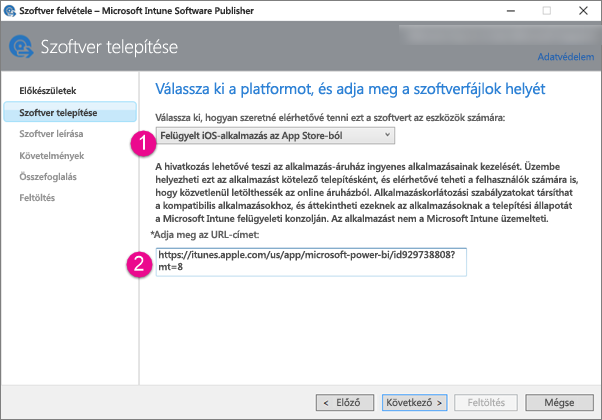

1. Adjon meg egy **kiadót**, **nevet** és **leírást**. Opcionálisan megadhat egy **ikont** is. A **Kategória** a Céges portál alkalmazásra vonatkozik. Ha elkészült, kattintson a **Tovább** gombra.

1. Eldöntheti, hogy az alkalmazást **bármely** (alapértelmezett), **iPad** vagy **iPhone** eszközökre szeretné-e kiadni. Alapértelmezés szerint a **Bármely** jelenik meg, és mindkét eszköztípus esetében működik. A Power BI alkalmazás URL-címe iPhone és iPad esetén is azonos. Kattintson a **Tovább** gombra.

1. Válassza a **Feltöltés** lehetőséget.

1. Ha a listában nem találja az alkalmazást, frissítse az oldalt: Nyissa meg az **Áttekintés** részt, majd térjen vissza az **Alkalmazások** területhez.

    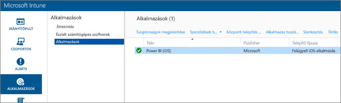

### Létrehozás Android rendszerben

1. Válassza a **Külső hivatkozás** elemet a legördülő listából.

1. Adja meg az alkalmazás [1. lépésben ](#step-1-get-the-URL-for-the-application) beszerzett URL-címét, és kattintson a **Tovább** elemre.

    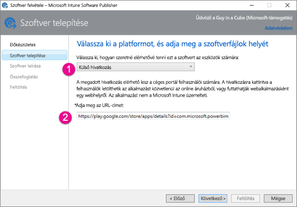

1. Adjon meg egy **kiadót**, **nevet** és **leírást**. Opcionálisan megadhat egy **ikont** is. A **Kategória** a Céges portál alkalmazásra vonatkozik. Ha elkészült, kattintson a **Tovább** gombra.

1. Válassza a **Feltöltés** lehetőséget.

1. Ha a listában nem találja az alkalmazást, frissítse az oldalt: Nyissa meg az **Áttekintés** részt, majd térjen vissza az **Alkalmazások** területhez.

    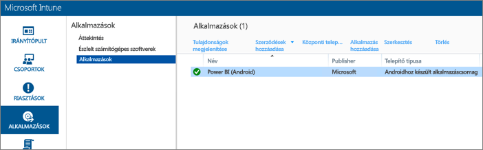

## 4. lépés: Az alkalmazás üzembe helyezése

Miután hozzáadta az alkalmazást, üzembe kell helyeznie azt, hogy a végfelhasználók elérhessék. Ebben a lépésben a létrehozott szabályzatot az alkalmazáshoz fogja kötni.

### Üzembe helyezés iOS rendszerben

1. Az alkalmazások képernyőn válassza ki a létrehozott alkalmazást. Válassza az **Üzembe helyezés kezelése...**  hivatkozást.

    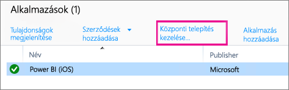

1. A **Csoportok kiválasztása** képernyőn eldöntheti, hogy mely csoportokban szeretné az alkalmazást üzembe helyezni. Válassza a **Tovább** gombot.

1. A **Központi telepítési művelet** képernyőn eldöntheti, hogy miként szeretné az alkalmazást üzembe helyezni. Az **Elérhető telepítés** vagy **Szükséges telepítés** lehetőséget választva az alkalmazás igény szerint lesz üzembe helyezve a céges portálon a felhasználók részére. Miután befejezte a kijelölést, kattintson a **Tovább** gombra.

    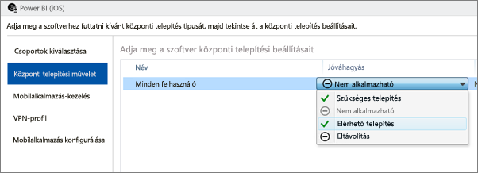

1. A **Mobilalkalmazás-kezelés** képernyőn kiválaszthatja a [2. lépés](#step-2-create-a-mobile-application-management-policy) során létrehozott mobilalkalmazás-kezelési szabályzatot. Az alapértelmezés az Ön által létrehozott szabályzat lesz, ha ez az egyetlen rendelkezésre álló iOS-szabályzat. Kattintson a **Tovább** gombra.

    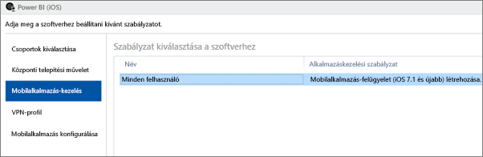

1. A **VPN-profil** képernyőn kiválaszthat egy szabályzatot, ha munkahelye rendelkezik ilyennel. A beállítás alapértelmezett értéke a **Nincs**. Válassza a **Tovább** gombot.

1. A **Mobilalkalmazás konfigurálása** képernyőn kiválaszthat egy **alkalmazáskonfigurálási szabályzatot**, ha van ilyen. A beállítás alapértelmezett értéke a **Nincs**. Ez nem kötelező. Válassza a **Befejezés** gombot.

Miután telepítette az alkalmazást, mellette az **Igen** feliratnak kell megjelennie az alkalmazások lapján.

### Üzembe helyezés Android rendszerben

1. Az alkalmazások képernyőn válassza ki a létrehozott alkalmazást. Válassza az **Üzembe helyezés kezelése...**  hivatkozást.

    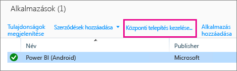
1. A **Csoportok kiválasztása** képernyőn eldöntheti, hogy mely csoportokban szeretné az alkalmazást üzembe helyezni. Válassza a **Tovább** gombot.

1. A **Központi telepítési művelet** képernyőn eldöntheti, hogy miként szeretné az alkalmazást üzembe helyezni. Az **Elérhető telepítés** vagy **Szükséges telepítés** lehetőséget választva az alkalmazás igény szerint lesz üzembe helyezve a céges portálon a felhasználók részére. Miután befejezte a kijelölést, kattintson a **Tovább** gombra.

    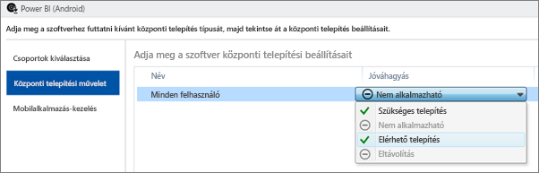

1. A **Mobilalkalmazás-kezelés** képernyőn kiválaszthatja a [2. lépés](#step-2-create-a-mobile-application-management-policy) során létrehozott mobilalkalmazás-kezelési szabályzatot. Az alapértelmezés az Ön által létrehozott szabályzat lesz, ha ez az egyetlen rendelkezésre álló Android-szabályzat. Válassza a **Befejezés** gombot.

    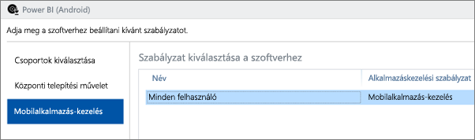

Miután telepítette az alkalmazást, mellette az **Igen** feliratnak kell megjelennie az alkalmazások lapján.

## 5. lépés: Az alkalmazás telepítése egy eszközön

Az alkalmazást a *Céges portál* alkalmazáson keresztül fogja telepíteni. Ha még nem telepítette a Céges portált, beszerezheti azt az iOS vagy az Android platform alkalmazásáruházából. A Céges portálra a munkahelyi bejelentkezési adataival jelentkezzen be.

1. Nyissa meg a Céges portál alkalmazást.

1. Ha nem látja a Power BI alkalmazást felsorolt kiemelt alkalmazásként, válassza a **Céges alkalmazások** lehetőséget.

    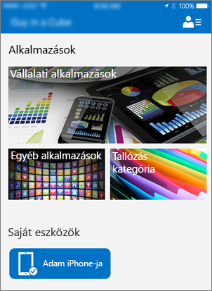

1. Válassza ki az üzembe helyezett Power BI alkalmazást.

    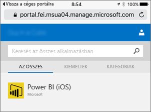

1. Válassza a **Telepítés** gombot.

    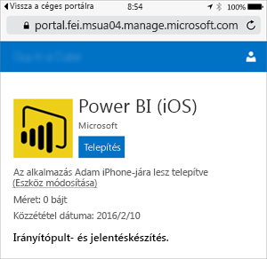

1. Ha iOS rendszert használ, akkor az le fogja küldeni Önnek az alkalmazást. Válassza a **Telepítés** gombot a leküldési párbeszédpanelen.

    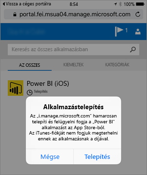

1. Az alkalmazás telepítését követően látni fogja, hogy azt **A munkahely kezeli**. Ha a szabályzatban engedélyezte a PIN-kóddal való hozzáférést, a következőt láthatja.

    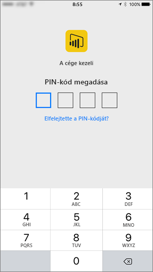

## Következő lépések

[Mobilalkalmazás-felügyeleti szabályzatok konfigurálása és üzembe helyezése a Microsoft Intune-konzolon](/intune/app-protection-policies/)  

[Power BI-alkalmazások mobileszközökre](consumer/mobile/mobile-apps-for-mobile-devices.md)  

További kérdései vannak? [Kérdezze meg a Power BI közösségét](http://community.powerbi.com/)  