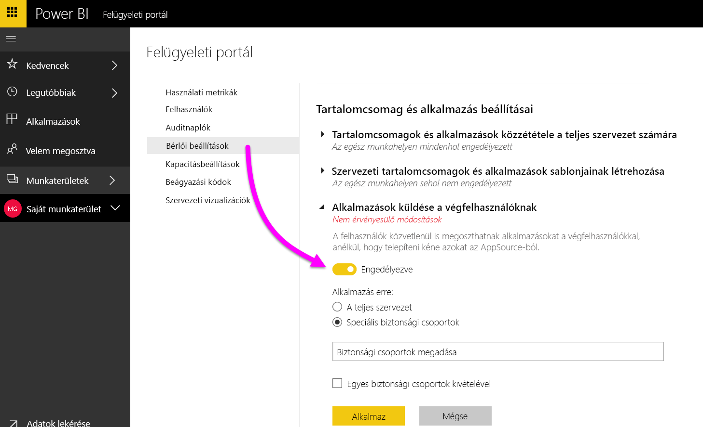
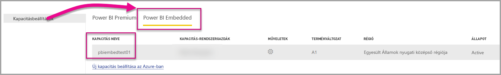

# Power BI felügyeleti portál

A felügyeleti portál segítségével kezelheti a szervezetéhez tartozó Power BI-*bérlőt*. A portál olyan lehetőségeket kínál, mint például a használati metrikák, hozzáférés az Office 365 felügyeleti központjához, valamint a beállítások.

Az Office 365 minden globális rendszergazdája hozzáférhet a teljes felügyeleti portálhoz, valamint olyan felhasználók is, akik Power BI-szolgáltatásadminisztrátori szerepkört kaptak. Ha még nem kapott ilyen szerepkörbe, csak a **kapacitásbeállításokat** láthatja a portálon. A Power BI szolgáltatás rendszergazdai szerepkörére vonatkozó további információkat [a Power BI rendszergazdai szerepkörét ismertető](service-admin-role.md) témakör tartalmaz.

## A felügyeleti portál elérése

A Power BI felügyeleti portál eléréséhez az adott fiókot **globális rendszergazdaként** kell megjelölni az Office 365-ben vagy az Azure Active Directoryban, vagy Power BI-szolgáltatásadminisztrátori szerepkört kell hozzárendelni. További információ a Power BI-szolgáltatásadminisztrátori szerepkörről: [A Power BI rendszergazdai szerepkörének ismertetése](service-admin-role.md). A Power BI felügyeleti portál eléréséhez tegye az alábbiakat.

1. Válassza ki a Beállítások fogaskereket a Power BI szolgáltatás jobb felső sarkában.

1. Válassza a **Felügyeleti portál** lehetőséget.

    

A portálon hét lap található. A cikk további részében ezen lapokról olvashat.

* [Használati metrikák](#usage-metrics)
* [Felhasználók](#users)
* [Auditnaplók](#audit-logs)
* [Bérlői beállítások](#tenant-settings)
* [Premium-beállítások](#premium-settings)
* [Beágyazási kódok](#embed-codes)
* [Szervezeti vizualizációk](#organization-visuals)

## Használati metrikák

A **Használati metrikák** segítségével nyomon követheti a szervezet Power BI-használatát. Ezenkívül azt is mutatja, hogy mely munkahelyi felhasználók és csoportok a legaktívabbak a Power BI-ban.

> [!NOTE]
> Az irányítópult első használatakor, vagy ha hosszú idő elteltével keresi fel újra az irányítópultot, egy betöltési képernyő jelenik meg az irányítópult betöltése során.

Miután az irányítópult betöltődött, két szakaszba sorolt csempék jelennek meg. Az első szakasz tartalmazza az egyes felhasználók használati adatait, míg a második szakaszban a munkahelyi csoportok hasonló információi láthatók.

Az alábbiakban az egyes csempéknél megjelenő részletes információkat ismertetjük:

* A felhasználói munkaterület összes irányítópultjának, jelentésének és adatkészletének eltérő darabszáma
  
    

* A legtöbbet használt irányítópult az ahhoz hozzáférő felhasználók száma szerint. Például ha 3 felhasználóval oszt meg egy irányítópultot, és olyan tartalomcsomaghoz is hozzáadja azt, amelyhez két különböző felhasználó kapcsolódik, a számláló értéke 6 (1 + 3 + 2)
  
    

* A legnépszerűbb tartalom, amelyhez a felhasználók kapcsolódtak. Ez bármi lehet, amelyhez a felhasználók hozzáférhetnek az adatbeolvasási folyamaton keresztül, például szolgáltatott szoftveres tartalomcsomagok, munkahelyi tartalomcsomagok, fájlok vagy adatbázisok.
  
    

* A legaktívabb felhasználókat mutatja az irányítópultok száma alapján, beleértve a felhasználók által létrehozott és a velük megosztott irányítópultok számát.
  
    

* A legaktívabb felhasználókat mutatja a jelentések száma alapján
  
    

A második szakasz ugyanezeket az információkat tartalmazza – a csoportok alapján. Lehetővé teszi annak megtekintését, hogy a munkahely mely csoportjai a legaktívabbak, és milyen típusú tartalmakat használnak fel.

Ezek az információk valós betekintést nyújtanak abba, hogy a felhasználók miként használják a Power BI-t a munkahelyen, és mely munkahelyi felhasználók és csoportok számítanak különösen aktívnak.

## Felhasználók

A Power BI-felhasználókat, -csoportokat és -rendszergazdákat az Office 365 felügyeleti központjában kezelheti. A **Felhasználók** lap tartalmaz egy hivatkozást a bérlő felügyeleti központjára.

## Auditnaplók

A Power BI-naplókat az Office 365 Security & Compliance Centerben kezelheti. A **Auditnaplók** lap tartalmaz egy, a bérlőhöz tartozó Security & Compliance centerre mutató hivatkozást. [További információ](service-admin-auditing.md)

## Bérlői beállítások

A **Bérlői beállítások** lap lehetővé teszi a szervezet számára elérhetővé tett funkciók finomhangolt szabályozását. Ha aggályai vannak a bizalmas adatokkal kapcsolatban, a funkciók némelyike esetlegesen nem megfelelő a munkahely számára, vagy csak egy adott funkciót szeretne engedélyezni egy adott csoportnak.

Az alábbi képen a **Bérlői beállítások** lap első két szakasza látható.

> [!NOTE]
> A beállítás módosításának érvénybe léptetése a bérlő összes felhasználója számára akár 10 percet is igénybe vehet.

A beállítások állapota háromféle lehet:

* **A szervezeten belül sehol nem engedélyezett**: A munkahelyen senki sem használhatja az adott funkciót.

    

* **A szervezeten belül mindenhol engedélyezett**: A munkahelyen mindenki használhatja az adott funkciót.

    

* **A szervezet egy alegysége számára engedélyezett**: A szervezet felhasználóinak egy adott részhalmaza vagy csoportjai használhatják az adott funkciót.

    Engedélyezhet egy funkciót az egész munkahelyen a felhasználók egy adott csoportja kivételével.

    

    Engedélyezhet egy funkciót a felhasználók egy adott csoportjában, és letilthatja azt a felhasználók egy másik csoportjában. Ezzel a módszerrel garantálható, hogy egyes felhasználók még akkor sem férhetnek hozzá az adott funkcióhoz, ha egyébként benne vannak az engedélyezett csoportban.

    

A következő néhány bekezdés a bérlői beállítások különböző típusainak áttekintését nyújtja.

## Munkaterület beállításai

### Munkaterületek létrehozása (előzetes verzió)

A vállalat felhasználói alkalmazás-munkaterületeket hozhatnak létre az irányítópultok, jelentések és egyéb tartalmak közös használatához. [További információ](service-create-the-new-workspaces.md)

## Exportálási és megosztási beállítások

### Tartalom megosztása külső felhasználókkal

A munkahelyi felhasználók külső felhasználókkal oszthatnak meg irányítópultokat.

Az alábbi képen azon üzenet látható, amely akkor jelenik meg, ha külső felhasználóval oszt meg tartalmat.

### Webes közzététel

A munkahelyi felhasználók a weben tehetnek közzé jelentéseket. [További információ](service-publish-to-web.md)

Az alábbi képen látható a **Fájl** menü egy jelentéshez, ha a **Webes közzététel** beállítás engedélyezve van.

A **Webes közzététel** beállításától függően a felhasználók különféle lehetőségeket láthatnak a felhasználói felületen.

|Funkció |A teljes cég számára engedélyezve |A teljes cég számára letiltva |Speciális biztonsági csoportok   |
|---------|---------|---------|---------|
|A **Webes közzététel** parancs egy jelentés **Fájl** menüjében.|Mindenki számára engedélyezve|Nem mindenki számára látható|Csak az arra jogosult felhasználók vagy csoportok láthatják.|
|A **Beágyazási kódok kezelése** funkció a **Beállítások** közt|Mindenki számára engedélyezve|Mindenki számára engedélyezve|Mindenki számára engedélyezve  * A **Törlés** parancsot csak az arra jogosult felhasználók vagy csoportok érik el. * A **Kód lekérése** mindenki számára engedélyezve van.|
|**Beágyazási kódok** a felügyeleti portálon|Az állapot a következő értékek egyikét jeleníti meg: * Aktív * Nem támogatott * Blokkolva|Állapotként a **Letiltva** jelenik meg|Az állapot a következő értékek egyikét jeleníti meg: * Aktív * Nem támogatott * Blokkolva  Ha egy felhasználónak nincs megfelelő jogosultsága a bérlői beállítások alapján, akkor a **Megsértve** állapot jelenik meg.|
|Meglévő közzétett jelentések|Minden engedélyezve|Minden letiltva|A jelentések továbbra is megjelennek mindenki számára.|

### Adatok exportálása

A munkahelyi felhasználók adatokat exportálhatnak egy csempéről vagy vizualizációból. [További információ](visuals/power-bi-visualization-export-data.md)

Az alábbi képen az adatok exportálásának lehetősége látható egy csempén.

> [!NOTE]
> Az **Adatok exportálása** lehetőség letiltásával azt is megakadályozhatja, hogy a felhasználók az **Elemzés az Excelben** funkciót vagy a Power BI szolgáltatás élő kapcsolatát használják.

### Jelentések exportálása PowerPoint-bemutatóként

A munkahelyi felhasználók PowerPoint-fájlként exportálhatják a Power BI-jelentéseket. [További információ](consumer/end-user-powerpoint.md)

Az alábbi képen látható a **Fájl** menü egy jelentéshez, ha a **Jelentések exportálása PowerPoint-bemutatóként** beállítás engedélyezve van.

### Irányítópultok és jelentések nyomtatása

A munkahelyi felhasználók irányítópultokat és jelentéseket nyomtathatnak. [További információ](consumer/end-user-print.md)

## Tartalomcsomag-beállítások

### Tartalomcsomagok közzététele az egész munkahely számára

A munkahelyi felhasználók tartalomcsomagokat tehetnek közzé az egész munkahely számára.

### Munkahelyi tartalomcsomagok sablonjainak létrehozása

A munkahelyi felhasználók tartalomcsomag-sablonokat készíthetnek, amelyek a Power BI Desktop adott adatforrására épülő adatkészleteket használják.

### Alkalmazások küldése a végfelhasználóknak

A bérlői rendszergazda a **Bérlői beállításokban** engedélyezheti az alkalmazások küldését.

   

A beállítást **Engedélyezve** értékre állíthatja, és megadhatja, hogy ki használhatja ezt a funkciót (a teljes szervezet vagy adott biztonsági csoportok).

> [!NOTE]
> Ne feledje, hogy bérlői beállítások módosításának érvénybe lépése időbe telhet.

További információ az [alkalmazások leküldéséről](service-create-distribute-apps.md).

## Integrálási beállítások

### Adatokkal kapcsolatos kérdések feltevése Cortanával

A munkahelyi felhasználók Cortana használatával kérdéseket tehetnek fel az adataikról.

> [!NOTE]
> Ez a beállítás az egész munkahelyre vonatkozik, és nem lehet korlátozni meghatározott csoportokra.

### Az Elemzés az Excelben helyszíni adatkészleteken való használata

A munkahelyi felhasználók az Excel használatával megtekinthetik és használhatják a helyszíni Power BI-adatkészleteket. [További információ](service-analyze-in-excel.md)

> [!NOTE]
> Az **Adatok exportálása** lehetőség letiltásával azt is megakadályozhatja, hogy a felhasználók az **Elemzés az Excelben** funkciót használják.

### Az ArcGIS Maps for Power BI használata

A vállalati felhasználók használhatják az Esri által biztosított ArcGIS Maps for Power BI vizualizációt. [További információ](power-bi-visualization-arcgis.md)

### A globális keresés használata a Power BI-ban (előzetes verzió)

A vállalati felhasználók használhatják az Azure Searchre épülő külső keresési funkciókat. Például a felhasználók a Cortana használatával a lényeges információkat közvetlenül a Power BI-irányítópultokból és -jelentésekből nyerhetik ki. [További információ](service-cortana-intro.md)

## Egyéni vizualizációk beállításai

### Egyéni vizualizációk engedélyezése a teljes cég számára

A munkahelyi felhasználók egyéni vizualizációkat használhatnak és oszthatnak meg. [További információ](power-bi-custom-visuals.md)

> [!NOTE]
> Ez a beállítás az egész munkahelyre vonatkozik, és nem lehet korlátozni meghatározott csoportokra.

## R-vizualizációk beállításai

### R-vizualizációk kezelése és megosztása

A munkahelyi felhasználók R-szkriptekkel készült vizualizációkat használhatnak és oszthatnak meg. [További információ](visuals/service-r-visuals.md)

> [!NOTE]
> Ez a beállítás az egész munkahelyre vonatkozik, és nem lehet korlátozni meghatározott csoportokra.

## Naplózási és használati beállítások

### Auditnaplók létrehozása a belső tevékenységek vizsgálatához és a megfelelőség biztosításához

A felhasználók a naplózással nyomon követhetik, hogy a munkahely más felhasználói milyen műveleteket hajtottak végre a Power BI-ban. [További információ](service-admin-auditing.md)

Az auditnapló bejegyzéseinek rögzítéséhez ezt a beállítást kell bekapcsolni. Akár 48 órás késés is lehet a naplózás engedélyezése és a naplózási adatok megtekinthetővé válása között. Ha nem látja azonnal adatokat, ellenőrizze később az auditnaplókat. Hasonló késés lehet az auditnaplók megtekintési engedélyének megkapása és a naplók elérésének lehetővé válása között.

> [!NOTE]
> Ez a beállítás az egész munkahelyre vonatkozik, és nem lehet korlátozni meghatározott csoportokra.

### Használati metrikák tartalomkészítők számára
A szervezet felhasználói láthatják az általuk létrehozott jelentések és irányítópultok metrikáit. [További információ](service-usage-metrics.md).

A beállítást **Engedélyezve** értékre állíthatja, és megadhatja, hogy ki láthat használati metrikákat (a teljes szervezet vagy adott biztonsági csoportok).

> [!NOTE]
> Ne feledje, hogy bérlői beállítások módosításának érvénybe lépése időbe telhet.

### Felhasználónkénti adatok a használati metrikákban a tartalmak szerzői számára
A tartalmak szerzőinek használati metrikáiban szerepel a tartalmakhoz hozzáférő felhasználók megjelenítendő neve és e-mail-címe. [További információ](service-usage-metrics.md).

A beállítást **Engedélyezve** értékre állíthatja, és megadhatja, hogy ki láthatja a megjelenített nevet és az e-mail-címet a használati metrikákban (a teljes szervezet vagy adott biztonsági csoportok).

A felhasználónkénti adatok alapértelmezés szerint engedélyezve vannak a használati metrikákhoz, a tartalomkészítői fiókadatok pedig szerepelnek a metrikák jelentéseiben. Ha ezt az információt nem szeretné belefoglalni egyes felhasználók esetében, tiltsa le a funkciót megadott biztonsági csoportok, vagy a teljes szervezet számára. A fiókadatok ekkor *névtelenként* jelennek meg a jelentésben.

> [!NOTE]
> Ne feledje, hogy bérlői beállítások módosításának érvénybe lépése időbe telhet.

## Irányítópult beállításai

### Irányítópultok adatainak besorolása

A munkahelyi felhasználók a biztonsági szint besorolását jelző címkékkel láthatják el az irányítópultokat. [További információ](service-data-classification.md)

> [!NOTE]
> Ez a beállítás az egész munkahelyre vonatkozik, és nem lehet korlátozni meghatározott csoportokra.

## Fejlesztői beállítások

### Tartalom beágyazása alkalmazásokba

A munkahelyi felhasználók beágyazhatnak Power BI-irányítópultokat és -jelentéseket szolgáltatott szoftveres (SaaS-) alkalmazásokba. A beállítás kikapcsolásával megakadályozhatja, hogy a felhasználók a REST API-k használatával Power BI-tartalmakat ágyazzanak be saját alkalmazásukba.

## Kapacitásbeállítások

### Premium-beállítások

A Premium-beállítások lapon bármely Power BI Premium-kapacitás (Em vagy P termékváltozat) felügyelhető, amelyet a munkahely megvásárolt. A munkahely bármely felhasználója láthatja a Premium-beállítások lapot, de annak tartalma csak akkor jelenik meg, ha az adott felhasználó **kapacitás-rendszergazda**, vagy rendelkezik a szükséges engedélyekkel. Ha a felhasználó nem rendelkezik ilyen engedéllyel, az alábbi üzenet jelenik meg.

További információ a Premium-beállítások kezeléséről: [A Power BI Premium kezelése](service-admin-premium-manage.md).

### Power BI Embedded-beállítások

A Power BI Embedded beállítások lapján megtekintheti a Power BI Embedded (A termékváltozat) kapacitásait, amelyeket az ügyfelének vásárolt. Mivel az Azure-tól csak A termékváltozatot vásárolhat, a [beágyazott kapacitások Azure-ban való kezelésére](developer/azure-pbie-create-capacity.md) az **Azure Portalt** használhatja.

A Power BI Embedded (A termékváltozat) beállításainak kezeléséről további információért lásd a [Mi a Power BI Embedded](developer/azure-pbie-what-is-power-bi-embedded.md) szakaszt.

## Beágyazási kódok

A rendszergazdák megnézhetik a bérlő számára generált beágyazási kódokat. Elérhetőek a jelentés megtekintésére, valamint a visszavonáshoz a beágyazási kód törlésére vonatkozó műveletek is.

## Szervezeti vizualizációk

A szervezeti vizualizációk lapon egyéni vizualizációkat helyezhet el és kezelhet a szervezetén belül, így könnyen alkalmazhat jogvédett egyéni vizualizációkat a szervezetében, amelyeket a jelentéskészítők könnyen megtalálhatnak és importálhatnak a jelentéseikbe közvetlenül a Power BI Desktopból.

A lapon minden olyan egyéni vizualizáció megjelenik, amely jelenleg megtalálható a szervezet adattárában.

### Új egyéni vizualizáció hozzáadása

Új egyéni vizualizáció a listához adásához válassza az **Egyéni vizualizáció hozzáadása** lehetőséget

> [!WARNING]
> Az egyéni vizualizációk biztonsági vagy adatvédelmi kockázatot jelentő kódokat tartalmazhatnak, ezért az adattárban való üzembe helyezés előtt ellenőrizze, hogy megbízható-e a vizualizáció szerzője és forrása.

Töltse ki a mezőket:

* Válasszon egy .pbiviz-fájlt (kötelező): Válasszon ki egy feltöltendő egyéni vizualizációs fájlt. Csak a verziószámmal ellátott API-s vizualizációk támogatottak (itt elolvashatja, ez mit jelent).

Az egyéni vizualizációk feltöltése előtt át kell tekintenie a vizualizációt biztonsági és adatvédelmi szempontból, hogy biztosan megfeleljen a szervezet igényeinek. További információk az egyéni vizualizációk biztonságáról.

* Nevezze el az egyéni vizualizációkat (kötelező): Adjon egy rövid címet a vizualizációnak, a Power BI Desktop felhasználói így könnyen megérthetik, mi annak a célja

* Ikon (kötelező): A Power BI Desktop felhasználói felületén megjelenő ikonfájl.

* Leírás: A vizualizáció rövid leírása, amely több információt szolgáltat a felhasználónak

Az „Alkalmazás“ lehetőséggel kezdje meg a feltöltést. Ha ez sikeres, az új elem megjelenik a listában. Ha nem, egy ennek megfelelő hibaüzenet jelenhet meg

### Egyéni látványelem törlése a listából

A kuka ikonnal végleg törölheti a vizualizációt az adattárból.
Fontos: a törlés nem vonható vissza. A törölt vizualizációk azonnal abbahagyják a renderelést a meglévő jelentésekben. Még ha újra feltölti is a vizualizációt, az nem helyettesíti a törölt verziót, a felhasználók újra importálhatják az új vizualizációt, és kicserélhetik azt a saját jelentésükben található példánnyal.

### Egyéni látványelem letiltása a listában

A vizualizáció szervezeti áruházból való letiltásához válassza a fogaskerék ikont. A **Hozzáférés** szakaszban, tiltsa le az egyéni vizualizációt.

Miután letiltja a vizualizációt, az nem fog megjelenni a meglévő jelentésekben, és az alábbi hibaüzenet jelenik meg.

*Ez az egyéni vizualizáció már nem érhető el. További információért forduljon a rendszergazdához.*

Azonban a könyvjelzőzött vizualizációk továbbra is működnek.

Frissítés vagy rendszergazdai módosítás után a Power BI felhasználóinak újra kell indítaniuk az alkalmazást, vagy a Power BI szolgáltatás használata esetén frissíteniük kell a böngészőt a frissítések megjelenítéséhez.

### A vizualizációk frissítése

Ha szeretné frissíteni az adattárban a vizualizációt, mert annak újabb verziója érhető el (pl. hibajavítások, új funkciók stb.), akkor válassza a **Frissítés** ikont, és töltse fel az új fájlt. Győződjön meg róla, hogy a vizuális azonosító ugyanaz maradt. Az új fájl az előző fájlt helyére kerül a jelentésekben az egész vállalatnál. Ha azonban a vizualizáció új verziója megbontja az előző verziójának valamely használati vagy adatstruktúráját, akkor ne cserélje le az előző verziót. Ehelyett hozzon létre egy új listázást a vizualizáció új verziójához. Például adjon hozzá egy új verziószámot (X.X verzió) az új listázott vizualizáció címéhez. Ezáltal nyilvánvalóvá válik, hogy ez ugyanaz a vizualizáció, de frissített verziószámmal, így a meglévő jelentések működése nem hibásodik meg. Most is győződjön meg róla, hogy a vizuális azonosító ugyanaz maradt. Így amikor a felhasználók legközelebb belépnek a szervezeti adattárba a Power BI Desktopból, importálhatják az új verziót, amely kérni fogja őket, hogy cseréljék le a jelentésben található jelenlegi verziót.

## Következő lépések

[A Power BI rendszergazdai szerepkörének ismertetése](service-admin-role.md)  
[A Power BI-naplózás használata a munkahelyen](service-admin-auditing.md)  
[A Power BI Premium kezelése](service-admin-premium-manage.md)  
[A Power BI felügyelete a munkahelyen](service-admin-administering-power-bi-in-your-organization.md)  

További kérdései vannak? [Kérdezze meg a Power BI közösségét](http://community.powerbi.com/)
