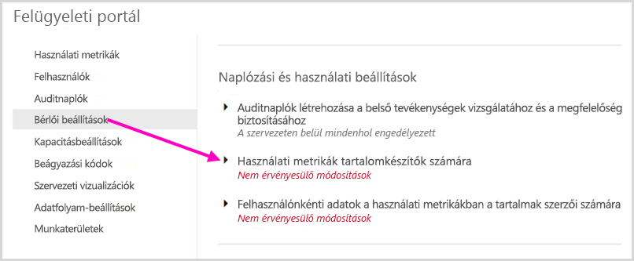
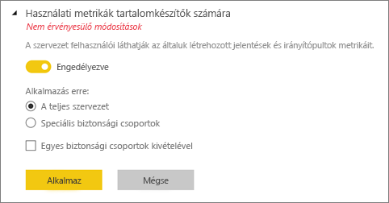
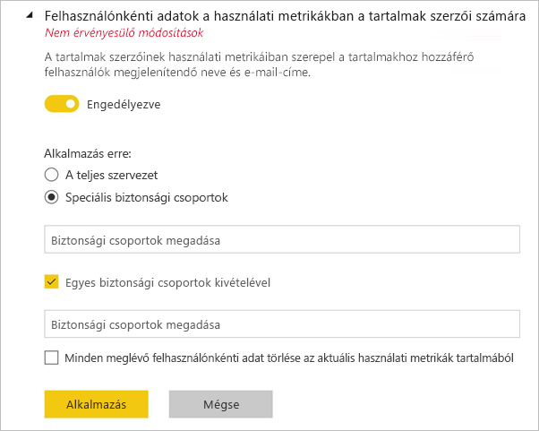
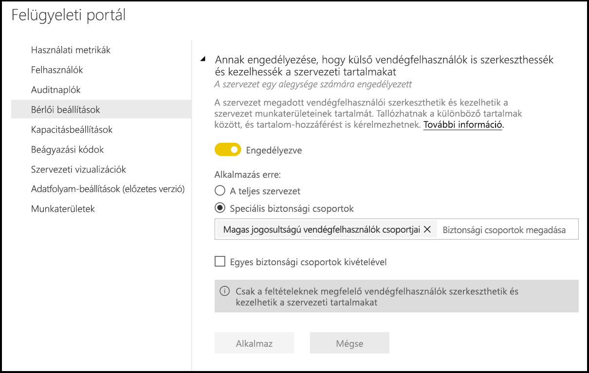
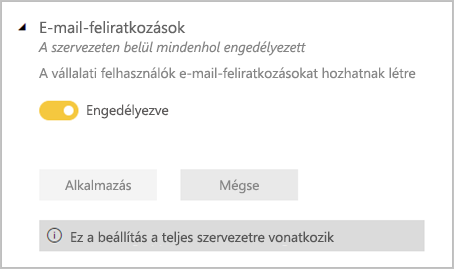
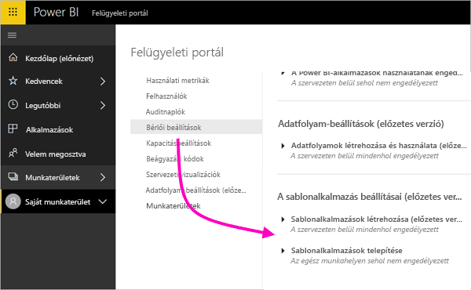
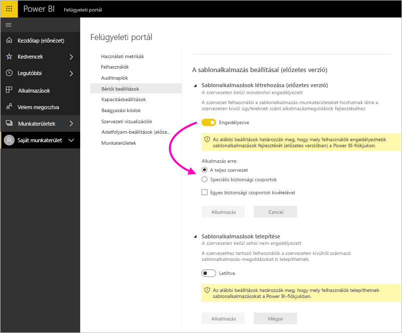
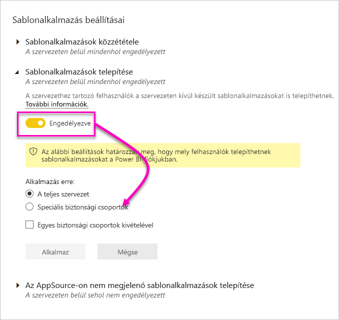
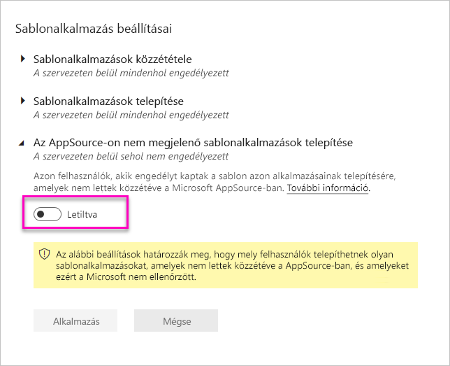
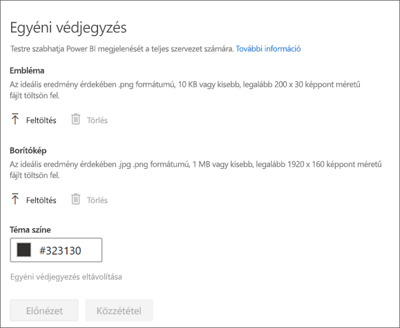

# A Power BI felügyelete a felügyeleti portálon

A felügyeleti portál segítségével kezelheti a szervezetéhez tartozó Power BI-*bérlőt*. A portál olyan lehetőségeket kínál, mint például a használati metrikák, hozzáférés a Microsoft 365 Felügyeleti központjához, valamint a beállítások.

Az Office 365 minden globális rendszergazdája hozzáférhet a teljes felügyeleti portálhoz, valamint olyan felhasználók is, akik Power BI-szolgáltatásadminisztrátori szerepkört kaptak. Ha még nem kapott ilyen szerepkörbe, csak a **kapacitásbeállításokat** láthatja a portálon. A Power BI szolgáltatás rendszergazdai szerepkörére vonatkozó további információkat [a Power BI rendszergazdai szerepkörét ismertető](service-admin-role.md) témakör tartalmaz.

## A felügyeleti portál elérése

A Power BI felügyeleti portál eléréséhez az adott fiókot **globális rendszergazdaként** kell megjelölni az Office 365-ben vagy az Azure Active Directoryban, vagy Power BI-szolgáltatásadminisztrátori szerepkört kell hozzárendelni. További információ a Power BI-szolgáltatásadminisztrátori szerepkörről: [A Power BI rendszergazdai szerepkörének ismertetése](service-admin-role.md). A Power BI felügyeleti portál eléréséhez tegye az alábbiakat.

1. Válassza ki a Beállítások fogaskereket a Power BI szolgáltatás jobb felső sarkában.

1. Válassza a **Felügyeleti portál** lehetőséget.

    

A portálon kilenc lap található. A cikk további részében ezen lapokról olvashat.

* [Használati metrikák](#usage-metrics)
* [Felhasználók](#users)
* [Auditnaplók](#audit-logs)
* [Bérlői beállítások](#tenant-settings)
* [Kapacitásbeállítások](#capacity-settings)
* [Beágyazási kódok](#embed-codes)
* [Szervezeti vizualizációk](#organizational-visuals)
* [Adatfolyam-tárolás (előzetes verzió)](#dataflowStorage)
* [Munkaterületek](#workspaces)
* [Egyéni védjegyzés](#custom-branding)

## Használati metrikák

A **Használati metrikák** segítségével nyomon követheti a szervezet Power BI-használatát. Ezenkívül azt is mutatja, hogy mely munkahelyi felhasználók és csoportok a legaktívabbak a Power BI-ban. 

> [!NOTE]
> Az irányítópult első használatakor, vagy ha hosszú idő elteltével keresi fel újra az irányítópultot, egy betöltési képernyő jelenik meg az irányítópult betöltése során.

Miután az irányítópult betöltődött, két szakaszba sorolt csempék jelennek meg. Az első szakasz tartalmazza az egyes felhasználók használati adatait, míg a második szakaszban a munkahelyi csoportok hasonló információi láthatók.

Az alábbiakban az egyes csempéknél megjelenő részletes információkat ismertetjük:

* A felhasználói munkaterület összes irányítópultjának, jelentésének és adatkészletének egyedi darabszáma.
  
    

* A legtöbbet használt irányítópult az ahhoz hozzáférő felhasználók száma szerint. Például ha 3 felhasználóval oszt meg egy irányítópultot, és olyan tartalomcsomaghoz is hozzáadja azt, amelyhez két különböző felhasználó kapcsolódik, a számláló értéke 6 (1 + 3 + 2).
  
    

* A legnépszerűbb tartalom, amelyhez a felhasználók kapcsolódtak. Ez bármi lehet, amelyhez a felhasználók hozzáférhetnek az adatbeolvasási folyamaton keresztül, például szolgáltatott szoftveres tartalomcsomagok, munkahelyi tartalomcsomagok, fájlok vagy adatbázisok.
  
    

* A legaktívabb felhasználókat mutatja az irányítópultok száma alapján, beleértve a felhasználók által létrehozott és a velük megosztott irányítópultok számát.
  
    

* A legaktívabb felhasználókat mutatja a jelentéseik száma alapján.
  
    

A második szakasz ugyanezeket az információkat tartalmazza – a csoportok alapján. Lehetővé teszi annak megtekintését, hogy a munkahely mely csoportjai a legaktívabbak, és milyen típusú tartalmakat használnak fel.

Ezek az információk valós betekintést nyújtanak abba, hogy a felhasználók miként használják a Power BI-t a munkahelyen, és mely munkahelyi felhasználók és csoportok számítanak különösen aktívnak.

## Használati metrikák szabályozása

A használati metrikai jelentés olyan funkció, amelyet a Power BI vagy Office 365 rendszergazdája kapcsolhat be vagy ki. A rendszergazdák részletesen szabályozhatják, hogy mely felhasználók férnek hozzá használati metrikákhoz. Ezek alapértelmezés szerint minden vállalati felhasználó számára **engedélyezve** vannak.

A rendszergazdák azt is meghatározhatják, hogy a tartalomkészítők láthatják-e a felhasználónkénti adatokat a használati metrikák között. 

Magukról a jelentésekről a [Power BI-irányítópultok és -jelentések használati metrikáinak figyelése](service-usage-metrics.md) című szakaszban olvashat részleteket.

### Használati metrikák tartalomkészítők számára

1. A Felügyeleti portálon válassza a **Bérlői beállítások** > **Tartalomkészítőknek szánt használati metrikák** lehetőséget.

    

1. Engedélyezze (vagy tiltsa le) a használati metrikákat > **Alkalmaz**.

    

### Felhasználónkénti adatok a használati metrikákban

Alapértelmezés szerint a felhasználónkénti adatok engedélyezve vannak a használati metrikákhoz, a tartalomfelhasználói fiókadatok pedig szerepelnek a metrikajelentésekben. Ha ezt az információt nem szeretné belefoglalni egyes felhasználók esetében, tiltsa le a funkciót megadott biztonsági csoportok, vagy a teljes szervezet számára. A fiókadatok ekkor *névtelenként* jelennek meg a jelentésben.

### Az összes meglévő használati metrikai tartalom törlése

Ha letiltják a használati metrikákat az egész vállalat számára, a rendszergazdák az alábbi két lehetőség egyikét, vagy mindkettőt is kiválaszthatják:

- Az **összes meglévő használati metrikai tartalom törlése** lehetőséggel törölni tudnak minden meglévő jelentést és irányítópult-csempét, amely a használati metrikai jelentések és adathalmazok használatával készült. Ezen a módon minden használati metrikai adat hozzáférhetetlenné válik a szervezet valamennyi felhasználója számára, akik esetleg már használják is azokat. 
- Az **összes meglévő felhasználói adat törlése az aktuális használati metrikai tartalomban** lehetőséggel minden felhasználónkénti adat hozzáférhetetlenné válik a szervezet valamennyi felhasználója számára, akik esetleg már használják is azokat. 

Fontolja meg ezt a lépést, mert a meglévő használati és felhasználónkénti metrikai tartalom törlése nem vonható vissza.

## Felhasználók

A Power BI-felhasználókat, -csoportokat és -rendszergazdákat a Microsoft 365 Felügyeleti központjában kezelheti. A **Felhasználók** lap tartalmaz egy hivatkozást a bérlő felügyeleti központjára.

## Auditnaplók

A Power BI-naplókat az Office 365 Security & Compliance Centerben kezelheti. A **Auditnaplók** lap tartalmaz egy, a bérlőhöz tartozó Security & Compliance centerre mutató hivatkozást. [További információ](service-admin-auditing.md)

Az auditnaplók használatához engedélyezze a [**Vizsgálati naplók létrehozása belső tevékenységek és megfelelőség vizsgálatához**](#create-audit-logs-for-internal-activity-auditing-and-compliance) beállítást.

## Bérlői beállítások

A **Bérlői beállítások** lap lehetővé teszi a szervezet számára elérhetővé tett funkciók finomhangolt szabályozását. Ha aggályai vannak a bizalmas adatokkal kapcsolatban, a funkciók némelyike esetlegesen nem megfelelő a munkahely számára, vagy csak egy adott funkciót szeretne engedélyezni egy adott csoportnak.

Az alábbi képen a **Bérlői beállítások** lap néhány beállítása látható.

> [!NOTE]
> A beállítás módosításának érvénybe léptetése a bérlő összes felhasználója számára akár 10 percet is igénybe vehet.

A beállítások állapota háromféle lehet:

* **A szervezeten belül sehol nem engedélyezett**: A szervezeten belül senki sem használhatja ezt a funkciót.

    

* **A szervezeten belül mindenhol engedélyezett**: A szervezeten belül mindenki használhatja ezt a funkciót.

    

* **A szervezet egy alegysége számára engedélyezett**: A szervezet felhasználóinak egy adott részhalmaza vagy csoportjai használhatják az adott funkciót.

    Engedélyezhet egy funkciót az egész munkahelyen a felhasználók egy adott csoportja kivételével.

    

    Engedélyezhet egy funkciót a felhasználók egy adott csoportjában, és letilthatja azt a felhasználók egy másik csoportjában. Ezzel a módszerrel garantálható, hogy egyes felhasználók még akkor sem férhetnek hozzá az adott funkcióhoz, ha egyébként benne vannak az engedélyezett csoportban.

    

A következő néhány bekezdés a bérlői beállítások különböző típusainak áttekintését nyújtja.

## Súgó és támogatás beállításai

### Súgóinformációk közzététele

A vállalati felhasználók belső súgó és támogatási forrásokhoz fordulhatnak a Power BI súgó menüjében. Ezek a paraméterek pontosabban a Tanulás, Közösség és Segítség kérése menüelemek viselkedését módosítják.

    

Ha megad egy URL-címet a licenckérésekhez, azzal a **Fiók bővítése** gomb cél-URL-címét szabja testre, amelyet a Power BI Pro-licenccel nem rendelkező felhasználók a **Bővítés Power BI Próra** párbeszédpanelen és a **Személyes tárhely kezelése** oldalon is megtalálhatnak. Emellett a Power BI-ban már nem érhető el **A Pro kiadás ingyenes kipróbálása** gomb ezen a párbeszédpanelen és a Tárolás lapon, hogy a Power BI biztosan megbízhatóan vezesse végig a felhasználókat a szervezetnél a licenckezelési megoldással meghatározott folyamatokon.

### E-mail-értesítések fogadása szolgáltatásbeli kimaradásokról vagy incidensekről

Az e-mail-küldést engedélyező biztonsági csoportok e-mail-értesítéseket fognak kapni, ha ezt a bérlőt érinti egy szolgáltatáskimaradás vagy egy incidens. További információ a [Szolgáltatáskimaradásokkal kapcsolatos értesítésekről](service-interruption-notifications.md).

## Munkaterület beállításai

### Munkaterületek létrehozása

A rendszergazdák a **Munkaterületek létrehozása** beállítással határozhatják meg, hogy a vállalat mely felhasználói hozhatnak létre munkaterületeket az irányítópultok, jelentések és egyéb tartalmak közös használatához. További tudnivalók a [munkaterületekről](service-create-the-new-workspaces.md).

A felügyeleti portálon egy másik szakasz is tartalmaz a bérlőbeli munkaterületekre vonatkozó beállításokat. Ebben a szakaszban rendezheti és szűrheti a munkaterületek listáját, és minden munkaterület adatait megjelenítheti. A részleteket a [Munkaterületek](#workspaces) című szakaszban találja meg.

A felügyeleti portálon azt is szabályozhatja, hogy mely felhasználók rendelkezzenek engedéllyel alkalmazások vállalaton belüli terjesztésére. A részleteket ennek a cikknek [Tartalomcsomagok és alkalmazások közzététele a teljes vállalat számára](#publish-content-packs-and-apps-to-the-entire-organization) című fejezetében találhatja meg.

## Exportálási és megosztási beállítások

### Tartalom megosztása külső felhasználókkal

A munkahelyi felhasználók külső felhasználókkal oszthatnak meg irányítópultokat. További információ a [külső megosztásról](service-share-dashboards.md#share-a-dashboard-or-report-outside-your-organization).

Az alábbi képen azon üzenet látható, amely akkor jelenik meg, ha külső felhasználóval oszt meg tartalmat.

  

### Webes közzététel

A munkahelyi felhasználók a weben tehetnek közzé jelentéseket. [További információ](service-publish-to-web.md)

Az alábbi képen látható a **Fájl** menü egy jelentéshez, ha a **Webes közzététel** beállítás engedélyezve van.

A **Webes közzététel** beállításától függően a felhasználók különféle lehetőségeket láthatnak a felhasználói felületen.

|Funkció |A teljes cég számára engedélyezve |A teljes cég számára letiltva |Speciális biztonsági csoportok   |
|---------|---------|---------|---------|
|A **Webes közzététel** parancs egy jelentés **Fájl** menüjében.|Mindenki számára engedélyezve|Nem mindenki számára látható|Csak az arra jogosult felhasználók vagy csoportok láthatják.|
|A **Beágyazási kódok kezelése** funkció a **Beállítások** közt|Mindenki számára engedélyezve|Mindenki számára engedélyezve|Mindenki számára engedélyezve  * A **Törlés** parancsot csak az arra jogosult felhasználók vagy csoportok érik el. * A **Kód lekérése** mindenki számára engedélyezve van.|
|**Beágyazási kódok** a felügyeleti portálon|Az állapot a következő értékek egyikét jeleníti meg: * Aktív * Nem támogatott * Blokkolva|Állapotként a **Letiltva** jelenik meg|Az állapot a következő értékek egyikét jeleníti meg: * Aktív * Nem támogatott * Blokkolva  Ha egy felhasználónak nincs megfelelő jogosultsága a bérlői beállítások alapján, akkor a **Megsértve** állapot jelenik meg.|
|Meglévő közzétett jelentések|Minden engedélyezve|Minden letiltva|A jelentések továbbra is megjelennek mindenki számára.|

### Adatok exportálása

A munkahelyi felhasználók adatokat exportálhatnak egy csempéről vagy vizualizációból. [További információ](visuals/power-bi-visualization-export-data.md)

Az alábbi képen az adatok exportálásának lehetősége látható egy csempén.

> [!NOTE]
> Az **Adatok exportálása** lehetőség letiltásával azt is megakadályozhatja, hogy a felhasználók az **Elemzés az Excelben** funkciót vagy a Power BI szolgáltatás élő kapcsolatát használják.

### Jelentések exportálása PowerPoint-bemutatóként vagy PDF-dokumentumként

A szervezeten belüli felhasználók PowerPoint-fájlként és PDF-dokumentumként is exportálhatnak Power BI-jelentéseket. [További információ](consumer/end-user-powerpoint.md)

Az alábbi képen látható a **Fájl** menü egy jelentéshez, ha a **Jelentések exportálása PowerPoint-bemutatóként vagy PDF-fájlként** beállítás engedélyezve van.

### Irányítópultok és jelentések nyomtatása

A munkahelyi felhasználók irányítópultokat és jelentéseket nyomtathatnak. [További információ](consumer/end-user-print.md)

Az alábbi képen az irányítópult nyomtatásának lehetősége látható.

Az alábbi képen a jelentéshez tartozó **Fájl** menü látható, ha az **Irányítópultok és jelentések nyomtatása** beállítás engedélyezve van.

### Annak engedélyezése, hogy külső vendégfelhasználók is szerkeszthessék és kezelhessék a szervezeti tartalmakat
Az Azure Active Directory B2B-vendégfelhasználók szerkeszthetik és kezelhetik a szervezeti tartalmakat. [További információ](service-admin-azure-ad-b2b.md)

A következő képen az „Annak engedélyezése, hogy külső vendégfelhasználók is szerkeszthessék és kezelhessék a szervezeti tartalmakat” beállítás látható.

> [!IMPORTANT]
> Amikor külső felhasználót ad hozzá az Azure AD-bérlőhöz (manuálisan vagy jelentés megosztásával), az adott felhasználói fiók felderíthetővé válik a belső fiókok számára. A belső felhasználók így megoszthatnak másokat is a külső felhasználóval akkor is, ha a belső fiók nem rendelkezik külső megosztási engedélyekkel.

### E-mail-feliratkozások
A vállalati felhasználók e-mail-feliratkozásokat hozhatnak létre és használhatnak. További tudnivalók a [feliratkozásokról](service-report-subscribe.md).

## Tartalomcsomag és alkalmazás beállításai

### Tartalomcsomagok és alkalmazások közzététele a teljes szervezet számára

A rendszergazdák ezzel a beállítással határozzák meg, hogy mely felhasználók tehetnek közzé tartalomcsomagokat és alkalmazásokat a teljes vállalat, és nem csak adott csoportok számára. További tudnivalók az [alkalmazások közzétételéről](service-create-distribute-apps.md).

Az alábbi képen a **Teljes saját szervezet** lehetőség látható a tartalomcsomag létrehozásakor.

### Vállalati tartalomcsomagok és alkalmazások sablonjainak létrehozása

A munkahelyi felhasználók sablonalkalmazásokat és vállalati sablon tartalomcsomagokat készíthetnek, amelyek a Power BI Desktop adott adatforrására épülő adathalmazokat használják. További információ a [sablonalkalmazásokról](template-content-pack-authoring.md).

### Alkalmazások küldése a végfelhasználóknak

A jelentéskészítők közvetlenül is megoszthatnak alkalmazásokat a végfelhasználókkal, anélkül, hogy telepíteni kellene azokat az [AppSource](https://appsource.microsoft.com)-ból. További információ: [alkalmazások automatikus telepítése a végfelhasználók számára](service-create-distribute-apps.md#automatically-install-apps-for-end-users).

## Integrálási beállítások

### Az Elemzés az Excelben helyszíni adathalmazokon való használata

A munkahelyi felhasználók az Excel használatával megtekinthetik és használhatják a helyszíni Power BI-adatkészleteket. [További információ](service-analyze-in-excel.md)

> [!NOTE]
> Az **Adatok exportálása** lehetőség letiltásával azt is megakadályozhatja, hogy a felhasználók az **Elemzés az Excelben** funkciót használják.

### Az ArcGIS Maps for Power BI használata

A vállalati felhasználók használhatják az Esri által biztosított ArcGIS Maps for Power BI vizualizációt. [További információ](visuals/power-bi-visualization-arcgis.md)

### A globális keresés használata a Power BI-ban (előzetes verzió)

A vállalati felhasználók használhatják az Azure Searchre épülő külső keresési funkciókat.

## Egyéni vizualizációk beállításai

### Egyéni vizualizációk hozzáadása és használata

A munkahelyi felhasználók egyéni vizualizációkat használhatnak és oszthatnak meg. [További információ](developer/power-bi-custom-visuals.md)

> [!NOTE]
> Ez a beállítás az egész munkahelyre vonatkozhat, de korlátozható meghatározott csoportokra.

A Power BI Desktop (a 2019. márciusi kiadással kezdődően) támogatja a **Csoportházirendek** használatát az egyéni vizualizációk letiltásához a cég összes üzembe helyezett számítógépén.

<table>
<tr><th>Attribútum</th><th>Érték</th>
</tr>
<td>key</td>
    <td>Software\Policies\Microsoft\Power BI Desktop\</td>
<tr>
<td>valueName</td>
<td>EnableCustomVisuals</td>
</tr>
</table>

Az 1 (decimális) érték engedélyezi az egyéni vizualizációk használatát a Power BI-ban (ez az alapértelmezett beállítás).

A 0 (decimális) érték letiltja az egyéni vizualizációk használatát a Power BI-ban.

### Csak hitelesített vizualizációk engedélyezése

A szervezet azon felhasználói, akik engedélyt kaptak egyéni vizualizációk hozzáadására és használatára (őket „Egyéni vizualizációk hozzáadása és használata” beállítás jelzi), csak a [hitelesített egyéni vizualizációkat](https://go.microsoft.com/fwlink/?linkid=2002010) használhatják (a nem hitelesített vizualizációk le lesznek tiltva, használatuk esetén hibaüzenet jelenik meg). 

A Power BI Desktop (a 2019. márciusi kiadással kezdődően) támogatja a **Csoportházirendek** használatát a tanúsítvány nélküli egyéni vizualizációk letiltásához a cég összes üzembe helyezett számítógépén.

<table>
<tr><th>Attribútum</th><th>Érték</th>
</tr>
<td>key</td>
    <td>Software\Policies\Microsoft\Power BI Desktop\</td>
<tr>
<td>valueName</td>
<td>EnableUncertifiedVisuals</td>
</tr>
</table>

Az 1 (decimális) érték engedélyezi a tanúsítvány nélküli egyéni vizualizációk használatát a Power BI-ban (ez az alapértelmezett beállítás).

A 0 (decimális) érték letiltja a tanúsítvány nélküli egyéni vizualizációk használatát a Power BI-ban (ez a beállítás csak a [tanúsítvánnyal rendelkező egyéni vizualizációkat engedélyezi](https://go.microsoft.com/fwlink/?linkid=2002010)).

## R-vizualizációk beállításai

### R-vizualizációk kezelése és megosztása

A munkahelyi felhasználók R-szkriptekkel készült vizualizációkat használhatnak és oszthatnak meg. [További információ](visuals/service-r-visuals.md)

> [!NOTE]
> Ez a beállítás az egész munkahelyre vonatkozik, és nem lehet korlátozni meghatározott csoportokra.

## Naplózási és használati beállítások

### Auditnaplók létrehozása a belső tevékenységek vizsgálatához és a megfelelőség biztosításához

A felhasználók a naplózással nyomon követhetik, hogy a munkahely más felhasználói milyen műveleteket hajtottak végre a Power BI-ban. [További információ](service-admin-auditing.md)

Az auditnapló bejegyzéseinek rögzítéséhez engedélyezni kell ezt a beállítást. Akár 48 órás késés is lehet a naplózás engedélyezése és a naplózási adatok megtekinthetővé válása között. Ha nem látja azonnal adatokat, ellenőrizze később az auditnaplókat. Hasonló késés lehet az auditnaplók megtekintési engedélyének megkapása és a naplók elérésének lehetővé válása között.

> [!NOTE]
> Ez a beállítás az egész munkahelyre vonatkozik, és nem lehet korlátozni meghatározott csoportokra.

### Használati metrikák tartalomkészítők számára

A munkahelyi felhasználók láthatják az általuk létrehozott jelentések és irányítópultok használati metrikáit. [További információ](service-usage-metrics.md)

### Felhasználónkénti adatok a használati metrikákban a tartalmak szerzői számára

A tartalmak szerzőinek használati metrikáiban szerepel a tartalmakhoz hozzáférő felhasználók megjelenítendő neve és e-mail-címe. [További információ](service-usage-metrics.md)

A felhasználónkénti adatok alapértelmezés szerint engedélyezve vannak a használati metrikákhoz, a tartalomkészítői fiókadatok pedig szerepelnek a metrikák jelentéseiben. Ha ezt az információt nem szeretné összegyűjteni az összes felhasználó esetében,letilthatja a funkciót megadott biztonsági csoportok vagy a teljes szervezet számára. A fiókadatok a kizárt felhasználók esetén ekkor *névtelenként* jelennek meg a jelentésben.

## Irányítópult beállításai

### Irányítópultok adatainak besorolása

A munkahelyi felhasználók a biztonsági szint besorolását jelző címkékkel láthatják el az irányítópultokat. [További információ](service-data-classification.md)

> [!NOTE]
> Ez a beállítás az egész munkahelyre vonatkozik, és nem lehet korlátozni meghatározott csoportokra.

## Fejlesztői beállítások

### Tartalom beágyazása alkalmazásokba

A munkahelyi felhasználók beágyazhatnak Power BI-irányítópultokat és -jelentéseket szolgáltatott szoftveres (SaaS-) alkalmazásokba. A beállítás kikapcsolásával megakadályozhatja, hogy a felhasználók a REST API-k használatával Power BI-tartalmakat ágyazzanak be saját alkalmazásukba. [További információ](developer/embedding.md)

### A Power BI API-k használatának engedélyezése szolgáltatásneveknek

Az Azure Active Directoryban (Azure AD-ben) regisztrált webalkalmazások hozzárendelt szolgáltatásnevet használnak a Power BI API-k elérésére anélkül, hogy a felhasználónak be kellene jelentkeznie. Egy alkalmazás számára akkor lehet engedélyezni a szolgáltatásnévvel történő hitelesítést, ha a szolgáltatásneve szerepel egy engedélyezett biztonsági csoportban. [További információ](developer/embed-service-principal.md)

> [!NOTE]
> A szolgáltatásnevek a biztonsági csoportjukból öröklik az engedélyeket a Power BI összes bérlői beállításához. Az engedélyek korlátozásához hozzon létre egy külön biztonsági csoportot a szolgáltatásneveknek, majd adja hozzá az Egyes biztonsági csoportok kivételével listához a vonatkozó, engedélyezett Power BI-beállítások esetében.

## Adatfolyam-beállítások

### Adatfolyamok létrehozása és használata

A vállalati felhasználók létrehozhatnak és használhatnak adatfolyamokat. További információ az adatfolyamokról: [Önkiszolgáló adatelőkészítés a Power BI-ban](service-dataflows-overview.md). Az adatfolyamok prémium szintű kapacitásban való engedélyezéséről lásd: [Számítási feladatok konfigurálása](service-admin-premium-workloads.md).

> [!NOTE]
> Ez a beállítás az egész munkahelyre vonatkozik, és nem lehet korlátozni meghatározott csoportokra.

## Sablonalkalmazások beállításai

Három beállítás szabja meg, hogy egy sablonalkalmazás képes-e sablonalkalmazásokat közzétenni vagy telepíteni.

### Sablonalkalmazások közzététele

A vállalati felhasználók sablon alkalmazás-munkaterületeket hozhatnak létre. Az [AppSource](https://appsource.microsoft.com) vagy más terjesztési mód segítségével szabályozható, hogy mely felhasználók tehetnek közzé vagy terjeszthetnek a vállalaton kívüli ügyfelek között sablonalkalmazásokat.

### Az AppSource-on megjelenő sablonalkalmazások telepítése

A vállalati felhasználók **csak** az [AppSource](https://appsource.microsoft.com)-ról tölthetnek le és telepíthetnek alkalmazásokat. Megadható, hogy mely felhasználók vagy biztonsági csoportok telepíthetnek sablonalkalmazásokat az AppSource-ról.

### Az AppSource-on nem megjelenő sablonalkalmazások telepítése

Megadható, hogy mely vállalati felhasználók tölthetnek le és telepíthetnek **az [AppSource](https://appsource.microsoft.com)-on nem megjelenő** sablonalkalmazásokat.

## Kapacitásbeállítások

### Power BI Premium

A **Power BI Premium** lapon a munkahely által megvásárolt bármely Power BI Premium-kapacitás (EM vagy P termékváltozat) felügyelhető. A munkahely minden felhasználója láthatja a **Power BI Premium** lapot, de annak tartalma csak akkor jelenik meg, ha az adott felhasználó *kapacitás-rendszergazda* vagy rendelkezik a szükséges engedélyekkel. Ha a felhasználó nem rendelkezik ilyen engedéllyel, az alábbi üzenet jelenik meg.

### Power BI Embedded

A **Power BI Embedded** lapon megtekintheti az ügyfél számára vásárolt Power BI Embedded (A termékváltozat) kapacitásait. Mivel az A termékváltozatot csak az Azure-tól szerezheti be, a [beágyazott kapacitások Azure-ban való kezelésére](developer/azure-pbie-create-capacity.md) **az Azure Portalt** kell használnia.

A Power BI Embedded (A termékváltozat) beállításainak kezeléséről további információért lásd a [Mi a Power BI Embedded](developer/azure-pbie-what-is-power-bi-embedded.md) szakaszt.

## Beágyazási kódok

A rendszergazdák megnézhetik a bérlő számára generált beágyazási kódokat. A kódokat vissza is vonhatja, vagy törölheti. [További információ](service-publish-to-web.md)

 ## <a name="organizational-visuals">Szervezeti vizualizációk</a> 

A **Szervezeti vizualizációk** lapon egyéni vizualizációkat helyezhet üzembe és kezelhet a cégen belül. A szervezeti vizualizációk segítségével egyszerűen helyezhet üzembe szellemi tulajdont képező vizualizációkat, a szerzők pedig láthatják a jelentéseket és importálhatják a saját jelentéseikbe a Power BI Desktopból. [További információ](developer/power-bi-custom-visuals-organization.md)

> [!WARNING]
> Az egyéni vizualizációk biztonsági vagy adatvédelmi kockázatot jelentő kódokat tartalmazhatnak, ezért az adattárban való üzembe helyezés előtt ellenőrizze, hogy megbízható-e a vizualizáció szerzője és forrása.

A következő képen látható az összes olyan egyéni vizualizáció, amely jelenleg megtalálható a szervezet adattárában.

### Új egyéni vizualizáció hozzáadása

Új egyéni vizualizáció hozzáadásához kövesse az alábbi lépéseket. 

1. A jobb oldali ablaktáblán válassza ki az **Egyéni vizualizáció hozzáadása** lehetőséget.

    

1. Töltse ki az **Egyéni vizualizáció hozzáadása** űrlapot:

    * **Válasszon egy .pbiviz-fájlt** (kötelező): Válasszon ki egy feltöltendő egyéni vizualizációs fájlt. Csak a verziószámmal ellátott API-s vizualizációk támogatottak (itt elolvashatja, ez mit jelent).

    Az egyéni vizualizációk feltöltése előtt át kell tekintenie a vizualizációt biztonsági és adatvédelmi szempontból, hogy biztosan megfeleljen a szervezet igényeinek.

    * **Nevezze el az egyéni vizualizációkat** (kötelező): Adjon egy rövid címet a vizualizációnak, hogy a Power BI Desktop felhasználói könnyen megértsék a rendeltetését.

    * **Ikon**: A Power BI Desktop felhasználói felületén megjelenő ikonfájl.

    * **Leírás**: A vizualizáció rövid leírása, amely több információt szolgáltat a felhasználónak

1. Kattintson a **Hozzáadás** lehetőségre a feltöltés kérelmezéséhez. Ha ez sikeres, az új elem megjelenik a listában. Ha nem, egy ennek megfelelő hibaüzenet jelenhet meg

### Egyéni látványelem törlése a listából

A vizualizáció végleges törléséhez kattintson az adattárban lévő vizualizációhoz tartozó kuka ikonra.

> [!IMPORTANT]
> A törlés nem vonható vissza. A törölt vizualizációk azonnal abbahagyják a renderelést a meglévő jelentésekben. A törölt változatot még ugyanazon vizualizáció ismételt feltöltése sem helyettesíti. A felhasználók azonban újraimportálhatják a vizualizációt, és pótolhatják azt a jelentéseikben.

### Egyéni látványelem letiltása a listában

A vizualizáció szervezeti áruházból való letiltásához válassza a fogaskerék ikont. A **Hozzáférés** szakaszban, tiltsa le az egyéni vizualizációt.

Miután letiltja a vizualizációt, az nem fog megjelenni a meglévő jelentésekben, és az alábbi hibaüzenet jelenik meg.

*Ez az egyéni vizualizáció már nem érhető el. További információért forduljon a rendszergazdához.*

Azonban a könyvjelzőzött vizualizációk továbbra is működnek.

Frissítés vagy rendszergazdai módosítás után a Power BI felhasználóinak újra kell indítaniuk az alkalmazást, vagy a Power BI szolgáltatás használata esetén frissíteniük kell a böngészőt a frissítések megjelenítéséhez.

### Vizualizáció frissítése

A vizualizáció munkahelyi áruházból való feltöltéséhez kattintson a fogaskerék ikonra. Keresse meg és töltse fel a vizualizáció új verzióját.

Győződjön meg róla, hogy a vizuális azonosító ugyanaz maradt. Az új fájl az előző fájlt helyére kerül a jelentésekben az egész vállalatnál. Ha azonban a vizualizáció új verziója megbontja az előző verziójának valamely használati vagy adatstruktúráját, akkor ne cserélje le az előző verziót. Ehelyett hozzon létre egy új listázást a vizualizáció új verziójához. Például adjon hozzá egy új verziószámot (X.X verzió) az új listázott vizualizáció címéhez. Ezáltal nyilvánvalóvá válik, hogy ez ugyanaz a vizualizáció, de frissített verziószámmal, így a meglévő jelentések működése nem hibásodik meg. Most is győződjön meg róla, hogy a vizuális azonosító ugyanaz maradt. Így amikor a felhasználók legközelebb belépnek a szervezeti adattárba a Power BI Desktopból, importálhatják az új verziót, amely kérni fogja őket, hogy cseréljék le a jelentésben található jelenlegi verziót.

További információt [az egyéni vállalati vizualizációkkal kapcsolatos gyakori kérdések](https://docs.microsoft.com/power-bi/power-bi-custom-visuals-faq#organizational-visuals) között talál.

## <a name="dataflowStorage">Adatfolyam-tárolás (előzetes verzió)</a>

A Power BI-jal használt adatok alapértelmezés szerint a Power BI által biztosított belső tárolóban helyezkednek el. Az adatfolyamok és az Azure Data Lake Storage Gen2 (ADLS Gen2) integrációjának köszönhetően adatfolyamait vállalata Azure Data Lake Storage Gen2-fiókjában is tárolhatja. További információt az [Adatfolyamok és az Azure Data Lake integrációja (előzetes verzió)](service-dataflows-azure-data-lake-integration.md) című cikkben talál.

## Munkaterületek

Rendszergazdaként megtekintheti a bérlőjében meglévő munkaterületeket. Rendezheti és szűrheti a munkaterületek listáját, és minden munkaterület adtait megjelenítheti. A táblázat oszlopai a munkaterületek a [Power BI felügyeleti Rest API](/rest/api/power-bi/admin) által visszaadott tulajdonságainak felelnek meg. A személyes munkaterületek típusa **PersonalGroup**, a klasszikus munkaterületeké **Group**, az új felületű munkaterületek pedig **Workspace** típusúak. További információk: [Új munkaterületek létrehozása a Power BI-ban](service-create-the-new-workspaces.md).

A **Munkaterületek** lapon megtekintheti az egyes munkaterületek *állapotát*. Az alábbi táblázat részletesebben is ismerteti ezen állapotok jelentését.

|Állam  |Leírás  |
|---------|---------|
| Aktív | Normál munkaterület. Nem árul el semmit a felhasználásról vagy a tartalomról, csak annyit, hogy maga a munkaterület „normális”. |
| Árva | Rendszergazda-jogú felhasználó nélküli munkaterület. |
| Törölve | Törölt munkaterület. Elég metaadatot tartunk meg ahhoz, hogy a munkaterületet szükség esetén helyreállítsa. |
| Eltávolítás folyamatban | A munkaterület törlése folyamatban van, de még nem szűnt meg. A felhasználók törölhetik saját munkaterületeiket, először Eltávolítás folyamatban, majd végül Törölve állapotba léptetve azokat. |

## Egyéni védjegyzés

Rendszergazdaként a teljes szervezet számára testreszabhatja a Power BI kinézetét. Jelenleg három fő lehetőség közül választhat:

* **Embléma feltöltése**: Az ideális eredmény érdekében .png formátumú, 10 KB vagy kisebb, legalább 200 x 30 képpont méretű fájlt töltsön fel.

* **Borítókép feltöltése**: Az ideális eredmény érdekében .jpg .png formátumú, 1 MB vagy kisebb, legalább1920 x 160 képpont méretű fájlt töltsön fel.

* **Témaszín kiválasztása**: Témaszínt hexadecimális, RGB, érték, vagy színskála alapján választhat.

További információ: [Céges egyéni védjegyzés](https://aka.ms/orgBranding).

## Következő lépések

[A Power BI felügyelete a munkahelyen](service-admin-administering-power-bi-in-your-organization.md)  
[A Power BI rendszergazdai szerep ismertetése](service-admin-role.md)  
[A Power BI-naplózás használata a munkahelyen](service-admin-auditing.md)  

További kérdései vannak? [Kérdezze meg a Power BI közösségét](https://community.powerbi.com/)
