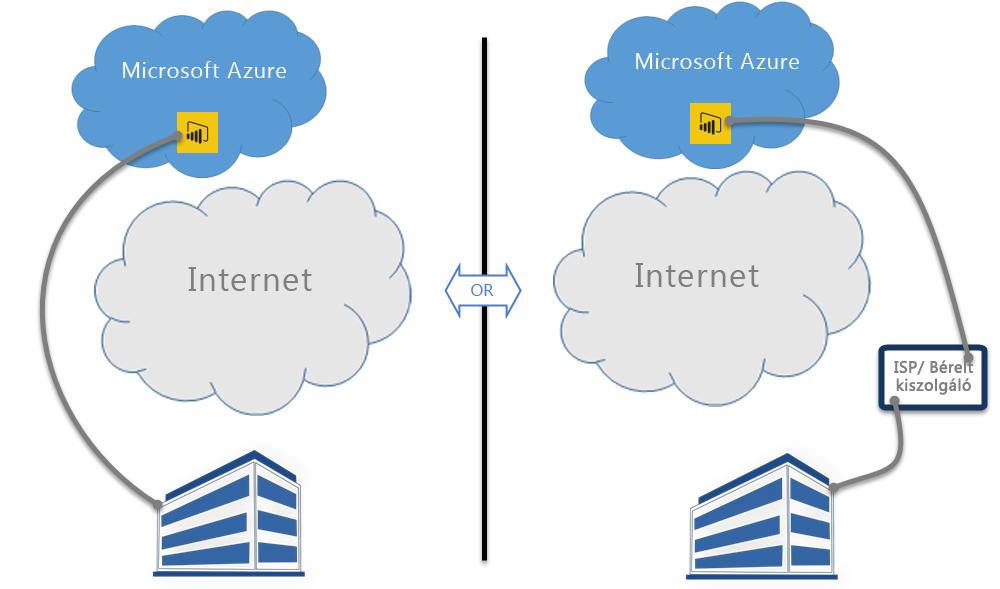

# A Power BI és az ExpressRoute

Az **ExpressRoute** egy olyan Azure-szolgáltatás, amely magánkapcsolatok létrehozását teszi lehetővé az Azure-adatközpontok (ahol a Power BI is található) és a saját helyszíni infrastruktúrája vagy bérelt kiszolgálói környezete között.

A **Power BI** és az **ExpressRoute** közös használatával létrehozhat egy hálózati magánkapcsolatot a vállalata és a Power BI között (vagy egy internetszolgáltatótól bérelhető kiszolgálói létesítmény között), így megkerülheti az Internetet, és jobb védelmet biztosíthat érzékeny Power BI-adatai és -kapcsolatai számára.

További információkat az [ExpressRoute áttekintésében](/azure/expressroute/expressroute-introduction) találhat. A Power BI használható az ExpressRoute-tal, azonban van néhány olyan kivétel, amikor a Power BI a nyilvános interneten keresztül fogad vagy küld adatokat. A Power BI által használt URL-ek listáját megtekintheti a [Power BI URL-címei](power-bi-whitelist-urls.md) című témakörben.

