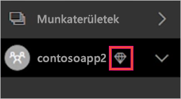
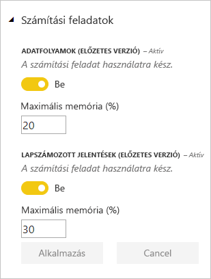

# Kapacitáskezelés a Power BI Premium és a Power BI Embedded szolgáltatással

Megtudhatja, hogyan kezelheti a Power BI Premium és a Power BI Embedded kapacitásait, amelyek dedikált erőforrásokat biztosítanak az Ön tartalmai számára.

## Mi az a kapacitás?

A *kapacitás* a Power BI Premium- és a Power BI Embedded-ajánlatok legfontosabb eleme. Ez egy olyan erőforráskészlet, amely kizárólag az Ön intézménye számára van fenntartva. A dedikált kapacitással irányítópultokat, jelentéseket és adathalmazokat tehet közzé a szervezet felhasználóinak anélkül, hogy felhasználónkénti licenceket kellene vásárolnia számukra. A dedikált kapacitás emellett megbízható, egyenletes teljesítményt biztosít az így üzemeltetett tartalmakhoz. További információ: [A Power BI Premium bemutatása](service-premium.md).

### Kapacitás-rendszergazdák

Ha Ön egy *kapacitás rendszergazdája* lesz, teljes körű felügyelettel rendelkezik a kapacitás és annak rendszergazdai funkciói felett. A Power BI felügyeleti portálon további kapacitás-rendszergazdákat adhat hozzá, vagy kapacitás-hozzárendelési engedélyeket adhat a felhasználóknak. Egy kapacitáshoz tömegesen rendelhet hozzá munkaterületeket, és megtekintheti a kapacitás használati metrikáit.

> [!NOTE]
> A Power BI Embedded kapacitás-rendszergazdái a Microsoft Azure Portalon adhatók meg.

Minden kapacitás saját rendszergazdával rendelkezik. Azzal, hogy kapacitás-rendszergazdát rendel egy adott kapacitáshoz, még nem ad hozzáférést a szervezet összes kapacitásához a rendszergazdának. A kapacitás-rendszergazdáknak alapértelmezés szerint nincs hozzáférésük a Power BI összes rendszergazdai felületéhez, például a használati metrikákhoz, az auditnaplókhoz és a bérlői beállításokhoz. A kapacitás-rendszergazdák továbbá nem hozhatnak létre új kapacitásokat, és nem módosíthatják a meglévő kapacitások termékváltozatait. Ezekhez az elemekhez csak az Office 365 globális rendszergazdái és a Power BI szolgáltatásadminisztrátorai férhetnek hozzá.

Az Office 365 globális rendszergazdái és a Power BI szolgáltatásadminisztrátorai automatikusan a Power BI Premium-kapacitás és a Power BI Embedded-kapacitás rendszergazdáivá is válnak.

## Kapacitás vásárlása

A dedikált kapacitás használatához meg kell vásárolnia a Power BI Premiumot az Office 365 Felügyeleti központban, vagy létre kell hoznia egy Power BI Embedded-erőforrást a Microsoft Azure Portalon. További információért tekintse át a következő cikkeket:

* **Power BI Premium:** [A Power BI Premium megvásárlása](service-admin-premium-purchase.md)

* **Power BI Embedded:** [Power BI Embedded-kapacitás létrehozása az Azure Portalon](https://docs.microsoft.com/azure/power-bi-embedded/create-capacity)

A Power BI Premium vagy Embedded termékváltozatok megvásárlásakor a bérlő a vásárlásnak megfelelő számú virtuális magot kap, amelyet a futó kapacitásokban használhat. Például a Power BI Premium P3 SKU megvásárlásakor a bérlő 32 virtuális magot kap. További információ a termékváltozatokról: [Prémium szintű kapacitást használó csomópontok](service-premium.md#premium-capacity-nodes).

## A prémium szintű kapacitás a végfelhasználók szemével

Az esetek többségében a felhasználónak nem kell tudnia róla, hogy prémium szintű kapacitást használ, amíg az irányítópultjai és jelentései működnek. Vizuális utalásként a prémium szintű kapacitás munkaterületeit gyémánt ikon jelzi.

## Számítási feladatok konfigurálása

Egy Power BI-beli számítási feladat felfogható a felhasználók számára felkínálható számos szolgáltatás egyikeként. A **Power BI Premium** és a **Power BI Embedded** kapacitásai alapértelmezés szerint csak a Power BI-lekérdezések felhőbeli futtatásával társított számítási feladatot támogatják.

Most két további számítási feladathoz kínálunk előzetes verziójú támogatást: a **lapszámozott jelentésekhez**, és az **adatfolyamokhoz**. Ezek a számítási feladatok a Power BI felügyeleti portálján, vagy a Power BI REST API-n keresztül engedélyezhetők. Beállíthatja az egyes számítási feladatok által felhasználható memória maximumát is, hogy szabályozni tudja a különböző számítási feladatok egymásra gyakorolt hatását.

### Számítási feladatok engedélyezése a Power BI felügyeleti portálján

Számítási feladatokat a következő lépésekkel engedélyezhet.

1. A **Kapacitásbeállítások** alatt válasszon kapacitást.

1. A **TOVÁBBI LEHETŐSÉGEK** alatt bontsa ki a **Számítási feladatok** elemet.

1. Engedélyezzen egy vagy több számítási feladatot, és állítsa be a **Maximális memória** értékét.

    

1. Kattintson az **Alkalmaz** elemre.

### Alapértelmezett memóriabeállítások

Az alábbi táblázat a különböző elérhető [kapacitás-csomópontokon](service-premium.md#premium-capacity-nodes) alapuló alapértelmezett és minimális memóriaértékeket ismerteti. A memória adatfolyamokhoz dinamikusan, lapszámozott jelentésekhez viszont statikusan van lefoglalva. További információt a következő, [Szempontok lapszámozott jelentések esetén](#considerations-for-paginated-reports) című szakaszban talál.

|                     | EM3                      | P1                       | P2                      | P3                       |
|---------------------|--------------------------|--------------------------|-------------------------|--------------------------|
| Oldalakra osztott jelentések | N.A. | Alapértelmezés szerint 20%; minimum 10% | Alapértelmezés szerint 20%; minimum 5% | Alapértelmezés szerint 20%; minimum 2,5% |
| Adatfolyamok | Alapértelmezés szerint 15%; minimum 8%  | Alapértelmezés szerint 15%; minimum 4%  | Alapértelmezés szerint 15%; minimum 2% | Alapértelmezés szerint 15%; minimum 1%  |
| | | | | |

### Szempontok lapszámozott jelentések esetén

A „lapszámozott jelentések” számítási feladat használata során a következőket tartsa szem előtt.

* **Memóriafoglalás lapszámozott jelentésekben**: A lapszámozott jelentések lehetővé teszik, hogy a jelentés renderelése során saját kódot futtasson (például dinamikusan változtassa a szövegszínt a tartalom alapján). Ezt figyelembe véve, a Power BI Premium-kapacitás védelme érdekében a lapszámozott jelentéseket a kapacitás egy korlátozott területén belül futtatjuk. Ehhez a területhez az Ön által megadott maximális memóriát foglaljuk le, akár aktív a számítási feladat, akár nem. Ha egy kapacitásban több Power BI-jelentést vagy -adatfolyamot használ, ügyeljen rá, hogy a lapszámozott jelentésekhez kellően alacsony memóriakorlátot adjon meg, hogy azok ne befolyásolhassák hátrányosan a többi számítási feladatot.

* **A lapszámozott jelentések nem elérhetők**: Ritkán előfordulhat, hogy a „lapszámozott jelentések” számítási feladat elérhetetlenné válik. Ilyen esetben a számítási feladat hibás állapotot jelez a felügyeleti portálon, a felhasználók pedig időtúllépést tapasztalnak a jelentés renderelése során. A probléma megoldásához tiltsa le, majd engedélyezze újra a számítási feladatot.

## Kapacitáshasználat monitorozása

A Power BI biztosít egy alkalmazást a kapacitás használatának monitorozásásra. További információ: [A Power BI Premium kapacitásának figyelése a cégnél](service-admin-premium-monitor-capacity.md).

## Kapacitás kezelése

A kapacitás-csomópontok Office 365-ben való megvásárlása után a kapacitást a Power BI felügyeleti portálján hozhatja létre. A Power BI Premium-kapacitásokat a portál **Kapacitásbeállítások** területén kezelheti.

Az adott kapacitás kezeléséhez jelölje ki a kapacitás nevét. Ekkor megjelenik a kapacitáskezelési képernyő.

Ha a kapacitáshoz még nem rendelt munkaterületet, megjelenik egy üzenet, amely tájékoztatja [a munkaterület kapacitáshoz való hozzárendeléséről](#assign-a-workspace-to-a-capacity).

### Új kapacitás beállítása (Power BI Premium)

A felügyeleti portálon látható a felhasznált és a rendelkezésre álló *virtuális magok* száma. A virtuális magok teljes száma a megvásárolt prémium szintű termékváltozattól függ. P3 és P2 vásárlásakor például 48 mag áll rendelkezésre – 32 a P3-ból és 16 a P2-ből.

Ha rendelkezik szabad virtuális magokkal, az új kapacitást az alábbi lépésekkel hozhatja létre.

1. Válassza az **Új kapacitás beállítása** lehetőséget.

1. Adjon nevet a kapacitásnak.

1. Adja meg a kapacitás rendszergazdáját.

1. Válassza ki a kapacitás méretét. Az elérhető lehetőségek attól függnek, hogy mennyi virtuális maggal rendelkezik. Olyan lehetőséget nem választhat, amely nagyobb az elérhető virtuális magok számánál.

    

1. Válassza a **Beállítás** lehetőséget.

    

A kapacitás-rendszergazdák, a Power BI-rendszergazdák és az Office 365 globális rendszergazdái ettől kezdve látják a kapacitást a felügyeleti portálon.

### Kapacitásbeállítások

1. A beállításokat a prémium szintű kapacitáskezelési képernyő **Műveletek** területén, a **fogaskerék ikon** kiválasztásával tekintheti át és frissítheti. 

    

1. Megtekintheti a szolgáltatás-rendszergazdákat, valamint a kapacitás termékváltozatát, méretét és régióját.

    

1. Át is nevezhet vagy törölhet is kapacitásokat.

    

> [!NOTE]
> A Power BI Embedded-kapacitásbeállításokat a Microsoft Azure Portalon kezelheti.

### Kapacitás méretének módosítása

A Power BI Premium-kapacitásokat a Power BI-rendszergazdák és az Office 365 globális rendszergazdái módosíthatják. Más kapacitás-rendszergazdák erre nem jogosultak.

1. Válassza a **Kapacitás méretének módosítása** elemet.

    

1. A **Kapacitás méretének módosítása** képernyőn igény szerint módosíthatja a kapacitást.

    

    A rendszergazdák szabadon hozhatnak létre, méretezhetnek át és törölhetnek csomópontokat, amennyiben rendelkeznek a megfelelő számú virtuális maggal.

    A P termékváltozatok nem minősíthetők vissza EM termékváltozatokká. Ha az egérmutatót a letiltott beállítás fölé húzza, megjelenik a hozzá tartozó magyarázat.

### Felhasználói engedélyek kezelése

Hozzárendelhet további kapacitás-rendszergazdákat és *kapacitás-hozzárendelési* engedéllyel rendelkező felhasználókat. Egy hozzárendelési engedéllyel rendelkező felhasználó alkalmazás-munkaterületet rendelhet egy kapacitáshoz, ha az adott felhasználó a munkaterület rendszergazdája. Emellett a *saját munkaterületüket* is hozzárendelhetik a kapacitáshoz. A hozzárendelési engedéllyel rendelkező felhasználók nem férhetnek hozzá a felügyeleti portálhoz.

> [!NOTE]
> A Power BI Embedded kapacitás-rendszergazdái a Microsoft Azure Portalon adhatók meg.

A **Felhasználói engedélyek** területen bontsa ki a **Hozzárendelési engedélyekkel rendelkező felhasználók** csomópontot, majd igény szerint adjon hozzá felhasználókat vagy csoportokat.

## Munkaterület hozzárendelése kapacitáshoz

Kétféle módon rendelhető munkaterület egy kapacitáshoz: a felügyeleti portálon keresztül vagy egy alkalmazás-munkaterületről.

### Hozzárendelés a felügyeleti portálról

A kapacitás-rendszergazdák, a Power BI-rendszergazdák és az Office 365 globális rendszergazdái tömegesen is hozzárendelhetnek munkaterületeket a felügyeleti portál prémium szintű kapacitáskezelési területén. A kapacitáskezeléskor látható a **Munkaterületek** szakasz, amelyen hozzárendelheti a munkaterületeket.

1. Válassza a **Munkaterületek hozzárendelése** lehetőséget. Ez a beállítás több helyen is elérhető.

1. Válasszon egy lehetőséget az **Alkalmazás a következőre** mezőben.

    

   | Kiválasztás | Leírás |
   | --- | --- |
   | **Munkaterületek felhasználók szerint** | Ha felhasználó vagy csoport alapján rendel hozzá munkaterületet, a megadott felhasználók tulajdonában lévő minden munkaterület a prémium szintű kapacitáshoz lesz rendelve, beleértve a felhasználó saját munkaterületét. Az érintett felhasználók automatikusan munkaterület-hozzárendelési engedélyt is kapnak, amely a más kapacitásokhoz rendelt munkaterületekre is érvényes. |
   | **Adott munkaterületek** | Adja meg egy munkaterület nevét a kiválasztott kapacitáshoz történő hozzárendeléshez. |
   | **A teljes cég munkaterületei** | Ha a prémium szintű kapacitáshoz a teljes szervezet munkaterületeit hozzárendeli, azzal a szervezet valamennyi alkalmazás-munkaterületét és saját munkaterületét ehhez a prémium szintű kapacitáshoz rendeli. Emellett minden jelenlegi és jövőbeli felhasználó engedélyt kap az egyéni munkaterületek ehhez a kapacitáshoz való újbóli hozzárendelésére. |
   | | |

1. Kattintson az **Alkalmaz** elemre.

### Hozzárendelés az alkalmazás-munkaterület beállításaiból

Az alkalmazás-munkaterületeket a munkaterület beállításaiban is hozzárendelheti egy prémium szintű kapacitáshoz. Ha egy munkaterületet át szeretne helyezni egy kapacitásba, az adott munkaterületre vonatkozó rendszergazdai engedélyekkel, valamint a kapacitásra vonatkozó esetében kapacitás-hozzárendelési engedélyekkel kell rendelkeznie. Vegye figyelembe, hogy a munkaterületek rendszergazdái bármikor eltávolíthatnak munkaterületeket a prémium szintű kapacitásból.

1. Az alkalmazás-munkaterület szerkesztéséhez válassza a három pont **(. . .)**, majd a **Munkaterület szerkesztése** elemet.

    

1. A **Munkaterület szerkesztése** területen bontsa ki a **Speciális** csomópontot.

1. Válassza ki azt a kapacitást, amelyhez hozzá szeretné rendelni az alkalmazás-munkaterületet.

    

1. Kattintson a **Mentés** gombra.

A mentés után a munkaterület és annak minden tartalma a prémium szintű kapacitásba kerül. A felhasználók számára ez semmilyen szolgáltatáskimaradással nem jár.

## Power BI jelentéskészítő kiszolgáló termékkulcsa

A Power BI jelentéskészítő kiszolgáló termékkulcsát a Power BI felügyeleti portáljának **Kapacitásbeállítások** lapján találja. Ezt csak a globális rendszergazdák vagy a Power BI szolgáltatás-rendszergazdai szerepéhez rendelt felhasználók érhetik el, ha vásároltak egy Power BI Premium SKU-t.

A **Power BI jelentéskészítő kiszolgáló kulcsának** kiválasztásakor megjelenik a termékkulcsot tartalmazó párbeszédpanel. Ezt másolhatja és használhatja a telepítéshez.

További információt [a Power BI jelentéskészítő kiszolgáló telepítését](report-server/install-report-server.md) ismertető témakörben találhat.

## Következő lépések

A közzétett alkalmazásokat megoszthatja a felhasználókkal. További információ: [Alkalmazások létrehozása és terjesztése a Power BI-ban](service-create-distribute-apps.md).

További kérdései vannak? [Kérdezze meg a Power BI közösségét](http://community.powerbi.com/)
