# A Power BI Premium kapacitásainak konfigurálása és kezelése

A Power BI Premium kezeléséhez tartozik a Premium-kapacitások létrehozása, kezelése és figyelése. Ez a cikk részletes útmutatást nyújt. A kapacitások áttekintéséhez tekintse meg a [Premium-kapacitások kezelése](service-premium-capacity-manage.md) című cikket.

Megtudhatja, hogyan kezelheti a Power BI Premium és a Power BI Embedded kapacitásait, amelyek dedikált erőforrásokat biztosítanak az Ön tartalmai számára.

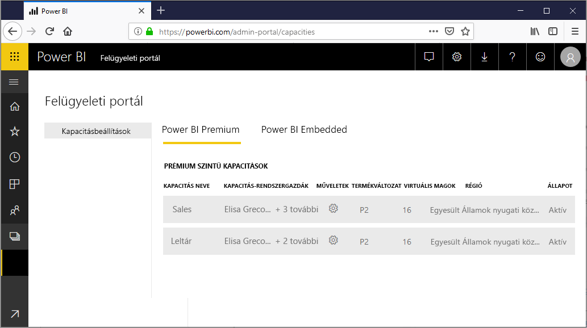

A *kapacitás* a Power BI Premium- és a Power BI Embedded-ajánlatok legfontosabb eleme. Ez egy olyan erőforráskészlet, amely kizárólag az Ön intézménye számára van fenntartva. A dedikált kapacitással irányítópultokat, jelentéseket és adathalmazokat tehet közzé a szervezet felhasználóinak anélkül, hogy felhasználónkénti licenceket kellene vásárolnia számukra. A dedikált kapacitás emellett megbízható, egyenletes teljesítményt biztosít az így üzemeltetett tartalmakhoz. További információ: [A Power BI Premium bemutatása](service-premium.md).

## Kapacitás kezelése

A kapacitás-csomópontok Office 365-ben való megvásárlása után a kapacitást a Power BI felügyeleti portálján hozhatja létre. A Power BI Premium-kapacitásokat a portál **Kapacitásbeállítások** területén kezelheti.

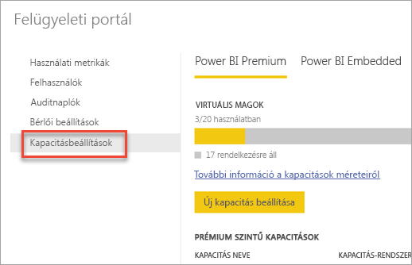

Az adott kapacitás kezeléséhez jelölje ki a kapacitás nevét. Ekkor megjelenik a kapacitáskezelési képernyő.

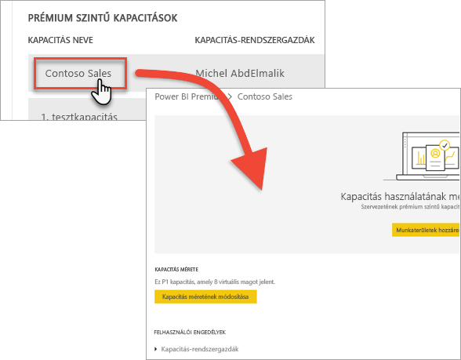

Ha a kapacitáshoz még nem rendelt munkaterületet, megjelenik egy üzenet, amely tájékoztatja [a munkaterület kapacitáshoz való hozzárendeléséről](#assign-a-workspace-to-a-capacity).

### Új kapacitás beállítása (Power BI Premium)

A felügyeleti portálon látható a felhasznált és a rendelkezésre álló *virtuális magok* száma. A virtuális magok teljes száma a megvásárolt prémium szintű termékváltozattól függ. P3 és P2 vásárlásakor például 48 mag áll rendelkezésre – 32 a P3-ból és 16 a P2-ből.

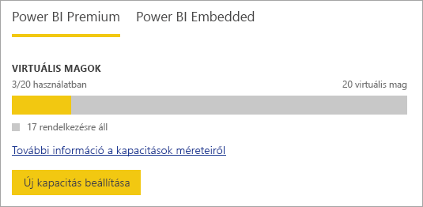

Ha rendelkezik szabad virtuális magokkal, az új kapacitást az alábbi lépésekkel hozhatja létre.

1. Válassza az **Új kapacitás beállítása** lehetőséget.

1. Adjon nevet a kapacitásnak.

1. Adja meg a kapacitás rendszergazdáját.

1. Válassza ki a kapacitás méretét. Az elérhető lehetőségek attól függnek, hogy mennyi virtuális maggal rendelkezik. Olyan lehetőséget nem választhat, amely nagyobb az elérhető virtuális magok számánál.

    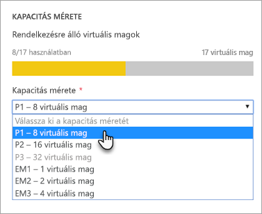

1. Válassza a **Beállítás** lehetőséget.

    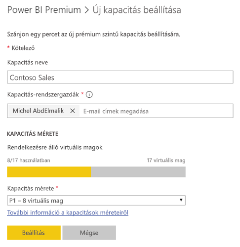

A kapacitás-rendszergazdák, a Power BI-rendszergazdák és az Office 365 globális rendszergazdái ettől kezdve látják a kapacitást a felügyeleti portálon.

### Kapacitásbeállítások

1. A beállításokat a prémium szintű kapacitáskezelési képernyő **Műveletek** területén, a **fogaskerék ikon** kiválasztásával tekintheti át és frissítheti. 

    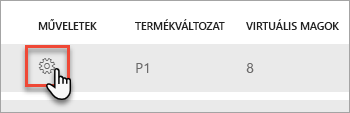

1. Megtekintheti a szolgáltatás-rendszergazdákat, valamint a kapacitás termékváltozatát, méretét és régióját.

    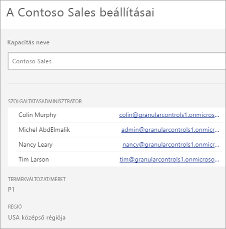

1. Át is nevezhet vagy törölhet is kapacitásokat.

    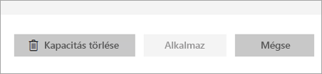

> [!NOTE]
> A Power BI Embedded-kapacitásbeállításokat a Microsoft Azure Portalon kezelheti.

### Kapacitás méretének módosítása

A Power BI Premium-kapacitásokat a Power BI-rendszergazdák és az Office 365 globális rendszergazdái módosíthatják. Más kapacitás-rendszergazdák erre nem jogosultak.

1. Válassza a **Kapacitás méretének módosítása** elemet.

    

1. A **Kapacitás méretének módosítása** képernyőn igény szerint módosíthatja a kapacitást.

    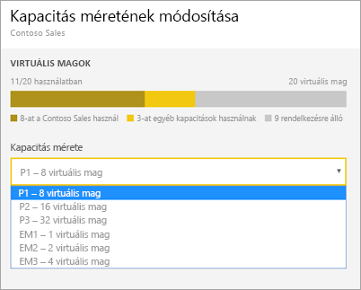

    A rendszergazdák szabadon hozhatnak létre, méretezhetnek át és törölhetnek csomópontokat, amennyiben rendelkeznek a megfelelő számú virtuális maggal.

    A P termékváltozatok nem minősíthetők vissza EM termékváltozatokká. Ha az egérmutatót a letiltott beállítás fölé húzza, megjelenik a hozzá tartozó magyarázat.

### Felhasználói engedélyek kezelése

Hozzárendelhet további kapacitás-rendszergazdákat és *kapacitás-hozzárendelési* engedéllyel rendelkező felhasználókat. Egy hozzárendelési engedéllyel rendelkező felhasználó munkaterületet rendelhet egy kapacitáshoz, ha az adott felhasználó a munkaterület rendszergazdája. Emellett a *saját munkaterületüket* is hozzárendelhetik a kapacitáshoz. A hozzárendelési engedéllyel rendelkező felhasználók nem férhetnek hozzá a felügyeleti portálhoz.

> [!NOTE]
> A Power BI Embedded kapacitás-rendszergazdái a Microsoft Azure Portalon adhatók meg.

A **Felhasználói engedélyek** területen bontsa ki a **Hozzárendelési engedélyekkel rendelkező felhasználók** csomópontot, majd igény szerint adjon hozzá felhasználókat vagy csoportokat.

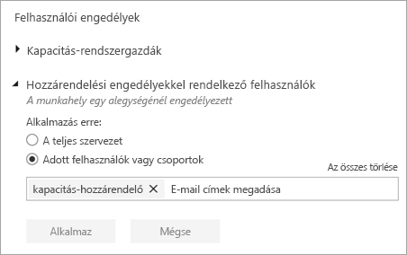

## Munkaterület hozzárendelése kapacitáshoz

Kétféle módon rendelhető munkaterület egy kapacitáshoz: a felügyeleti portálon keresztül vagy egy munkaterületről.

### Hozzárendelés a felügyeleti portálról

A kapacitás-rendszergazdák, a Power BI-rendszergazdák és az Office 365 globális rendszergazdái tömegesen is hozzárendelhetnek munkaterületeket a felügyeleti portál prémium szintű kapacitáskezelési területén. A kapacitáskezeléskor látható a **Munkaterületek** szakasz, amelyen hozzárendelheti a munkaterületeket.

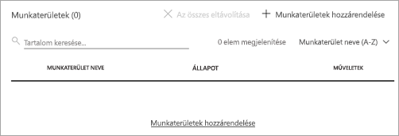

1. Válassza a **Munkaterületek hozzárendelése** lehetőséget. Ez a beállítás több helyen is elérhető.

1. Válasszon egy lehetőséget az **Alkalmazás a következőre** mezőben.

    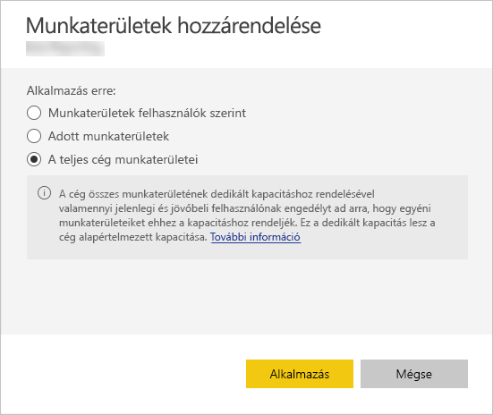

   | Kiválasztás | Leírás |
   | --- | --- |
   | **Munkaterületek felhasználók szerint** | Ha felhasználó vagy csoport alapján rendel hozzá munkaterületet, a megadott felhasználók tulajdonában lévő minden munkaterület a prémium szintű kapacitáshoz lesz rendelve, beleértve a felhasználó saját munkaterületét. Az érintett felhasználók automatikusan munkaterület-hozzárendelési engedélyt is kapnak, amely a más kapacitásokhoz rendelt munkaterületekre is érvényes. |
   | **Adott munkaterületek** | Adja meg egy munkaterület nevét a kiválasztott kapacitáshoz történő hozzárendeléshez. |
   | **A teljes cég munkaterületei** | Ha a prémium szintű kapacitáshoz a teljes szervezet munkaterületeit hozzárendeli, azzal a szervezet valamennyi munkaterületét és saját munkaterületét ehhez a prémium szintű kapacitáshoz rendeli. Emellett minden jelenlegi és jövőbeli felhasználó engedélyt kap az egyéni munkaterületek ehhez a kapacitáshoz való újbóli hozzárendelésére. |
   | | |

1. Kattintson az **Alkalmaz** elemre.

### Hozzárendelés a munkaterület beállításaiból

A munkaterületeket az adott munkaterület beállításaiban is hozzárendelheti egy prémium szintű kapacitáshoz. Ha egy munkaterületet át szeretne helyezni egy kapacitásba, az adott munkaterületre vonatkozó rendszergazdai engedélyekkel, valamint a kapacitásra vonatkozó esetében kapacitás-hozzárendelési engedélyekkel kell rendelkeznie. Vegye figyelembe, hogy a munkaterületek rendszergazdái bármikor eltávolíthatnak munkaterületeket a prémium szintű kapacitásból.

1. Egy munkaterület szerkesztéséhez válassza a három pont **(. . .)** , majd a **Munkaterület szerkesztése** elemet.

    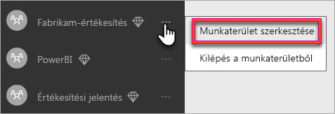

1. A **Munkaterület szerkesztése** területen bontsa ki a **Speciális** csomópontot.

1. Válassza ki azt a kapacitást, amelyhez hozzá szeretné rendelni a munkaterületet.

    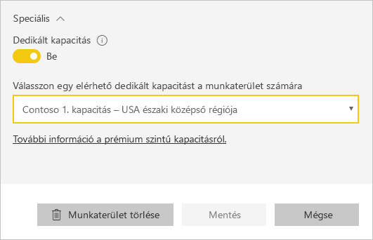

1. Kattintson a **Mentés** gombra.

A mentés után a munkaterület és annak minden tartalma a prémium szintű kapacitásba kerül. A felhasználók számára ez semmilyen szolgáltatáskimaradással nem jár.

## Power BI jelentéskészítő kiszolgáló termékkulcsa

A Power BI jelentéskészítő kiszolgáló termékkulcsát a Power BI felügyeleti portáljának **Kapacitásbeállítások** lapján találja. Ezt csak a globális rendszergazdák vagy a Power BI szolgáltatás-rendszergazdai szerepéhez rendelt felhasználók érhetik el, ha vásároltak egy Power BI Premium SKU-t.

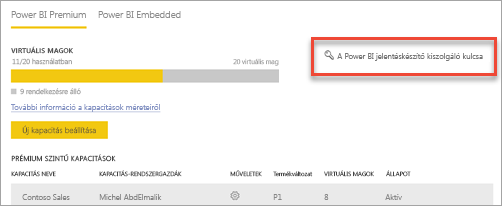

A **Power BI jelentéskészítő kiszolgáló kulcsának** kiválasztásakor megjelenik a termékkulcsot tartalmazó párbeszédpanel. Ezt másolhatja és használhatja a telepítéshez.

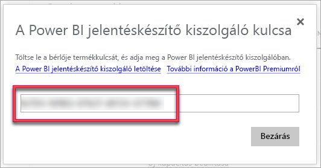

További információt [a Power BI jelentéskészítő kiszolgáló telepítését](report-server/install-report-server.md) ismertető témakörben találhat.

## Következő lépések

[Prémium szintű kapacitások kezelése](service-premium-capacity-manage.md)

További kérdései vannak? [Kérdezze meg a Power BI közösségét](https://community.powerbi.com/)
