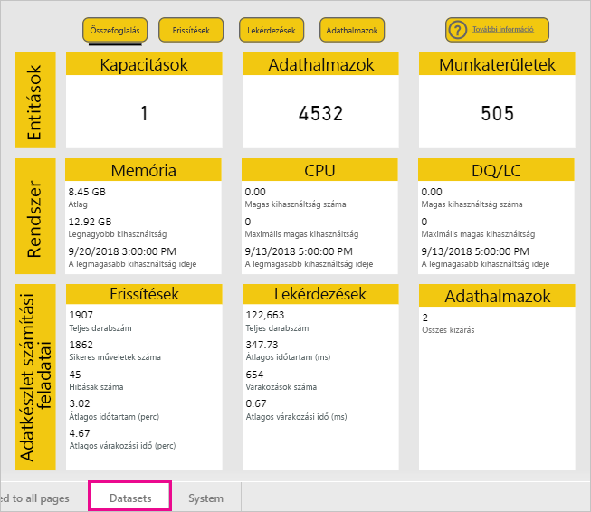
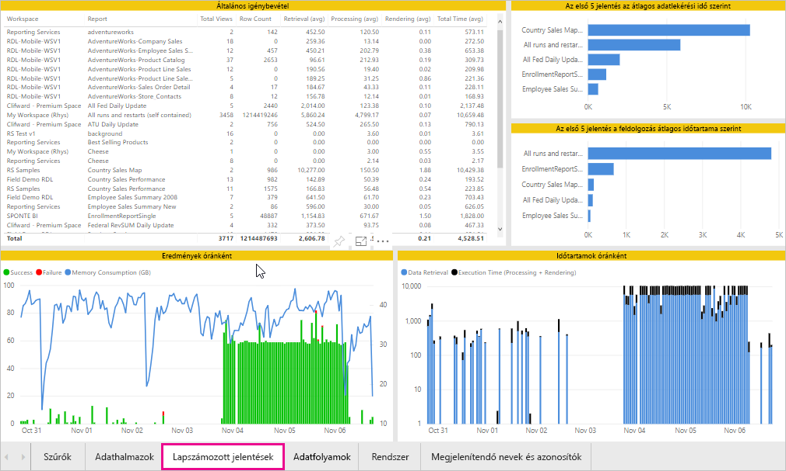
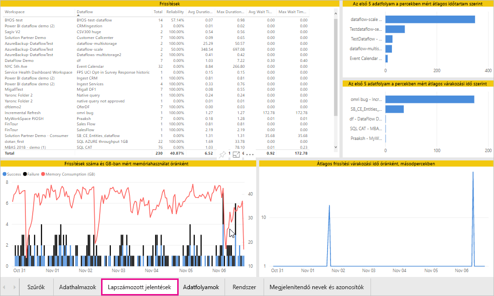
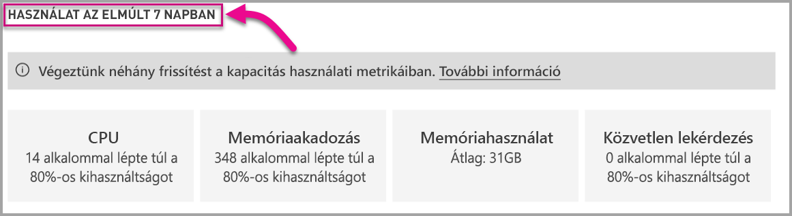

# A Power BI Premium- és a Power BI Embedded-kapacitások monitorozása

A cikk azt tekinti át, hogyan monitorozhatóak a Power BI Premium kapacitásmetrikái. A kapacitás felhasználásának figyelemmel kísérése segít abban, hogy megalapozott döntéseket hozhasson a kapacitáskezelést illetően.

A kapacitás monitorozható a Power BI Premium Metrics alkalmazással vagy a felügyeleti portálon is. Az alkalmazás használatát javasoljuk, mert az jelentősen több információt nyújt, de a jelen cikkben mindkét monitorozási lehetőséget megvizsgáljuk.

**Az alkalmazás jelenlegi verziója 1.9 (a kiadás dátuma: 2018. november 14.).**

.

<iframe width="560" height="315" src="https://www.youtube.com/embed/UgsjMbhi_Bk?rel=0&amp;showinfo=0" frameborder="0" allowfullscreen></iframe>

## A Premium Capacity Metrics alkalmazás telepítése

A [Premium Capacity Metrics alkalmazást](https://app.powerbi.com/groups/me/getapps/services/capacitymetrics) közvetlenül is megnyithatja, de ha szeretné, ugyanúgy telepítheti is, mint bármely más alkalmazást a Power BI-ban.

1. A Power BI-ban kattintson az **Alkalmazások** elemre.

    

1. A jobb oldalon kattintson az **Alkalmazások beszerzése** lehetőségre.

1. Az **Alkalmazások** kategóriában keresse meg a **Power BI Premium Capacity Metrics alkalmazást**.

1. Az alkalmazás telepítéséhez regisztrálnia kell.

Az alkalmazás telepítése után már megtekintheti a cég kapacitásainak információit. Most vizsgáljuk meg a legfontosabb elérhető metrikákat.

## A metrika alkalmazás használata

Az alkalmazás a megnyitás után egy irányítópultot jelenít meg, amelyen egy összefoglaló áttekintés látható minden olyan kapacitásról, amelyhez Önnek adminisztrátori jogosultsága van.

Kattintson az irányítópultra a mögöttes jelentés megnyitásához. A jelentés hat lapból áll, amelyeknek részletesebb leírását az alábbi szakaszokban találja.

* **Szűrők**: lehetővé teszi egy adott kapacitás szűrését a jelentés többi oldalán.

* **Adatkészletek**: részletes metrikák a kapacitásokon belüli Power BI-adathalmazok állapotáról.

* **Lapszámozott jelentések**: részletes metrikák a kapacitásokon belüli lapszámozott jelentések állapotáról.

* **Adatfolyamok**: részletes frissítési metrikák a kapacitásokon belüli adatfolyamokról.

* **Rendszer**: általános kapacitási metrikák, például a memória és a processzor magas kihasználtságáról.

* **Megjelenítendő nevek és azonosítók**: kapacitások, munkaterületek és számítási feladatok neve, azonosítója és tulajdonosa.

### Szűrők lap

A **Szűrők** lapon kapacitást, dátumtartományt és más lehetőségeket választhat. A szűrők ezután alkalmazva lesznek a jelentés vonatkozó oldalaira és csempéire. Ha nincsenek kiválasztva szűrők, a jelentés alapértelmezés szerint a kapacitások múlt heti mérőszámait jeleníti meg.

* **(A)** Válassza az **Adathalmazok**, **Lapszámozott jelentések** vagy **Adatfolyamok** lehetőséget, hogy szűrőket állíthasson be az egyes számítási feladatokhoz.

* A **(B)** szakaszban szereplő nevek és a **(C)** szakaszban szereplő adatok az **(A)** részen kiválasztott lehetőség függvényében frissülnek, így név szerint szűrhet a számítási feladatokra. A fenti ábrán például az **Adatfolyamok** lehetőség van kiválasztva, így az **Adatfolyamok neve** és az **Adatfolyamok információi** láthatók.

* **(D)** Kapacitásinformációk, amelyek azt jelzik, hogy engedélyezve vannak-e a kapacitáshoz az adathalmazok, lapszámozott jelentések vagy adatfolyamok.

### Adatkészletek lap

Használja az **Adathalmazok** lap tetején található gombokat a különböző területek közötti váltáshoz: **Összefoglalás**, **Frissítések**, **Lekérdezések időtartama**, **Lekérdezési várakozások** és **Adatkészletek**.

#### Összefoglalás terület

Az **Összefoglalás** terület entitások, rendszererőforrások és adathalmazhoz tartozó számítási feladatok alapján jeleníti meg a kapacitásokat. A következő metrikákat mutatja meg.

| **Jelentésszakasz** | **Metrikák** |
| --- | --- |
| **Entitások** | * Az Önhöz tartozó kapacitások száma  * A kapacitásában meglévő különálló adatkészletek száma  * A kapacitásában meglévő különálló munkaterületek száma |
| **Rendszer** | * Az átlagos memóriahasználat GB-ban az elmúlt hét napban  * A legmagasabb memóriahasználat GB-ban az elmúlt hét napban, az események helyi idejével  * Az a szám, ahányszor a CPU-használat meghaladta a küszöbérték 80%-át a legutóbbi hét napban, három perces gyűjtőkbe csoportosítva  * A legtöbb eset, amikor a CPU-használat meghaladta a 80%-ot a legutóbbi hét napban, egyórás gyűjtőkbe elosztva, és az esemény helyi idejével  * Az a szám, ahányszor a Közvetlen lekérdezés/Élő kapcsolat értéke meghaladta a küszöbérték 80%-át a legutóbbi hét napban, három perces gyűjtőkbe csoportosítva  * A legtöbb eset, amikor a Közvetlen lekérdezés/Élő kapcsolat értéke meghaladta a 80%-ot a legutóbbi hét napban, egyórás gyűjtőkbe elosztva, és az esemény helyi idejével |
| **Adatkészlethez tartozó számítási feladatok** | * A frissítések teljes száma a legutóbbi hét napban  * A sikeres frissítések teljes száma a legutóbbi hét napban  * A sikertelen frissítések teljes száma a legutóbbi hét napban  * A nem elegendő mennyiségű memória miatt sikertelen frissítések teljes száma  * A frissítések átlagos időtartama a művelethez szükséges teljes idő, percekben kifejezve  * A frissítésre várakozás átlagos időtartama az ütemezett időpont és a művelet kezdete közötti átlagos késést jelenti, percekben kifejezve  * A lekérdezések teljes száma a legutóbbi hét napban  * A sikeres lekérdezések teljes száma a legutóbbi hét napban  * A sikertelen lekérdezések teljes száma a legutóbbi hét napban  * A lekérdezések átlagos időtartama a művelethez szükséges teljes idő, percekben kifejezve  * A memóriaterhelés miatt kizárt modellek teljes száma  * Az adatkészletek átlagos mérete   * A memóriába betöltött adatkészletek átlagos száma |
|  |  |

#### Frissítések terület

A **Frissítések** terület az alábbi metrikákat tartalmazza.

| **Jelentésszakasz** | **Metrikák** |
| --- | --- |
| **Frissítések megbízhatósága** | * Teljes szám: Az egyes adathalmazok frissítéseinek teljes száma  * Megbízhatóság: Az egyes adathalmazok befejezett frissítéseinek százalékos aránya  * A várakozás átlagos időtartama: az ütemezett időpont és az adathalmaz frissítésének kezdete közötti átlagos késés, percekben kifejezve  * Maximális várakozási idő: az adathalmazhoz tartozó leghosszabb várakozási idő, percekben kifejezve   * Átlagos időtartam: az adathalmaz frissítéseinek átlagos időtartama, percekben kifejezve  * Maximális időtartam: az adathalmaz leghosszabb ideig futó frissítésének időtartama, percekben kifejezve |
| **Az első 5 adathalmaz a frissítés átlagos időtartama szerint** | * Az öt leghosszabb (percekben megadott) átlagos frissítési idejű adathalmaz |
| **Az első 5 adathalmaz az átlagos várakozási idő szerint** | * Az öt leghosszabb (percekben megadott) átlagos frissítési várakozási idejű adathalmaz |
| **Átlagos frissítési várakozási idő óránként** | * A frissítésre várakozás átlagos időtartama órákra lebontva, helyi idő szerint jelentve. Ha több kiugróan magas frissítési várakozási érték is van, az azt jelzi, hogy a kapacitáshasználat a csúcsértékhez közelít. |
| **Frissítések száma és memóriahasználat óránként** | * Sikeres és sikertelen frissítések, valamint memóriahasználat órákra lebontva, helyi idő szerint jelentve |
|  |  |

#### A Lekérdezések időtartama terület

A **Lekérdezések időtartama** terület az alábbi metrikákat tartalmazza.

| **Jelentésszakasz** | **Metrikák** |
| --- | --- |
| **Lekérdezések időtartama** | * Ebben a szakaszban az adatok adathalmazokra, munkaterületekre és egyórás gyűjtőkre vannak lebontva az elmúlt hét napra vonatkozóan  * Összesen: az adathalmazon futtatott lekérdezések teljes száma  * Átlag: az adathalmaz lekérdezéseinek átlagos időtartama, ezredmásodpercben megadva  * Max: az adathalmaz leghosszabb ideig futó lekérdezésének időtartama, ezredmásodpercben megadva|
| **Lekérdezések időtartamának eloszlása** | * A lekérdezési időtartamok hisztogramja ezredmásodpercben mért lekérdezés-időtartamokra van osztva a következő kategóriákba: <= 30 ms, 30–100 ms, 100–300 ms, 300 ms–1 mp, 1–3 mp, 3–10 mp, 10–30 mp és > 30 mp időszakok. A hosszú lekérdezési időtartamok és a hosszú várakozási idők azt jelzik, hogy a kapacitáshasználat a csúcsértékhez közelít. Azt is jelenthetik, hogy az egyik adathalmaz problémákat okoz, és további vizsgálat szükséges. |
| **Az első 5 adathalmaz az átlagos időtartam szerint** | * Az öt leghosszabb (ezredmásodpercekben megadott) átlagos lekérdezési idejű adathalmaz |
| **Közvetlen lekérdezés / élő kapcsolatok (80% feletti kihasználtság)** | * Azon alkalmak száma, amikor egy közvetlen lekérdezés vagy élő kapcsolat túllépte a 80%-os CPU-kihasználtságot, óránként lebontva, helyi idő szerint jelentve |
| **Lekérdezések időtartamának eloszlása óránként** | * A lekérdezések száma és az átlagos időtartam (ezredmásodpercekben) összehasonlítva a GB-ban kifejezett memóriahasználattal, óránként lebontva, helyi idő szerint jelentve |
|  |  |

#### Lekérdezésekre való várakozások terület

A **Lekérdezésekre való várakozások** terület az alábbi metrikákat tartalmazza.

| **Jelentésszakasz** | **Metrikák** |
| --- | --- |
| **Lekérdezésekre való várakozások időtartama** | * Ebben a szakaszban az adatok adathalmazokra, munkaterületekre és egyórás gyűjtőkre vannak lebontva az elmúlt hét napra vonatkozóan  * Összesen: az adathalmazon futtatott lekérdezések teljes száma  * Várakozások száma: Az adathalmaz azon lekérdezéseinek számra, amelyek rendszererőforrásokra várakoztak a végrehajtás előtt   * Átlag: az adathalmaz lekérdezéseinek átlagos várakozási időtartama, ezredmásodpercben megadva  * Max: az adathalmaz leghosszabb ideig várakozó lekérdezésének időtartama, ezredmásodpercben megadva|
| **Várakozási idők eloszlása** | * A lekérdezési időtartamok hisztogramja ezredmásodpercekben mért lekérdezés-időtartamokra van osztva a következő kategóriákba: <= 50 ms, 50–100 ms, 100–200 ms, 200–400 ms, 400 ms–1 mp, 1–5 mp és > 5 mp |
| **Az első 5 adathalmaz az átlagos várakozási idő szerint** | * Az az öt adathalmaz, amelynek a lekérdezések előtti, ezredmásodpercekben mért várakozási ideje a legnagyobb |
| **Lekérdezések várakozásainak száma és időtartama óránként** | A lekérdezésekre való várakozások száma és az átlagos várakozási időtartam (ezredmásodpercekben), összehasonlítva a GB-ban kifejezett memóriahasználattal, óránként lebontva, helyi idő szerint jelentve |
|  |  |

#### Adatkészletek terület

Az **Adathalmazok** terület az alábbi metrikákat tartalmazza.

| **Jelentésszakasz** | **Metrikák** |
| --- | --- |
| **Adathalmaz-kizárások száma** | * Összesen: az adathalmaz-*kizárások* teljes száma kapacitásonként. Ha egy kapacitásban magas memóriaterhelés lép fel, a csomópont egy vagy több adathalmazt kizár a memóriából. Először az inaktív adathalmazok (nincs végrehajtás alatt álló lekérdezési/frissítési művelet) lesznek kizárva. Ezután a „legrégebben használt” (LRU) paraméter értéke határozza meg a kizárási sorrendet.|
| **Adathalmaz-kizárások és memóriahasználat** | * Adathalmaz-kizárások és a GB-ban kifejezett memóriahasználat óránkénti bontásban, helyi idő szerint jelentve |
| **Óránként betöltött adatkészletek száma** | * A memóriába betöltött adathalmazok és a GB-ban kifejezett memóriahasználat óránkénti bontásban, helyi idő szerint jelentve |
| **Adatok mérete**  | * Maximális méret: Az adatkészlet maximális mérete (MB) a megjelenített időszakra |
|  |  |

### Lapszámozott jelentések lap

A **Lapszámozott jelentések** lap részletes metrikákat mutat a kapacitásokon belüli lapszámozott jelentések állapotáról.

A **Lapszámozott jelentések** lap az alábbi metrikákat tartalmazza.

| **Jelentésszakasz** | **Metrikák** |
| --- | --- |
| **Általános igénybevétel** | * Összes megtekintés: azon alkalmak száma, amikor egy felhasználó megtekintette a jelentést  * Sorok száma: a jelentésben szereplő adatsorok száma  * Lekérés (átlag): az adatok jelentéshez való lekérésének átlagos időtartama, ezredmásodpercben megadva. A hosszú időtartamok lassú lekérdezésekre vagy az adatforrással kapcsolatos más problémára utalhatnak.   * Feldolgozás (átlag): az adatok jelentéshez való feldolgozásának átlagos időtartama, ezredmásodpercben megadva * Renderelés (átlag): a jelentés böngészőben való renderelésének átlagos időtartama, ezredmásodpercben megadva  * Teljes időtartam: a jelentés összes fázisának időtartama, ezredmásodpercben megadva|
| **Az első 5 adathalmaz az átlagos adatlekérési idő szerint** | * Az öt, ezredmásodpercekben mérve legnagyobb átlagos adatlekérési idejű jelentés |
| **Az első 5 adathalmaz a jelentés feldolgozásának átlagos időtartama szerint** | * Az ezredmásodpercekben mérve legnagyobb átlagos feldolgozási idejű jelentés |
| **Időtartamok óránként** | * Adatlekérés a feldolgozási és renderelési időhöz viszonyítva, óránkénti bontásban, helyi idő szerint jelenve |
| **Eredmények óránként** | * Sikeres és sikertelen frissítések, valamint memóriahasználat órákra lebontva, helyi idő szerint jelentve |
|  |  |

### Adatfolyamok lap

Az **Adatfolyamok** lap részletes frissítési metrikákat mutat a kapacitásokon belüli adatfolyamokról.

Az **Adatfolyamok** lap az alábbi metrikákat tartalmazza.

| **Jelentésszakasz** | **Metrikák** |
| --- | --- |
| **Frissítés** | * Összesen: az egyes adatfolyamok frissítéseinek teljes száma  * Megbízhatóság: az egyes adatfolyamok befejezett frissítéseinek százalékos aránya  * A várakozás átlagos időtartama: az ütemezett időpont és az adatfolyam frissítésének kezdete közötti átlagos késés, percekben kifejezve  * Maximális várakozási idő: az adatfolyamhoz tartozó leghosszabb várakozási idő, percekben kifejezve   * Átlagos időtartam: az adatfolyam frissítéseinek átlagos időtartama, percekben kifejezve  * Maximális időtartam: az adatfolyam leghosszabb ideig futó frissítésének időtartama, percekben kifejezve |
| **Az első 5 adatfolyam a frissítés átlagos időtartama szerint** | * Az öt leghosszabb (percekben megadott) átlagos frissítési idejű adatfolyam |
| **Az első 5 adatfolyam az átlagos várakozási idő szerint** | * Az öt leghosszabb (percekben megadott) átlagos frissítési várakozási idejű adatfolyam |
| **Átlagos frissítési várakozási idő óránként** | * A frissítésre várakozás átlagos időtartama órákra lebontva, helyi idő szerint jelentve. Ha több kiugróan magas frissítési várakozási érték is van, az azt jelzi, hogy a kapacitáshasználat a csúcsértékhez közelít. |
| **Frissítések száma és memóriahasználat óránként** | * Sikeres és sikertelen frissítések, valamint memóriahasználat órákra lebontva, helyi idő szerint jelentve |
|  |  |

### Rendszer lap

A **Rendszer** lap az összes kapacitás és számítási feladat CPU- és memóriafelhasználását mutatja.

A **Rendszer** lap az alábbi metrikákat tartalmazza.

| **Jelentésszakasz** | **Metrikák** |
| --- | --- |
| **CPU-metrikák (80% feletti kihasználtság)** | * Az a szám, ahányszor a CPU-használat meghaladta a küszöbérték 80%-át a legutóbbi hét napban, három perces gyűjtőkbe csoportosítva |
| **Memóriahasználat** | * Memóriahasználat az elmúlt hét nap folyamán, háromperces időszakokra lebontva |
|  |  |

### A Megjelenítendő nevek és azonosítók lap

A **Megjelenítendő nevek és azonosítók** lap kapacitások, munkaterületek és számítási feladatok nevét, azonosítóját és tulajdonosát tartalmazza.

## A Power BI Embedded-kapacitás monitorozása

A Power BI Premium Capacity Metrics alkalmazással *A SKU*-kapacitásokat is monitorozhat a Power BI Embedded szolgáltatásban. Ha Ön az adott kapacitás adminisztrátora, akkor a kapacitás megjelenik a jelentésben is. A jelentést azonban csak akkor lehet frissíteni, ha a Power BI-nak megad bizonyos engedélyeket az A SKU-kra vonatkozóan:

1. Nyissa meg a kapacitást az Azure Portalon.

1. Kattintson a **Hozzáférés-vezérlés (IAM)** lehetőségre, és adja hozzá a „Power BI Premium” alkalmazást az Olvasó szerepkörhöz. Ha az alkalmazást nem találja név szerint, az ügyfél-azonosító használatával is hozzáadhatja azt: cb4dc29f-0bf4-402a-8b30-7511498ed654.

    

> [!NOTE]
> Power BI Embedded kapacitás használatát monitorozhatja az alkalmazással vagy az Azure Portalon, a Power BI felügyeleti portálján azonban nincs erre lehetőség.

## Alapszintű monitorozás a felügyeleti portálon

A felügyeleti portál **Kapacitásbeállítások** területén négy kijelző van, amelyeken a kapacitás által felhasznált terhelés és erőforrás-fogyasztás látható a legutóbbi hét napra vonatkozóan. A négy csempe egyórás időszakokkal működik, és megmutatja, hány óráig volt a vonatkozó metrika a legutóbbi hét nap során 80% fölötti értéken. Ez a metrika azt jelzi, hogy a végfelhasználói élmény minősége csökkenhet.

| **Metrika** | **Leírás** |
| --- | --- |
| CPU |Ahányszor a processzorhasználat túllépte a 80%-ot. |
| Memóriaakadozás |A háttérrendszerbeli magok memóriaterhelését mutatja. Ez egészen pontosan azt jelzi, hogy az adathalmazok hányszor lettek kiürítve a memóriából a több adathalmaz használata miatti memóriaterhelés következtében. |
| Memóriahasználat |Átlagos memóriahasználat, gigabájtban (GB) kifejezve. |
| DQ/másodperc | Ahányszor a Direct Query-kapcsolatok és élő kapcsolatok száma meghaladta a korlát 80%-át.   * A DirectQuery és élő kapcsolatos lekérdezések másodpercenkénti maximális száma korlátozott.* A korlátok a következők: 30/s P1-nél, 60/s P2-nél és 120/s P3 esetén. * A Direct Query és az élő kapcsolatos lekérdezések száma összeadódik. Ha például 15 DirectQueryvel és 15 élő kapcsolattal rendelkezik egy adott másodpercben, elérte a korlátot * Ez mind a helyszíni, mind a felhőkapcsolatokra vonatkozik. |
|  |  |

A metrikák az elmúlt hét használati adatait tükrözik.  Ha szeretne részletesebb nézetet látni a metrikákról, kattintson az összesítő csempék egyikére.  Ez megnyitja a prémium szintű kapacitása metrikáinak részletes diagramjait tartalmazó lapot. Az alábbi ábrán a CPU-metrika részletei láthatóak.

Ezeket a diagramokat a rendszer óránként összegzi az elmúlt hétre vonatkozóan, és segítenek megállapítani, hogy mikor történhetett teljesítménnyel kapcsolatos esemény a prémium szintű kapacitásában.

Exportálhatja bármelyik metrika mögöttes adatait egy CSV-fájlba.  Ezzel a művelettel részletes adatokat kaphat három perces időközökkel az elmúlt hét minden egyes napjára vonatkozóan.

## Következő lépések

Most, hogy megismerkedett a Power BI Premium kapacitásainak monitorozásával, tudjon meg többet a kapacitás optimalizálásáról is.

> [!div class="nextstepaction"]
> [A Power BI Premium-kapacitás erőforrás-kezelése és optimalizálása](service-premium-understand-how-it-works.md)
