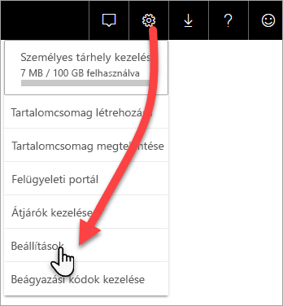

# Prémium szintű kapacitások monitorozása az alkalmazással

A kapacitások figyelése elengedhetetlen a megalapozott döntések meghozatalához, hogy a prémium szintű kapacitás erőforrásait a legjobban használhassa ki. A kapacitás monitorozható a felügyeleti portálon vagy a **Power BI Premium kapacitásmetrikák** alkalmazással. Ez a cikk a Prémium szintű kapacitásmetrikák alkalmazás használatát ismerteti. Az alkalmazás adja a legmélyrehatóbb információkat a kapacitások teljesítményéről. Az elmúlt hét nap átlagos használatára vonatkozó metrikák magasabb szintű áttekintésére használhatja a felügyeleti portált. A monitorozás portálon történő használatáról további információt a [Prémium szintű kapacitások monitorozása a felügyeleti portálon](service-admin-premium-monitor-portal.md) szakaszban talál.

Az alkalmazás rendszeresen új szolgáltatásokkal és funkciókkal frissül. Győződjön meg róla, hogy a legújabb verziót futtatja.
**Az alkalmazás legújabb verziója az 1.10.1.1 verzió (2019. február 5.)**.   
Ha az alkalmazásnak már telepítve van egy korábbi verziója, célszerű törölni az alkalmazások közül, majd lenyomni a CTRL+F5 billentyűket a frissítéshez. 

## Az alkalmazás telepítse

A [Premium Capacity Metrics alkalmazást](https://app.powerbi.com/groups/me/getapps/services/capacitymetrics) közvetlenül is megnyithatja, de ha szeretné, ugyanúgy telepítheti is, mint bármely más alkalmazást a Power BI-ban.

1. A Power BI-ban kattintson az **Alkalmazások** elemre.   
    

2. A jobb oldalon kattintson az **Alkalmazások beszerzése** lehetőségre.
3. Az **Alkalmazások** kategóriában keresse meg a **Power BI Premium Capacity Metrics alkalmazást**.
4. Az alkalmazás telepítéséhez regisztrálnia kell.

Legyen türelemmel. A metrikák telepítése és frissítése eltart néhány percig. Ha az alkalmazás üres metrikákat jelenít meg, nyomja le az F5 billentyűt a böngésző frissítéséhez.

## Alkalmazásfrissítési előzmények lekérése

A Premium Capacity Metrics alkalmazás legutóbbi frissítési időpontjának ellenőrzéséhez kattintson a **Beállítások** > **Adatkészletek** > **Power BI Premium-kapacitásmetrikák** > **Frissítési előzmények** elemre. 

A legutóbbi frissítés jelenik meg, vagy kattintson a **Frissítési előzmények** elemre az ütemezett és az igény szerinti frissítések megtekintéséhez.

## Kapacitás figyelése az alkalmazással

Az alkalmazás telepítése után már megtekintheti a szervezet kapacitásaira vonatkozó metrikákat. Most vizsgáljuk meg a legfontosabb elérhető metrikákat.

### Metrikai irányítópult

Az alkalmazás a megnyitás után egy irányítópultot jelenít meg, amelyen egy összefoglaló áttekintés látható minden olyan kapacitásról, amelyhez Önnek adminisztrátori jogosultsága van.

Az irányítópult a következő metrikákat tartalmazza:

| **Jelentésszakasz** | **Metrikák** |
| --- | --- |
| **Rendszer összegzése** |  Az alkalmazás verziója   Azoknak a kapacitásoknak a száma, amelyeknél Ön rendszergazda   A kapacitásokon belül azoknak a munkaterületeknek a száma, amelyek metrikákat jelentenek   Átlagos memóriahasználat GB-ban az utóbbi hét napban   Maximális memóriahasználat GB-ban az utóbbi hét napban   A maximális memóriahasználat előfordulásának helyi ideje   Az a szám, ahányszor a CPU-használat meghaladta a küszöbérték 80%-át a legutóbbi hét napban, három perces gyűjtőkbe csoportosítva   A legtöbb eset, amikor a CPU-használat meghaladta a 80%-ot a legutóbbi hét napban, egyórás gyűjtőkbe elosztva   Annak a helyi ideje, amikor a CPU-használat egy órán belül a legtöbbször haladta meg a 80%-ot |
| **Adatkészlet összegzése** |  A kapacitásokon belüli összes munkaterület adatkészleteinek teljes száma   Az a szám, ahányszor a Közvetlen lekérdezés/Élő kapcsolat értéke meghaladta a küszöbérték 80%-át a legutóbbi hét napban, három perces gyűjtőkbe csoportosítva   A legtöbb eset, amikor a Közvetlen lekérdezés/Élő kapcsolat értéke meghaladta a 80%-ot a legutóbbi hét napban, egyórás gyűjtőkbe elosztva   Annak a helyi ideje, amikor a Közvetlen lekérdezés/Élő kapcsolat értéke a legtöbbször meghaladja a 80%-ot egy órán belül   A frissítések teljes száma a legutóbbi hét napban   A frissítésre várakozás átlagos időtartama az ütemezett időpont és a frissítés kezdete közötti átlagos késést jelenti, percekben kifejezve   A frissítések átlagos időtartama a frissítéshez szükséges teljes idő, percekben kifejezve   A lekérdezések teljes száma a legutóbbi hét napban   A lekérdezések átlagos várakozási ideje – az az időtartam, amíg a lekérdezés a rendszer erőforrásaira várakozott a végrehajtás előtt, ezredmásodpercekben kifejezve   A frissítések átlagos időtartama – a lekérdezés befejezéséhez szükséges teljes idő, ezredmásodpercekben kifejezve   A memóriaterhelés miatt kizárt modellek teljes száma   Az adatkészletek átlagos mérete    A memóriába betöltött adatkészletek átlagos száma |
| **Adatfolyam összegzése** |  A kapacitásokon belüli összes munkaterület adatfolyamainak teljes száma   A frissítések teljes száma a legutóbbi hét napban   A frissítésre várakozás átlagos időtartama az ütemezett időpont és a frissítés kezdete közötti átlagos késést jelenti, percekben kifejezve   A frissítések átlagos időtartama a frissítéshez szükséges teljes idő, percekben kifejezve |
| **Lapszámozott jelentés összefoglalás** |  A kapacitásokon belüli összes munkaterület lapszámozott jelentéseinek teljes száma   Az összes jelentés felhasználók általi megtekintésének teljes száma   Az összes jelentésben található adatsorok teljes száma   Az a teljes időtartam ezredmásodpercben, amely az összes jelentés minden fázisához (adatlekérés, feldolgozás és megjelenítés) szükséges |
|  |  |

### Metrikajelentés

Kattintson az irányítópultra a mögöttes jelentés megnyitásához. A jelentés alján öt lapfül található:

* [**Adatkészletek**](#datasets) Részletes metrikák a kapacitásokon belüli Power BI-adathalmazok állapotáról.

* [**Lapszámozott jelentések**](#paginated-reports) Részletes metrikák a kapacitásokon belüli lapszámozott jelentések állapotáról.

* [**Adatfolyamok**](#dataflows) Részletes frissítési metrikák a kapacitásokon belüli adatfolyamokról.

* [**Erőforrás-felhasználás**](#resource-consumption) Általános kapacitási metrikák, például a memória és a processzor magas kihasználtságáról.

* [**Azonosítók és információ**](#ids-and-info) Kapacitások, munkaterülete és számítási feladatok neve, azonosítója és tulajdonosa.

A metrikák minden lapon szűrhetők kapacitás és dátumtartomány szerint. Ha nincsenek kiválasztva szűrők, a jelentés alapértelmezés szerint a kapacitások múlt heti mérőszámait jeleníti meg minden metrikát jelentő kapacitáshoz. 

#### Adathalmazok

Az **Adatkészletek** lap felső részén található gombokkal léphet különféle területekre: **Frissítések**, **Lekérdezések időtartamai**, **Lekérdezések várakozásai** és **Adatkészletek**.

##### Frissítések terület

A **Frissítések** terület az alábbi metrikákat tartalmazza.

| **Jelentésszakasz** | **Metrikák** |
| --- | --- |
| **Frissítések megbízhatósága** |  Teljes darabszám: Az egyes adathalmazok frissítéseinek teljes száma   Megbízhatóság: Az egyes adathalmazok befejezett frissítéseinek százalékos aránya   A várakozás átlagos időtartama: Az ütemezett időpont és az adathalmaz frissítésének kezdete közötti átlagos késés, percekben kifejezve   Maximális várakozási idő: Az adathalmazhoz tartozó leghosszabb várakozási idő, percekben kifejezve    Átlagos időtartam: Az adathalmaz frissítéseinek átlagos időtartama, percekben kifejezve   Maximális időtartam: Az adathalmaz leghosszabb ideig futó frissítésének időtartama, percekben kifejezve |
| **Az első 5 adathalmaz a frissítés átlagos időtartama szerint** |  Az öt leghosszabb (percekben megadott) átlagos frissítési idejű adathalmaz |
| **Az első 5 adathalmaz az átlagos várakozási idő szerint** |  Az öt leghosszabb (percekben megadott) átlagos frissítési várakozási idejű adathalmaz |
| **Átlagos frissítési várakozási idő óránként** |  A frissítésre várakozás átlagos időtartama órákra lebontva, helyi idő szerint jelentve. Ha több kiugróan magas frissítési várakozási érték is van, az azt jelzi, hogy a kapacitáshasználat a csúcsértékhez közelít. |
| **Frissítések száma és memóriahasználat óránként** |  Sikeres és sikertelen frissítések, valamint memóriahasználat órákra lebontva, helyi idő szerint jelentve |
|  |  |

##### A Lekérdezések időtartama terület

A **Lekérdezések időtartama** terület az alábbi metrikákat tartalmazza.

| **Jelentésszakasz** | **Metrikák** |
| --- | --- |
| **Lekérdezések időtartama** |  Ebben a szakaszban az adatok adathalmazokra, munkaterületekre és egyórás gyűjtőkre vannak lebontva az elmúlt hét napra vonatkozóan   Összesen: Az adathalmazon futtatott lekérdezések teljes száma   Átlag: Az adathalmaz lekérdezéseinek átlagos időtartama, ezredmásodpercben megadva   Max: Az adathalmaz leghosszabb ideig futó lekérdezésének időtartama, ezredmásodpercben megadva|
| **Lekérdezések időtartamának eloszlása** |  A lekérdezési időtartamok hisztogramja ezredmásodpercben mért lekérdezés-időtartamokra van osztva a következő kategóriákba: <= 30 ms, 30–100 ms, 100–300 ms, 300 ms–1 mp, 1–3 mp, 3–10 mp, 10–30 mp és > 30 mp időszakok. A hosszú lekérdezési időtartamok és a hosszú várakozási idők azt jelzik, hogy a kapacitáshasználat a csúcsértékhez közelít. Azt is jelenthetik, hogy az egyik adathalmaz problémákat okoz, és további vizsgálat szükséges. |
| **Az első 5 adathalmaz az átlagos időtartam szerint** |  Az öt leghosszabb (ezredmásodpercekben megadott) átlagos lekérdezési idejű adathalmaz |
| **Közvetlen lekérdezés / élő kapcsolatok (80% feletti kihasználtság)** |  Azon alkalmak száma, amikor egy közvetlen lekérdezés vagy élő kapcsolat túllépte a 80%-os CPU-kihasználtságot, óránként lebontva, helyi idő szerint jelentve |
| **Lekérdezések időtartamának eloszlása óránként** |  A lekérdezések száma és az átlagos időtartam (ezredmásodpercekben) összehasonlítva a GB-ban kifejezett memóriahasználattal, óránként lebontva, helyi idő szerint jelentve |
|  |  |

##### Lekérdezésekre való várakozások terület

A **Lekérdezésekre való várakozások** terület az alábbi metrikákat tartalmazza.

| **Jelentésszakasz** | **Metrikák** |
| --- | --- |
| **Lekérdezésekre való várakozások időtartama** |  Ebben a szakaszban az adatok adathalmazokra, munkaterületekre és egyórás gyűjtőkre vannak lebontva az elmúlt hét napra vonatkozóan   Összesen: Az adathalmazon futtatott lekérdezések teljes száma   Várakozások száma: Az adathalmaz azon lekérdezéseinek számra, amelyek rendszererőforrásokra várakoztak a végrehajtás előtt    Átlag: Az adathalmaz lekérdezéseinek átlagos várakozási időtartama, ezredmásodpercben megadva   Max: Az adathalmaz leghosszabb ideig várakozó lekérdezésének időtartama, ezredmásodpercben megadva|
| **Várakozási idők eloszlása** |  A lekérdezési időtartamok hisztogramja ezredmásodpercekben mért lekérdezés-időtartamokra van osztva a következő kategóriákba: <= 50 ms, 50–100 ms, 100–200 ms, 200–400 ms, 400 ms–1 mp, 1–5 mp és > 5 mp |
| **Az első 5 adathalmaz az átlagos várakozási idő szerint** |  Az az öt adathalmaz, amelynek a lekérdezések előtti, ezredmásodpercekben mért várakozási ideje a legnagyobb |
| **Lekérdezések várakozásainak száma és időtartama óránként** |  A lekérdezésekre való várakozások száma és az átlagos várakozási időtartam (ezredmásodpercekben), összehasonlítva a GB-ban kifejezett memóriahasználattal, óránként lebontva, helyi idő szerint jelentve |
|  |  |

##### Adatkészletek terület

Az **Adathalmazok** terület az alábbi metrikákat tartalmazza.

| **Jelentésszakasz** | **Metrikák** |
| --- | --- |
| **Adathalmaz-kizárások száma** |  Összesen: Az adathalmaz-*kizárások* teljes száma kapacitásonként. Ha egy kapacitásban magas memóriaterhelés lép fel, a csomópont egy vagy több adathalmazt kizár a memóriából. Először az inaktív adathalmazok (nincs végrehajtás alatt álló lekérdezési/frissítési művelet) lesznek kizárva. Ezután a „legrégebben használt” (LRU) paraméter értéke határozza meg a kizárási sorrendet.|
| **Adathalmaz-kizárások és memóriahasználat** |  Adathalmaz-kizárások és a GB-ban kifejezett memóriahasználat óránkénti bontásban, helyi idő szerint jelentve |
| **Óránként betöltött adatkészletek száma** |  A memóriába betöltött adathalmazok és a GB-ban kifejezett memóriahasználat óránkénti bontásban, helyi idő szerint jelentve |
| **A felhasznált memória százalékos aránya** |  Az összes aktív adatkészlet a memóriában a teljes memória százalékaként. Az aktív és az összes meghatározott adathalmaz közötti különbség, amely kiüríthető. Óránként megjelenítve az elmúlt hét napra. |
| **Adatok mérete**  |  Maximális méret: Az adatkészlet maximális mérete (MB) a megjelenített időszakra |
|  |  |

#### Oldalakra osztott jelentések

A **Lapszámozott jelentések** lap részletes metrikákat mutat a kapacitásokon belüli lapszámozott jelentések állapotáról.

| **Jelentésszakasz** | **Metrikák** |
| --- | --- |
| **Általános igénybevétel** |  Összes megtekintés: Azon alkalmak száma, amikor egy felhasználó megtekintette a jelentést   Sorok száma: A jelentésben szereplő adatsorok száma   Lekérés (átlag): Az adatok jelentéshez való lekérésének átlagos időtartama, ezredmásodpercben megadva. A hosszú időtartamok lassú lekérdezésekre vagy az adatforrással kapcsolatos más problémára utalhatnak.    Feldolgozás (átlag): Az adatok jelentéshez való feldolgozásának átlagos időtartama, ezredmásodpercben megadva  Renderelés (átlag): A jelentés böngészőben való renderelésének átlagos időtartama, ezredmásodpercben megadva   Teljes időtartam: A jelentés összes fázisának időtartama, ezredmásodpercben megadva|
| **Az első 5 adathalmaz az átlagos adatlekérési idő szerint** |  Az öt, ezredmásodpercekben mérve legnagyobb átlagos adatlekérési idejű jelentés |
| **Az első 5 adathalmaz a jelentés feldolgozásának átlagos időtartama szerint** |  Az ezredmásodpercekben mérve legnagyobb átlagos feldolgozási idejű jelentés |
| **Időtartamok óránként** |  Adatlekérés a feldolgozási és renderelési időhöz viszonyítva, óránkénti bontásban, helyi idő szerint jelenve |
| **Eredmények óránként** |  Sikeres és sikertelen frissítések, valamint memóriahasználat órákra lebontva, helyi idő szerint jelentve |
|  |  |

#### Adatfolyamok

Az **Adatfolyamok** lap részletes frissítési metrikákat mutat a kapacitásokon belüli adatfolyamokról.

| **Jelentésszakasz** | **Metrikák** |
| --- | --- |
| **Frissítés** |  Összesen: Az egyes adatfolyamok frissítéseinek teljes száma   Megbízhatóság: az egyes adatfolyamok befejezett frissítéseinek százalékos aránya   A várakozás átlagos időtartama: Az ütemezett időpont és az adatfolyam frissítésének kezdete közötti átlagos késés, percekben kifejezve   Maximális várakozási idő: Az adatfolyamhoz tartozó leghosszabb várakozási idő, percekben kifejezve    Átlagos időtartam: Az adatfolyam frissítéseinek átlagos időtartama, percekben kifejezve   Maximális időtartam: Az adatfolyam leghosszabb ideig futó frissítésének időtartama, percekben kifejezve |
| **Az első 5 adatfolyam a frissítés átlagos időtartama szerint** |  Az öt leghosszabb (percekben megadott) átlagos frissítési idejű adatfolyam |
| **Az első 5 adatfolyam az átlagos várakozási idő szerint** |  Az öt leghosszabb (percekben megadott) átlagos frissítési várakozási idejű adatfolyam |
| **Átlagos frissítési várakozási idő óránként** |  A frissítésre várakozás átlagos időtartama órákra lebontva, helyi idő szerint jelentve. Ha több kiugróan magas frissítési várakozási érték is van, az azt jelzi, hogy a kapacitáshasználat a csúcsértékhez közelít. |
| **Frissítések száma és memóriahasználat óránként** |  Sikeres és sikertelen frissítések, valamint memóriahasználat órákra lebontva, helyi idő szerint jelentve |
|  |  |

#### Erőforrás-felhasználás

Az **Erőforrás-felhasználás** lap az összes kapacitás és számítási feladat CPU- és memóriafelhasználását mutatja.

| **Jelentésszakasz** | **Metrikák** |
| --- | --- |
| **CPU-felhasználás** |  Számítási feladatonkénti használat a teljes CPU-kapacitás százalékában. Óránként megjelenítve az elmúlt hét napra. |
| **Memóriahasználat** |  Számítási feladatonkénti memóriahasználat GB-ban (folytonos vonal) és számítási feladatonkénti korlát (pontozott vonal). Óránként megjelenítve az elmúlt hét napra. |
|  |  |

#### Azonosítók és információk

Az **Azonosítók és információ** lap kapacitások, munkaterületek és számítási feladatok nevét, azonosítóját és tulajdonosát tartalmazza.

## A Power BI Embedded-kapacitás monitorozása

A Power BI Premium Capacity Metrics alkalmazással az *A termékváltozat* (SKU) kapacitásait is monitorozhatja a Power BI Embedded szolgáltatásban. Ha Ön az adott kapacitás adminisztrátora, akkor a kapacitás megjelenik a jelentésben is. A jelentést azonban csak akkor lehet frissíteni, ha a Power BI-nak megad bizonyos engedélyeket az A SKU-kra vonatkozóan:

1. Nyissa meg a kapacitást az Azure Portalon.

1. Kattintson a **Hozzáférés-vezérlés (IAM)** lehetőségre, és adja hozzá a „Power BI Premium” alkalmazást az Olvasó szerepkörhöz. Ha az alkalmazást nem találja név szerint, az ügyfél-azonosító használatával is hozzáadhatja azt: cb4dc29f-0bf4-402a-8b30-7511498ed654.

    

> [!NOTE]
> Power BI Embedded kapacitás használatát monitorozhatja az alkalmazással vagy az Azure Portalon, a Power BI felügyeleti portálján azonban nincs erre lehetőség.

## Következő lépések

> [!div class="nextstepaction"]
> [A Power BI Premium-kapacitás erőforrás-kezelése és optimalizálása](service-premium-understand-how-it-works.md)
