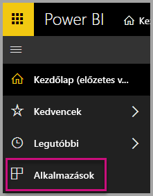
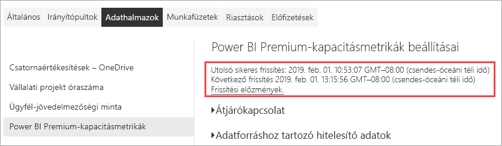
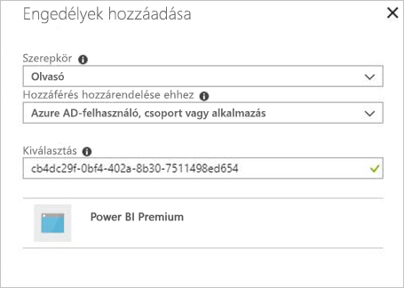

# Prémium szintű kapacitások monitorozása az alkalmazással

A kapacitások figyelése elengedhetetlen a megalapozott döntések meghozatalához, hogy a prémium szintű kapacitás erőforrásait a legjobban használhassa ki. A kapacitás monitorozható a felügyeleti portálon vagy a **Power BI Premium kapacitásmetrikák** alkalmazással. Ez a cikk a Prémium szintű kapacitásmetrikák alkalmazás használatát ismerteti. Az alkalmazás adja a legmélyrehatóbb információkat a kapacitások teljesítményéről. Az elmúlt hét nap átlagos használatára vonatkozó metrikák magasabb szintű áttekintésére használhatja a felügyeleti portált. A monitorozás portálon történő használatáról további információt a [Prémium szintű kapacitások monitorozása a felügyeleti portálon](service-admin-premium-monitor-portal.md) szakaszban talál.

Az alkalmazás rendszeresen új szolgáltatásokkal és funkciókkal frissül. Győződjön meg róla, hogy a legújabb verziót futtatja. Ha az alkalmazásnak már telepítve van egy korábbi verziója, célszerű törölni az alkalmazások közül, majd lenyomni a CTRL+F5 billentyűket a frissítéshez.

## Az alkalmazás telepítse

A [Premium Capacity Metrics alkalmazást](https://app.powerbi.com/groups/me/getapps/services/capacitymetrics) közvetlenül is megnyithatja, de ha szeretné, ugyanúgy telepítheti is, mint bármely más alkalmazást a Power BI-ban.

1. A Power BI-ban kattintson az **Alkalmazások** elemre.

    

2. A jobb oldalon kattintson az **Alkalmazások beszerzése** lehetőségre.
3. Az **Alkalmazások** kategóriában keresse meg a **Power BI Premium Capacity Metrics alkalmazást**.
4. Az alkalmazás telepítéséhez regisztrálnia kell.

Legyen türelemmel. A metrikák telepítése és frissítése eltart néhány percig. Ha az alkalmazás üres metrikákat jelenít meg, nyomja le az F5 billentyűt a böngésző frissítéséhez.

## Alkalmazásfrissítési előzmények lekérése

A Premium Capacity Metrics alkalmazás legutóbbi frissítési időpontjának ellenőrzéséhez kattintson a **Beállítások** > **Adatkészletek** > **Power BI Premium-kapacitásmetrikák** > **Frissítési előzmények** elemre. 

A legutóbbi frissítés jelenik meg, vagy kattintson a **Frissítési előzmények** elemre az ütemezett és az igény szerinti frissítések megtekintéséhez.

## Kapacitások monitorozása az alkalmazással

Az alkalmazás telepítése után már megtekintheti a szervezet kapacitásaira vonatkozó metrikákat. Az alkalmazás a metrika-összegzéseket tartalmazó irányítópultot és részletes metrikákat tartalmazó jelentéseket kínál.

### Irányítópult

Az **Irányítópultok** alatt a **Power BI Premium-kapacitásmetrikák** lehetőségre kattintva tekintheti meg az azoknak a kapacitásoknak a fő metrikáit összegző irányítópultot, amelyeknél Ön rendszergazda. Megjelenik egy irányítópult.

Az irányítópult a következő metrikákat tartalmazza:

#### Felső

| Mérték | Leírás |
| --- | --- |
| Verzió | Az alkalmazás verziója. | 
| Kapacitások | Azoknak a kapacitásoknak a száma, amelyeknél Ön rendszergazda. | 
| Munkaterületek | A kapacitásokon belül azoknak a munkaterületeknek a száma, amelyek metrikákat jelentenek.|
|||

#### Rendszer összegzése

| Mérték | Leírás |
| --- | --- |
| A legmagasabb CPU-kihasználtságú kapacitás | Az a kapacitás, ahol a CPU-használat a legutóbbi hét napban a legtöbbször haladta meg a küszöbérték 80%-át. |
| Legmagasabb CPU-kihasználtság száma | Az a szám, ahányszor a megnevezett kapacitásban a CPU-használat meghaladta a küszöbérték 80%-át a legutóbbi hét napban. | 
| A legmagasabb memóriakihasználtságú kapacitás | Az a kapacitás, ahol a memóriahasználat a legutóbbi hét napban a legtöbbször érte el a küszöbértéket, háromperces gyűjtőkbe csoportosítva.  |
| Maximális memóriahasználat száma| Azoknak az alkalmaknak a száma, ahányszor a megnevezett kapacitás elérte a memóriahasználat küszöbértékét a legutóbbi hét napban, háromperces gyűjtőkbe csoportosítva. |
|||

#### Adatkészlet összegzése

| Mérték | Leírás |
| --- | --- |
| Adathalmazok | A kapacitásokon belüli összes munkaterület adathalmazainak teljes száma.|
| Átlagos adathalmazméret (MB) | A kapacitásokon belüli összes munkaterület adatkészleteinek átlagos mérete.|  
| Betöltött adathalmazok átlagos száma | A memóriába betöltött adatkészletek átlagos száma. |  
| Adathalmazok – Aktív adathalmazok átlagosan (%)| A legutóbbi hét napban aktív adathalmazok átlagos száma. Egy adathalmaz akkor minősül aktívnak, ha a vizualizáción a legutóbbi három perc folyamán történ felhasználói tevékenység. |
| CPU – adathalmazok maximuma (%)| Az adathalmazok munkaterhelése általi legmagasabb CPU-kihasználtság a legutóbbi hét nap folyamán. |
| CPU – adathalmazok átlaga (%)| Az adathalmazok munkaterheléseinek átlagos CPU-kihasználtsága a legutóbbi hét nap folyamán. |
| Memória – adathalmazok átlaga (GB) | Az adathalmazok munkaterheléseinek átlagos memóriahasználata a legutóbbi hét nap folyamán. |
| Memória – adathalmazok maximuma (GB) | Az adathalmazok munkaterheléseinek legmagasabb memóriahasználata a legutóbbi hét nap folyamán.|
| Adathalmaz-kizárások | A memóriaterhelés miatt kizárt adathalmazok teljes száma. |
| DirectQuery/élő kapcsolat magas kihasználtságainak száma| Az a szám, ahányszor a DirectQuery/élő kapcsolat értéke meghaladta a küszöbérték 80%-át a legutóbbi hét napban, háromperces gyűjtőkbe csoportosítva. |
| DirectQuery/élő kapcsolat legtöbb magas kihasználtsága| A legtöbb eset, amikor a DirectQuery/élő kapcsolat értéke meghaladta a 80%-ot a legutóbbi hét napban, egyórás gyűjtőkbe csoportosítva. |
| DirectQuery/élő kapcsolat magas kihasználtságainak maximális száma | Az a maximális szám, ahányszor a DirectQuery/élő kapcsolat értéke meghaladta a küszöbérték 80%-át a legutóbbi hét napban, háromperces gyűjtőkbe csoportosítva.|
| DirectQuery/élő kapcsolat legnagyobb gyakoriságának időszaka | Az az UTC-idő, amikor a DirectQuery/élő kapcsolat értéke a legtöbbször meghaladja a 80%-ot egy órán belül. |
| Frissítések összesen | A frissítések teljes száma a legutóbbi hét napban. |
| Frissítések megbízhatósága (%) | A legutóbbi hét napban történt sikeres frissítések teljes száma elosztva a frissítések teljes számával. |
| Frissítések átlagos időtartama (perc) | Az egyes frissítések befejezéséig átlagosan eltelt idő. |
| Frissítések átlagos várakozási ideje (perc)| Az egyes frissítések indításáig átlagosan eltelt idő. |
| Lekérdezések összesen |  A lekérdezések teljes száma a legutóbbi hét napban. |
| Várakozó lekérdezések összesen | Azoknak a lekérdezéseknek a teljes száma, amelyeknek várakozniuk kellett végrehajtás előtt. |
| Lekérdezések átlagos időtartama (ms) | Az egyes lekérdezések befejezéséhez szükséges idő átlaga. |
| Lekérdezések átlagos várakozási ideje (ms) | Az átlagos idő, amennyit a lekérdezéseknek végrehajtás előtt várakozniuk kellett a rendszer erőforrásaira. |
|||

#### Adatfolyam összegzése

| Mérték | Leírás |
| --- | --- |
| Adatfolyamok |  A kapacitásokon belüli összes munkaterület adatfolyamainak teljes száma.|
| Frissítések összesen | A frissítések teljes száma a legutóbbi hét napban.|  
| Frissítések átlagos időtartama (perc) | A frissítés befejezéséhez szükséges idő. |
| Frissítések várakozási idejének átlaga (perc) | Az ütemezett időpont és a frissítés tényleges indítása közötti késés.|
| CPU – adatfolyamok maximuma (%) | Az adatfolyamok munkaterhelése általi legmagasabb CPU-kihasználtság a legutóbbi hét nap folyamán. |
| CPU – adatfolyamok átlaga (%) | Az adatfolyamok munkaterheléseinek átlagos CPU-kihasználtsága a legutóbbi hét nap folyamán. |
| Memória – adatfolyamok maximuma (GB) | Az adatfolyamok munkaterhelése általi legmagasabb memóriahasználat a legutóbbi hét nap folyamán. |
| Memória – adatfolyamok átlaga (GB) | Az adatfolyamok munkaterheléseinek átlagos memóriahasználata a legutóbbi hét nap folyamán. |
|||

#### Lapszámozott jelentés összefoglalás

| Mérték | Leírás |
| --- | --- |
| Lapszámozott jelentések |  A kapacitásokon belüli összes munkaterület lapszámozott jelentéseinek teljes száma. |
| Megtekintések összesen | Az összes jelentés felhasználók általi megtekintésének teljes száma. | 
| Sorok összesen | Az összes jelentésben található adatsorok teljes száma.|
| Teljes időtartam | Az a teljes időtartam ezredmásodpercben, amely az összes jelentés minden fázisához (adatlekérés, feldolgozás és megjelenítés) szükséges. |
| CPU – lapszámozott jelentések maximuma (%) | A lapszámozott jelentések munkaterhelése általi legmagasabb CPU-kihasználtság a legutóbbi hét nap folyamán. |
| CPU – lapszámozott jelentések átlaga (%) | A lapszámozott jelentések munkaterheléseinek átlagos CPU-kihasználtsága a legutóbbi hét nap folyamán. |
| Memória – lapszámozott jelentések maximuma (GB) | A lapszámozott jelentések munkaterheléseinek átlagos memóriahasználata a legutóbbi hét nap folyamán. |
| Memória – lapszámozott jelentések átlaga (GB) | A lapszámozott jelentések munkaterheléseinek átlagos memóriahasználata a legutóbbi hét nap folyamán. |
|||

#### Mesterséges intelligencia összegzése

| Mérték | Leírás |
| --- | --- |
| Mesterségesintelligencia-függvények végrehajtása | A végrehajtások teljes száma a legutóbbi hét napban. |
| Mesterségesintelligencia-függvények végrehajtásának megbízhatósága (%) | A legutóbbi hét napban történt sikeres végrehajtások teljes száma elosztva a végrehajtások teljes számával. |
| CPU maximum (%)| A mesterséges intelligencia munkaterhelése általi legmagasabb CPU-kihasználtság a legutóbbi hét nap folyamán. |
| Memória maximum (GB) | A mesterséges intelligencia munkaterhelése általi legmagasabb memóriafelhasználás a legutóbbi hét nap folyamán.|
| Mesterségesintelligencia-függvények végrehajtásának maximális várakozási ideje (ms) | A végrehajtás kezdetéig eltelt idő maximuma. |
| Mesterségesintelligencia-függvények végrehajtásának átlagos várakozási ideje (ms)| A végrehajtások kezdetéig eltelt idő átlaga. |
| Mesterségesintelligencia-függvények végrehajtásának maximális időtartama (ms) | A végrehajtás befejezéséig eltelt idő maximuma. |
| Mesterségesintelligencia-függvények végrehajtásának átlagos időtartama (ms)| Az egyes végrehajtások befejezéséig átlagosan eltelt idő. |
| | |

### Jelentések

A jelentések részletesebb metrikákat nyújtanak. A **Jelentések** alatt a **Power BI Premium-kapacitásmetrikák** lehetőségre kattintva tekintheti meg azoknak a kapacitásoknak a jelentéseit, amelyeknél Ön rendszergazda. A mögöttes jelentést az irányítópulton egy metrikacellára kattintva is megnyithatja. 

A jelentés alján öt *lapfül* található:

[**Adathalmazok**](#datasets) – Részletes metrikákat nyújt a kapacitásokon belüli Power BI-adathalmazok állapotáról.
[**Lapszámozott jelentések**](#paginated-reports) – Részletes metrikákat nyújt a kapacitásokon belüli lapszámozott jelentések állapotáról.
[**Adatfolyamok**](#dataflows) – Részletes frissítési metrikákat nyújt a kapacitásokon belüli adatfolyamokról.
[**Mesterséges intelligencia**](#ai) – Részletes mérőszámokat biztosít a kapacitásokban használt mesterségesintelligencia-függvények állapotáról.
[**Erőforrás-felhasználás**](#resource-consumption) – Részletes erőforrás-metrikákat nyújt többek között a memória és a processzor magas kihasználtságáról.
[**Azonosítók és információ**](#ids-and-info) Kapacitások, munkaterülete és számítási feladatok neve, azonosítója és tulajdonosa.

Minden lapfül egy kapacitás és dátumtartomány szerint szűrhető lapot nyit meg. Ha nincsenek kiválasztva szűrők, a jelentés alapértelmezés szerint a kapacitások múlt heti mérőszámait jeleníti meg minden metrikát jelentő kapacitáshoz. 

### Adathalmazok

Az Adathalmazok oldal több *területre* van felosztva, köztük a **Frissítések**, **Lekérdezések időtartama**, **Lekérdezések várakozásai** és **Adathalmazok**. Az oldal felső részén található gombokkal léphet a különféle területekre.

#### Frissítések terület

| Jelentésszakasz | Metrikák |
| --- | --- |
| Frissítések |  Teljes darabszám: Az egyes adathalmazok frissítéseinek teljes száma.   Megbízhatóság: Az egyes adathalmazok befejezett frissítéseinek százalékos aránya.   A várakozás átlagos időtartama: Az ütemezett időpont és az adathalmaz frissítésének kezdete közötti átlagos késés, percekben kifejezve.   Maximális várakozási idő: Az adathalmazhoz tartozó leghosszabb várakozási idő, percekben kifejezve.   Átlagos időtartam: Az adathalmaz frissítéseinek átlagos időtartama, percekben kifejezve.   Maximális időtartam: Az adathalmaz leghosszabb ideig futó frissítésének időtartama, percekben kifejezve. |
| Az első 5 adathalmaz az átlagos időtartam szerint (perc) |  Az öt leghosszabb (percekben megadott) átlagos frissítési idejű adathalmaz. |
| Az első 5 adathalmaz az átlagos várakozási idő szerint (perc) |  Az öt leghosszabb (percekben megadott) átlagos frissítési várakozási idejű adathalmaz. |
| Frissítések száma és GB-ban mért memóriahasználat óránként |  Sikeres és sikertelen frissítések, valamint memóriahasználat órákra lebontva, UTC-idő szerint jelentve. |
| Átlagos frissítési várakozási idő óránként (perc) |  A frissítésre várakozás átlagos időtartama órákra lebontva, UTC-idő szerint jelentve. Ha több kiugróan magas frissítési várakozási érték is van, az azt jelzi, hogy a kapacitáshasználat a csúcsértékhez közelít. |
|  |  |

#### A Lekérdezések időtartama terület

| Jelentésszakasz | Metrikák |
| --- | --- |
| Lekérdezések időtartama |  Ebben a szakaszban az adatok adathalmazokra, munkaterületekre és egyórás gyűjtőkre vannak lebontva az elmúlt hét napra vonatkozóan.   Összesen: Az adathalmazon futtatott lekérdezések teljes száma.   Átlag: Az adathalmaz lekérdezéseinek átlagos időtartama, ezredmásodpercben megadva   Max: Az adathalmaz leghosszabb ideig futó lekérdezésének időtartama, ezredmásodpercben megadva.|
| Lekérdezések időtartamának eloszlása |  A lekérdezési időtartamok hisztogramja ezredmásodpercben mért lekérdezés-időtartamokra van osztva a következő kategóriákba: <= 30 ms, 30–100 ms, 100–300 ms, 300 ms–1 mp, 1–3 mp, 3–10 mp, 10–30 mp és > 30 mp időszakok. A hosszú lekérdezési időtartamok és a hosszú várakozási idők azt jelzik, hogy a kapacitáshasználat a csúcsértékhez közelít. Azt is jelenthetik, hogy az egyik adathalmaz problémákat okoz, és további vizsgálat szükséges. |
| Az első 5 adathalmaz az átlagos időtartam szerint |  Az öt leghosszabb (ezredmásodpercekben megadott) átlagos lekérdezési idejű adathalmaz. |
| Lekérdezések időtartamának eloszlása óránként |  A lekérdezések száma és az átlagos időtartam (ezredmásodpercekben) összehasonlítva a GB-ban kifejezett memóriahasználattal, óránként lebontva, UTC-idő szerint jelentve. |
| DirectQuery / élő kapcsolatok (80% feletti kihasználtság) |  Azon alkalmak száma, amikor egy DirectQuery- vagy élő kapcsolat túllépte a 80%-os CPU-kihasználtságot, óránként lebontva, UTC-idő szerint jelentve. |
|  |  |

#### Lekérdezésekre való várakozások terület

| Jelentésszakasz | Metrikák |
| --- | --- |
| Lekérdezésekre való várakozások időtartama |  Ebben a szakaszban az adatok adathalmazokra, munkaterületekre és egyórás gyűjtőkre vannak lebontva az elmúlt hét napra vonatkozóan.   Összesen: Az adathalmazon futtatott lekérdezések teljes száma.   Várakozások száma: Az adathalmaz azon lekérdezéseinek számra, amelyek rendszererőforrásokra várakoztak a végrehajtás előtt.   Átlag: Az adathalmaz lekérdezéseinek átlagos várakozási időtartama, ezredmásodpercben megadva.   Max: Az adathalmaz leghosszabb ideig várakozó lekérdezésének időtartama, ezredmásodpercben megadva.|
| Az első 5 adathalmaz az átlagos várakozási idő szerint |  Az az öt adathalmaz, amelynek a lekérdezések előtti, ezredmásodpercekben mért várakozási ideje a legnagyobb. |
| Várakozási idők eloszlása |  A lekérdezési időtartamok hisztogramja ezredmásodpercekben mért lekérdezés-időtartamokra van osztva a következő kategóriákba: <= 50 ms, 50–100 ms, 100–200 ms, 200–400 ms, 400 ms–1 mp, 1–5 mp és > 5 mp. |
| Lekérdezésekre való várakozások időtartamának eloszlása óránként |  A lekérdezésekre való várakozások száma és az átlagos várakozási időtartam (ezredmásodpercekben), összehasonlítva a GB-ban kifejezett memóriahasználattal, óránként lebontva, UTC-idő szerint jelentve. |
|  |  |

#### Adatkészletek terület

| **Jelentésszakasz** | **Metrikák** |
| --- | --- |
| Adathalmaz-méretek  |  Maximális méret: Az adathalmaz maximális mérete (MB) a megjelenített időszakra. |
| Adathalmaz-kizárások száma |  Összesen: Az adathalmaz-*kizárások* teljes száma kapacitásonként. Ha egy kapacitásban magas memóriaterhelés lép fel, a csomópont egy vagy több adathalmazt kizár a memóriából. Először az inaktív adathalmazok (nincs végrehajtás alatt álló lekérdezési/frissítési művelet) lesznek kizárva. Ezután a „legrégebben használt” (LRU) paraméter értéke határozza meg a kizárási sorrendet.|
| Óránként betöltött adatkészletek száma |  A memóriába betöltött adathalmazok és a GB-ban kifejezett memóriahasználat óránkénti bontásban, UTC-idő szerint jelentve. |
| Adathalmaz-kizárások és memóriahasználat óránként |  Adathalmaz-kizárások és a GB-ban kifejezett memóriahasználat óránkénti bontásban, UTC-idő szerint jelentve. |
| A felhasznált memória százalékos aránya |  Az összes aktív adatkészlet a memóriában a teljes memória százalékaként. Az aktív és az összes meghatározott adathalmaz közötti különbség, amely kiüríthető. Óránként megjelenítve az elmúlt hét napra. |
|  |  |

### Lapszámozott jelentések

| **Jelentésszakasz** | **Metrikák** |
| --- | --- |
| Általános igénybevétel |  Összes megtekintés: Azon alkalmak száma, amikor egy felhasználó megtekintette a jelentést.   Sorok száma: A jelentésben szereplő adatsorok száma.   Lekérés (átlag): Az adatok jelentéshez való lekérésének átlagos időtartama, ezredmásodpercben megadva. A hosszú időtartamok lassú lekérdezésekre vagy az adatforrással kapcsolatos más problémára utalhatnak.    Feldolgozás (átlag): Az adatok jelentéshez való feldolgozásának átlagos időtartama, ezredmásodpercben megadva.  Renderelés (átlag): A jelentés böngészőben való renderelésének átlagos időtartama, ezredmásodpercben megadva.   Teljes időtartam: A jelentés összes fázisának időtartama, ezredmásodpercben megadva. |
| Az első 5 jelentés az átlagos adatlekérési idő szerint |  Az öt, ezredmásodpercekben mérve legnagyobb átlagos adatlekérési idejű jelentés. |
| Az első 5 jelentés a feldolgozás átlagos időtartama szerint |  Az ezredmásodpercekben mérve legnagyobb átlagos feldolgozási idejű jelentés. |
| Eredmények óránként |  Sikeres és sikertelen frissítések, valamint memóriahasználat órákra lebontva, UTC-idő szerint jelentve. |
| Időtartamok óránként |  Adatlekérés a feldolgozási és renderelési időhöz viszonyítva, óránkénti bontásban, UTC-idő szerint jelenve. |
|  |  |

### Adatfolyamok

| **Jelentésszakasz** | **Metrikák** |
| --- | --- |
| Frissítések |  Összesen: Az egyes adatfolyamok frissítéseinek teljes száma.   Megbízhatóság: Az egyes adatfolyamok befejezett frissítéseinek százalékos aránya.   A várakozás átlagos időtartama: Az ütemezett időpont és az adatfolyam frissítésének kezdete közötti átlagos késés, percekben kifejezve.   Maximális várakozási idő: Az adatfolyamhoz tartozó leghosszabb várakozási idő, percekben kifejezve.   Átlagos időtartam: Az adatfolyam frissítéseinek átlagos időtartama, percekben kifejezve.   Maximális időtartam: Az adatfolyam leghosszabb ideig futó frissítésének időtartama, percekben kifejezve. |
| Az első 5 adatfolyam a frissítés átlagos időtartama szerint |  Az öt leghosszabb (percekben megadott) átlagos frissítési idejű adatfolyam. |
| Az első 5 adatfolyam az átlagos várakozási idő szerint |  Az öt leghosszabb (percekben megadott) átlagos frissítési várakozási idejű adatfolyam. |
| Átlagos frissítési várakozási idő óránként |  A frissítésre várakozás átlagos időtartama órákra lebontva, UTC-idő szerint jelentve. Ha több kiugróan magas frissítési várakozási érték is van, az azt jelzi, hogy a kapacitáshasználat a csúcsértékhez közelít. |
| Frissítések száma és memóriahasználat óránként |  Sikeres és sikertelen frissítések, valamint memóriahasználat órákra lebontva, UTC-idő szerint jelentve. |
|  |  |

### Mesterséges intelligencia

| **Jelentésszakasz** | **Metrikák** |
| --- | --- |
| A mesterséges intelligencia memóriahasználata | A GB-ban kifejezett memóriahasználat óránkénti bontásban, UTC-idő szerint jelentve. |
| Mesterségesintelligencia-függvények végrehajtása és átlagos várakozási ideje óránként | A mesterségesintelligencia-függvények végrehajtása és ezredmásodpercekben megadott átlagos várakozási ideje óránkénti bontásban, UTC-idő szerint jelentve. |
| Általános igénybevétel | Teljes darabszám: A mesterségesintelligencia-függvények száma egy munkaterületen vagy adatfolyamban.   Rendszer megbízhatósága: A befejezett végrehajtások százalékos aránya.  Átl. várakozási idő: Az átlagos késés az ütemezett időpont és a végrehajtás kezdete között, ezredmásodpercekben megadva.  Maximális várakozási idő: A maximális várakozási idő ezredmásodpercekben megadva.  Átl. időtartam: A végrehajtás átlagos időtartama ezredmásodpercekben megadva.  Maximális időtartam: A leghosszabb ideig futó végrehajtás időtartama, ezredmásodpercekben megadva.  Átlagos teljes méret: A mesterségesintelligencia-függvény bemeneti és kimeneti adatainak átlagos mérete bájtokban kifejezve. |
| | |

### Erőforrás-felhasználás

| **Jelentésszakasz** | **Metrikák** |
| --- | --- |
| CPU-kihasználtság |  Számítási feladatonkénti maximális CPU-felhasználás a teljes CPU-kapacitás százalékában. Óránként megjelenítve az elmúlt hét napra. |
| Memóriahasználat |  Számítási feladatonkénti maximális memóriahasználat egy óra alatt, GB-ban (folytonos vonal) és számítási feladatonkénti korlát (pontozott vonal). Óránként megjelenítve az elmúlt hét napra. |
|  |  |

### Azonosítók és információk

Az **Azonosítók és információ** lap a következő területeket tartalmazza: **Kapacitások**, **Munkaterületek**, **Adathalmazok**, **Lapszámozott jelentések** és **Adatfolyamok**.

#### Kapacitások terület

| Jelentésszakasz | Metrikák |
| --- | --- |
| Termékváltozat és a munkaterhelés-információk | A kapacitás termékváltozat- és munkaterhelés-beállításai. |
| Rendszergazdák | A kapacitás rendszergazdáinak nevei. |
|||

#### Munkaterületek terület

| Jelentésszakasz | Metrikák |
| --- | --- |
| Munkaterületek | Az összes munkaterület neve és azonosítója. |
|||

#### Adatkészletek terület

| Jelentésszakasz | Metrikák |
| --- | --- |
| Adathalmazok | Munkaterület-nevek és -azonosítók minden adathalmazhoz. |
|||

#### Lapszámozott jelentések terület

| Jelentésszakasz | Metrikák |
| --- | --- |
| Lapszámozott jelentések | Nevek, munkaterület-nevek és azonosítók minden lapszámozott jelentéshez. |
|||

#### Adatfolyamok terület

| Jelentésszakasz | Metrikák |
| --- | --- |
| Adatfolyamok | Adatfolyamnevek, munkaterületnevek és azonosítók minden adatfolyamhoz. |
|||

## A Power BI Embedded-kapacitás monitorozása

A Power BI Premium Capacity Metrics alkalmazással az *A termékváltozat* (SKU) kapacitásait is monitorozhatja a Power BI Embedded szolgáltatásban. Ha Ön az adott kapacitás adminisztrátora, akkor a kapacitás megjelenik a jelentésben is. A jelentést azonban csak akkor lehet frissíteni, ha a Power BI-nak megad bizonyos engedélyeket az A SKU-kra vonatkozóan:

1. Nyissa meg a kapacitást az Azure Portalon.

1. Kattintson a **Hozzáférés-vezérlés (IAM)** lehetőségre, majd adja hozzá a **Power BI Premium** alkalmazást az Olvasó szerepkörhöz. Ha az alkalmazást nem találja név szerint, az ügyfélazonosító használatával is hozzáadhatja azt: `cb4dc29f-0bf4-402a-8b30-7511498ed654`.

    

> [!NOTE]
> Power BI Embedded kapacitás használatát monitorozhatja az alkalmazással vagy az Azure Portalon, a Power BI felügyeleti portálján azonban nincs erre lehetőség.

## Következő lépések

> [!div class="nextstepaction"]
> [Power BI Premium-kapacitások optimalizálása](service-premium-capacity-optimize.md)
