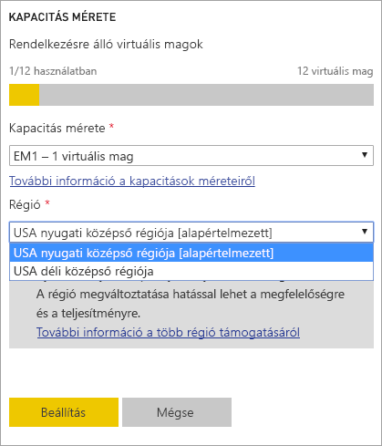
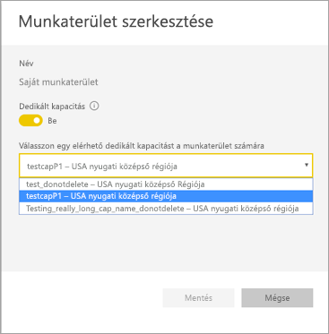
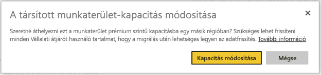
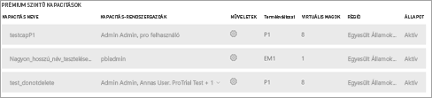

# Multi-Geo-támogatás konfigurálása a Power BI Premiumhoz

A Multi-Geo a Power BI Premium funkciója, amely segít a nemzetközi ügyfeleknek a regionális, üzletág-specifikus vagy vállalati adatok tárolási helyére vonatkozó előírások betartásában. Power BI Premium-ügyfélként a Power BI-bérlője saját régióján kívüli régiókban lévő adatközpontokban is helyezhet üzembe tartalmat. Egy geo (földrajzi értelemben) egynél több régiót is tartalmazhat. Az Egyesült Államok például egy geo, az USA nyugati középső régiója és az USA déli középső régiója pedig az Egyesült Államokon belüli régió. A tartalom üzembe helyezéséhez az alábbi helyek bármelyikét választhatja:

- Egyesült Államok
- Kanada
- Egyesült Királyság
- Brazília
- Európa
- Japán
- India
- Kelet-Ázsia
- Ausztrália
- Afrika

A Multi-Geo nem elérhető a Power BI Germany, a 21Vianet által üzemeltetett Power BI China és az USA kormányzati szervei számára készült Power BI esetében.

A Multi-Geo már a Power BI Embeddedben is elérhető. További információ: [Multi-Geo-támogatás a Power BI Embedded számára](developer/embedded/embedded-multi-geo.md).

## Engedélyezés és konfigurálás

Új kapacitásokat érhet el, ha a legördülő listából az alapértelmezettől eltérő régiót választva engedélyezi a Multi-Geo használatát.  Minden elérhető kapacitásnál megjelenik a régió, ahol jelenleg elhelyezkedik, például az **USA nyugati középső régiója**.

A kapacitás létrehozása után ebben a régióban marad, és az összes létrehozott munkaterület tartalma ebben a régióban lesz tárolva. Munkaterület egy régióból egy másikba a munkaterület beállításainak képernyőjén lévő legördülő listával migrálható.

Megjelenik a következő üzenet, amely a módosítás megerősítését kéri.

Az átjáró hitelesítő adatait a migrálás során ekkor nem kell újra beállítani.  Miután tárolva lesznek a Prémium szintű kapacitás régiójában, újra be kell állítania őket a migráláskor.

A migrálás során bizonyos műveletek, amilyen az új adatkészletek közzététele vagy az ütemezett adatfrissítés, sikertelenek lehetnek.  

A Multi-Geo engedélyezése esetén a következő elemek lesznek a Prémium-régióban tárolva:

- Modellek (.ABF-fájlok) importáláshoz és DirectQuery-adathalmazok
- Lekérdezési gyorsítótár
- R-lemezképek

A következő elemek a bérlő saját régiójában maradnak:

- Leküldéses adathalmazok
- Excel-munkafüzetek
- Irányítópultok és jelentések metaadatai: például csempenevek, csempelekérdezések
- Átjárólekérdezések vagy ütemezett frissítési feladatok szolgáltatásbuszai
- Engedélyek
- Adathalmaz hitelesítő adatai

## Kapacitások és régiók megtekintése

A felügyeleti portálom megtekinthető a Power BI-bérlő összes kapacitása, és a régiók, ahol azok jelenleg elhelyezkednek.

 

## Meglévő tartalom régiójának módosítása

Ha módosítania kell egy meglévő tartalom régióját, két módszer közül választhat.

- Létrehozhat egy másik kapacitást, majd áthelyezheti a munkaterületeket. Az ingyenes felhasználók nem tapasztalnak állásidőt, ha a bérlő rendelkezik tartalék virtuális magokkal.
- Ha második kapacitás létrehozása nem járható út, akkor ideiglenesen visszahelyezheti a tartalmat a Prémium szintűből a megosztott kapacitásba. További virtuális magokra nincs szükség, az ingyenes felhasználók viszont valamennyi állásidőt tapasztalnak majd.

## Tartalom visszavétele a Multi-Geo alól  

A munkaterületek kétféle módon vonhatók ki a Multi-Geo-kapacitásból:

- Törölheti a meglévő kapacitást, ahol a munkaterület elhelyezkedik.  A munkaterület ezáltal vissza lesz helyezve a saját régi megosztott kapacitásába.
- A munkaterületeket egyenként visszamigrálhatja a saját bérlőbeli Prémium szintű kapacitásba.

## Korlátozások és megfontolandó szempontok

- Mielőtt kezdeményezné az adatátvitelt, győződjön meg arról, hogy a régiók közötti összes forgalom megfelel minden vállalati és kormányzati megfelelőségi követelménynek.
- A távoli régiókban tárolt gyorsítótárazott lekérdezések inaktív állapotban abban a régióban maradnak. Más átvitt adatok azonban oda-vissza mozoghatnak több földrajzi hely között.
- Ha Multi-Geo-környezetben adatot mozgat egy régióból egy másikba, a forrásadatok akár 30 napon át is megmaradhatnak abban a régióban, ahonnan mozgatta őket. Ebben az időszakban a végfelhasználók nem férnek hozzájuk. A 30 napos időszak után az adatok el lesznek távolítva ebből a régióból, és meg lesznek semmisítve.

- Az [adatfolyamok](service-dataflows-overview.md) funkció jelenleg nem támogatott Multi-GEO használatával.

## További lépések

- [Mi a Power BI Premium?](service-premium-what-is.md)
- [Multi-Geo a Power BI Embedded-kapacitásokhoz](developer/embedded/embedded-multi-geo.md)

Több kérdése van? [Kérdezze meg a Power BI-közösséget](https://community.powerbi.com/)
