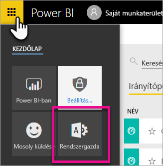
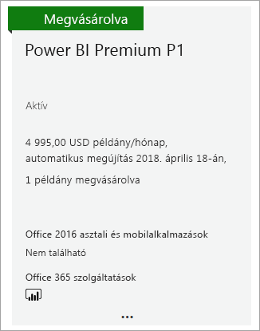
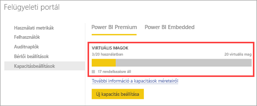

# A Power BI Premium megvásárlása

> [!NOTE]
> Ezt a cikket jelenleg frissítjük új funkciók leírásával, valamint további részletekkel, és javítjuk az olvashatóságot. 

Ez a cikk azt ismerteti, hogyan vásárolhat Power BI Premium-kapacitást (P1-P3) vállalata számára. Power BI Premium-kapacitást a Microsoft 365 Felügyeleti központban vásárolhat, a kapacitások felügyeletéhez pedig a Power BI felügyeleti portált használhatja. A jelenlegi díjszabással kapcsolatos és további tervezési információkat a [Power BI díjszabását ismertető oldalon](https://powerbi.microsoft.com/pricing/) és a [Power BI Premium-kalkulátor](https://powerbi.microsoft.com/calculator/) oldalán talál.

A tartalmak létrehozóinak továbbra is Power BI Pro-licencre lesz szükségük, abban az esetben is, ha vállalata a Power BI Premiumot használja. Legalább egy Power BI Pro-licencet meg kell vásárolnia cége számára.

Egy Premium-előfizetés lejárta után 30 napig a kapacitása még teljes mértékben a rendelkezésére áll. Ezután tartalmai megosztott kapacitásra állnak vissza. Az 1 GB-nál nagyobb méretű modellek nem támogatottak a megosztott kapacitásban.

## Új bérlő létrehozása a Power BI Premium P1 csomaggal

Ha nem rendelkezik meglévő bérlővel, és létre szeretne hozni egyet, ezzel egy időben megvásárolhatja a Power BI Premiumot. A következő hivatkozás végigvezeti egy új bérlő létrehozásának folyamatán, és a segítségével megvásárolhatja a Power BI Premiumot: [Power BI Premium P1 ajánlat](https://signup.microsoft.com/Signup?OfferId=b3ec5615-cc11-48de-967d-8d79f7cb0af1). Amikor létrehoz egy bérlőt, automatikusan hozzá lesz rendelve a bérlőhöz tartozó Office 365 globális rendszergazdai szerepkörhöz.

## Power BI Premium-kapacitás vásárlása meglévő szervezet számára

Ha rendelkezik egy meglévő vállalattal (bérlővel), akkor előfizetések és licencek vásárlásához az Office 365 globális rendszergazdai szerepkörrel vagy számlázási rendszergazdai szerepkörrel kell rendelkeznie. További információ: [Az Office 365 rendszergazdai szerepkörei](https://support.office.com/article/About-Office-365-admin-roles-da585eea-f576-4f55-a1e0-87090b6aaa9d).

Premium-kapacitás vásárlásához kövesse az alábbi lépéseket.

1. A Power BI szolgáltatásban válassza az Office 365 alkalmazásválasztót, majd a **Rendszergazda** lehetőséget.

    

    Másik lehetőségként megnyithatja a Microsoft 365 Felügyeleti központját. Ehhez nyissa meg a(z) https://portal.office.com oldalt, majd válassza a **Felügyelet** lehetőséget.

1. Válassza a **Számlázás** > **Szolgáltatások vásárlása** lehetőséget.

1. Az **Egyéb csomagok** területen keresse meg a Power BI Premium ajánlatait. Itt az alábbi lehetőségek közül választhat: P1-től P3-ig, valamint EM3 és P1 (havonta megújuló).

1. Helyezze a kurzort a három pont fölé (**. . .**), majd válassza a **Vásárlás** lehetőséget.

    

1. A vásárlás megerősítéséhez kövesse a lépéseket.

A vásárlás befejezése után a **Szolgáltatások vásárlása** oldalon a termék megvásároltként és aktívként jelenik meg.

## További kapacitások vásárlása

Most, hogy rendelkezik egy kapacitással, az igények növekedésének megfelelően hozzáadhat továbbiakat is. Cégében a Premium-kapacitások termékváltozatainak bármely kombinációját (P1-től P3-ig) használhatja. A különböző termékváltozatok különböző erőforrás-képességeket biztosítanak.

1. A Microsoft 365 Felügyeleti központjában válassza a **Számlázás** > **Szolgáltatások vásárlása** lehetőséget.

1. Keresse meg azt a Power BI Premium-elemet, amelyből további példányokat szeretne vásárolni az **Egyéb csomagok** területen.

1. Helyezze a kurzort a **három pont(…)**  fölé, majd válassza a **Licencmennyiség módosítása** lehetőséget.

    

1. Adja meg az elemhez használni kívánt példányok számát. Ha kész, válassza a **Küldés** lehetőséget.

   > [!IMPORTANT]
   > A **Küldés** lehetőség választása megterheli a nyilvántartásba vett hitelkártyát.

A **Szolgáltatások vásárlása** lapon ekkor megjelenik a példányok száma. A Power BI felügyeleti portáljának **Kapacitásbeállítások** területén az elérhető virtuális magok megjelenítik az új kapacitást.

## Az előfizetés megszüntetése

Az előfizetést a Microsoft 365 Felügyeleti központjában szüntetheti meg. A Premium-előfizetés megszüntetéséhez végezze el az alábbi műveleteket.

1. Nyissa meg a Microsoft 365 Felügyeleti központot.

1. Válassza a **Számlázás** > **Előfizetések** lehetőséget.

1. Válassza ki a listából a Power BI Premium-előfizetését.

1. Válassza a **További műveletek** > **Előfizetés megszüntetése** lehetőséget.

1. Az **Előfizetés megszüntetése** lapon tájékoztatást kap arról, hogy kell-e [idő előtti megszüntetésért felszámolt díjat](https://support.office.com/article/early-termination-fees-6487d4de-401a-466f-8bc3-c0beb5cc40d3) fizetnie. Ezen a lapon azt is megtudhatja, hogy mikor törlődnek az előfizetés adatai.

1. Olvassa végig az adatokat, és ha folytatni kívánja, válassza az **Előfizetés megszüntetése** lehetőséget.

### Törlésnél, vagy amikor lejár a licenc

Ha törli a Prémium előfizetést, vagy ha lejár a kapacitáslicenc, a törlés idejét vagy a licenc lejáratát követő 30 napon keresztül továbbra is hozzáférhet a prémium kapacitásokhoz. A 30 nap letelte után nem tudja majd elérni a prémium kapacitásokat és a bennük található munkaterületeket.

## Következő lépések

[A Power BI díjszabási oldala](https://powerbi.microsoft.com/pricing/)   
[Power BI Premium díjszámító](https://powerbi.microsoft.com/calculator/)   
[Power BI Premium – gyakori kérdések](service-premium-faq.md)   
[A Power BI Enterprise üzembehelyezési előkészületeit bemutató tanulmány ](https://aka.ms/pbienterprisedeploy)

További kérdései vannak? [Kérdezze meg a Power BI közösségét](http://community.powerbi.com/)