# Felhasználói Power BI Pro-licencek vásárlása és kiosztása

A Power BI Pro egyéni felhasználói licenc, amely lehetővé teszi, hogy a felhasználók más felhasználók által a Power BI szolgáltatásban közzétett jelentéseket és irányítópultokat olvassanak és kezeljenek, valamint tartalmat osszanak meg, és más Power BI Pro-felhasználókkal működjenek együtt. Tartalmat csak Power BI Pro-licenccel rendelkező felhasználók tehetnek közzé vagy oszthatnak meg más felhasználókkal, és csak ők használhatnak más felhasználók által létrehozott tartalmat, kivéve akkor, ha a tartalom Power BI Premium-kapacitásban van üzemeltetve. További információ: [Power BI-szolgáltatások licenctípus szerint](service-features-license-type.md).

## Felhasználói Power BI Pro-licencek vásárlása és kiosztása

Ez a cikk a felhasználói Power BI Pro licenceknek a Microsoft 365 Felügyeleti központban való megvásárlását ismerteti, valamint bemutatja azt a két módot, ahogyan a rendszergazdák kioszthatják ezeket a licenceket az egyes felhasználóknak: a Microsoft 365 Felügyeleti központban és az Azure Portalon (egy lehetőség választható).

### Előfeltételek

Ahhoz, hogy licenceket vásároljon vagy osszon ki a Microsoft 365 Felügyeleti központban, **[globális rendszergazdai vagy számlázási adminisztrátor](https://support.office.com/article/about-office-365-admin-roles-da585eea-f576-4f55-a1e0-87090b6aaa9d)** szerepkörrel kell rendelkeznie a Microsoft 365-ben.

A licencek Azure Portalon való kiosztásához a Power BI által az Azure Active Directory-keresésekhez használt Azure-előfizetés tulajdonosának kell lennie.

### Licencek vásárlása a Microsoft 365-ben

Kövesse az alábbi lépéseket a Power BI Pro licenceknek a Microsoft 365 Felügyeleti központban történő megvásárlásához:

1. Nyissa meg a [Microsoft 365 Felügyeleti központot](https://portal.office.com/adminportal/home#/homepage).

2. A navigációs panelen kattintson a **Számlázás** > **Előfizetések** lehetőségre.

    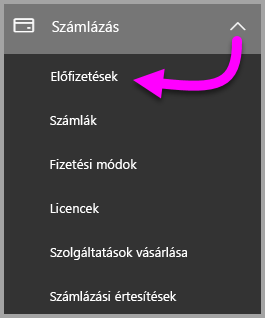

3. Az **Előfizetések** lap jobb felső sarkában kattintson az **Előfizetések felvétele** gombra.

    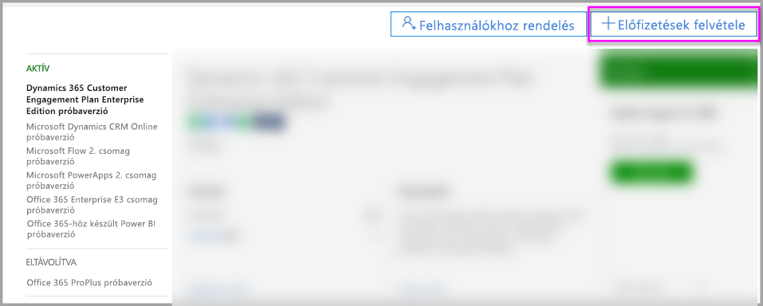

4. Keresse meg a kívánt előfizetési ajánlatot:

    Válassza a **Nagyvállalati csomag** csoportban az **Office 365 Nagyvállalati E5 csomag** lehetőséget.

    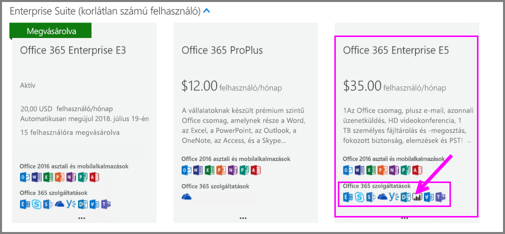

    Válassza az **Egyéb csomagok** csoportban a **Power BI Pro** lehetőséget.

    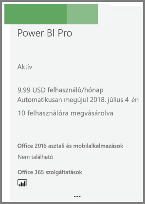

5. Mutasson a kívánt előfizetéshez tartozó három pontra ( **. . .** ), majd válassza a **Vásárlás** lehetőséget.

    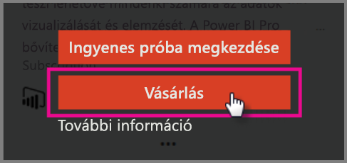

6. Válassza a **Fizetés havonta** vagy a **Fizetés egy teljes évre** lehetőséget a számlázási igényeinek megfelelően.

7. A **Hány felhasználóra van szüksége?** területen adja meg a licencek kívánt számát, válassza a **Fizetés most** lehetőséget, majd fejezze be a tranzakciót.

8. Ellenőrizze, hogy a beszerzett előfizetés megjelenik-e az **Előfizetések** lap listájában.

   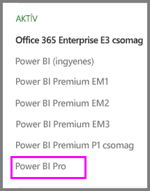

9. Ha az eredeti vásárlás után további licenceket szeretne hozzáadni, az **Előfizetések** oldalon válassza a **Power BI Pro** lehetőséget, majd válassza a **Licencek hozzáadása/eltávolítása** elemet.

### Licencek kiosztása a Microsoft 365 Felügyeleti központban

Az alábbi lépésekkel rendelheti hozzá a Power BI Pro-licenceket egyéni felhasználói fiókokhoz:

1. Nyissa meg a [Microsoft 365 Felügyeleti központot](https://portal.office.com/adminportal/home#/homepage).

2. A navigációs panelen válassza a **Felhasználók**, majd az **Aktív felhasználók** lehetőséget.

    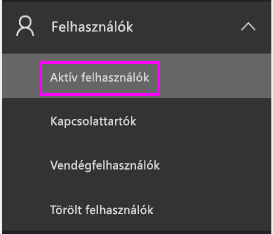

3. Válasszon ki egy felhasználót, majd a **Terméklicencek** területen válassza a **Szerkesztés** lehetőséget.

    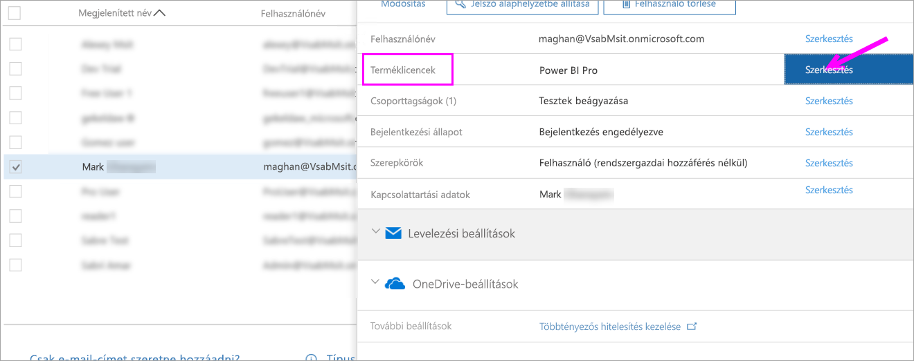

4. A **Power BI Pro** területen állítsa a kapcsolót **Be** állásra, majd kattintson a **Mentés** gombra.

    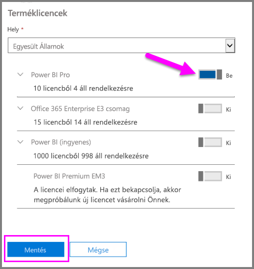

5. Az **Állapot** oszlopban ellenőrizze, hogy a kijelölt fiókhoz sikeresen hozzá lett-e rendelve a Power BI Pro-licenc.

    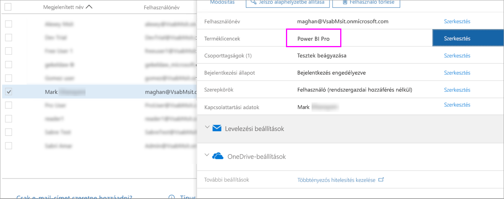

### Licencek kiosztása az Azure Portalon

Az alábbi lépésekkel rendelheti hozzá a Power BI Pro-licenceket egyéni felhasználói fiókokhoz:

1. Nyissa meg az [Azure Portalt](https://ms.portal.azure.com/#@microsoft.onmicrosoft.com/dashboard/private/39bc3cf7-31a4-43f6-954c-f2d69ca2f0).

2. A navigációs panelen válassza az **Azure Active Directory** lehetőséget.

    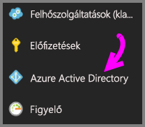

3. Az **Azure Active Directory** alatt válassza a **Licencek** lehetőséget.

    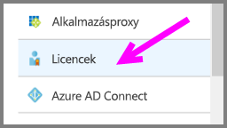

4. A **Licencek** alatt válassza a **Minden termék**, majd a **Power BI Pro** lehetőséget a licenccel rendelkező felhasználók listájának megjelenítéséhez.

    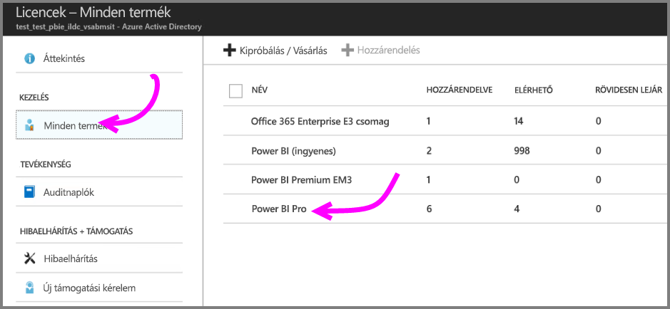

5. Power BI Pro-licenc felhasználó fiókhoz való hozzáadásához válassza **Hozzárendelés** lehetőséget.

    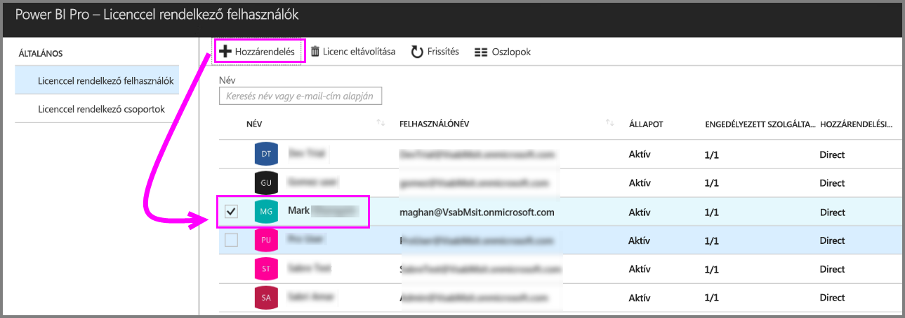

## Következő lépések

Javasoljuk, hogy a licencek hozzárendelése után ismerkedjen meg közelebbről is a Power BI Pro használatával.

[Szervezeti Power BI-licencelés](service-admin-licensing-organization.md)

[Bejelentkezett Power BI-felhasználók keresése](service-admin-access-usage.md)

További kérdései vannak? [Kérdezze meg a Power BI közösségét](https://community.powerbi.com/)
