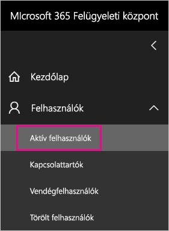
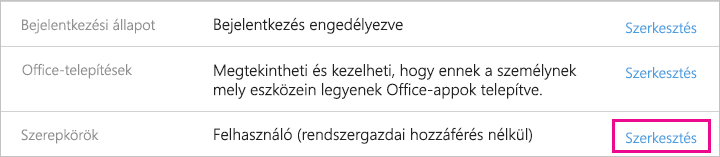
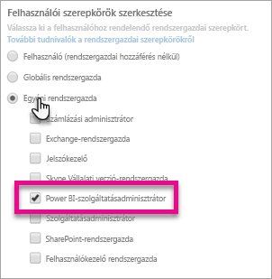
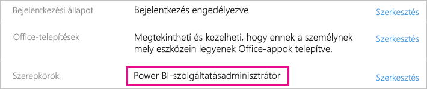

# <a name="understanding-the-power-bi-service-administrator-role"></a>A Power BI-szolgáltatásadminisztrátor szerepkör ismertetése

Megismerheti a Power BI-szolgáltatásadminisztrátor szerepkör használatát a munkahelyen. Az ezzel a szerepkörrel rendelkező felhasználóknak teljes felügyeleti jogosultsága van a Power BI-bérlőre és annak felügyeleti funkcióira vonatkozóan (kivéve a licencelést).

<iframe width="640" height="360" src="https://www.youtube.com/embed/PQRbdJgEm3k?showinfo=0" frameborder="0" allowfullscreen></iframe>

A Power BI szolgáltatásadminisztrátori szerepkörét olyan felhasználókhoz lehet hozzárendelni, akiknek szükségük van a Power BI felügyeleti portáljához való hozzáférésre, de nem kaphatnak egyéb rendszergazdai Office 365-hozzáférést.

Az Office 365 felhasználókezelő rendszergazdái az Office 365 felügyeleti központjában vagy egy PowerShell-szkripttel rendelhetnek felhasználókat a Power BI-szolgáltatásadminisztrátor szerepkörhöz. Miután a hozzárendelés megtörténik, a felhasználók hozzáférhetnek a [Power BI felügyeleti portáljához](service-admin-portal.md). A portálon hozzáférhetnek a bérlői szintű használati metrikákhoz, valamint képesek szabályozni a Power BI funkcióinak bérlői szintű használatát.

## <a name="limitations-and-considerations"></a>Korlátozások és szempontok

A Power BI-szolgáltatásadminisztrátori szerepkör nem teszi lehetővé az alábbiakat:

* A felhasználók és licencek módosításának képessége az Office 365 felügyeleti központjában.

* Hozzáférés az auditnaplókhoz. További információért lásd: [Naplózás használata a munkahelyen](service-admin-auditing.md).

## <a name="assign-users-to-the-admin-role-in-office-365"></a>Felhasználók hozzárendelése a rendszergazdai szerepkörhöz az Office 365-ben

A Power BI rendszergazdai szerepkörének felhasználókhoz való hozzárendeléséhez kövesse az alábbi lépéseket az Office 365 felügyeleti központjában.

1. Az Office 365 felügyeleti központjában válassza a **Felhasználók** > **Aktív felhasználók** elemet.

    

1. Válassza ki azt a felhasználót, akihez a szerepkört szeretné hozzárendelni.

1. A **Szerepkörök** területen válassza a **Szerkesztés** lehetőséget.

    

1. Válassza ki a **Személyre szabott adminisztrátor** > **Power BI-szolgáltatásadminisztrátor** elemet.

    

1. Válassza a **Mentés**, majd a **Bezárás** lehetőséget.

Most már láthatja, hogy a **Power BI-szolgáltatásadminisztrátor** megjelölés szerepel az adott felhasználó szerepkörénél.



## <a name="assign-users-to-the-admin-role-with-powershell"></a>Felhasználók hozzárendelése a rendszergazdai szerepkörhöz a PowerShellben

Felhasználókat a PowerShell-lel is hozzárendelhet szerepkörökhöz. Őket az Azure Active Directoryban (Azure AD) kezelheti. Ha még nem rendelkezik az Azure AD PowerShell-modullal, [töltse le és telepítse a legújabb verziót](https://www.powershellgallery.com/packages/AzureAD/).

1. Elsőként be kell szereznie a **Power BI-szolgáltatásadminisztrátor** szerepkörhöz tartozó **ObjectId** paramétert. Az **ObjectId** beszerzéséhez futtathatja a [Get-AzureADDirectoryRole](/powershell/module/azuread/get-azureaddirectoryrole) parancsot

    ```
    PS C:\Windows\system32> Get-AzureADDirectoryRole

    ObjectId                             DisplayName                        Description
    --------                             -----------                        -----------
    00f79122-c45d-436d-8d4a-2c0c6ca246bf Power BI Service Administrator     Full access in the Power BI Service.
    250d1222-4bc0-4b4b-8466-5d5765d14af9 Helpdesk Administrator             Helpdesk Administrator has access to perform..
    3ddec257-efdc-423d-9d24-b7cf29e0c86b Directory Synchronization Accounts Directory Synchronization Accounts
    50daa576-896c-4bf3-a84e-1d9d1875c7a7 Company Administrator              Company Administrator role has full access t..
    6a452384-6eb9-4793-8782-f4e7313b4dfd Device Administrators              Device Administrators
    9900b7db-35d9-4e56-a8e3-c5026cac3a11 AdHoc License Administrator        Allows access manage AdHoc license.
    a3631cce-16ce-47a3-bbe1-79b9774a0570 Directory Readers                  Allows access to various read only tasks in ..
    f727e2f3-0829-41a7-8c5c-5af83c37f57b Email Verified User Creator        Allows creation of new email verified users.
    ```

    Ebben az esetben a szerepkör **ObjectId** paramétere a következő: 00f79122-c45d-436d-8d4a-2c0c6ca246bf.

1. Ezután szerezze be a felhasználó **ObjectId** paraméterét. Ezt a [Get-AzureADUser](/powershell/module/azuread/get-azureaduser) parancs futtatásával szerezheti be.

    ```
    PS C:\Windows\system32> Get-AzureADUser -SearchString 'tim@contoso.com'

    ObjectId                             DisplayName UserPrincipalName      UserType
    --------                             ----------- -----------------      --------
    6a2bfca2-98ba-413a-be61-6e4bbb8b8a4c Tim         tim@contoso.com        Member
    ```

1. A szerepkör taghoz való hozzárendeléséhez futtassa az [Add-AzureADDirectoryRoleMember](/powershell/module/azuread/add-azureaddirectoryrolemember) parancsot.

    | Paraméter | Leírás |
    | --- | --- |
    | ObjectId |A szerepkör objektumazonosítója (ObjectId). |
    | RefObjectId |A tag objektumazonosítója (ObjectId). |

    ```powershell
    Add-AzureADDirectoryRoleMember -ObjectId 00f79122-c45d-436d-8d4a-2c0c6ca246bf -RefObjectId 6a2bfca2-98ba-413a-be61-6e4bbb8b8a4c
    ```

## <a name="next-steps"></a>Következő lépések

[A Power BI felügyelete a munkahelyen](service-admin-administering-power-bi-in-your-organization.md)  
[Power BI felügyeleti portál](service-admin-portal.md)  

További kérdései vannak? [Kérdezze meg a Power BI közösségét](http://community.powerbi.com/)