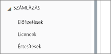
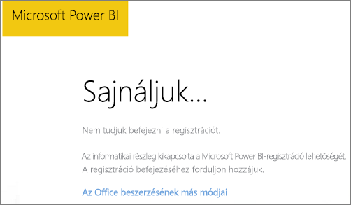
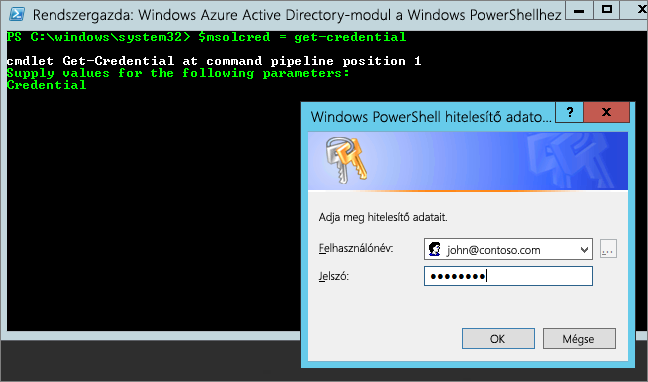

# <a name="unable-to-add-power-bi-to-office-365-partner-subscription"></a>Nem sikerült hozzáadni a Power BI-t az Office 365 típusú partneri előfizetéshez

Az Office 365 lehetővé teszi a cégeknek az Office 365 saját megoldásokkal integrált, csomagalapú továbbértékesítését, és a cégek egyetlen kapcsolatfelvételi pontot biztosíthatnak a végfelhasználóknak a vásárláshoz, a számlázáshoz és a támogatáshoz.

Ha érdekli a Power BI és az Office 365-előfizetés együttes beszerzése, javasoljuk, hogy érdeklődjön a partnernél ezzel kapcsolatban. Ha a partner kínálatában jelenleg nem szerepel a Power BI, különböző lehetőségeket vehet fontolóra.

## <a name="work-with-your-partner-to-purchase-power-bi"></a>A Power BI megvásárlása a partnerrel együttműködve

Ha szeretne Power BI Pro- vagy Power BI Premium-előfizetést vásárolni, a partnerrel együttműködve mérlegelje a rendelkezésre álló lehetőségeket:

* A partner beleegyezik abba, hogy felvegye a Power BI-t a portfóliójába, így megvásárolhatja azt tőle.

* A partner segítségével olyan modellre válthat, amelyben a Power BI közvetlenül a Microsofttól vagy egy Power BI-t értékesítő másik partnertől vásárolható meg.

## <a name="purchase-from-microsoft-or-another-channel"></a>Vásárlás a Microsofttól vagy másik forrásból

A partnerével való kapcsolatától függően előfordulhat, hogy közvetlenül a Microsofttól vagy egy másik partnertől vásárolhatja meg a Power BI-t. A Microsoft 365 felügyeleti portálján ellenőrizheti, hogy hozzáadhat-e Power BI-előfizetéseket (ehhez Globális rendszergazda vagy Számlázási rendszergazda szerepkör szükséges).

1. A [Microsoft 365 Felügyeleti központ](https://admin.microsoft.com/AdminPortal/Home#/homepage) megnyitása.

1. A bal oldali menüben nyissa meg a **Számlázás** területet:

    * Ha látja az **Előfizetések** elemet, közvetlenül vásárolhatja meg a szolgáltatást a Microsofttól, vagy felveheti a kapcsolatot egy olyan partnerrel, akinek a kínálatában szerepel a Power BI.

        

    * Ha nem látja az **Előfizetések** elemet, nem vásárolhat közvetlenül a Microsofttól vagy egy másik partnertől.

Ha a partnere kínálatában nem szerepel a Power BI, és a Microsofttól vagy egy másik partnertől sem tud vásárolni, regisztráljon egy ingyenes próbaverzióra.

## <a name="sign-up-for-a-free-trial"></a>Regisztráció ingyenes próbára

Regisztrálhat a Power BI Pro ingyenes próbaverziójára. Ha nem vásárolja meg a Power BI Prót a próbaidőszak végén, továbbra is rendelkezik majd egy ingyenes licenccel, amellyel a Power BI számos funkcióját kihasználhatja. További információ: [Power-szolgáltatások licenctípus szerint](service-features-license-type.md).

### <a name="enable-ad-hoc-subscriptions"></a>Alkalmi előfizetések engedélyezése

Az egyéni regisztrációk (más néven alkalmi előfizetések), alapértelmezés szerint le vannak tiltva. Ilyen esetben regisztrálási kísérletnél az alábbi üzenet jelenik meg: *Az informatikai részleg kikapcsolta a Microsoft Power BI-regisztráció lehetőségét*.



Az alkalmi előfizetések engedélyezéséhez megkérheti a partnert, hogy kapcsolja be azt. Ha Ön a bérlő rendszergazdája, és ismeri az Azure Active Directory PowerShell-parancsok használatát, saját maga is engedélyezheti az alkalmi előfizetéseket. [Azure Active Directory PowerShell for Graph](/powershell/azure/active-directory/install-adv2/)

1. Jelentkezzen be az Azure Active Directoryba az Office 365-ös hitelesítő adataival. Az alábbi szkript első sora bekéri a hitelesítő adatokat. A második sor csatlakozik az Azure Active Directoryhoz.

    ```powershell
    $msolcred = get-credential
    connect-msolservice -credential $msolcred
    ```

    

1. Miután bejelentkezett, a következő parancs futtatásával ellenőrizheti az `AllowAdHocSubscriptions` aktuális beállítását.

    ```powershell
    Get-MsolCompanyInformation
    ```

1. Az ingyenes regisztráció engedélyezéséhez futtassa a következő parancsot.

    ```powershell
    Set-MsolCompanySettings -AllowAdHocSubscriptions $true
    ```

## <a name="next-steps"></a>Következő lépések

[Szervezeti Power BI-licencelés](service-admin-licensing-organization.md)

További kérdései vannak? [Kérdezze meg a Power BI közösségét](https://community.powerbi.com/)