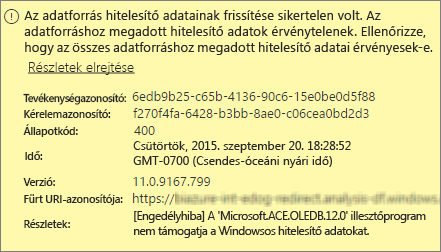
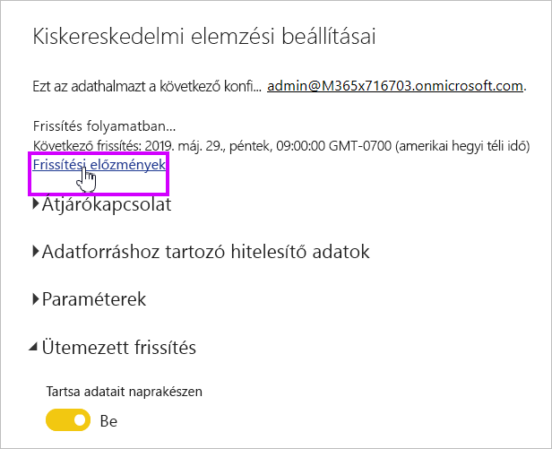
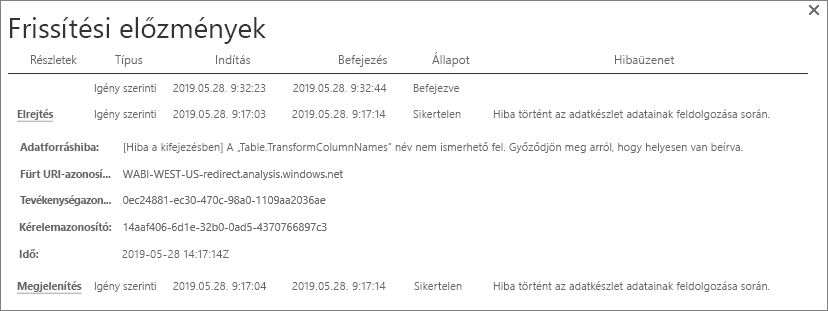
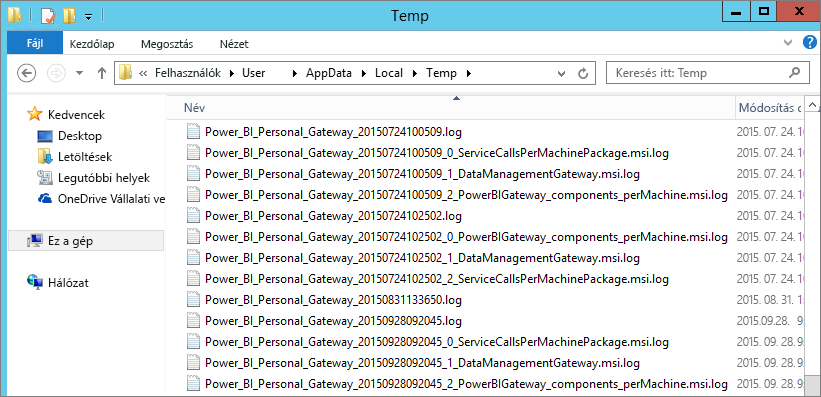

# A Power BI személyes átjáró hibáinak elhárítása
Próbálja ki az alábbi szakaszok olyan használata a Power BI Gateway-Personal gyakori problémákat.

> [!NOTE]
> Az átjáró aktuális, személyes használatú verziója a **Helyszíni adatátjáró (személyes)**. A telepített példányt frissítve térjen át erre a verzióra.
> 
> 

## Frissítés a legújabb verzióra
Számos probléma akkor merülhet fel, ha az átjáró verziója elavult.  Általános célszerű a legújabb verziót róla, hogy legyen. Ha egy hónapban, vagy hosszabb ideig nem frissítette az átjárót, fontolja meg az átjáró legújabb verziójának telepítéséhez. Ezután tekintse meg, ha Reprodukálja a problémát.

## Telepítés
**Személyes átjáró egy 64 bites** – Ha számítógépe 32 bites, a személyes átjáró nem telepíthető. Az operációs rendszer nem lehet 64-bites verzióján. A Windows 64 bites verzióját telepítse, vagy a személyes átjárót telepíti egy 64 bites számítógépre.

**Személyes átjárót nem tudja szolgáltatásként telepíteni, annak ellenére, hogy a számítógép helyi rendszergazdai** -telepítés meghiúsulhat, ha a felhasználó szerepel-e a számítógép helyi Rendszergazdák csoportnak, de a csoportházirend nem engedélyezi a megadott felhasználónévvel jelentkezhessen be, egy a szolgáltatás. Abban a pillanatban győződjön meg arról, a csoportházirend lehetővé teszi, hogy a felhasználó szolgáltatásként jelentkezzen be. Ennek a problémának a javításán még dolgozunk. [További információ](https://technet.microsoft.com/library/cc739424.aspx)

**A művelet túllépte az időkorlátot** – Ez az üzenet a gyakori, ha a számítógép (fizikai gép vagy VM), amelyen a személyes átjáró telepítése egymagos processzorral rendelkezik. Zárja be az alkalmazásokat, állítsa le azokat a folyamatokat, melyek nem nélkülözhetetlenek, és próbálja meg újra telepíteni az átjárót.

**Adatkezelési átjáró vagy az Analysis Services Connector nem telepíthető ugyanazon a számítógépen, a személyes átjáróval** – Ha már rendelkezik az Analysis Services Connector vagy az adatkezelési átjáró telepítve van, először el kell távolítani az összekötőt, vagy az átjáró. Ezt követően próbálja meg telepíteni a személyes átjárót.

> [!NOTE]
> Ha problémát tapasztal a telepítés során, a telepítési naplókat a probléma elhárításához információkat biztosítja. További információkért lásd: [telepítési naplók](#SetupLogs).
> 
> 

 **Proxykonfiguráció** a személyes átjáró konfigurálásával, ha a proxy használatát a környezetnek meg kell kapcsolatos problémák jelenhetnek meg. Ha további információkra van szüksége a proxyadatok konfigurálásával kapcsolatban, tekintse át a [Power BI-átjárók proxybeállításainak konfigurálásáról](service-gateway-proxy.md) szóló cikket.

## Frissítés ütemezése
**Hiba: The credential stored in the cloud is missing. (A felhőben tárolt hitelesítő adat hiányzik.)**

Előfordulhat, hogy megjelenik a hibaüzenet a beállítások \<adatkészlet\> Ha rendelkezik egy ütemezett frissítés és majd eltávolította és újratelepítette a személyes átjárót. Személyes átjáró eltávolításakor törlődnek az adatforrás hitelesítő adatainak egy adatkészlethez, amelynek része a frissítéshez a Power BI szolgáltatásban.

**Megoldás:** A Power BI-ban lépjen az adatkészletre vonatkozó beállítások frissítéséhez. Az adatforrások kezelése egy hibás semmilyen adatforrás esetében válassza **hitelesítő adatok szerkesztése** , és jelentkezzen be ismét az adatforrás.

**Hiba: The credentials provided for the dataset are invalid. (Az adatkészlethez megadott hitelesítő adatok érvénytelenek.) A folytatáshoz először frissítse a hitelesítő adatokat a lap frissítésével vagy az Adatforrás beállításai párbeszédpanelen.**

**Megoldás**: Ha a hitelesítő adatokkal kapcsolatos üzenet jelenik meg, az a következőket jelentheti:

* Ellenőrizze, hogy a felhasználónév és jelszó adatforrások bejelentkezik naprakészek legyenek. A Power BI-ban lépjen az adatkészlet beállításainak frissítéséhez. Válassza ki az adatforrások kezelése **hitelesítő adatok szerkesztése** az adatforrás hitelesítő adatainak frissítéséhez.
* Egy felhőbeli forrás és a egy helyszíni adatforráshoz, egyetlen lekérdezésben keresztül a személyes átjárón frissítéséhez, ha a forrásokból nem használja OAuth hitelesítési sikertelen. Egy példa a probléma, CRM Online-hoz és a egy helyi SQL Server-szerver. Az Adategyesítés meghiúsul, mert a CRM Online OAuth szükséges.
  
  Ez a hiba egy ismert probléma, azt a foglalkozunk. A probléma megkerüléséhez rendelkezik külön lekérdezést használ a felhőbeli forráshoz és a helyszíni adatforráshoz. Majd összefésüléssel vagy összefűzéssel egyesíti az eredményeket.

**Hiba: Unsupported data source. (Nem támogatott adatforrás.)**

**Megoldás:** Ha nem támogatott adatforrásról tájékoztató üzenetet kap a frissítések ütemezése közben, az a következőket jelentheti: 

* Az adatforrás jelenleg nem támogatott a Power bi-ban a frissítéshez. 
* Az Excel-munkafüzet nem tartalmaz egy adatmodellt, csak a munkalap adatainak. A Power BI jelenleg csak akkor támogatja a frissítést, ha a feltöltött Excel-munkafüzet tartalmaz adatmodellt. Ha az Excelbe a Power Query-t használva importál adatokat, válassza az Adatok betöltése adatmodellbe lehetőséget. Ez a beállítás biztosítja az adatok importálása egy adatmodellbe. 

**Hiba: [Nem kombinálhatók az adatok] &lt;lekérdezés rész&gt;/&lt;... &gt; / &lt;... &gt; fér hozzá az adatforrásokat, amelyek adatvédelmi szintjei, amely nem használható együtt. Kérjük, építse újra az adategyesítést.**

**Megoldás**: Ezt a hibát az adatvédelmi szintekre vonatkozó korlátozások és a típusú adatforrások használata miatt van.

**Hiba: Adatforráshiba: We cannot convert the value "\[Table\]" to type Table. (Adatforrás-hiba: A [Tábla] érték nem konvertálható a következő típusra: Tábla.)**

**Megoldás**: Ezt a hibát az adatvédelmi szintekre vonatkozó korlátozások és a típusú adatforrások használata miatt van.

**Hiba: Nincs elegendő szabad terület ehhez a sorhoz.**

Ez a hiba akkor fordul elő, ha egyetlen sor 4 MB-nál nagyobb méretű. Megkeresi az adatforrásból, és próbálja ki szűrni, vagy csökkenteni a méretét a sorhoz.

## Adatforrások
**Hiányzó adatszolgáltató** – a személyes átjáró csak 64 bites verzió. Működéséhez arra van szükség, hogy a számítógépre, amelyen a személyes átjáró üzemel, telepítve legyen az adatszolgáltató 64 bites verziója. Például, ha az adatkészletben szereplő adatforrás Microsoft Access típusú, telepítenie kell a 64 bites ACE-szolgáltatót arra a számítógépre, amelyen a személyes átjáró is fut.  

>[!NOTE]
>Ha az Excel 32 bites verziója van, egy 64 bites ACE-szolgáltatót nem telepíthető ugyanazon a számítógépen.

**Access-adatbázis használata esetén a Windows-hitelesítés nem támogatott** – Access-adatbázis esetén a Power BI jelenleg csak a névtelen hitelesítést támogatja. Még dolgozunk Access-adatbázis Windows-hitelesítés engedélyezése.

**Bejelentkezési hiba, ha egy adatforráshoz tartozó hitelesítő adatok megadása** – Ha egy adatforráshoz Windows hitelesítő adatok beírásakor ehhez hasonló hibaüzenetet kap, továbbra is valószínűleg egy régebbi verzióját, a személyes átjárót. [Telepítse a Power BI személyes átjáró legfrissebb verzióját](https://powerbi.microsoft.com/gateway/).

  

**Hiba: Bejelentkezési hiba Windows-hitelesítés kijelölésekor, ACE OLEDB-t használó adatforrás esetén** – Ha ACE OLEDB szolgáltatót használó adatforrás esetén a hitelesítési adatok beírásakor az alábbi üzenet jelenik meg:

A Power BI jelenleg nem támogatja a Windows-hitelesítést ACE OLEDB szolgáltatót használó adatforrások esetében.

**Megoldás:** Ez a hiba elkerüléséhez kiválaszthatja **névtelen hitelesítés**. A hagyományos ACE OLEDB szolgáltatók névtelen hitelesítő adatok Windows hitelesítő adatok egyenlő.

## Csempefrissítés
Ha az irányítópult csempéinek frissítésével hiba azért küldtük Önnek, tekintse meg a következő cikket.

[Csempékkel kapcsolatos hibák elhárítása](refresh-troubleshooting-tile-errors.md)

## Hibaelhárítási eszközök
### Frissítési előzmények
**Frissítési előzmények** segítségével tájékozódhat a hibákat, és hasznos adatokat tesz elérhetővé, ha hozzon létre egy támogatási kérést szeretne. Ütemezett mind az igény szerinti, frissítések tekintheti meg. Itt látható, hogyan juthat el a **frissítési előzmények**.

1. A Power BI navigációs ablaktáblájának **Adatkészletek** területén jelöljön ki egy adatkészletet, majd válassza a &gt;Menü megnyitása&gt; **Frissítés ütemezése** lehetőséget.
   
1. A **beállításai...** válassza **frissítési előzmények**.  
   
   
   

### Eseménynaplók
Több eseménynapló információkkal szolgálhat. Az első két **adatkezelési átjáró** és **PowerBIGateway**, ha Ön rendszergazda a számítógépen.  Ha Ön nem rendszergazda, és a személyes átjárót használja, látni fogja a naplóbejegyzéseket a **alkalmazás** napló.

A **Data Management Gateway** (Adatkezelési átjáró) és **PowerBIGateway** naplók az **Alkalmazás- és szolgáltatásnaplók** között találhatók.

### Nyomon követés a Fiddlerrel
A [Fiddler](http://www.telerik.com/fiddler) a Telerik ingyenes eszköze, amely a HTTP-adatforgalom figyelésére használható. Láthatja, hogy a kommunikáció áramlását az ügyfélszámítógépen a Power BI szolgáltatással. Ez a kommunikáció valószínűleg hibák és egyéb kapcsolódó információkat.

### Telepítési naplók
Ha a **személyes átjáró**, nem tudja telepíteni, megjelenik egy hivatkozás, megjelenítheti a telepítési naplót. A telepítő naplóját jeleníti meg, a hiba részleteit. Ezek a naplók olyan Windows-telepítési napló, más néven MSI-napló. Ezek a bejegyzések meglehetősen összetettek és nehezen olvashatók. Általában a eredményül kapott hiba: a lap alján, de a hiba okának megállapítása nem triviális. Lehet, hogy egy másik naplóban feljegyzett hibák eredményeképpen alakult ki, de az is előfordulhat, hogy egy korábbi bejegyzésben szereplő hiba miatt.

Másik lehetőségként megnyithatja az **Temp mappa** (% temp %) és kezdődő fájlokat **Power\_BI\_**.

> [!NOTE]
> Elképzelhető, hogy a %temp% használatával a Temp mappa egyik almappájába kerül. A **Power\_BI\_**  fájljai a temp könyvtár gyökerében találhatók.  Ehhez lehet, hogy egy vagy két szinttel feljebb kell lépnie.
> 
> 

## Következő lépések
[A Power BI-átjárók proxybeállításainak konfigurálása](service-gateway-proxy.md)  
[Adatok frissítése](refresh-data.md)  
[A Power BI személyes átjáró](service-gateway-personal-mode.md)  
[Csempékkel kapcsolatos hibák elhárítása](refresh-troubleshooting-tile-errors.md)  
[A Helyszíni adatátjáróval kapcsolatos hibák elhárítása](service-gateway-onprem-tshoot.md)  
További kérdései vannak? [Kérdezze meg a Power BI közösségét](http://community.powerbi.com/)

