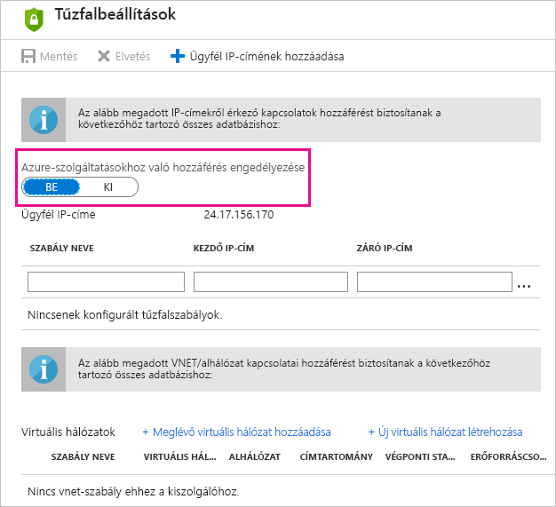

# Az Azure SQL Database ütemezett frissítésének hibaelhárítása a Power BI-ban
Az ütemezett frissítés beállításának részletes leírásáért tekintse meg az [adatok a Power BI-ban történő frissítését](refresh-data.md) ismertető témakört.

Amikor ütemezett frissítést hoz létre egy Azure SQL Database-hez, és 400-as számú hibaüzenetet kap a hitelesítő adatok szerkesztése során, a következő módon állíthatja be a megfelelő tűzfalszabályt:

1. Jelentkezzen be az Azure felügyeleti portálján.
2. Keresse meg azt az Azure SQL Servert, amelyhez be kívánja állítani a frissítést.
3. Jelölje be a „Windows Azure-szolgáltatások” elemet az engedélyezett szolgáltatások szakaszában.

  

További kérdései vannak? [Kérdezze meg a Power BI közösségét](http://community.powerbi.com/)

