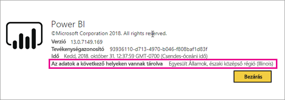
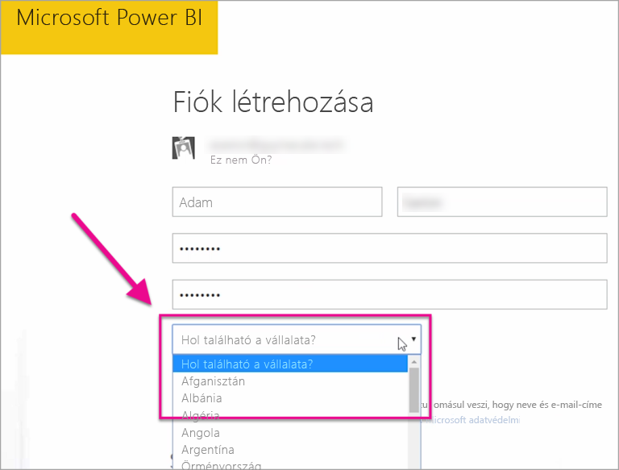

# Hol található a Power BI-bérlőm?

<iframe width="560" height="315" src="https://www.youtube.com/embed/0fOxaHJPvdM?showinfo=0" frameborder="0" allowfullscreen></iframe>

Tudja meg, hogy hol található a Power BI-bérlője, és hogy miként történt ennek a helynek a kiválasztása. Fontos a hely ismerete, mert az befolyásolhatja a szolgáltatással való kommunikációt.

## A Power BI-bérlő helyének meghatározása

A bérlő a régiójának megkereséséhez kövesse az alábbi lépéseket.

1. A Power BI szolgáltatásban a felső menüből válassza ki a Súgó (**?**), majd **A Power BI bemutatása** lehetőséget.

1. Nézze meg **Az adatok a következő helyeken vannak tárolva** melletti szöveget. A bérlője ezen a területen található.

    

## Az adatrégió kiválasztásának módja

Az adatrégiót a bérlő létrehozásakor kiválasztott ország határozza meg. Ez a Power BI mellett az Office 365-re való regisztrációra is vonatkozik, mivel ez egy megosztott információ. Ha új bérlőről van szó, regisztrációkor válassza ki a megfelelő országot a listából.

A Power BI a megjelölt országhoz legközelebbi adatterületet választja ki, amely meghatározza, hogy hol tárolódnak a bérlővel kapcsolatos adatok.

> [!IMPORTANT]
> Ez a beállítás a bérlő létrehozása után már nem módosítható.

További kérdései vannak? [Kérdezze meg a Power BI közösségét](http://community.powerbi.com/)

