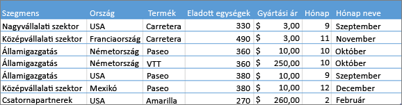
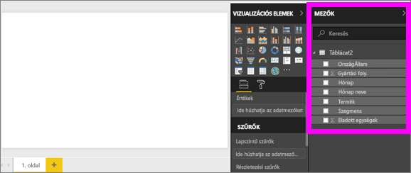
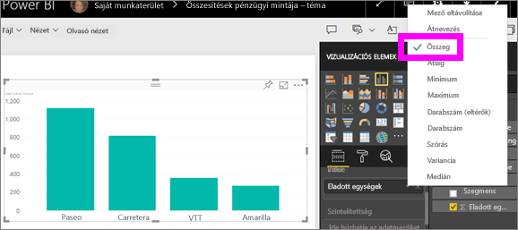
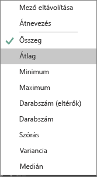
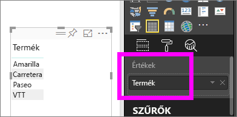
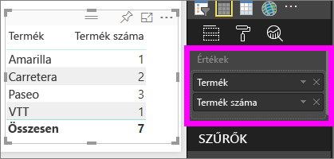

# Összesítésekkel (összeg, átlag stb.) végzett munka a Power BI szolgáltatásban

## Mi az az összesítés?

Néha szükség van az adatok értékeinek matematikai összevonására. Ez a matematikai művelet lehet összeadás, átlagolás, maximumérték meghatározása, darabszám meghatározása, stb. Az adatok értékeinek összevonását *összesítésnek* nevezzük. Az ilyen matematikai műveletek eredménye az *összesítési érték*.

Amikor a Power BI szolgáltatás és a Power BI Desktop vizualizációkat hoz létre, előfordulhat, hogy összesítés is történik. Az így létrehozott összesítés gyakran éppen megfelelő a célnak, de előfordulhat, hogy az értékeket másféle módon szükséges összesíteni.  Ilyen lehet például, ha összeg helyett átlagot szeretnénk. A vizualizációkban a Power BI által használt összesítések többféle módszerrel is kezelhetők és módosíthatók.

Először vizsgáljuk meg az *adattípusokat*, hiszen az adat típusa határozza meg, hogy az illető adatot képes-e egyáltalán a Power BI összesíteni, és ha igen, milyen módon.

## Adattípusok

A legtöbb adathalmazban többféle adattípus található. Az adatok alapvetően lehetnek numerikusak vagy nem numerikusak. A Power BI numerikus adatot összeg, átlag, szám, minimum, variancia és sok más módszerrel is tud összesíteni. A szolgáltatás még a szöveges adatokat is képes összesíteni (ezeket néha *kategóriaadatnak* is nevezzük). Ha kategóriamezőt próbál összegezni úgy, hogy egy csak számalapú gyűjtőbe (például **Értékek** vagy **Elemleírások**) helyezi őket, a Power BI képes megszámlálni az egyes kategóriák normál vagy eltérő előfordulásait. A speciális adattípusok, például a dátumok néhány saját összegzési típussal is rendelkeznek, ilyenek lehetnek a legkorábbi, a legújabb, az első vagy az utolsó.

Az alábbi példában:

- A **Units Sold** és a **Manufacturing Price** oszlopok numerikus adatokat tartalmaznak

- A **Segment**, **Country**, **Product**, **Month**, és **Month Name** nevű oszlopok kategóriaadatokat tartalmaznak

   

Amikor a Power BI-ban vizualizációkat hoz létre, a numerikus adatok néhány kategóriaadat alapján lesznek összesítve (alapértelmezetten az *összeg* használatával).  Például a „Units Sold ***by Product***” (értékesített egységek termékek szerint), a „Units Sold ***by Month***” (értékesített egységek hónapok szerint) és a „Manufacturing Price ***by Segment***” (gyártási költség szegmens alapján). A Power BI-ban néhány számmezőt gyakran **mértéknek** is nevezünk. A Power BI jelentésszerkesztőjében egyszerűen megtalálhatók a mértékek, mert ezek mindig a ∑ jellel jelennek meg a **Mezőlistában**. További információ: [Jelentésszerkesztő – Bevezetés](service-the-report-editor-take-a-tour.md).

## Miért nem az elvártnak megfelelően működnek az összesítések?

A Power BI szolgáltatásban az összesítések használata bonyolultnak tűnhet. Például számmezőről van szó, és a Power BI nem engedélyezi az összesítés módosítását. Vagy esetleg olyan mezőről van szó (például évszám), amelynek nem kellene szerepelnie az összesítésben, csak az ahhoz tartozó előfordulások számát szeretnénk megszámlálni.

Az alapprobléma általában az adatkészletben található meződefiníció. Lehet, hogy az adatkészlet tulajdonosa szövegként definiálta a mezőt, és a Power BI emiatt nem tudja összesíteni vagy átlagolni azt. Sajnos [csak az adatkészlet tulajdonosa tudja módosítani a mezők kategóriáját](desktop-measures.md). Ha tehát tulajdonosi hozzáféréssel rendelkezik az adatkészlethez akár a Desktopban, akár abban a programban, amellyel létrehozták az adathalmazt (ilyen lehet például az Excel), akkor ezt a problémát el tudja hárítani. Ellenkező esetben azonban az adathalmaz tulajdonosától kell segítséget kérnie.  

A cikk végén szerepel egy [**Megfontolandó szempontok és hibaelhárítás című szakasz**](#considerations-and-troubleshooting). Ebben tippeket és útmutatást talál. Ha ebben nem találja meg a választ, tegye fel kérdését a [Power BI közösségi fórumában](https://community.powerbi.com). Itt gyors választ kaphat közvetlenül a Power BI csapatától.

## Számmezők összevonásának módosítása

Tegyük fel, hogy egy diagramban különböző termékekhez tartozó értékesítési adatok összesítése szerepel, de Ön inkább átlagot szeretne számolni.

1. Hozzon létre egy **Fürtözött oszlopdiagramot**, amely egy kategóriát és egy mértéket használ. Ebben a példában a „Units Sold by Product” (értékesített egységek termék szerint) összesítést használjuk.  A Power BI alapbeállítás szerint létrehoz egy diagramot, amely összegzi az értékesített egységeket (az **Érték** mezőbe húzza a mértéket) minden egyes termék esetében (a **Tengely** mezőbe húzza a kategóriát).

   

1. A **Megjelenítések** panelen kattintson a jobb gombbal a mértékre, majd válassza ki a kívánt összesítési típust. Ebben az esetben most az **Átlagot** választjuk. Ha nem jelenik meg a kívánt összesítési típus, olvassa el a [**Megfontolandó szempontok és hibaelhárítás**](#considerations-and-troubleshooting) szakaszt.

   

   > [!NOTE]
   > A legördülő menüben elérhető lehetőségek a következőktől függenek: 1) a kijelölt mező, illetve 2) a mező adatkészlet-tulajdonos általi kategorizálása.

1. A vizualizáció most már az átlag szerinti összesítést használja.

   

## Az adatok összesítésének módjai

A mezők összesítésekor esetlegesen rendelkezésre álló lehetőségek:

- **Összegzés mellőzése**. A lehetőség használatakor az adott mező egyes értékeit a Power BI különállóként kezeli, és nem összegzi. Ezt akkor használhatja, ha olyan számazonosítós oszlopról van szó, amelyet nem kell összeadni.

- **Összeg**. Összeadja a mezőben szereplő összes értéket.

- **Átlag**. Az értékek számtani középértékét számítja ki.

- **Minimum**. A legkisebb értéket mutatja.

- **Maximum**. A legnagyobb értéket mutatja.

- **Darabszám (nem üres).** A nem üres mezőkben lévő értékek darabszámát adja vissza.

- **Darabszám (eltérők).** A mezőkben lévő különböző értékek darabszámát adja vissza.

- **Szórás.**

- **Variancia**.

- **Medián**.  A mediánt (középértéket) mutatja. Ez az az érték, amely képest ugyanannyi számú nála nem kisebb és nem nagyobb elem van.  Ha két mediánról van szó, a Power BI átlagolja őket.

Nézzük például az alábbi adatokat:

| Ország | Összeg |
|:--- |:--- |
| Amerikai Egyesült Államok |100 |
| Egyesült Királyság |150 |
| Kanada |100 |
| Németország |125 |
| Franciaország | |
| Japán |125 |
| Ausztrália |150 |

Ezek az alábbi eredményeket adnák vissza:

- **Összegzés mellőzése**: Minden érték külön jelenik meg

- **Összeg**: 750

- **Átlag**: 125

- **Maximum**:  150

- **Minimum**: 100

- **Darabszám (nem üres):** 6

- **Darabszám (eltérők):** 4

- **Szórás:** 20,4124145...

- **Variancia:** 416,666...

- **Medián:** 125

## Összesítés létrehozása a kategória- (szöveg-) mező használatával

Nem numerikus mezőt is lehet összesíteni. Ha például egy Terméknév nevű mezőről van szó, felveheti értékként, majd beállíthatja azt a **Darabszám** vagy a **Darabszám (eltérők)** , az **Első** vagy **Utolsó** használatára.

1. Húzza a **Termék** mezőt az **Értékek** területre. Az **Értékek** mező általában numerikus értékekhez használatos. A Power BI felismeri, hogy ez egy szöveges mező, ezért az összesítést úgy állítja be, hogy az **Összegzés mellőzése** legyen érvényes, és egy egyoszlopos táblázatot hoz létre.

   

1. Ha ilyenkor az összesítést az alapértelmezett **Összegzés mellőzése** lehetőségről a **Darabszám (eltérők)** lehetőségre módosítjuk, a Power BI megszámlálja a különböző termékekhez tartozó darabszámot. Ebben az esetben az eredmény 4.
  
   

1. Ha az összesítést a **Darabszám** lehetőségre módosítja, a Power BI a teljes darabszámot adja vissza. Ebben az esetben a **Product** (Termék) 7 tételt tartalmaz.

   

1. Ha ugyanazt a mezőt (ebben az esetben a **Product**, azaz Termékek mezőt) az **Értékek** közé húzzuk, és változtatás nélkül hagyjuk az **Összegzés mellőzése** beállítást, akkor a Power BI az összeget termékek szerint adja vissza.

   

## Megfontolandó szempontok és hibaelhárítás

KÉRDÉS:  Miért nem látható az **Összegzés mellőzése** lehetőség?

VÁLASZ:  A kijelölt mező valószínűleg számított mérték, vagy olyan speciális mérték, amelyet a Excelben vagy a [Power BI Desktopban](desktop-measures.md) hoztak létre. Minden számított mértékhez saját nem változtatható képlet tartozik. A Power BI által használt összesítés nem módosítható. Ha az például összeg, akkor csak összeg maradhat. A **Mezők** listában a *számított mértékek* számológép szimbólummal vannak ellátva.

KÉRDÉS:  A mező **számalapú**. Miért csak a **Darabszám** és a **Darabszám (eltérők)** lehetőséget lehet kiválasztani?

VÁLASZ1:  Ennek a valószínű magyarázata az, hogy az adatkészlet tulajdonosa *nem* számként sorolta be a mezőt. Ha például egy adatkészlet egy **év** mezővel rendelkezik, akkor lehet, hogy az adatkészlet tulajdonosa szövegként kategorizálja az értéket. Nagyobb a valószínűsége annak, hogy Power BI megszámolja az **év** mezőt (például a 1974-ben született személyek számát). Kevésbé valószínű, hogy Power BI összegzi vagy átlagot számol belőle. Ha Ön a tulajdonos, az adatkészletet a Power BI Desktop alkalmazásban nyithatja meg, és a **Modellezés** lapon módosíthatja az adattípust.

VÁLASZ2: Ha a mezőhöz számológép ikon tartozik, az azt jelenti, hogy ez egy *számított* mérték. Minden számított mértékhez saját nem változtatható képlet tartozik, amelyet csak az adatkészlet tulajdonosa módosíthat. A Power BI által alkalmazott számítás lehet, hogy csak egy egyszerű összesítés, például átlagolás vagy összeadás. De lehet bonyolultabb művelet is, mint például „szülőkategóriához való hozzájárulás százaléka” vagy „göngyölített összeg az év kezdete óta”. Power BI nem fogja összeadni vagy átlagolni az eredményeket. Ehelyett csak újraszámítást végez (a rögzített képlet használatával) az egyes adatpontokra.

VÁLASZ3:  Egy másik lehetőség az, hogy az adott mezőt egy olyan *gyűjtőbe* helyezte, amely csak kategóriaértékeket engedélyez.  Ebben az esetben csak a Darabszám és a Darabszám (eltérők) típus érhető el.

VÁLASZ4:  A negyedik lehetőség pedig az, hogy tengelyen használja az adott mezőt. Például a sávdiagramok tengelyén a Power BI egy sávot jelenít meg mindegyik eltérő értékhez kapcsolódóan – és egyáltalán nem összesíti a mezőértékeket.

>[!NOTE]
>Az egyetlen kivételt e szabály alól a pontdiagram képviseli, amely *megköveteli* az összesített értékek használatát az X és az Y tengelyeken.

KÉRDÉS:  Miért nem lehet összesíteni a szöveges mezőket az SQL Server Analysis Services- (SSAS-) adatforrásoknál?

VÁLASZ:  A többdimenziós SSAS-modellekkel való élő kapcsolat nem engedélyezi ügyféloldali összesítés, így a first, last, avg, min, max, és sum használatát sem.

KÉRDÉS:  Pontdiagramot használok, és szeretném, ha az adott mező *nem* szerepelne az összesítésben.  Hogyan?

VÁLASZ:  A **Részletek** gyűjtőbe vegye fel a mezőt, ne az X vagy Y tengelyhez tartozó gyűjtőbe.

KÉRDÉS:  Számmezők vizualizációhoz való hozzáadásakor azok többsége alapértelmezés szerint összeadásban szerepel, de a rendszer egyes mezőket átlagoláshoz, számláláshoz vagy egyéb összesítéshez használ.  Miért nem mindig ugyanazt az alapértelmezett összesítést használja a rendszer?

VÁLASZ:  Az adatkészlet tulajdonosa állíthatja be az egyes mezőkhöz tartozó, alapértelmezett összesítést. Ha Ön az adatkészlet tulajdonosa, az alapértelmezett összesítést a Power BI Desktop **Modellezés** lapján módosíthatja.

KÉRDÉS:  Adatkészlet-tulajdonos vagyok, és azt szeretném, hogy a rendszer egy adott mezőt soha ne használjon összesítéshez.

VÁLASZ:  A Power BI Desktop **Modellezés** lapján állítsa be az **Adattípus** lehetőséget **Szöveg** típusra.

KÉRDÉS:  Nem látom az **Összegzés mellőzése** lehetőséget a legördülő listában.

VÁLASZ:  Próbálja eltávolítani a mezőt, majd vegye fel újra.

További kérdései vannak? [Kérdezze meg a Power BI közösségét](https://community.powerbi.com/)