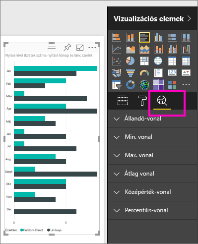
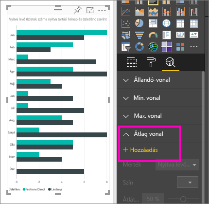
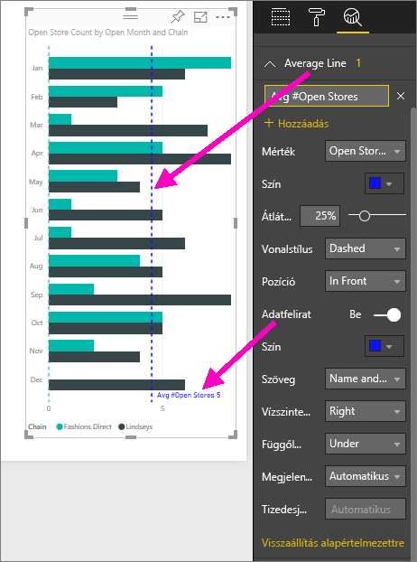
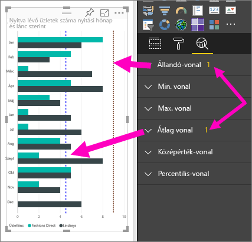
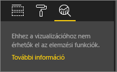

# Dinamikus referenciavonalak létrehozása vizualizációkhoz a Power BI szolgáltatásban

A **Power BI szolgáltatás** **Elemzés** paneljével dinamikus *referenciavonalak* adhatók a vizualizációkhoz, kiemelve a fontos trendeket vagy elemzési eredményeket.

> [!NOTE]
> Az **Elemzés** panel csak akkor jelenik meg, ha egy vizualizáció ki van jelölve a jelentés vásznon.
> 
> 

## Az Elemzés panel használata
Az **Elemzés** panelen a következő típusú dinamikus referenciavonalak hozhatók létre (nem mindegyik vonal érhető el az összes vizualizációtípushoz):

* Állandó-vonal az X tengelyen
* Állandó-vonal az Y tengelyen
* Min. vonal
* Max. vonal
* Átlagos vonal
* Középérték-vonal
* Percentilis-vonal

Az adott vizualizáció esetében rendelkezésre álló dinamikus referenciavonalak megtekintéséhez hajtsa végre a következő lépéseket:

1. Jelöljön ki vagy hozzon létre egy vizualizációt, majd kattintson a **Megjelenítések** panel **Elemzés** ikonjára .

2. Válassza a kívánt vonaltípus melletti lefelé mutató nyilat a lehetőségek kibontásához. Ebben az esetben most az **Átlagos vonal** típust választjuk.
   
   

3. Egy új sor hozzáadásához válassza a **+ Hozzáadás** lehetőséget, majd válassza ki a vonal létrehozásához használandó mértéket.  A rendszer automatikusan feltölti a **Mérték** legördülő listát a kiválasztott vizualizáció elérhető adataival. Válassza az **Open store count** (Nyitva lévő üzletek száma) lehetőséget.

5. Számos olyan beállítási lehetőség áll rendelkezésére a vonalhoz kapcsolódóan, mint például a szín, az átlátszóság, a stílus és a pozíció (a vizualizáció adatelemeihez képest). Ha szeretné feliratokkal ellátni a vonalat, adjon neki címet, majd állítsa az **Adatfelirat** csúszkát a **Be** állásba.  Ebben a példában az *Avg # Open Stores* (Nyitva lévő üzletek átlagos száma) címet adjuk a vonalnak, és néhány további beállítást is testre szabunk az alábbiak szerint.
   
   

1. Az **Elemzés** panel **Átlagos vonal** eleme mellett egy szám jelenik meg. Ez a szám azt mutatja meg, hogy jelenleg hány dinamikus vonal található a vizualizáción, és hogy ezek milyen típusúak. Ha felvesz egy **Konstans vonalat** az üzletek számára kijelölt 9 célértékkel, akkor az **Elemzés** panelen látható, hogy már egy **Konstans vonal** referenciavonal is tartozik a vizualizációhoz.
   
   
   

Sokféle érdekes elemzést emelhet ki dinamikus referenciavonalak létrehozásával az **Elemzés** panelen.

## Megfontolandó szempontok és hibaelhárítás

Ha a kiválasztott vizualizációra nem lehet dinamikus referenciavonalat alkalmazni (ebben az esetben a **Térkép** vizualizációról van szó), akkor az **Elemzés** panelre kattintva az alábbiakat fogja látni.
   

A dinamikus referenciavonalak használatának lehetősége az éppen használt vizualizáció típusán alapul. Az alábbi listában az egyes vizualizációkhoz jelenleg rendelkezésre álló dinamikus vonalak vannak felsorolva:

A dinamikus vonalak teljes körű alkalmazása a következő vizualizációk esetében lehetséges:

* Területdiagram
* Vonaldiagram
* Pontdiagram
* Fürtözött oszlopdiagram
* Fürtözött sávdiagram

A következő vizualizációk esetében csak az *Állandó-vonal* típus érhető el az **Elemzés** panelen:

* Halmozott terület
* Halmozott sáv
* Halmozott oszlop
* 100%-ig halmozott sáv
* 100%-ig halmozott oszlop

A következő vizualizációk esetében csak a *Trendvonal* típus érhető el:

* Nem halmozott vonal
* Fürtözött oszlopdiagram

Végül pedig a nem Descartes-féle vizualizációk esetében jelenleg nem alkalmazhatók dinamikus vonalak az **Elemzés** panelen. Ilyen vizualizációk például:

* Mátrix
* Tortadiagram
* Gyűrű
* Tábla

## További lépések
[Az Elemzés panel a Power BI Desktopban](desktop-analytics-pane.md)

További kérdései vannak? [Kérdezze meg a Power BI közösségét](https://community.powerbi.com/)

