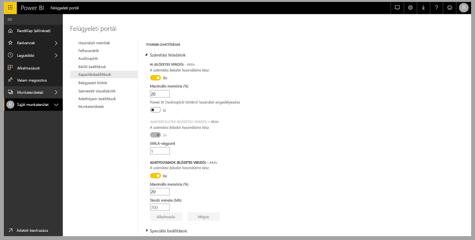
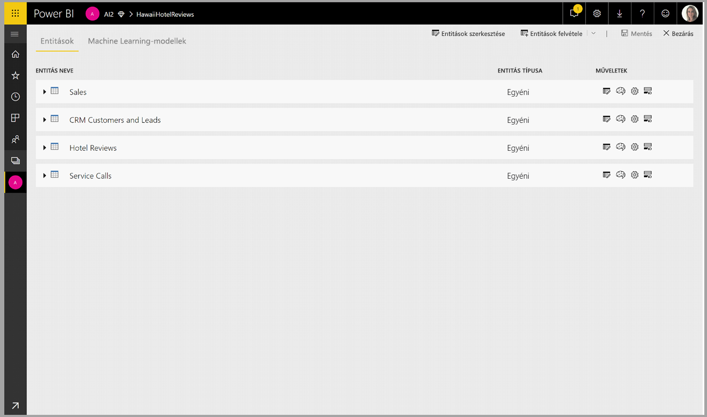
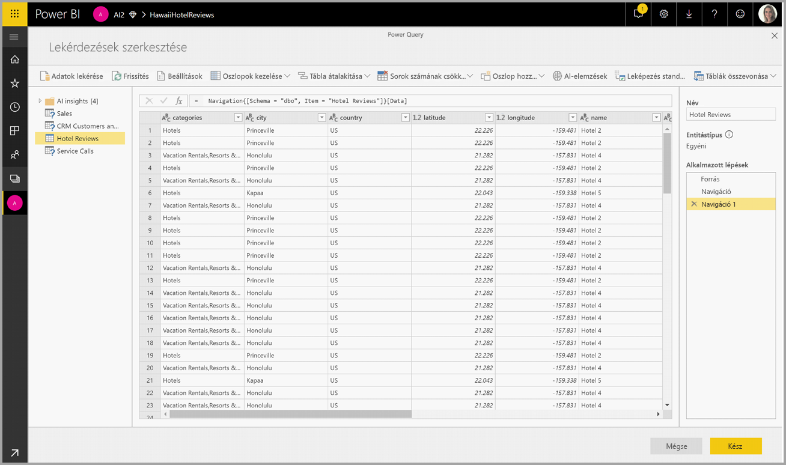
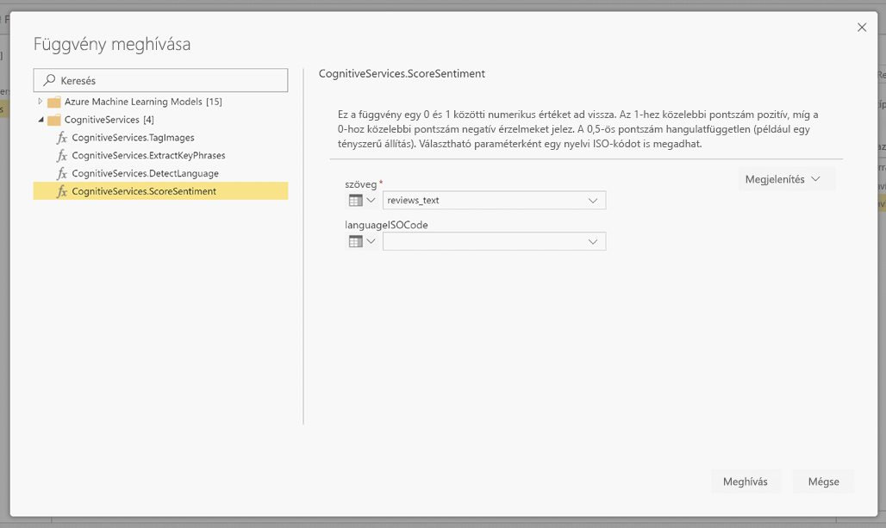
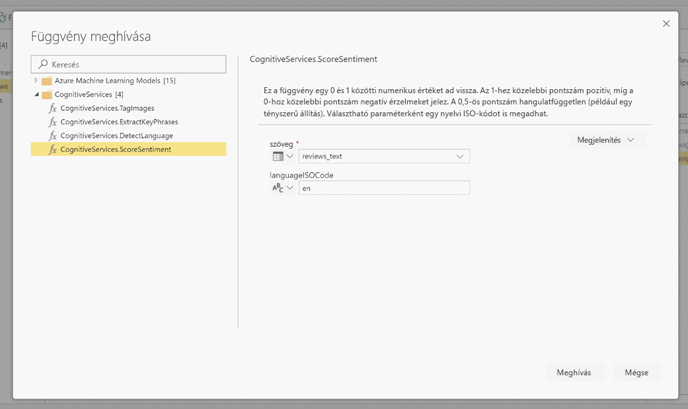
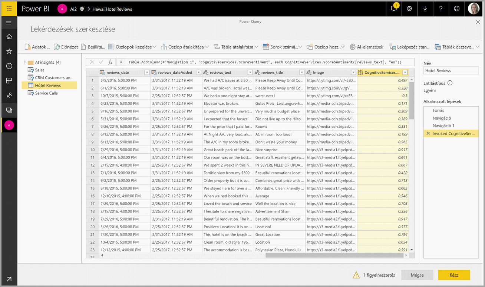
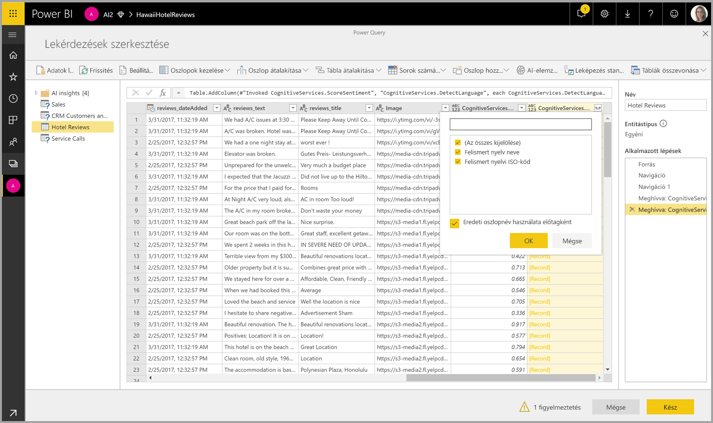

# Cognitive Services-szolgáltatások a Power BI-ban (Előzetes verzió)

A Power BI-beli Cognitive Services segítségével az [Azure Cognitive Services](https://azure.microsoft.com/services/cognitive-services/) különböző algoritmusait használhatja fel az adatok gazdagítására azoknak az adatfolyamokhoz való önkiszolgáló előkészítése során.

A támogatott szolgáltatások jelenleg a következők: [Hangulatelemzés](https://docs.microsoft.com/azure/cognitive-services/text-analytics/how-tos/text-analytics-how-to-sentiment-analysis), [Kulcsszókeresés](https://docs.microsoft.com/azure/cognitive-services/text-analytics/how-tos/text-analytics-how-to-keyword-extraction), [Nyelvfelismerés](https://docs.microsoft.com/azure/cognitive-services/text-analytics/how-tos/text-analytics-how-to-language-detection) és [Képcímkézés](https://docs.microsoft.com/azure/cognitive-services/computer-vision/concept-tagging-images). Az átalakítások a Power BI szolgáltatásban vannak végrehajtva, és nem igényelnek Azure Cognitive Services-előfizetést. Ennek a funkciónak a használatához Power BI Premium szükséges.

## **Mesterségesintelligencia-funkciók engedélyezése**

A Cognitive Services prémium szintű kapacitásbeli EM2, A2 vagy P1 és magasabb csomópontokhoz támogatott. A kapacitáson külön MI-számítási feladat szolgál a Cognitive Services-szolgáltatások futtatására. A nyilvános előzetes verzió időtartama alatt ez a számítási feladat alapértelmezés szerint le van tiltva. Ahhoz, hogy a Cognitive Services használható legyen a Power BI-ban, a mesterségesintelligencia-számítási feladatot engedélyezni kell a felügyeleti portál kapacitásbeállításai között. Az MI-számítási feladat a Számítási feladatok szakaszban kapcsolható be, és itt adható meg a számítási feladat által maximálisan felhasználható memória mennyisége. A javasolt memóriakorlát 20%. Ennek a korlátnak a túllépése lelassítja a lekérdezést.

## **A Cognitive Services-szolgáltatások Power BI-ban való használatának első lépései**

A Cognitive Services átalakításai az [Adatfolyamokhoz való önkiszolgáló adatelőkészítés](https://powerbi.microsoft.com/blog/introducing-power-bi-data-prep-wtih-dataflows/) részei. Adatai Cognitive Services-szolgáltatásokkal való gazdagítását kezdje egy adatfolyam szerkesztésével.

Válassza a Power Query-szerkesztő felső szalagjának **MI-elemzések** gombját.

A felugró ablakban válassza ki a használni kívánt függvényt és az átalakítani kívánt adatokat. Ebben a példában egy szöveges kritikákat tartalmazó oszlop hangulatértékelését végezzük el.

A **kulturális környezet** a szöveg nyelvének megadásához választható bemenet. Ez a mező ISO-kódot fogad el. A kulturális környezet bemenetként egy oszlop vagy egy statikus mező is használható. Ebben a példában az angol (en) nyelv van megadva az egész oszlophoz. Ha ezt a mezőt üresen hagyja, a Power BI automatikusan észleli a nyelv a függvény alkalmazása előtt. Ez után válassza a **Meghívás** lehetőséget.

A függvény hívása után az eredmény új oszlopként lesz a táblához fűzve. Az átalakítás is be lett szúrva a lekérdezésbe, mint alkalmazott lépés.

Ha a függvény több kimeneti mezőt ad vissza, akkor a függvény hívása a kimeneti mezők rekordjával vesz fel új oszlopot.

A Kibontás lehetőséggel adhatja hozzá az egyik vagy mindkét értéket oszlopként az adatokhoz.

## **Elérhető funkciók**

Ez a szakasz a Power BI-beli Cognitive Servicesben elérhető funkciókat ismerteti.

### **Nyelvfelismerés**

A nyelvfelismerő függvény szöveges bemenetet értékel ki, és minden mezőhöz a nyelv megnevezését és ISO-azonosítóját adja vissza. Ez a függvény a tetszőleges szövegeket gyűjtő adatoszlopoknál hasznos, ahol a nyelv nem ismert. A függvény szöveges formátumú adatokat vár bemenetként.

A Text Analytics akár 120 nyelvet is felismer. További információt a [támogatott nyelvek](https://docs.microsoft.com/azure/cognitive-services/text-analytics/text-analytics-supported-languages) ismertetésében talál.

### **Kulcsszavak keresése**

A **kulcsszókeresési** funkció strukturálatlan szöveget elemez, és minden szövegmezőhöz kulcsszavak listáját adja vissza. A függvény szövegmezőt vár el bemeneteként, és nem kötelező bemenetként elfogadja a **kulturális környezet** megadását. (Lásd a cikk korábbi, **Első lépések** szakaszát.)

A kulcsszókeresés akkor a leghatékonyabb, ha nagyobb összefüggő szövegeken dolgozhat. Ez éppen fordítva van a hangulatelemzésnél, amely kisebb szövegblokkokkal működik hatékonyabban. Annak érdekében, hogy mindkét művelet a legjobb eredményt hozza, érdemes lehet ennek megfelelően átszervezni a bemeneteket.

### **Hangulatértékelés**

A **hangulatértékelő** függvény szöveges bemenetet értékel ki, és minden dokumentumhoz egy 0 (negatív) és 1 (pozitív) közötti hangulat-pontszámot ad vissza. Ez a függvény a közösségi médiában, ügyfelek véleményében és vitafórumokon megnyilvánuló pozitív és a negatív érzelmek észleléséhez hasznos.

A Text Analytics gépi tanulási besorolási algoritmus használatával generál egy 0 és 1 közötti hangulat-pontszámot. Az 1-hez közelebbi pontszám pozitív, a 0-hoz közelebbi pontszám negatív érzelmeket jelez. A modell érzelmeket kifejező szövegek bőséges gyűjteményével van előre betanítva. Saját betanítási adatokat jelenleg nem lehet megadni. A modell több technika kombinációját használja a szövegelemzés során, köztük szövegfeldolgozást, szövegrész-elemzést, szóhelyzeteket és szótársításokat. Az algoritmusról [A Text Analytics bemutatása](https://blogs.technet.microsoft.com/machinelearning/2015/04/08/introducing-text-analytics-in-the-azure-ml-marketplace/) című cikkben talál további információt.

A hangulatelemzés a teljes bemeneti mezőn van végrehajtva, szemben a szöveg egy adott entitása érzelmeinek kinyerésével. A gyakorlatban az értékelés pontossága általában javul, ha a dokumentumok nem nagy szövegblokkokat, hanem egy-két mondatot tartalmaznak. Az objektivitásfelmérési szakaszban a modell azt határozza meg, hogy a bemeneti mező egésze objektív, vagy érzelmet fejez ki. Az inkább objektív bemeneti mezők nem haladnak tovább a hangulatelemzési fázisba, hanem további feldolgozás nélkül 0,5 pontot eredményeznek. A folyamatban továbblépő bemeneti mezőkhöz a következő fázis 0,5 feletti vagy alatti pontszámot generál attól függően, hogy milyen érzelmeket észlel a bemeneti mezőben.

A hangulatelemzés jelenleg az angol, a német, a spanyol és a francia nyelvet támogatja. További nyelvek érhetők el előzetes verzióban. További információt a [támogatott nyelvek](https://docs.microsoft.com/azure/cognitive-services/text-analytics/text-analytics-supported-languages) ismertetésében talál.

### **Képek címkézése**

A **Képcímkézés** funkció címkéket ad vissza több mint 2000 felismerhető tárgy, élőlény, táj és tevékenység alapján. Ha a címkék nem egyértelműek vagy nem közismertek, a kimenet a címke jelentését egy ismert környezetben megvilágító „tippeket” ad. A címkék nincsenek rendszerezve, és nincs öröklési hierarchiájuk. Egy kép ember által olvasható nyelven, teljes mondatokban megfogalmazott „leírásának” alapját tartalomcímkék gyűjteménye képezi.

Egy kép feltöltése vagy URL-címének megadása után Computer Vision-algoritmusok adnak meg címkéket a képeken felismert tárgyak, élőlények és tevékenységek alapján. A címkézés nem korlátozódik a fő témára, például az előtérben lévő személyre, hanem a (beltéri vagy kültéri) környezetre, bútorokra, eszközökre, növényekre, állatokra, kellékekre, kisebb tárgyakra és sok másra is kiterjed.

Ez a függvény képre mutató URL-címet vagy Base64-mezőt vár bemeneteként. A képcímkézés jelenleg az angol, a spanyol, a japán, a portugál és az egyszerűsített kínai nyelvet támogatja. További információt a [támogatott nyelvek](https://docs.microsoft.com/rest/api/cognitiveservices/computervision/tagimage/tagimage#uri-parameters) ismertetésében talál.

## Következő lépések

Ez a cikk a Cognitive Services-szolgáltatásoknak a Power BI szolgáltatással való használatáról nyújtott áttekintést. Az alábbi cikkek is érdekesek és hasznosak lehetnek. 

* [Oktatóanyag: Machine Learning Studio-modell meghívása a Power BI-ban (előzetes verzió)](service-tutorial-invoke-machine-learning-model.md)
* [Az Azure Machine Learning integrálása a Power BI-jal (Előzetes verzió)](service-machine-learning-integration.md)
* [Oktatóanyag: A Cognitive Services használata a Power BI-ban](service-tutorial-use-cognitive-services.md)

Az adatfolyamokkal kapcsolatban az alábbi cikkeket érdemes elolvasni:
* [Adatfolyamok létrehozása és használata a Power BI-ban](service-dataflows-create-use.md)
* [A Power BI Premium számított entitások használatával](service-dataflows-computed-entities-premium.md)
* [Adatfolyamok használata a helyszíni adatforrások](service-dataflows-on-premises-gateways.md)
* [Fejlesztői erőforrások a Power BI-adatfolyamok](service-dataflows-developer-resources.md)
* [Adatfolyamok és az Azure Data Lake integrációja (előzetes verzió)](service-dataflows-azure-data-lake-integration.md)