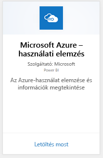
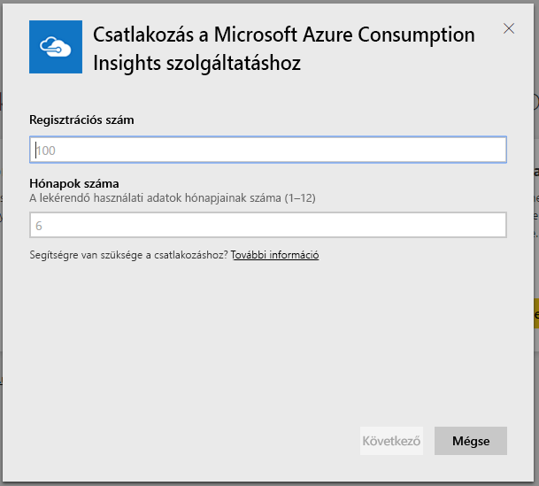
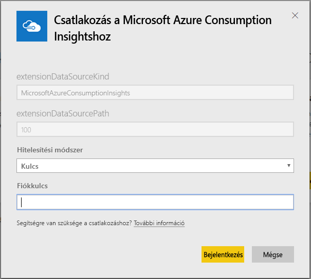
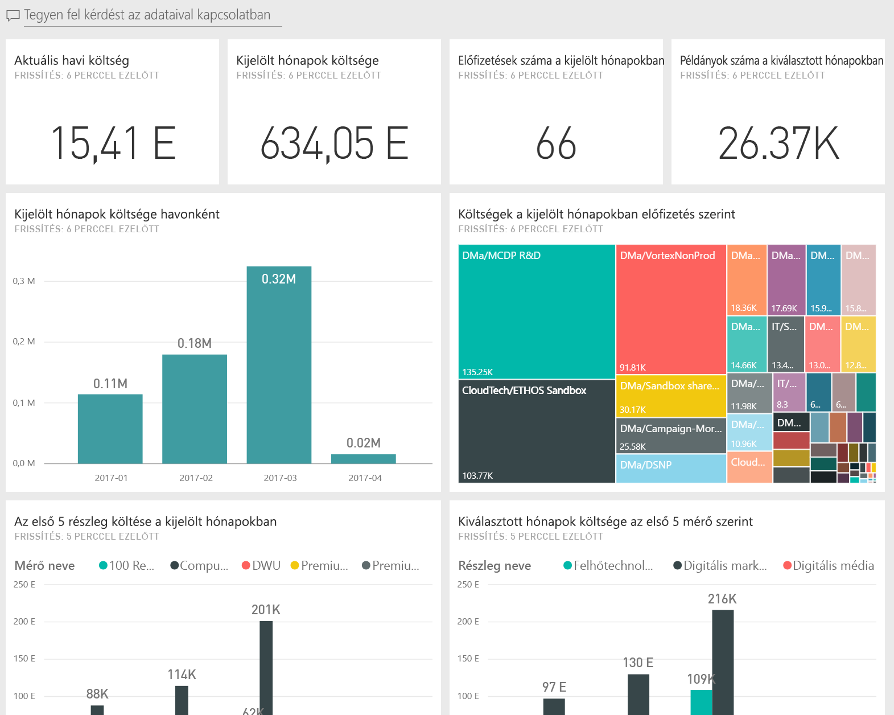
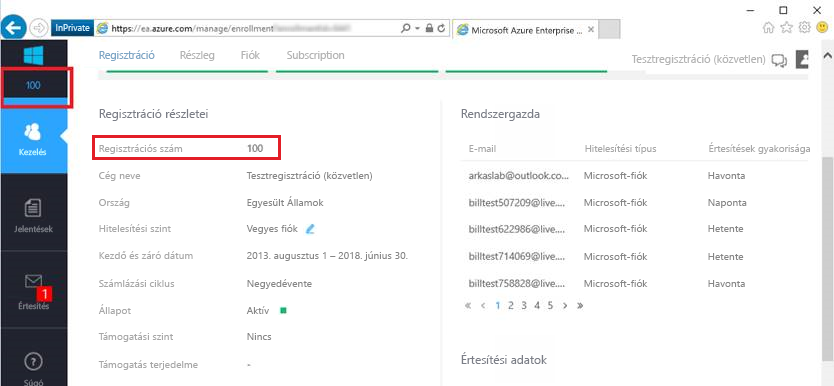
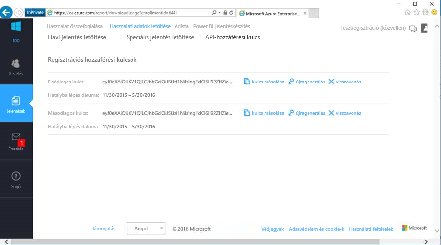

# Csatlakozás a Microsoft Azure Consumption Insightshoz a Power BI használatával
A Power BI-tartalomcsomaggal a Power BI szolgáltatásban vizsgálhatja és elemezheti a Microsoft Azure használati adatait. Az adatokat naponta egyszer automatikusan frissíti a rendszer.

Csatlakozzon a Power BI szolgáltatáshoz készült [Microsoft Azure Consumption Insights tartalomcsomaghoz](https://app.powerbi.com/getdata/services/azureconsumption).

> [!NOTE]
> A beállítások jobb testreszabása érdekében próbálja ki az [Azure Consumption Insights-összekötőt](desktop-connect-azure-consumption-insights.md) a Power BI Desktopban.

## Csatlakozás
1. A Power BI szolgáltatás bal oldali navigációs panelének alján kattintson az **Adatok lekérése** elemre.
   
    
2. A **Szolgáltatások** mezőben kattintson a **Lekérés** elemre.
   
   
3. Válassza a **Microsoft Azure Consumption Insights** \> **Azonnali lekérés** elemet. 
   
   
4. Adja meg, hogy hány hónapnyi adatot szeretne importálni, valamint az Azure Enterprise beléptetési számát. A [paraméterek fellelhetőségével](#FindingParams) kapcsolatos információt lásd alább.
   
    
5. A csatlakozáshoz adja meg a hozzáférési kulcsát. A regisztrációs kulcsot az Azure EA Portalon találja meg. 
   
    
6. Az importálás automatikusan megkezdődik. Ha befejeződött, a navigációs panelen megjelenik egy új irányítópult, jelentés és modell. Válassza ki az irányítópultot az importált adatok megtekintéséhez.
   
   

**Mi a következő lépés?**

* [Kérdéseket tehet fel a Q&A mezőben](consumer/end-user-q-and-a.md) az irányítópult tetején.
* [Módosíthatja az irányítópult csempéit](service-dashboard-edit-tile.md).
* [Kiválaszthatja valamelyik csempét](consumer/end-user-tiles.md) a mögöttes jelentés megnyitásához.
* Noha az adatkészlet napi frissítésre van ütemezve, módosíthatja a frissítési ütemezést, vagy igény szerint frissíthet az **Azonnali frissítés** gombbal

## Tartalom
A Microsoft Azure Consumption Insights tartalomcsomag a csatlakozás során megadott hónaptartományra vonatkozó havi jelentésadatokat tartalmazza. A tartomány egy mozgó időablak, ezért a dátumok az adathalmaz frissítésekor lesznek frissítve.

## Rendszerkövetelmények
A tartalomcsomag használatához hozzáférés szükséges a Vállalati szolgáltatásokhoz az Azure Portalon. 

## Paraméterek helye
A Power BI-jelentések készítése olyan közvetlen, partneri és közvetett vállalati szerződéssel rendelkező ügyfelek számára elérhető, akik meg tudják tekinteni a számlázási adatokat. Az alábbiakban megtalálhatja az ezeknek a csatlakozási folyamat során megadandó értékeknek a helyével kapcsolatos részleteket.

**Hónapok száma**

* Az importálni kívánt adatok dátuma a mai naptól számított hónapokban (1-36) megadva.

**Beléptetési szám**

* Ez az Ön Azure Enterprise beléptetési száma, amelyet az [Azure Enterprise Portal](https://ea.azure.com/) kezdőképernyőjén, a **Regisztráció részletei** területen talál.
  
    

**Hozzáférési kulcs**

* A hozzáférési kulcsot az Azure Enterprise portálon a **Használati adatok letöltése** > **API hozzáférési kulcsa** területen találhatja meg.
  
    

**További segítség**

* További segítséget kaphat az Azure Enterprise Power BI-csomag beállításához, ha bejelentkezik az Azure Enterprise Portalra, és a **Súgó** területen megtekinti az API-súgófájlt. A **Jelentések** -> **Használati adatok letöltése** -> **API-hozzáférési kulcs** területen is találhat további útmutatást.
* A beállítások jobb testreszabása érdekében próbálja ki az [Azure Consumption Insights-összekötőt](desktop-connect-azure-consumption-insights.md) a Power BI Desktopban.

## Következő lépések

Az [Azure Consumption Insights-összekötő](desktop-connect-azure-consumption-insights.md) a Power BI Desktopban

[Adatok lekérése a Power BI-ban](service-get-data.md)

