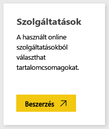
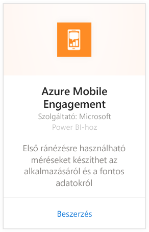
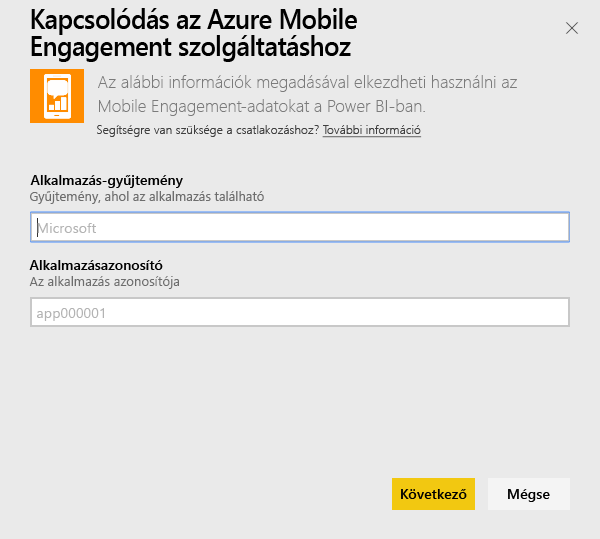
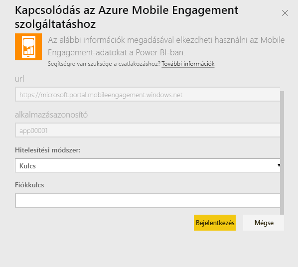
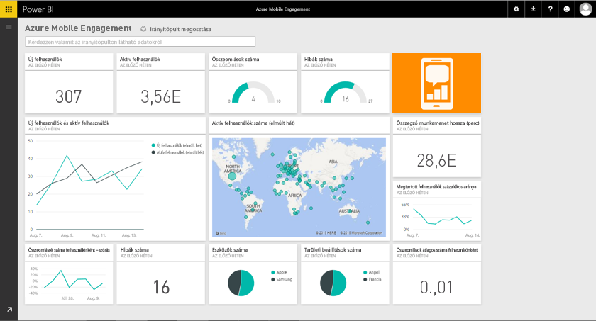

# Kapcsolódás az Azure Mobile Engagement szolgáltatáshoz a Power BI használatával
A Power BI Azure Mobile Engagement tartalomcsomaggal gyors betekintést nyerhet az alkalmazása adataiba.

Kapcsolódjon a Power BI-hoz készült [Azure Mobile Engagement-tartalomcsomaghoz](https://app.powerbi.com/groups/me/getdata/services/azme).

## A kapcsolódás menete
1. A bal oldali navigációs ablaktábla alján kattintson az **Adatok lekérése** elemre.
   
    
2. A **Szolgáltatások** mezőben válasza a **Beolvasás** elemet.
   
    
3. Válassza ki az **Azure Mobile Engagement** \> **Beolvasás** elemet.
   
     
4. Adja meg az alkalmazásgyűjteményt és az alkalmazásnevet. Ez az információ az Azure Mobile Engagement-fiókban található.
   
     
5. Hitelesítési módszernek adja meg a kulcsot, majd kattintson a Bejelentkezés gombra.
   
    
6. Miután a Power BI importálta az adatokat, a bal oldali navigációs ablaktáblán egy új irányítópult, jelentés és adatkészlet jelenik meg. A rendszer az új elemeket sárga csillaggal \* jelöli meg, amely kijelölés után eltűnik:
   
    

## Mi a következő lépés?

* [Kérdéseket tehet fel a Q&A mezőben](consumer/end-user-q-and-a.md) az irányítópult tetején.
* [Módosíthatja az irányítópult csempéit](service-dashboard-edit-tile.md).
* [Kiválaszthatja valamelyik csempét](consumer/end-user-tiles.md) a mögöttes jelentés megnyitásához.
* Noha az adatkészlet napi frissítésre van ütemezve, módosíthatja a frissítési ütemezést, vagy igény szerint frissíthet az **Azonnali frissítés** gombbal.

## Következő lépések
[Első lépések a Power BI-ban](service-get-started.md)

[Adatok lekérése a Power BI-ban](service-get-data.md)

