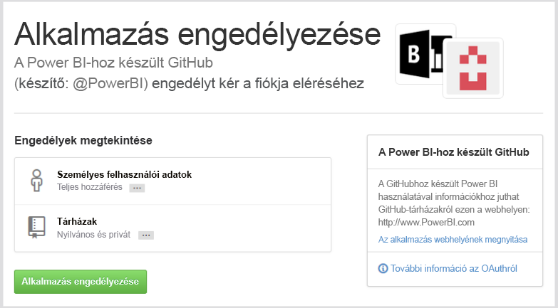
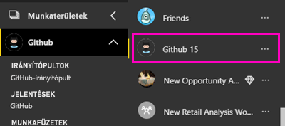
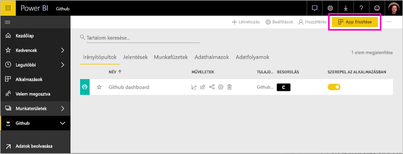
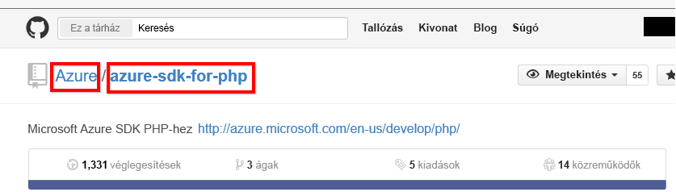

# Csatlakozás a GitHubhoz a Power BI használatával
Ez a cikk végigvezeti a GitHub-fiók egy Power bi-ban sablon alkalmazással adatok lekérése. A sablon alkalmazása hoz létre egy munkaterületet egy irányítópultot, több jelentést és a egy adathalmazt, amelyek segítségével megvizsgálhatja a GitHub-adatokat. A Power bi-hoz készült GitHub alkalmazást jeleníti meg a GitHub-tárban, más néven tárház hozzájárulások, a problémák, a pull-kérelmek és az aktív felhasználók adatokkal betekintést.

Ha már telepítette a sablonalapú alkalmazásként, módosíthatja az irányítópultot és jelentést. Majd terjesztheti azt munkatársainak alkalmazásként a szervezet.

Csatlakozás a [GitHub sablonalapú alkalmazásként](https://app.powerbi.com/getdata/services/github) vagy tudjon meg többet a [GitHub-integráció](https://powerbi.microsoft.com/integrations/github) Power BI-jal.

Megpróbálhatja a [GitHub oktatóanyag](service-tutorial-connect-to-github.md). A Power BI-dokumentáció a nyilvános adattár adatait valós GitHub telepíti.

>[!NOTE]
>A sablon-alkalmazásának hozzá kell férnie a tárház GitHub-fiók. A követelményekről alább talál további információkat.

## Csatlakozás
[!INCLUDE [powerbi-service-apps-get-more-apps](./includes/powerbi-service-apps-get-more-apps.md)]
   
3. Válassza ki **GitHub** \> **Letöltés most**.
4. A **a Power BI-alkalmazás telepítése?** kiválasztása **telepítése**.
4. Az a **alkalmazások** panelen válassza a **GitHub** csempére.

    

6. A **az új alkalmazás használatának első lépései**válassza **adatok**.

    

5. Adja meg az adattár nevét és tulajdonosát. A [paraméterek fellelhetőségével](#FindingParams) kapcsolatos információt lásd alább.
   
    

5. Adja meg a Githubhoz használt hitelesítő adatait (ebben a lépésben előfordulhat, hogy kimarad amennyiben már jelentkezett be a böngésző). 
6. A **Hitelesítési módszer** beállításánál válassza az **oAuth2** \> **Bejelentkezés** lehetőséget. 
7. Kövesse a GitHub-hitelesítés lépéseit. Adja meg a GitHub, a GitHub-adatokhoz a Power bi-ban sablon alkalmazás engedélyt.
   
   
   
    A GitHub és az adatokhoz a Power BI kapcsolódik.  Az adatok naponta egyszer frissülnek. Miután a Power BI importálta az adatokat, láthatja a tartalmát az új GitHub-munkaterületet.

## Módosíthatja, és az alkalmazás terjesztése

A GitHub-sablon alkalmazást telepítette. Ez azt jelenti, hogy a GitHub alkalmazás-munkaterület is létrehozott. A munkaterületen a jelentések és irányítópultok módosítsa, majd ezután osztja el, mint egy *alkalmazás* munkatársaknak a szervezetben. 

1. A bal oldali navigációs sávon válassza ki a munkaterület neve melletti nyílra. Megjelenik a munkaterület tartalmaz egy irányítópultot és jelentést.

    

8. Válassza ki az új [GitHub-irányítópult](https://powerbi.microsoft.com/integrations/github).    
    

3. Az új GitHub-munkaterületen a tartalmát megtekintéséhez a bal oldali navigációs sávon válassza **munkaterületek** > **GitHub**.
 
   

    Ez a nézet a munkaterület számára a tartalmak listája. A jobb felső sarokban látható **app frissítése**. Ha már készen áll az alkalmazást a munkatársai, ez az először lesz. 

    

2. Válassza ki **jelentések** és **adatkészletek** a munkaterület az egyéb elemek megtekintéséhez.

    További információ [alkalmazások terjesztése](service-create-distribute-apps.md) munkatársainak.

## Mit tartalmaz az alkalmazásban
A GitHubból az alábbi adatok érhetők el a Power BI szolgáltatásban:     

| Table name (Táblázat neve) | Description (Leírás) |
| --- | --- |
| Közreműködések |A hozzájárulások táblázata biztosít az összes kiegészítést, törléseket és véglegesítések összesített hetente közreműködői által készített. A táblázatban az első 100 hozzájáruló szerepel. |
| Issues (Problémák) |Listázza a kijelölt adattárban szereplő összes problémát, továbbá olyan adatokat, mint a problémák megoldására fordított összes és átlagos idő, az összes nyitott probléma és az összes megoldott probléma. A táblázat üres, ha nincsenek problémák az adattárban. |
| Pull requests (Lekéréses kérelmek) |Ebben a táblázatban szerepel az adattár összes lekéréses kérelme és a kérelmezők neve. Hány nyissa meg a lezárt és teljes lekéréses kérelmek körül számítások, mennyi ideig tartottak a kérelmek, és mennyi ideig tartott a átlagos lekéréses kérelem is tartalmaz. A táblázat üres, ha nincsenek problémák az adattárban. |
| Felhasználók |Ez a táblázat a GitHub-felhasználókat és a munkatársak, akik közreműködtek, iktattak, vagy megoldani a kiválasztott adattár Pull-kérelmek listáját tartalmazza. |
| Milestones (Mérföldkövek) |A kiválasztott adattár összes mérföldkövét tartalmazza. |
| DateTable (Dátumtáblázat) |Ez a táblázat tartalmazza a dátumokat még ma, és az elmúlt évben, amelyek lehetővé teszik, hogy a dátum szerint elemezheti a GitHub-adatait. |
| ContributionPunchCard (Közreműködői pontgyűjtés) |Ez a táblázat közreműködők pontgyűjtésének vezetésére használatható a kijelölt adattárban. A hozzájárulásokat nap és időpont szerint jeleníti meg. Ez a tábla nem kapcsolódik a modell többi táblájához. |
| RepoDetails (Adattár adatai) |Ez a táblázat a kiválasztott adattár adatait tartalmazza. |

## System requirements (Rendszerkövetelmények)
* A GitHub-fiók, amely hozzáfér az adattárhoz.  
* Engedély megadása a GitHubhoz készült Power BI alkalmazásnak az első bejelentkezéskor. Az engedély visszavonásának módját alább találja.  
* Elegendő API-hívás az adatok lekéréséhez és frissítéséhez.  

### A Power BI engedélyének visszavonása
A Power BI engedélyének a githubban, a GitHub-adattár, visszavonhatja a hozzáférést a Githubon. Ez [GitHub súgótémakörben](https://help.github.com/articles/keeping-your-ssh-keys-and-application-access-tokens-safe/#reviewing-your-authorized-applications-oauth) témakörben talál.

## Paraméterek helye
A tulajdonos és az adattár közvetlenül az adattárból állapítható meg a GitHubban:

Az első rész, az „Azure” a tulajdonos, a második rész, az „azure-sdk-for-php” pedig maga az adattár.  Ugyanez a két elem megtalálható az adattár URL-jében is:

    <https://github.com/Azure/azure-sdk-for-php> .

## Hibaelhárítás
Ha szükséges, ellenőrizheti a GitHub-hitelesítő adatait.  

1. Egy másik böngésző ablakában nyissa meg a GitHub webhelyen, és jelentkezzen be a GitHub. Ha bejelentkezett, azt a GitHub oldalának jobb felső sarkában láthatja.    
2. A GitHub webhelyen navigáljon annak az adattárnak az URL-címére, amelyet el kíván érni a Power BI-ból. Például: https://github.com/dotnet/corefx.  
3. A Power BI-ba visszatérve próbáljon csatlakozni a GitHubhoz. A GitHub beállítása párbeszédpanelen adja meg a szóban forgó adattár nevét és tulajdonosát.  

## Következő lépések

* [Oktatóanyag: Csatlakozás egy GitHub-adattárat a Power bi-JAL](service-tutorial-connect-to-github.md)
* [Az új munkaterületek létrehozása a Power bi-ban](service-create-the-new-workspaces.md)
* [Alkalmazások telepítése és használata a Power BI-ban](consumer/end-user-apps.md)
* [Csatlakozás a Power BI alkalmazások külső szolgáltatásokhoz](service-connect-to-services.md)
* Kérdése van? [Kérdezze meg a Power BI közösségét](http://community.powerbi.com/)

