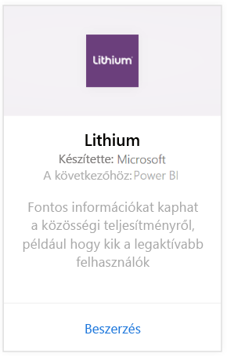
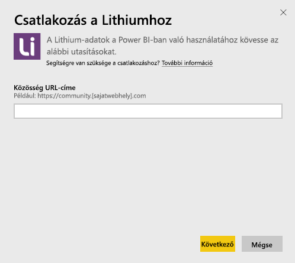
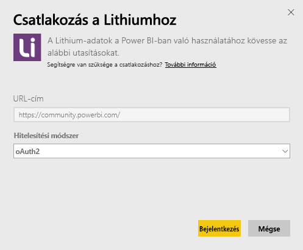
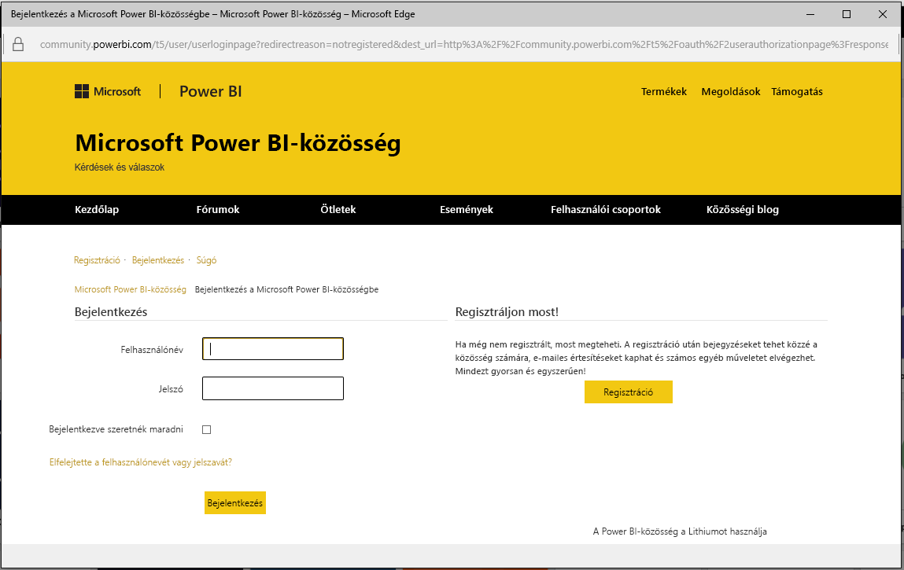
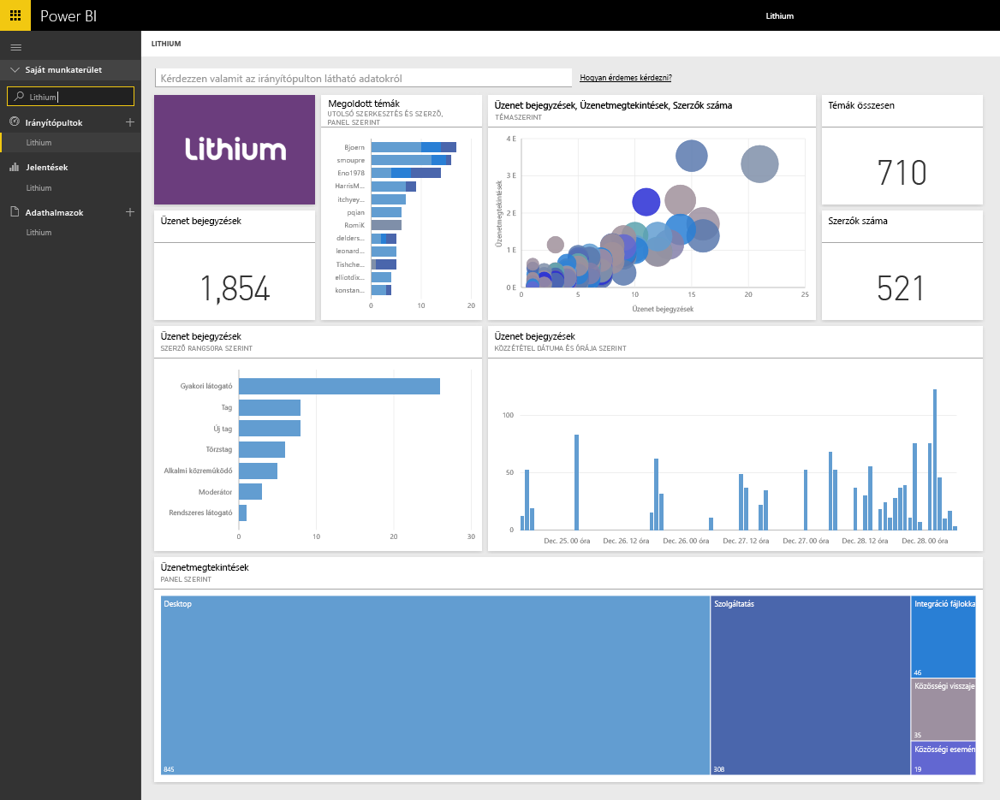

# Kapcsolódás a Power BI-ból a Lithiumhoz

A Lithium megbízható kapcsolatokat épít ki a világ legjobb márkái és az ügyfeleik között, és segít az embereknek választ kapni a kérdéseikre és megosztani a tapasztalataikat. Ha csatlakoztatja a Lithium-tartalomcsomagot a Power BI-hoz, akkor mérni tudja az online közössége legfontosabb metrikáit, így serkentheti az eladásokat, csökkentheti a szolgáltatási díjakat és növelheti ügyfelei hűségét. 

[!INCLUDE [include-short-name](./includes/service-deprecate-content-packs.md)]

Kapcsolódjon a Power BI-hoz készült [Lithium-tartalomcsomaghoz](https://app.powerbi.com/getdata/services/lithium).

>[!NOTE]
>A Power BI-tartalomcsomag a Lithium API-t használja. A túlzottan sok API-hívás további költségeket vonhat maga után a Lithium oldaláról. Kérjük, egyeztessen a Lithium-rendszergazdájával.

## A kapcsolódás menete
1. A bal oldali navigációs ablaktábla alján kattintson az **Adatok lekérése** elemre.
   
    
2. A **Szolgáltatások** mezőben válasza a **Beolvasás** elemet.
   
    
3. Válassza a **Lithium** \> **Beolvasás** lehetőséget.
   
   
4. Adja meg a Lithium-közössége URL-címét. Ennek formátuma: *https://community.yoursite.com* .
   
   
5. Amikor a rendszer kéri, adja meg a Lithium-fiókja hitelesítő adatait. Válassza ki az **oAuth 2** hitelesítési mechanizmust, kattintson a **Bejelentkezés** elemre, majd kövesse a Lithium-fiók hitelesítési folyamatát.
   
   
   
   
6. A sikeres bejelentkezési folyamat után megkezdődik az importálási folyamat. Ha befejeződött, a navigációs panelen megjelenik egy új irányítópult, jelentés és modell. Válassza ki az irányítópultot az importált adatok megtekintéséhez.
   
    

**Mi a következő lépés?**

* [Kérdéseket tehet fel a Q&A mezőben](consumer/end-user-q-and-a.md) az irányítópult tetején.
* [Módosíthatja az irányítópult csempéit](service-dashboard-edit-tile.md).
* [Kiválaszthatja valamelyik csempét](consumer/end-user-tiles.md) a mögöttes jelentés megnyitásához.
* Noha az adatkészlet napi frissítésre van ütemezve, módosíthatja a frissítési ütemezést, vagy igény szerint frissíthet az **Azonnali frissítés** gombbal.

## Rendszerkövetelmények
A Lithium-tartalomcsomaghoz 15.9-es vagy újabb verziójú Lithium-közösség szükséges. A verzió megerősítéséhez, kérjük, egyeztessen Lithium-rendszergazdájával.

## Következő lépések
[Mi az a Power BI?](fundamentals/power-bi-overview.md)

[A Power BI szolgáltatás alapfogalmai tervezők számára](service-basic-concepts.md)

